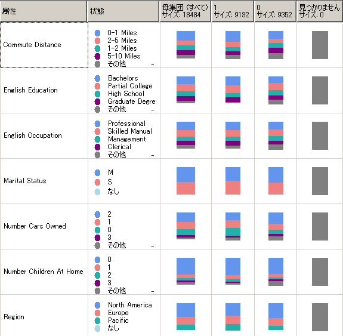

# Microsoft Naive Bayes アルゴリズム
[!INCLUDE[ssas-appliesto-sqlas](../../includes/ssas-appliesto-sqlas.md)]
  [!INCLUDE[msCoName](../../includes/msconame-md.md)] Naive Bayes アルゴリズムは、Bayes の定理に基づく分類アルゴリズムであり、探索および予測モデリングで使用できます。 Naive Bayes (単純ベイズ) という名前の単純 (Naive) という部分は、このアルゴリズムで Bayes の技法が使用されているものの、存在する可能性のある依存関係が考慮されないことに由来しています。  
  
 このアルゴリズムは、他の [!INCLUDE[msCoName](../../includes/msconame-md.md)] アルゴリズムよりも計算量が少ないので、入力列と予測可能列のリレーションシップを見つけるためのマイニング モデルを短時間で生成できます。 このアルゴリズムを使用してデータの初期調査を行った後、この結果を適用して、計算量が多く精度が高い他のアルゴリズムを使用して追加のマイニング モデルを作成できます。  
  
## 例  
 Adventure Works Cycle 社のマーケティング部門では、継続的な販売促進戦略として、潜在的な顧客を対象にチラシを発送することにしました。 コストを削減するために、反応がありそうな顧客だけにチラシを送ります。 同社では、人口統計情報と以前に発送したチラシへの反応に関する情報をデータベースに保存しています。 このデータを使用して、潜在的な顧客と、特性が似ている顧客や以前に同社から商品を購入したことがある顧客を比較することにより、年齢や場所などの人口統計から、販売促進への反応をどのように予測できるかを調べます。 特に、自転車を購入した顧客と購入していない顧客の違いを調べます。  
  
 マーケティング部門は、 [!INCLUDE[msCoName](../../includes/msconame-md.md)] Naive Bayes アルゴリズムを使用して、特定の顧客プロファイルの結果を短時間で予測できます。これにより、チラシに反応する可能性が最も高い顧客を特定できます。 [!INCLUDE[msCoName](../../includes/msconame-md.md)] の [!INCLUDE[ssBIDevStudioFull](../../includes/ssbidevstudiofull-md.md)]Naive Bayes ビューアーを使用して、特にどの入力列がチラシへの前向きな反応に影響を与えているかを視覚的に調べることもできます。  
  
## アルゴリズムの動作  
 予測可能列で考えられる状態をそれぞれ指定すると、 [!INCLUDE[msCoName](../../includes/msconame-md.md)] Naive Bayes アルゴリズムによって、各入力列のすべての状態の確率が計算されます。  
  
 このしくみを理解するには、 [!INCLUDE[msCoName](../../includes/msconame-md.md)] の [!INCLUDE[ssBIDevStudioFull](../../includes/ssbidevstudiofull-md.md)] Naive Bayes ビューアー (次の図) を使用すると、アルゴリズムによる状態の分布状況を視覚的に把握できます。  
  
   
  
 予測可能列の各状態を指定すると、 [!INCLUDE[msCoName](../../includes/msconame-md.md)] Naive Bayes ビューアーには、データセットの各入力列が一覧表示され、各列の状態の分布状況が表示されます。  
  
 モデルのこのビューを使用すると、予測可能列の状態の差異化に重要な役割を果たす入力列を特定できます。  
  
 たとえば、ここに示す Commute Distance の行では、入力値の分布の購入者と非購入者による違いが表示されます。 これでわかるのは、Commute Distance = 0-1 miles (通勤距離が 0 ～ 1.6 km) という入力が潜在的な予測子になるということです。  
  
 ビューアーには分布の値も示されるので、通勤距離が 1.6 ～ 3.2 km の場合に顧客が自転車を購入する確率は 0.387 ですが、自転車を購入しない確率は 0.287 であるとわかります。 この例のアルゴリズムでは、通勤距離などの顧客特性から導き出した数値情報を使用して、顧客が自転車を購入するかどうかを予測しています。  
  
 [!INCLUDE[msCoName](../../includes/msconame-md.md)] Naive Bayes ビューアーの使用の詳細については、 [「Microsoft Naive Bayes ビューアーを使用したモデルの参照」](../../analysis-services/data-mining/browse-a-model-using-the-microsoft-naive-bayes-viewer.md)を参照してください。  
  
## Naive Bayes モデルに必要なデータ  
 Naive Bayes モデルのトレーニングで使用するデータを用意する際には、必要なデータ量やデータの使用方法など、このアルゴリズムにおける要件を把握しておいてください。  
  
 Naive Bayes モデルの要件は次のとおりです。  
  
-   **単一キー列** : それぞれのモデルには、各レコードを一意に識別する数値列またはテキスト列が 1 つ含まれている必要があります。 複合キーは使用できません。  
  
-   **入力列**: Naive Bayes モデルでは、すべての列が不連続列であるか、または値がビン分割されている必要があります。 列を離散化 (ビン分割) する方法については、[「分離メソッド (データ マイニング)」](../../analysis-services/data-mining/discretization-methods-data-mining.md) を参照してください。  
  
-   **変数は、独立している必要があります。** Naive Bayes モデルでは、入力属性を互いに独立させることも重要です。 これは、予測のためにモデルを使用する場合に特に重要です。 既に密接な関係がある 2 つの列のデータを使用すると、それらの列の影響が増幅し、結果に影響を及ぼす他の要因が目立たなくなる可能性があります。  
  
     反対に、入力値の関係を把握するためにモデルまたはデータセットを調べるときには、変数間の相互関係を特定するこのアルゴリズムの特長が役立ちます。  
  
-   **少なくとも 1 つの予測可能列** : 予測可能な属性には、不連続値または分離された値を含める必要があります。  
  
     予測可能列の値は、入力として処理することができます。 これは、新しいデータセットを調べて列間の関係を見つけるときに役立ちます。  
  
## モデルの表示  
 モデルを参照するには、 **Microsoft Naive Bayes ビューアー**を使用します。 ビューアーには、予測可能な属性に対して入力属性がどのように関係するかが表示されます。 ビューアーでは、各クラスターの詳細なプロファイル、クラスターどうしを識別する属性の一覧、およびトレーニング データセット全体の特性も提供されます。 詳細については、[「Microsoft Naive Bayes ビューアーを使用したモデルの参照」](../../analysis-services/data-mining/browse-a-model-using-the-microsoft-naive-bayes-viewer.md) を参照してください。  
  
 さらに詳細を知るには、[Microsoft 汎用コンテンツ ツリー ビューアー (データ マイニング)](http://msdn.microsoft.com/library/751b4393-f6fd-48c1-bcef-bdca589ce34c) でモデルを参照してください。 モデルに格納されている情報の種類の詳細については、[「Naive Bayes モデルのマイニング モデル コンテンツ (Analysis Services - データ マイニング)」](../../analysis-services/data-mining/mining-model-content-for-naive-bayes-models-analysis-services-data-mining.md) を参照してください。  
  
## 予測の実行  
 モデルのトレーニング後、結果がパターンのセットとして保存されます。これを参照したり、これを使用して予測を実行したりできます。  
  
 クエリを作成して、予測可能な属性に新しいデータがどのように関連するかという予測を返すことも、モデルによって検出された相関関係を記述する統計情報を取得することもできます。  
  
 データ マイニング モデルに対するクエリの作成方法については、 [「データ マイニング クエリ」](../../analysis-services/data-mining/data-mining-queries.md)を参照してください。 Naive Bayes モデルでクエリを使用する方法の例については、 [「Naive Bayes モデルのクエリ例」](../../analysis-services/data-mining/naive-bayes-model-query-examples.md).を参照してください。  
  
## 解説  
  
-   Predictive Model Markup Language (PMML) を使用したマイニング モデルの作成がサポートされています。  
  
-   ドリルスルーがサポートされています。  
  
-   データ マイニング ディメンションの作成はサポートされていません。  
  
-   OLAP マイニング モデルの使用がサポートされています。  
  
## 参照  
 [データ マイニング アルゴリズム &#40;Analysis Services - データ マイニング&#41;](../../analysis-services/data-mining/data-mining-algorithms-analysis-services-data-mining.md)   
 [機能の選択 (&) #40";"データ マイニング"&"#41;](../../analysis-services/data-mining/feature-selection-data-mining.md)   
 [Naive Bayes モデルのクエリ例](../../analysis-services/data-mining/naive-bayes-model-query-examples.md)   
 [Naive Bayes モデル & #40; のマイニング モデル コンテンツAnalysis Services - データ マイニング & #41;](../../analysis-services/data-mining/mining-model-content-for-naive-bayes-models-analysis-services-data-mining.md)   
 [Microsoft Naive Bayes アルゴリズム テクニカル リファレンス](../../analysis-services/data-mining/microsoft-naive-bayes-algorithm-technical-reference.md)  
  
  
