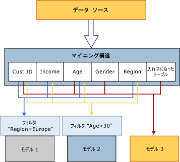

# データ マイニング オブジェクトの処理
[!INCLUDE[ssas-appliesto-sqlas](../../includes/ssas-appliesto-sqlas.md)]処理されるまで、データ マイニング オブジェクトは、空のコンテナーのみがします。 データ マイニング モデルの*処理* は *トレーニング*とも呼ばれます。  
  
 **マイニング構造の処理:** マイニング構造は、列バインドと使用方法のメタデータの定義に従って外部のデータ ソースからデータを取得し、データを読み取ります。 このデータの全体が読み取られて分析され、さまざまな統計情報が抽出されます。 Analysis Services では、データ マイニング アルゴリズムによる分析に適した、簡潔な表現のデータがローカル キャッシュに格納されます。 モデルを処理した後、このキャッシュを保持することも削除することもできます。 既定では、キャッシュが保存されます。 詳細については、「 [Process a Mining Structure](../../analysis-services/data-mining/process-a-mining-structure.md)」 (マイニング構造の処理) を参照してください。  
  
 **マイニング モデルの処理:** マイニング モデルは処理されるまで空で、定義だけが含まれています。 マイニング モデルを処理するには、基になるマイニング構造の処理が完了している必要があります。 マイニング モデルは、マイニング構造のキャッシュからデータを取得し、モデルに対して作成されたフィルターがあれば適用した後、データセットをアルゴリズムに渡してパターンを検出します。 処理後のモデルには、データ自体ではなく処理結果だけが保存されます。 詳細については、「 [Process a Mining Model](../../analysis-services/data-mining/process-a-mining-model.md)」 (マイニング モデルの処理) を参照してください。  
  
 次の図は、マイニング構造とマイニング モデルの処理時のデータ フローを示しています。  
  
   
  
## 処理結果の表示  
 処理後のマイニング構造には、統計分析に使用できる、簡潔な表現のデータが含まれています。 キャッシュが消去されていない場合、このキャッシュ内のデータには次の方法でアクセスできます。  
  
-   モデルに対するデータ マイニング拡張機能 (DMX) クエリを作成し、構造にドリルスルーします。 詳細については、「[SELECT FROM &#60;model&#62;.CASES (DMX)](../../dmx/select-from-model-cases-dmx.md)」を参照してください。  
  
-   構造に基づいてモデルを参照し、ユーザー インターフェイスでいずれかのオプションを使用して構造ケースにドリルスルーします。 詳細については、「 [Data Mining Model Viewers](../../analysis-services/data-mining/data-mining-model-viewers.md)」 (データ マイニング モデル ビューアー) または「 [マイニング モデルからケース データへのドリルスルー](../../analysis-services/data-mining/drill-through-to-case-data-from-a-mining-model.md)」を参照してください。  
  
-   構造ケースに対する DMX クエリを作成します。 詳細については、「[SELECT FROM &#60;structure&#62;.CASES](../../dmx/select-from-structure-cases.md)」を参照してください。  
  
 処理後のマイニング モデルには、分析によって生成されたパターンと、モデルの結果からキャッシュ内のトレーニング データへのマッピングだけが含まれています。 モデルの結果 ( *モデル コンテンツ*) に対して参照やクエリを実行できます。また、キャッシュされている場合は、モデル ケースや構造ケースに対してクエリを実行することもできます。  
  
 各マイニング モデルのモデル コンテンツは、作成に使用されたアルゴリズムによって異なります。 たとえば、クラスター モデルとデシジョン ツリー モデルでは、まったく同じデータを使用した場合でも、モデル コンテンツが大きく異なります。 詳細については、「[マイニング モデル コンテンツ (Analysis Services - データ マイニング)](../../analysis-services/data-mining/mining-model-content-analysis-services-data-mining.md)」を参照してください。  
  
## 処理の要件  
 処理の要件は、マイニング モデルがリレーショナル データのみに基づいているか多次元データ ソースに基づいているかに応じて異なる場合があります。  
  
 リレーショナル データソースの処理には、トレーニング データを作成し、そのデータでマイニング アルゴリズムを実行することだけが必要です。 ただし、マイニング モデルがディメンション、メジャーなどの OLAP オブジェクトに基づいている場合は、基になるデータが処理済みの状態であることが必要です。 これには、多次元オブジェクトを処理して、マイニング モデルを作成する必要があります。  
  
 詳細については、「[処理の要件および注意事項 (データ マイニング)](../../analysis-services/data-mining/processing-requirements-and-considerations-data-mining.md)」を参照してください。  
  
## 参照  
 [ドリルスルー クエリ (データ マイニング)](../../analysis-services/data-mining/drillthrough-queries-data-mining.md)   
 [マイニング構造 (Analysis Services - データ マイニング)](../../analysis-services/data-mining/mining-structures-analysis-services-data-mining.md)   
 [マイニング モデルと #40 です。Analysis Services - データ マイニング &#41;](../../analysis-services/data-mining/mining-models-analysis-services-data-mining.md)   
 [論理アーキテクチャ (Analysis Services - データ マイニング)](../../analysis-services/data-mining/logical-architecture-analysis-services-data-mining.md)  
  
  
