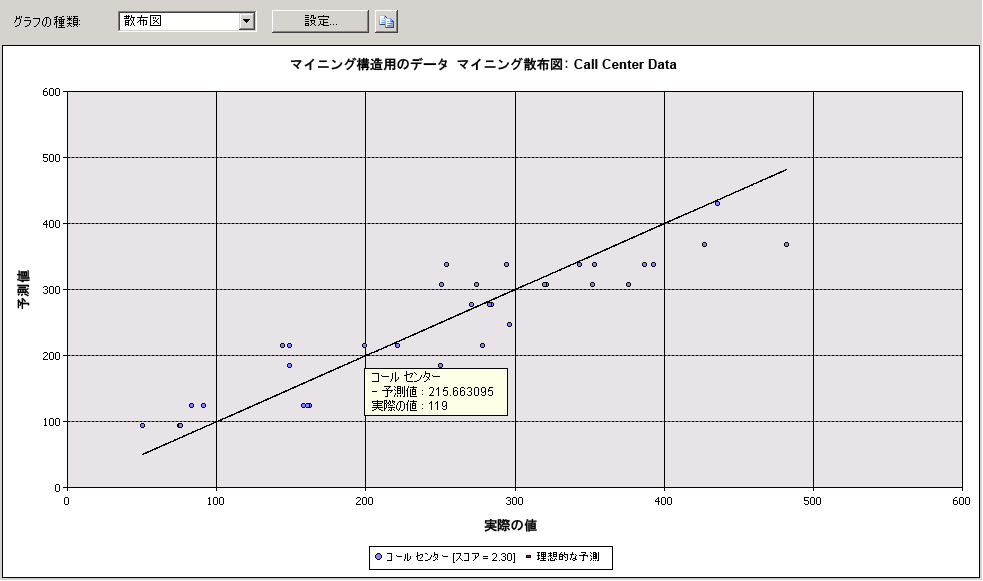

# 散布図 (Analysis Services - データ マイニング)
[!INCLUDE[ssas-appliesto-sqlas](../../includes/ssas-appliesto-sqlas.md)]A*散布図*モデルによって予測された値に対してデータの実際の値をグラフ化します。 実際の値は X 軸に表示され、予測された値は Y 軸に表示されます。 そのほかに、完璧な予測 (予測された値が実際の値と完全に一致する状態) を表す線も表示されます。 この理想的な 45 度の線からの距離により、それぞれの点の予測の正確さがわかります。  
  
## 散布図について  
 たとえば、マーケティング部門で、販促用電子メールで送信したリンクがクリックされた回数に基づいて毎日の売上を予測するモデルが使用されていたとします。 クリックの回数と売上高はどちらも連続する数値なので、クリックの回数を独立変数とし、売上を従属変数として、グラフに表すことができます。 この場合、グラフの直線は期待される直線関係を表し、直線の周りに散らばる点は、実際のデータがその予測からどれだけ逸脱しているかを表します。 この分析により、一連の結果と特定の入力との関連性と、理想的なモデルからの偏差の大きさがひとめでわかります。  
  
## 結果の解釈  
 次の図は、上で説明したシナリオのために作成された散布図の例を示しています。  
  
   
  
 直線の周りに散らばっている点の上にマウス ポインターを置くと、予測された値と実際の値がツールヒントに表示されます。 散布図には **[マイニング凡例]** はありませんが、グラフ自体に、モデルに関連付けられているスコアを表示する凡例が含まれています。 詳細については、「[線形回帰モデルのマイニング モデル コンテンツ (Analysis Services - データ マイニング)](../../analysis-services/data-mining/mining-model-content-for-linear-regression-models-analysis-services-data-mining.md)」を参照してください。  
  
 グラフの視覚的な表現はクリップボードにコピーできますが、基になるデータや式をコピーすることはできません。 直線の回帰式を表示するには、モデルに対するコンテンツ クエリを作成します。 詳細については、「 [線形回帰モデルのクエリ例](../../analysis-services/data-mining/linear-regression-model-query-examples.md)」を参照してください。  
  
## 散布図に関する制限  
 散布図は、 **[入力の選択]** タブで選択したモデルに連続する予測可能な属性が含まれている場合にのみ作成できます。 特に項目を選択する必要はありません。モデルと属性の種類に基づいて、 **[リフト チャート]** タブに "散布図" グラフの種類が自動的に表示されます。  
  
 タイム シリーズ モデルでは連続する数値が予測されますが、散布図を使用してタイム シリーズ モデルの精度を測定することはできません。 履歴データの一部を取っておくなど、別の方法を使用できます。 詳細については、「 [タイム シリーズ モデルのクエリ例](../../analysis-services/data-mining/time-series-model-query-examples.md)」を参照してください。  
  
## 関連コンテンツ  
 次のトピックには、散布図および関連する精度チャートの構築方法と使用方法に関する詳細な情報が含まれています。  
  
|トピック|リンク|  
|------------|-----------|  
|Targeted Mailing モデルのリフト チャートの作成方法に関するチュートリアルが含まれています。|[基本的なデータ マイニング チュートリアル](http://msdn.microsoft.com/library/6602edb6-d160-43fb-83c8-9df5dddfeb9c)   [リフト チャートを使用した精度テスト (基本的なデータ マイニング チュートリアル)](http://msdn.microsoft.com/library/822d414b-4a39-473f-80c3-53476e30655a)|  
|関連するグラフの種類について説明します。|[リフト チャート (Analysis Services - データ マイニング)](../../analysis-services/data-mining/lift-chart-analysis-services-data-mining.md)   [利益チャート (Analysis Services - データ マイニング)](../../analysis-services/data-mining/profit-chart-analysis-services-data-mining.md)   [分類マトリックス (Analysis Services - データ マイニング)](../../analysis-services/data-mining/classification-matrix-analysis-services-data-mining.md)|  
|マイニング モデルとマイニング構造の相互検証の使用法について説明します。|[相互検証 (Analysis Services - データ マイニング)](../../analysis-services/data-mining/cross-validation-analysis-services-data-mining.md)|  
|リフト チャートおよびその他の精度チャートを作成する手順について説明します。|[テスト、検証タスク、および操作方法 &#40;データ マイニング&#41;](../../analysis-services/data-mining/testing-and-validation-tasks-and-how-tos-data-mining.md)|  
  
## 参照  
 [テストおよび検証 &#40;データ マイニング&#41;](../../analysis-services/data-mining/testing-and-validation-data-mining.md)  
  
  
