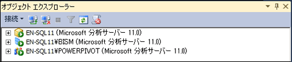

# Analysis Services インスタンスのサーバー モードの決定
[!INCLUDE[ssas-appliesto-sqlas](../../includes/ssas-appliesto-sqlas.md)]
  Analysis Services は、多次元およびデータ マイニング (既定)、 [!INCLUDE[ssGemini](../../includes/ssgemini-md.md)] for SharePoint、テーブルの 3 つのサーバー モードのいずれかでインストールできます。 Analysis Services インスタンスのサーバー モードは、セットアップ時にサーバーのインストール オプションを選択するときに決定します。  
  
 サーバー モードによって、作成および配置するソリューションの種類が決まります。 自分でサーバー ソフトウェアをインストールしなかった場合に、サーバーがインストールされたモードを確認するには、このトピックの情報を使用してモードを判別できます。 特定のモードで使用できる機能の詳細については、次を参照してください。[を比較する表形式と多次元ソリューション](../../analysis-services/comparing-tabular-and-multidimensional-solutions-ssas.md)します。  
  
 インストールした際のサーバー モードを使用しない場合は、ソフトウェアをアンインストールしてから、必要なモードを選択して再インストールする必要があります。 または、同じコンピューターに Analysis Services のもう 1 つのインスタンスをインストールして、複数のインスタンスを異なるモードで実行させることもできます。  
  
## オブジェクト エクスプローラーでのサーバー アイコン  
 サーバー モードを判別する最も簡単な方法は、SQL Server Management Studio でサーバーに接続し、オブジェクト エクスプローラーのサーバー名の横にあるアイコンを確認する方法です。 次の図に、多次元、テーブル、および [!INCLUDE[ssGemini](../../includes/ssgemini-md.md)] の各モードで配置された Analysis Services の 3 つのインスタンスを示します。  
  
   
  
## MSMDSRV.INI ファイルの DeploymentMode プロパティの表示  
 すべての Analysis Services インスタンスに含まれる msmdsrv.ini ファイルで **DeploymentMode** プロパティをチェックすることもできます。 このプロパティの値によってサーバー モードが示されます。 有効な値は、0 (多次元)、1 (SharePoint)、または 2 (テーブル) です。 msmdsrv.ini ファイルを開くには、 [!INCLUDE[ssASnoversion](../../includes/ssasnoversion-md.md)] 管理者 (つまり、サーバー ロールのメンバー) である必要があります。 このファイルには、構造化された XML が含まれています。 メモ帳または他のテキスト エディターでファイルを閲覧できます。  
  
> [!CAUTION]  
>  **DeploymentMode** プロパティの値は変更しないでください。 サーバーのインストール後の手動でのプロパティ変更はサポートされていません。  
  
## DeploymentMode プロパティについて  
 **DeploymentMode** プロパティは、Analysis Services サーバー インスタンスの操作コンテキストを指定します。 このプロパティは、ダイアログ ボックス、メッセージ、およびドキュメントで "サーバー モード" と呼ばれます。 このプロパティは、Analysis Services のインストール方法に基づいてセットアップによって初期化されます。 このプロパティは内部使用のみと見なしてください。常にセットアップによって指定された値が使用されます。  
  
 このプロパティの有効値を以下に示します。  
  
|値|Description|  
|-----------|-----------------|  
|0|これが既定値です。 MOLAP、HOLAP、ROLAP の各ストレージ、およびデータ マイニング モデルを使用する多次元データベースの処理に使用される多次元モードを指定します。|  
|1|[!INCLUDE[ssGemini](../../includes/ssgemini-md.md)] for SharePoint 配置の一部としてインストールされた Analysis Services インスタンスを指定します。 [!INCLUDE[ssGemini](../../includes/ssgemini-md.md)] for SharePoint インストールの一部である Analysis Services インスタンスの配置モード プロパティは変更しないでください。 [!INCLUDE[ssGemini](../../includes/ssgemini-md.md)] データは、モードを変更するとサーバー上で実行されなくなります。|  
|2|インメモリ ストレージまたは DirectQuery ストレージを使用するテーブル モデル データベースをホストするために使用するテーブル モードを指定します。|  
  
 各モードは、他のモードと相互に排他的です。 テーブル モード用に構成されたサーバーでは、キューブおよびディメンションを含む Analysis Services データベースを実行できません。 基になるコンピューターのハードウェアでサポートできる場合は、Analysis Services の複数のインスタンスを同じコンピューターにインストールし、さまざまな配置モードを使用するように各インスタンスを構成できます。 Analysis Services はリソースを大量に消費するアプリケーションであることに注意してください。 同じシステム上に複数のインスタンスを配置する構成は、ハイエンド サーバーの場合のみお勧めします。  
  
## 参照  
 [Analysis Services のインストール](../../analysis-services/instances/install-windows/install-analysis-services.md)   
 [多次元モードおよびデータ マイニング モードでの Analysis Services のインストール](http://msdn.microsoft.com/library/8a1f33e8-2bd6-4fb8-bd46-c86f2a067f60)   
 [Power Pivot for SharePoint 2010 のインストール](http://msdn.microsoft.com/8d47dde7-c941-4280-a934-e2fe3f9a938f)   
 [Analysis Services への接続](../../analysis-services/instances/connect-to-analysis-services.md)   
 [テーブル モデル ソリューション](../../analysis-services/tabular-models/tabular-models-ssas.md)   
 [多次元モデル ソリューション ](../../analysis-services/multidimensional-models/multidimensional-model-solutions-ssas.md)   
 [マイニング モデル (Analysis Services - データ マイニング)](../../analysis-services/data-mining/mining-models-analysis-services-data-mining.md)  
  
  
