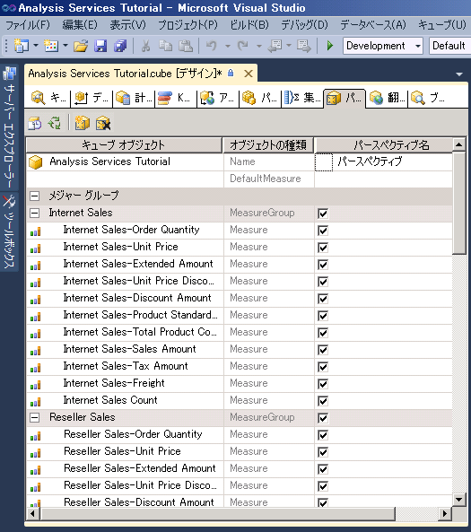
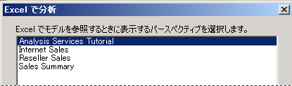
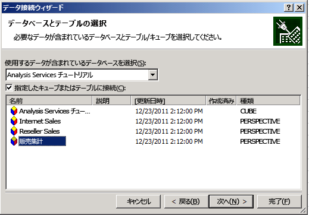
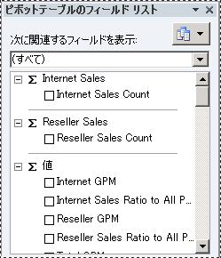

# レッスン 9-1-の定義とパースペクティブの表示
パースペクティブを使用すれば、特定の目的に従ってキューブの表示を単純化できます。 既定では、ユーザーはアクセスする権限のあるキューブ内のすべての要素を表示できます。 [!INCLUDE[ssASnoversion](../includes/ssasnoversion-md.md)] キューブ全体の表示時に表示されるものが、キューブの既定のパースペクティブです。 キューブ全体を表示すると、操作が非常に複雑になる可能性があります。特に、ビジネス インテリジェンスやレポートの要件に応じてキューブのごく一部分しか操作する必要のないユーザーにとっては複雑すぎます。  
  
キューブの表示上の複雑さを軽減するために、 *パースペクティブ*、つまりキューブの表示可能なサブセットを作成することができます。こうすれば、キューブ内のメジャー グループ、メジャー、ディメンション、属性、階層、主要業績評価指標 (KPI)、アクション、計算されるメンバーのうちの一部分だけがユーザーに表示されます。 これは、 [!INCLUDE[ssASnoversion](../includes/ssasnoversion-md.md)]の以前のリリース用に作成されたクライアント アプリケーションを使用する場合は特に有効です。 たとえば、これらのクライアントにはフォルダーやパースペクティブを表示する概念はありませんが、パースペクティブはあたかもキューブであるかのように古いクライアントに表示されます。 詳細については、「 [パースペクティブ](../analysis-services/multidimensional-models-olap-logical-cube-objects/perspectives.md)」および「 [多次元モデルのパースペクティブ](../analysis-services/multidimensional-models/perspectives-in-multidimensional-models.md)」を参照してください。  
  
> [!NOTE]  
> パースペクティブはセキュリティ上のメカニズムではなく、ユーザー エクスペリエンスを改善するためのツールです。 パースペクティブのセキュリティはすべて、基になるキューブから継承されます。  
  
このトピックの作業では、いくつかの異なるパースペクティブを定義した後、それぞれの新しいパースペクティブを使用してキューブを表示します。  
  
## Internet Sales パースペクティブの定義  
  
1.  [!INCLUDE[ssASnoversion](../includes/ssasnoversion-md.md)] Tutorial キューブのキューブ デザイナーを開いて、 **[パースペクティブ]** タブをクリックします。  
  
    次の図のように、すべてのオブジェクトとその種類が **[パースペクティブ]** ペインに表示されます。  
  
    ![キューブ デザイナーの [パースペクティブ] ペイン](../analysis-services/media/l9-perspectives-1.gif "キューブ デザイナーの [パースペクティブ] ペイン")  
  
2.  **[パースペクティブ]** タブのツール バーの **[新しいパースペクティブ]** ボタンをクリックします。  
  
    次の図のように、新しいパースペクティブの既定の名前 " **パースペクティブ** " が **[パースペクティブ名]**列に表示されます。 各オブジェクトのチェック ボックスはオンになっています。いずれかのオブジェクトのチェック ボックスをオフにするまでは、このキューブの既定のパースペクティブと同じ表示内容になります。  
  
      
  
3.  パースペクティブ名を「 **Internet Sales**」に変更します。  
  
4.  次の行で、DefaultMeasure を **[Internet Sales-Sales Amount]**に設定します。  
  
    ユーザーがこのパースペクティブを使ってキューブを表示する場合、他のメジャーをユーザーが指定しない限り、このメジャーがユーザーに表示されます。  
  
    > [!NOTE]  
    > [!INCLUDE[ssASnoversion](../includes/ssasnoversion-md.md)] Tutorial キューブ全体の既定のメジャーは、キューブの **[キューブ構造]** タブのプロパティ ウィンドウでも設定できます。  
  
5.  次のオブジェクトのチェック ボックスをオフにします。  
  
    -   **Reseller Sales** メジャー グループ  
  
    -   **Sales Quotas** メジャー グループ  
  
    -   **Sales Quotas 1** メジャー グループ  
  
    -   **Reseller** キューブ ディメンション  
  
    -   **Reseller Geography** キューブ ディメンション  
  
    -   **Sales Territory** キューブ ディメンション  
  
    -   **Employee** キューブ ディメンション  
  
    -   **Promotion** キューブ ディメンション  
  
    -   **Reseller Revenue** KPI  
  
    -   **Large Resellers** 名前付きセット  
  
    -   計算されるメンバー**Total Sales Amount**   
  
    -   計算されるメンバー**Total Product Cost**   
  
    -   計算されるメンバー**Reseller GPM**   
  
    -   計算されるメンバー**Total GPM**   
  
    -   計算されるメンバー**Reseller Sales Ratio to All Products**   
  
    -   計算されるメンバー**Total Sales Ratio to All Products**   
  
    これらのオブジェクトはインターネット販売とは関係がありません。  
  
    > [!NOTE]  
    > さらに、ディメンションごとに、パースペクティブに表示するユーザー定義階層と属性を個別に選択できます。  
  
## Reseller Sales パースペクティブの定義  
  
1.  **[パースペクティブ]** タブのツール バーの **[新しいパースペクティブ]** ボタンをクリックします。  
  
2.  新しいパースペクティブの名前を「 **Reseller Sales**」に変更します。  
  
3.  既定のメジャーとして **[Reseller Sales-Sales Amount]** を設定します。  
  
    ユーザーがこのパースペクティブを使用してキューブを表示するとき、他のメジャーをユーザーが指定しない限り、このメジャーがユーザーに表示されます。  
  
4.  次のオブジェクトのチェック ボックスをオフにします。  
  
    -   **Internet Sales** メジャー グループ  
  
    -   **Internet Sales Reason** メジャー グループ  
  
    -   **Customer** キューブ ディメンション  
  
    -   **Internet Sales Order Details** キューブ ディメンション  
  
    -   **Sales Reason** キューブ ディメンション  
  
    -   **Internet Sales Details Drillthrough Action** ドリルスルー アクション  
  
    -   計算されるメンバー**Total Sales Amount**   
  
    -   計算されるメンバー**Total Product Cost**   
  
    -   計算されるメンバー**Internet GPM**   
  
    -   計算されるメンバー**Total GPM**   
  
    -   計算されるメンバー**Internet Sales Ratio to All Products**   
  
    -   計算されるメンバー**Total Sales Ratio to All Products**   
  
    これらのオブジェクトは再販業者の販売とは関係がありません。  
  
## Sales Summary パースペクティブの定義  
  
1.  **[パースペクティブ]** タブのツール バーの **[新しいパースペクティブ]** ボタンをクリックします。  
  
2.  新しいパースペクティブの名前を「 **Sales Summary**」に変更します。  
  
    > [!NOTE]  
    > 計算されるメジャーを既定のメジャーとして指定することはできません。  
  
3.  次のオブジェクトのチェック ボックスをオフにします。  
  
    -   **Internet Sales** メジャー グループ  
  
    -   **Reseller Sales** メジャー グループ  
  
    -   **Internet Sales Reason** メジャー グループ  
  
    -   **Sales Quotas** メジャー グループ  
  
    -   **Sales Quotas1** メジャー グループ  
  
    -   **Internet Sales Order Details** キューブ ディメンション  
  
    -   **Sales Reason** キューブ ディメンション  
  
    -   **Internet Sales Details Drillthrough Action** ドリルスルー アクション  
  
4.  次のオブジェクトのチェック ボックスをオンにします。  
  
    -   **Internet Sales Count** メジャー  
  
    -   **Reseller Sales Count** メジャー  
  
## 各パースペクティブを使用したキューブの表示  
  
1.  **[ビルド]** メニューの **[Analysis Services Tutorial の配置]**をクリックします。  
  
2.  配置が正常に完了したら、 **[ブラウザー]** タブに切り替えて、 **[再接続]** ボタンをクリックします。  
  
3.  Excel を起動します。  
  
4.  次の図のように、Excel の分析機能では、Excel でモデルを参照するときに使用するパースペクティブを選択することができます。  
  
      
  
5.  または、Windows の [スタート] メニューから Excel を起動して、次の図のように、データ接続ウィザードで localhost 上の Analysis Services Tutorial データベースへの接続を定義し、パースペクティブを選択することもできます。  
  
      
  
6.  **[パースペクティブ]** ボックスの一覧で **[Internet Sales]** をクリックし、メタデータ ペインでメジャーとディメンションを確認します。  
  
    Internet Sales パースペクティブ用に指定されたオブジェクトだけが表示されます。  
  
7.  メタデータ ペインで、 **[Measures]**を展開します。  
  
    **Internet Sales** メジャー グループと、計算されるメンバー **Internet GPM** および **Internet Sales Ratio to All Products** だけが表示されます。  
  
8.  モデルで再度 Excel を選択します。 **[Sales Summary]**を選択します。  
  
    次の図のように、これらの各メジャー グループには 1 つのメジャーだけが表示されます。  
  
      
  
## このレッスンの次の作業  
[翻訳の定義と表示](../analysis-services/lesson-9-2-defining-and-browsing-translations.md)  
  
## 参照  
[Perspectives](../analysis-services/multidimensional-models-olap-logical-cube-objects/perspectives.md)  
[多次元モデルのパースペクティブ](../analysis-services/multidimensional-models/perspectives-in-multidimensional-models.md)  
  
  
  

