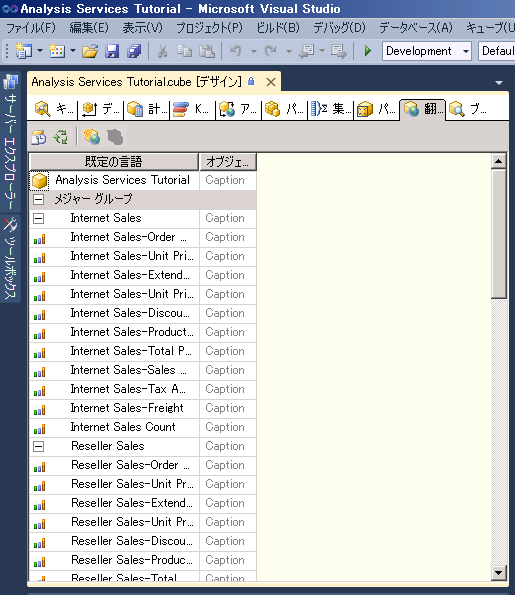
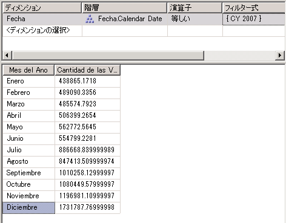

# レッスン 9-2-の定義と翻訳の表示
翻訳とは、 [!INCLUDE[ssASnoversion](../includes/ssasnoversion-md.md)] のオブジェクトの名前を特定の言語で表現することです。 オブジェクトには、メジャー グループ、メジャー、ディメンション、属性、階層、KPI、アクション、計算されるメンバーなどがあります。 翻訳によって、複数言語を使用するクライアント アプリケーションをサーバーがサポートできるようになります。 この場合、クライアントは、ロケール識別子 (LCID) を [!INCLUDE[ssASnoversion](../includes/ssasnoversion-md.md)]のインスタンスに渡します。 のインスタンスはこの LCID に基づいて、 [!INCLUDE[ssASnoversion](../includes/ssasnoversion-md.md)] オブジェクトにメタデータを提供する際に使用する翻訳セットを判別します。 [!INCLUDE[ssASnoversion](../includes/ssasnoversion-md.md)] オブジェクトにその言語の翻訳が含まれていない場合、または特定のオブジェクトの翻訳が含まれていない場合は、オブジェクトのメタデータがクライアントに送り返される際に既定の言語が使用されます。 たとえば、フランスのビジネス ユーザーが、フランス語にロケール設定されたワークステーションからキューブにアクセスした場合、該当する項目がフランス語に翻訳されているのであれば、メンバー キャプションとメンバー プロパティ値がフランス語で表示されます。 一方、ドイツのビジネス ユーザーが、ドイツ語にロケール設定されたワークステーションから同じキューブにアクセスすると、メンバー キャプションとメンバー プロパティ値はドイツ語で表示されます。 詳しくは、「 [Dimension Translations](../analysis-services/multidimensional-models-olap-logical-dimension-objects/dimension-translations.md)」(ディメンションの翻訳)、「 [キューブの翻訳](../analysis-services/multidimensional-models-olap-logical-cube-objects/cube-translations.md)」、「 [Analysis Services での翻訳のサポート](../analysis-services/translation-support-in-analysis-services.md)」を参照してください。  
  
このトピックの作業では、Date ディメンションのディメンション オブジェクトと [!INCLUDE[ssASnoversion](../includes/ssasnoversion-md.md)] Tutorial キューブのキューブ オブジェクトの限定されたセットに関するメタデータ翻訳を定義します。 それから、これらのディメンションとキューブ オブジェクトを表示して、メタデータ翻訳を確認します。  
  
## Date ディメンションのメタデータの翻訳の指定  
  
1.  **Date** ディメンションのディメンション デザイナーを開き、 **[翻訳]** タブをクリックします。  
  
    各ディメンション オブジェクトの既定の言語でメタデータが表示されます。 [!INCLUDE[ssASnoversion](../includes/ssasnoversion-md.md)] Tutorial キューブの既定の言語は英語です。  
  
2.  **[翻訳]** タブのツール バーで **[新しい翻訳]** ボタンをクリックします。  
  
    **[言語の選択]** ダイアログ ボックスに言語の一覧が表示されます。  
  
3.  **[スペイン語 (スペイン)]**をクリックして、 **[OK]**をクリックします。  
  
    新しい列が表示されるので、翻訳対象のメタデータ オブジェクトのスペイン語の翻訳をその列で定義します。 このチュートリアルでは、プロセスを示すために少数のオブジェクトだけを翻訳します。  
  
4.  **[翻訳]** タブのツール バーで **[新しい翻訳]** ボタンをクリックします。 **[言語の選択]** ダイアログ ボックスで **[フランス語 (フランス)]** をクリックして、 **[OK]**をクリックします。  
  
    新しい言語列が表示されるので、フランス語の翻訳をその列で定義します。  
  
5.  **Date** ディメンションの **Caption** オブジェクトの行で、 **[スペイン語 (スペイン)]** 翻訳列に「 **Fecha** 」と入力し、 **[フランス語 (フランス)]** 翻訳列に「 **Temps** 」と入力します。  
  
6.  **Month Name** 属性の **Caption** オブジェクトの行で、 **[スペイン語 (スペイン)]** 翻訳列に「 **Mes del Año** 」と入力し、 **[フランス語 (フランス)]** 翻訳列に「 **Mois d'Année** 」と入力します。  
  
    これらの翻訳を入力すると、参照ボタン (**[...]**) が表示されます。 この参照ボタンをクリックすると、属性階層の各メンバーの翻訳を入力する基になるテーブルの列を指定できます。  
  
7.  **Month Name**属性の **[スペイン語 (スペイン)]** 翻訳に表示される参照ボタン ( **[...]** ) をクリックします。  
  
    **[属性データの翻訳]** ダイアログ ボックスが表示されます。  
  
8.  次の図のように、 **[翻訳列]** ボックスの一覧で **[SpanishMonthName]**をクリックします。  
  
      
  
9. **[OK]**をクリックします。次に、**Month Name**属性の **[フランス語 (フランス)]** 翻訳に表示される参照ボタン ( **[...]** ) をクリックします。  
  
10. **[翻訳列]** ボックスの一覧で **[FrenchMonthName]**をクリックして、 **[OK]**をクリックします。  
  
    この手順は、ディメンション オブジェクトおよびメンバーのメタデータ翻訳を定義するプロセスを示しています。  
  
## Analysis Services Tutorial キューブのメタデータの翻訳の指定  
  
1.  [!INCLUDE[ssASnoversion](../includes/ssasnoversion-md.md)] Tutorial キューブのキューブ デザイナーを開いて、 **[翻訳]** タブに切り替えます。  
  
    次の図のように、各キューブ オブジェクトの既定の言語でメタデータが表示されます。 [!INCLUDE[ssASnoversion](../includes/ssasnoversion-md.md)] Tutorial キューブの既定の言語は英語です。  
  
      
  
2.  **[翻訳]** タブのツール バーで **[新しい翻訳]** ボタンをクリックします。  
  
    **[言語の選択]** ダイアログ ボックスに言語の一覧が表示されます。  
  
3.  **[スペイン語 (スペイン)]**を選択して、 **[OK]**をクリックします。  
  
    新しい列が表示されるので、翻訳対象のメタデータ オブジェクトのスペイン語の翻訳をその列で定義します。 このチュートリアルでは、プロセスを示すために少数のオブジェクトだけを翻訳します。  
  
4.  **[翻訳]** タブのツール バーで **[新しい翻訳]** ボタンをクリックします。 **[言語の選択]** ダイアログ ボックスで **[フランス語 (フランス)]** をクリックして、 **[OK]**をクリックします。  
  
    新しい言語列が表示されるので、フランス語の翻訳をその列で定義します。  
  
5.  **Date** ディメンションの **Caption** オブジェクトの行で、 **[スペイン語 (スペイン)]** 翻訳列に「 **Fecha** 」と入力し、 **[フランス語 (フランス)]** 翻訳列に「 **Temps** 」と入力します。  
  
6.  **Internet Sales** メジャー グループの **Caption** オブジェクトの行で、 **[スペイン語 (スペイン)]** 翻訳列に「 **Ventas del lnternet** 」と入力し、 **[フランス語 (フランス)]** 翻訳列に「 **Ventes D'Internet** 」と入力します。  
  
7.  Internet Sales-Sales Amount メジャーの **Caption** オブジェクトの行で、 **[スペイン語 (スペイン)]** 翻訳列に「 **Cantidad de las Ventas del Internet** 」と入力し、 **[フランス語 (フランス)]** 翻訳列に「 **Quantité de Ventes d'Internet** 」と入力します。  
  
    この手順は、キューブ オブジェクトのメタデータ翻訳を定義するプロセスを示しています。  
  
## 翻訳を使用したキューブの表示  
  
1.  **[ビルド]** メニューの **[Analysis Services Tutorial の配置]**をクリックします。  
  
2.  配置が正常に完了したら、 **[ブラウザー]** タブに切り替えて、 **[再接続]**をクリックします。  
  
3.  **データ** ペインからすべての階層とメジャーを削除して、 [!INCLUDE[ssASnoversion](../includes/ssasnoversion-md.md)] [パースペクティブ] **ボックスの一覧で [** Tutorial] をクリックします。  
  
4.  メタデータ ペインで、 **[Measures]** 、 **[Internet Sales]**の順に展開します。  
  
    このメジャー グループに **Internet Sales-Sales Amount** メジャー (英語) があることを確認します。  
  
5.  ツール バーの **[言語]** ボックスの一覧で **[スペイン語 (スペイン)]** をクリックします。  
  
    メタデータ ペインのアイテムが再設定されます。 メタデータ ペインのアイテムが再設定されると、Internet Sales-Sales Amount メジャーが [Internet Sales] 表示フォルダーに表示されなくなります。 その代わり、次の図のように **[Ventas del lnternet]**という新しい表示フォルダーにスペイン語で表示されます。  
  
      
  
6.  メタデータ ペインで、 **[Cantidad de las Ventas del Internet]** を右クリックし、 **[クエリに追加]**をクリックします。  
  
7.  メタデータ ペインで、 **[Fecha]**、 **[Fecha.Calendar Date]**の順に展開し、 **[Fecha.Calendar Date]**を右クリックして、 **[フィルターに追加]**をクリックします。  
  
8.  **フィルター** ペインで、フィルター式として **[CY 2007]** を選択します。  
  
9. メタデータ ペインで **[Mes del Ano]** を右クリックし、 **[クエリに追加]**をクリックします。  
  
    次の図のように、月の名前がスペイン語で表示されます。  
  
      
  
10. ツール バーの **[言語]** ボックスの一覧で **[フランス語 (フランス)]** をクリックします。  
  
    月の名前がフランス語で表示され、メジャー名もフランス語で表示されます。  
  
## 次のレッスン  
[レッスン 10 : 管理ロールの定義](../analysis-services/lesson-10-defining-administrative-roles.md)  
  
## 参照  
[Dimension Translations](../analysis-services/multidimensional-models-olap-logical-dimension-objects/dimension-translations.md)  
[キューブの翻訳](../analysis-services/multidimensional-models-olap-logical-cube-objects/cube-translations.md)  
[Analysis Services での翻訳のサポート](../analysis-services/translation-support-in-analysis-services.md)  
  
  
  

