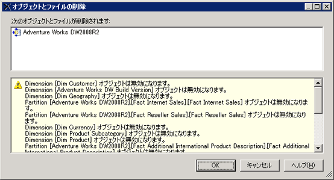

# データ ソース ビューの削除 (Analysis Services)
[!INCLUDE[ssas-appliesto-sqlas](../../includes/ssas-appliesto-sqlas.md)]
  OLAP プロジェクトでデータ ソース ビュー (DSV) を使用していない場合、[!INCLUDE[ssBIDevStudioFull](../../includes/ssbidevstudiofull-md.md)] でプロジェクトから DSV を削除できます。  
  
 DSV は、削除すると完全に失われます。 削除した DSV を、 [!INCLUDE[ssASnoversion](../../includes/ssasnoversion-md.md)] のプロジェクトまたはデータベースに復元することはできません。  
  
 他のオブジェクトが依存している DSV は、オンライン モードの [!INCLUDE[ssASnoversion](../../includes/ssasnoversion-md.md)] によって開かれた [!INCLUDE[ssBIDevStudioFull](../../includes/ssbidevstudiofull-md.md)] データベースから削除できません。 サーバーで実行中のデータベースに接続されているプロジェクトから DSV を削除するには、DSV 自体を削除する前に、 [!INCLUDE[ssASnoversion](../../includes/ssasnoversion-md.md)] データベース内でその DSV に依存しているすべてのオブジェクトを削除する必要があります。  
  
 DSV を削除すると、依存している他の [!INCLUDE[ssASnoversion](../../includes/ssasnoversion-md.md)] オブジェクトが無効になります。そのため、DSV を削除する前に、DSV を削除すると無効になるオブジェクトの一覧が表示されます。 使用する予定のあるオブジェクトが含まれていないか、この一覧で確認します。  
  
   
  
## 参照  
 [多次元モデル内のデータ ソース ビュー](../../analysis-services/multidimensional-models/data-source-views-in-multidimensional-models.md)   
 [データ ソース ビュー & #40; でプロパティを変更します。Analysis Services & #41;](../../analysis-services/multidimensional-models/change-properties-in-a-data-source-view-analysis-services.md)  
  
  
