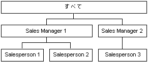

# 親子ディメンションの属性
[!INCLUDE[ssas-appliesto-sqlas](../../includes/ssas-appliesto-sqlas.md)]
  [!INCLUDE[msCoName](../../includes/msconame-md.md)] [!INCLUDE[ssNoVersion](../../includes/ssnoversion-md.md)] [!INCLUDE[ssASnoversion](../../includes/ssasnoversion-md.md)]では通常、ディメンションのメンバーのコンテンツに関して一般的な前提条件が適用されます。 リーフ メンバーには、基になるデータ ソースから直接派生したデータが含まれ、非リーフ メンバーには、子メンバーで実行した集計から算出したデータが含まれています。  
  
 ただし、親子階層では、一部の非リーフ メンバーに、子メンバーから取得したデータだけでなく、基になるデータ ソースから取得したデータも含まれている場合があります。 親子階層の非リーフ メンバーの場合、基になるファクト テーブル データを含む特殊なシステム生成の子メンバーが作成されます。 これらの子メンバーは *データ メンバー*と呼ばれ、非リーフ メンバーの子孫から計算される集計値に依存しない、非リーフ メンバーに直接関係付けられた値が含まれます。  
  
 データ メンバーは、親子階層を持つディメンションでのみ使用でき、親属性によって許可される場合にのみ表示されます。 ディメンション デザイナーを使用すると、データ メンバーの表示を制御できます。 データ メンバーを公開するには、親属性の **MembersWithData** プロパティを **NonLeafDataVisible**に設定します。 親属性に含まれるデータ メンバーを非表示にするには、親属性の **MembersWithData** プロパティを **NonLeafDataHidden**に設定します。  
  
 この設定により、非リーフ メンバーの通常の集計動作が上書きされることはありません。データ メンバーは、常に集計の目的で子メンバーとして含まれています。 ただし、カスタム ロールアップ式を使用して通常の集計動作を上書きすることはできます。 多次元式 (MDX) の [DataMember](../../mdx/datamember-mdx.md) 関数を使用すると、 **MembersWithData** プロパティの値に関係なく、関連付けられているデータ メンバーの値にアクセスできます。  
  
 親属性の **MembersWithDataCaption** プロパティを使用すると、 [!INCLUDE[ssASnoversion](../../includes/ssasnoversion-md.md)] で名前付けテンプレートを使用してデータ メンバーのメンバー名を生成できます。  
  
## データ メンバーの使用  
 データ メンバーは、親子階層を持つ組織ディメンションに従ってメジャーを集計する際に便利です。 たとえば、次の図は、製品の総売上高を表す 3 つのレベルを持つディメンションを示しています。 最初のレベルは、全販売員の総売上高を示します。 第 2 のレベルには営業責任者別にグループ化された全販売担当者の総売上高が含まれ、第 3 のレベルには販売員別にグループ化された全販売担当者の総売上高が含まれています。  
  
   
  
 通常、Sales Manager 1 メンバーの値は、Salesperson 1 メンバーと Salesperson 2 メンバーの値を集計することによって取得されます。 ただし、Sales Manager 1 も製品を販売でき、Sales Manager 1 に関連した総売上が存在する場合もあるため、このメンバーにはファクト テーブルから取得したデータも格納されていることがあります。  
  
 さらに、各販売担当者メンバーの個々の歩合は異なることがあります。 この場合、販売員による総売上の合計ではなく、2 つの異なる尺度を使用して営業責任者の個々の総売上に対する歩合が計算されます。 そのため、非リーフ メンバーの基になるファクト テーブル データにアクセスできることが重要になります。 MDX の **DataMember** 関数を使用すると、Sales Manager 1 メンバーの個々の総売上高を取得することができ、カスタム ロールアップ式を使用すると、Sales Manager 1 メンバーの集計値からデータ メンバーを除外できます。これにより、そのメンバーに関連付けられた販売員の総売上高が得られます。  
  
## 参照  
 [ディメンションの属性のプロパティの参照](../../analysis-services/multidimensional-models/dimension-attribute-properties-reference.md)   
 [親子ディメンション](../../analysis-services/multidimensional-models/parent-child-dimension.md)  
  
  
