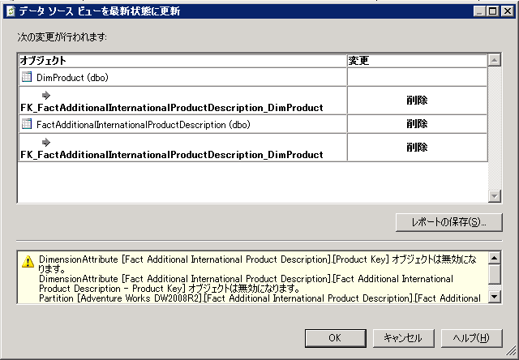

# データ ソース ビューでのスキーマの更新 (Analysis Services)
[!INCLUDE[ssas-appliesto-sqlas](../../includes/ssas-appliesto-sqlas.md)]
  [!INCLUDE[ssASnoversion](../../includes/ssasnoversion-md.md)] プロジェクトまたはデータベースでデータ ソース ビュー (DSV) を定義した後に、基になるデータ ソースのスキーマが変更される場合があります。 開発プロジェクトでは、これらの変更は自動的に検出または更新されません。 さらに、プロジェクトをサーバーに配置した場合に、Analysis Services が外部データ ソースに接続できないという処理エラーが発生します。  
  
 外部データ ソースと一致するように DSV を更新するには、Business Intelligence Development Studio (BIDS) で DSV を更新します。 DSV を更新すると、DSV の基になる外部データ ソースへの変更が検出され、外部データ ソース内の追加と削除を列挙した変更リストが構築されます。 その後、再配置を行う DSV への一連の変更を、基になるデータ ソースに適用できます。 DSV を使用するプロジェクトでキューブとディメンションをさらに更新するために、追加の作業が必要になることがよくあります。  
  
 このトピックのセクションは次のとおりです。  
  
 [更新でサポートされている変更](#bkmk_changlist)  
  
 [SQL Server Data Tools での DSV の更新](#bkmk_DSVrefresh)  
  
##   更新でサポートされている変更  
 DSV 更新には、次のアクションを含めることができます。  
  
-   テーブル、列、およびリレーションシップの削除。  
  
-   列およびリレーションシップの追加 (DSV に既に含まれているテーブルに適用)。  
  
-   新しい一意の制約の追加。 DSV のテーブルに論理主キーが存在し、データ ソースのテーブルに物理キーが追加されると、論理キーが削除され、物理キーで置換されます。  
  
 更新によって DSV に新しいテーブルが追加されることはありません。 新しいテーブルを追加する場合は、手動で追加する必要があります。 詳細については、「[データ ソース ビューでのテーブルまたはビューの追加または削除 (Analysis Services)](../../analysis-services/multidimensional-models/adding-or-removing-tables-or-views-in-a-data-source-view-analysis-services.md)」をご覧ください。  
  
##   SQL Server Data Tools での DSV の更新  
 DSV を更新するには、ソリューション エクスプ ローラーで DSV をダブルクリック[!INCLUDE[ssBIDevStudioFull](../../includes/ssbidevstudiofull-md.md)]です。  これは、DSV のデザイナーを起動します。  デザイナーでデータ ソース ビューの更新ボタンをクリックするか、選択し、**更新**データ ソース ビュー メニューからです。  
  
 [!INCLUDE[ssASnoversion](../../includes/ssasnoversion-md.md)] では、更新中、基になるリレーショナル データ ソースのすべてにクエリして、DSV に含まれているテーブルやビューが変更されたかどうかを調べます。 基になるデータ ソースのすべてに接続を確立できる場合は、変更されていれば **[データ ソース ビューを最新状態に更新]** ダイアログ ボックスに表示されます。  
  
   
  
 ダイアログ ボックスには、DSV で削除または追加されるテーブル、列、制約、およびリレーションシップが一覧表示されます。 また、レポートには、正常に準備できない名前付きクエリまたは計算も一覧表示されます。 影響を受けたオブジェクトは、テーブルで入れ子になった列およびリレーションシップと、オブジェクトごとに示されている変更の種類 (削除または追加) と共に、ツリー ビューに一覧表示されます。 標準的なデータ ソース ビューのオブジェクト アイコンは、影響を受けたオブジェクトの種類を示します。  
  
 更新は、基になるオブジェクトの名前に完全に基づいています。 したがって、基になるオブジェクトの名前がデータ ソースで変更されると、データ ソース ビュー デザイナーでは、名前が変更されたオブジェクトが、削除および追加の 2 つの別個の操作として処理されます。 この場合、名前が変更されたオブジェクトをデータ ソース ビューに手動で追加し直すことが必要な場合があります。 また、リレーションシップまたは論理主キーを再作成することが必要な場合もあります。  
  
> [!IMPORTANT]  
>  データ ソースでテーブルの名前が変更されたことがわかっている場合は、**[テーブルの置換]** コマンドを使用して、データ ソース ビューを更新する前に、テーブルを名前変更後のテーブルで置換することが必要な場合があります。 詳細については、「[データ ソース ビュー内のテーブルまたは名前付きクエリの置換 (Analysis Services)](../../analysis-services/multidimensional-models/replace-a-table-or-a-named-query-in-a-data-source-view-analysis-services.md)」をご覧ください。  
  
 レポートの確認後は、変更内容を受け入れるか、更新を取り消して変更内容を拒否することができます。 すべての変更はまとめて受け入れるか拒否する必要があります。 一覧の個々のアイテムを選択することはできません。 また、変更内容のレポートを保存することもできます。  
  
## 参照  
 [多次元モデル内のデータ ソース ビュー](../../analysis-services/multidimensional-models/data-source-views-in-multidimensional-models.md)  
  
  
