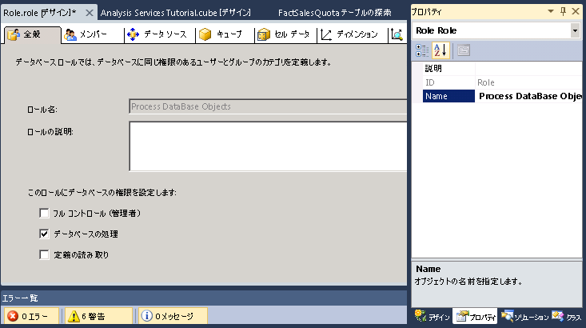
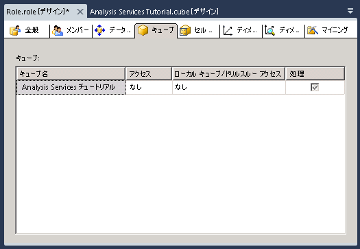

# レッスン 10: 処理データベース アクセス許可の付与
[!INCLUDE[ssas-appliesto-sqlas](../../includes/ssas-appliesto-sqlas.md)]

[!INCLUDE[ssASnoversion](../../includes/ssasnoversion-md.md)]のインスタンスをインストールすると、そのインスタンス内の [!INCLUDE[ssASnoversion](../../includes/ssasnoversion-md.md)] サーバー管理者ロールのすべてのメンバーは、サーバー全体について [!INCLUDE[ssASnoversion](../../includes/ssasnoversion-md.md)]のインスタンス内で任意のタスクを実行する権限を与えられます。 既定では、 [!INCLUDE[ssASnoversion](../../includes/ssasnoversion-md.md)]インスタンス内のオブジェクトを管理および表示する権限は他のユーザーに一切与えられません。  
  
サーバー管理者ロールのメンバーは、他のユーザーをロールのメンバーにすることにより、サーバー全体にわたる管理アクセス権をそのユーザーに許可できます。 また、データベース レベルで制限付きの、または完全な管理権限やアクセス権を他のユーザーに付与することで、より狭い範囲の権限をそのユーザーに与えることもできます。 制限付きの管理権限として、データベース レベル、キューブ レベル、またはディメンション レベルでの定義の処理権限や読み取り権限があります。  
  
このトピックの作業では、Process Database Objects というセキュリティ ロールを定義します。このロールのメンバーには、すべてのデータベース オブジェクトを処理する権限が与えられますが、データベース内のデータを表示する権限は与えられません。  
  
## Process Database Objects セキュリティ ロールの定義  
  
1.  ソリューション エクスプローラーで **[ロール]** を右クリックし、 **[新しいロール]** をクリックして、ロール デザイナーを開きます。  
  
2.  **[データベースの処理]** チェック ボックスをオンにします。  
  
3.  プロパティ ウィンドウで、この新しいロールの **Name** プロパティを「 **Process Database Objects Role**」に変更します。  
  
      
  
4.  ロール デザイナーの **[メンバーシップ]** タブに切り替えて、 **[追加]** をクリックします。  
  
5.  このロールのメンバーになる Windows ドメイン ユーザーまたはグループのアカウントを入力します。 アカウント情報を確認するために **[名前の確認]** をクリックし、 **[OK]** をクリックします。  
  
6.  ロール デザイナーの **[キューブ]** タブに切り替えます。  
  
    次の図に示すとおり、このロールのメンバーにはこのデータベースを処理する権限が与えられていますが、 [!INCLUDE[ssASnoversion](../../includes/ssasnoversion-md.md)] Tutorial キューブ内のデータへのアクセス権がなく、ローカル キューブ/ドリルスルー アクセスを行うことができません。  
  
      
  
7.  ロール デザイナーの **[ディメンション]** タブに切り替えます。  
  
    このロールのメンバーにはこのデータベース内のすべてのディメンション オブジェクトを処理する権限が与えられ、既定では、 [!INCLUDE[ssASnoversion](../../includes/ssasnoversion-md.md)] Tutorial データベース内の各ディメンション オブジェクトにアクセスするための読み取り権限も与えられます。  
  
8.  **[ビルド]** メニューの **[Analysis Services Tutorial の配置]** をクリックします。  
  
    これで、Process Database Objects セキュリティ ロールが正常に定義され、配置されました。 キューブが実稼働環境に配置された後、その配置されたキューブの管理者は、ユーザーをこのロールに追加することにより、処理作業を必要に応じて特定のユーザーに委任することができます。  
  
> [!NOTE]  
> レッスン 10 の操作内容が反映されたプロジェクトを入手するには、サンプルをダウンロードしてインストールしてください。 詳細については、「 [Analysis Services 多次元モデリング チュートリアル用のサンプル データおよびプロジェクトのインストール](install-sample-data-and-projects.md)」を参照してください。  
  
## 参照  
[ロールと権限 &#40;Analysis Services&#41;](../multidimensional-models/roles-and-permissions-analysis-services.md)  
  
  
  
