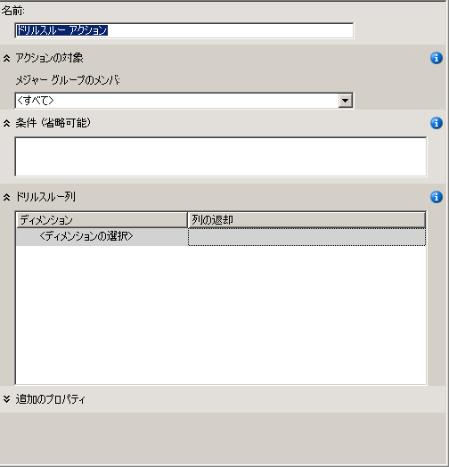
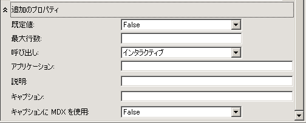
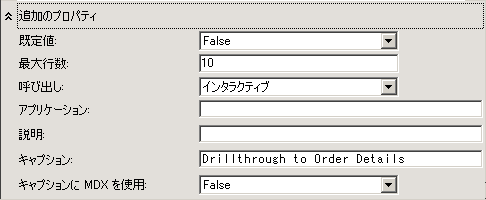
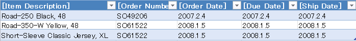

# レッスン 8-1-定義とドリルスルー アクションの使用
[!INCLUDE[ssas-appliesto-sqlas](../../includes/ssas-appliesto-sqlas.md)]

ファクト ディメンションによってファクト データを多次元化する場合、必要なデータのみが返されるようにフィルターを設定しないとクエリのパフォーマンスが低下する可能性があります。 これを回避するために、返される合計行数を制限するドリルスルー アクションを定義できます。 これにより、クエリのパフォーマンスが大幅に向上します。  
  
このトピックの作業では、インターネット経由での顧客への販売について注文の詳細情報を返すドリルスルー アクションを定義します。  
  
## ドリルスルー アクション プロパティの定義  
  
1.  [!INCLUDE[ssASnoversion](../../includes/ssasnoversion-md.md)] Tutorial キューブのキューブ デザイナーを開いて、 **[アクション]** タブをクリックします。  
  
    **[アクション]** タブにはいくつかのペインがあります。 このタブの左側には **[アクション オーガナイザー]** ペインと **[計算ツール]** ペインがあります。 これら 2 つのペインの右側には **[表示]** ペインがあり、 **[アクション オーガナイザー]** ペインで選択したアクションの詳細が表示されます。  
  
    次の図はキューブ デザイナーの **[アクション]** タブを示しています。  
  
    ![キューブ デザイナーの [アクション] タブ](../media/l8-action1.gif "キューブ デザイナーの [アクション] タブ")  
  
2.  **[アクション]** タブのツール バーで **[新しいドリルスルー アクション]** ボタンをクリックします。  
  
    表示ペインに、空のアクション テンプレートが表示されます。  
  
      
  
3.  **[名前]** ボックスに、このアクションの名前として「 **Internet Sales Details Drillthrough Action**」と入力します。  
  
4.  **[メジャー グループのメンバー]** リストで **[Internet Sales]** をクリックします。  
  
5.  **[ドリルスルー列]** で、 **[ディメンション]** リストから **[Internet Sales Order Details]** を選択します。  
  
6.  **[返される列]** リストで、 **[Item Description]** と **[Order Number]** チェック ボックスをオンにして、 **[OK]** をクリックします。 次の図は、ここまでの手順を実行した場合に表示されるアクション テンプレートを示しています。  
  
    ![[ドリルスルー列] ボックス](../media/l8-action3.gif "ドリルスルー列 ボックス")  
  
7.  次の図のように、 **[追加のプロパティ]** ボックスを展開します。  
  
      
  
8.  **[最大行数]** ボックスに「 **10**」と入力します。  
  
9. **キャプション**ボックスに「 **Drillthrough to Order Details.**.  
  
    これらの設定は、返される行数を制限し、クライアント アプリケーションのメニューに表示されるキャプションを指定します。 次の図は、 **[追加のプロパティ]** ボックスでの設定を示しています。  
  
      
  
## ドリルスルー アクションの使用  
  
1.  **[ビルド]** メニューの **[Analysis Services Tutorial の配置]** をクリックします。  
  
2.  配置が正常に完了したら、 **Tutorial キューブのキューブ デザイナーで** [ブラウザー] [!INCLUDE[ssASnoversion](../../includes/ssasnoversion-md.md)] タブをクリックし、 **[再接続]** ボタンをクリックします。  
  
3.  Excel を起動します。  
  
4.  **Internet Sales-Sales Amount** メジャーを値領域に追加します。  
  
5.  **Customer** ディメンションの **Location** フォルダーの **Customer Geography** ユーザー定義階層を **[レポート フィルター]** 領域に追加します。  
  
6.  ピボットテーブルの **Customer Geography**で、1 人の顧客を選択するフィルターを追加します。 **[All Customers]**、 **[Australia]**、 **[Queensland]**、 **[Brisbane]**、 **[4000]** の順に展開し、 **Adam Powell**のチェック ボックスをオンにして **[OK]** をクリックします。  
  
    Adam Powell に対する [!INCLUDE[ssSampleDBCoFull](../../includes/sssampledbcofull-md.md)] 社製品の売上合計がデータ領域に表示されます。  
  
7.  売上高を右クリックし、 **[追加アクション]** をポイントして、 **[Drillthrough to Order Details]** をクリックします。  
  
    次の図のように、Adam Powell に発送された注文の詳細が **[データ サンプル ビューアー]** に表示されます。 しかし、注文日、期限、発送日などの追加の情報があればさらに便利です。 次の手順では、これらの情報を追加します。  
  
      
  
8.  Excel を閉じます。  
  
## ドリルスルー アクションの変更  
  
1.  **Internet Sales Order Details** ディメンションのディメンション デザイナーを開きます。  
  
    このディメンションには 3 つの属性しか定義されていません。  
  
2.  **[データ ソース ビュー]** ペインで、何もない領域を右クリックし、 **[すべてのテーブルを表示]** をクリックします。  
  
3.  **[書式]** メニューの **[自動レイアウト]** をポイントし、 **[ダイアグラム]** をクリックします。  
  
4.  **InternetSales (dbo.FactInternetSales)** テーブルを検索します。検索するには、 **[データ ソース ビュー]** ペインの空いている領域を右クリックし、 **[テーブルの検索]** 、 **[InternetSales]** 、 **[OK]** の順にクリックします。  
  
5.  以下の列を基にして、新しい属性を作成します。  
  
    -   OrderDateKey  
  
    -   DueDateKey  
  
    -   ShipDateKey  
  
6.  **Order Date Key** 属性の **Name** プロパティを **Order Date** に変更します。次に、 **Name Column** プロパティの参照ボタンをクリックし、 **[名前列]** ダイアログ ボックスで、基になるテーブルとして **[Date]** を選択し、基になる列として [SimpleDate] を選択します。 [!INCLUDE[clickOK](../../includes/clickok-md.md)]  
  
7.  **Due Date Key** 属性の **Name** プロパティを **Due Date**に変更します。次に、 **Order Date Key** 属性と同じ方法で、この属性の **Name Column** プロパティを **Date.SimpleDate (WChar)** に変更します。  
  
8.  **Ship Date Key** 属性の **Name** プロパティを **Ship Date**に変更します。次に、この属性の **Name Column** プロパティを **Date.SimpleDate (WChar)** に変更します。  
  
9. **Tutorial キューブのキューブ デザイナーを開き、** [アクション] [!INCLUDE[ssASnoversion](../../includes/ssasnoversion-md.md)] タブに切り替えます。  
  
10. **[ドリルスルー列]** ボックスで、チェック ボックスをオンにして以下の列を **[返される列]** リストに追加し、 **[OK]** をクリックします。  
  
    -   Order Date  
  
    -   Due Date  
  
    -   Ship Date  
  
    次の図はこれらの列が選択された状態を示しています。  
  
    ![[ドリルスルー列] ボックス](../media/l8-action7.gif "ドリルスルー列 ボックス")  
  
## 変更されたドリルスルー アクションの確認  
  
1.  **[ビルド]** メニューの **[Analysis Services Tutorial の配置]** をクリックします。  
  
2.  配置が正常に完了したら、 **Tutorial キューブのキューブ デザイナーで** [ブラウザー] [!INCLUDE[ssASnoversion](../../includes/ssasnoversion-md.md)] タブに切り替え、 **[再接続]** ボタンをクリックします。  
  
3.  Excel を起動します。  
  
4.  値領域の **Internet Sales-Sales Amount** とレポート フィルターの **Customer Geography** を使用してピボットテーブルを再作成します。  
  
    **All Customers**、 **Australia**、 **Queensland**、 **Brisbane**、 **4000**、 **Adam Powell**から選択するフィルターを追加します。  
  
5.  **Internet Sales-Sales Amount** データ セルをクリックし、 **[追加アクション]** をポイントして、 **[Drillthrough to Order Details]** をクリックします。  
  
    Adam Powell に発送された注文の詳細が一時ワークシートに表示されます。 表示される情報には、次の図に示すように、アイテムの説明、注文番号、受注日、期日、出荷日が含まれます。  
  
      
  
## 次のレッスン  
[レッスン 9:パースペクティブと翻訳の定義](lesson-9-defining-perspectives-and-translations.md)  
  
## 参照  
[アクション &#40;Analysis Services - 多次元データ&#41;](../multidimensional-models/actions-analysis-services-multidimensional-data.md)  
[多次元モデルのアクション](../multidimensional-models/actions-in-multidimensional-models.md)  
[ディメンション リレーションシップ](../multidimensional-models-olap-logical-cube-objects/dimension-relationships.md)  
[ファクト リレーションシップの定義](lesson-5-2-defining-a-fact-relationship.md)  
[ファクト リレーションシップとファクト リレーションシップのプロパティの定義](../multidimensional-models/define-a-fact-relationship-and-fact-relationship-properties.md)  
  
  
  
