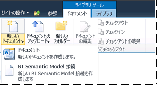

# BI セマンティック モデル接続のコンテンツ タイプをライブラリに追加します。
[!INCLUDE[ssas-appliesto-sqlas](../../includes/ssas-appliesto-sqlas.md)]BI セマンティック モデル接続は、SharePoint で作成およびの business intelligence semantic model データへのリダイレクト、[!INCLUDE[ssGemini](../../includes/ssgemini-md.md)]ブックや、ネットワーク サーバー上の Analysis Services 表形式モデル データベース。 SharePoint で BI セマンティック モデル接続を作成する前に、.bism ファイルの作成を許可するようにドキュメント ライブラリを拡張する必要があります。 この手順はライブラリごとに 1 回だけ実行する必要があり、.bism ファイルを作成するすべてのライブラリに対してこの手順を繰り返す必要があります。 ベスト プラクティスとして、権限を 1 か所で管理できるように、.bism ファイルを格納する単一のライブラリを作成することをお勧めします。  
  
> [!NOTE]  
>  既に SharePoint データ接続ライブラリを使用している場合、"BI セマンティック モデル接続" コンテンツ タイプがそのライブラリ テンプレートに自動的に追加されます。 既に新しい BI セマンティック モデル接続ドキュメントの作成が許可されているデータ接続ライブラリを使用する場合は、このセクションの手順を省略できます。  
  
##   ドキュメント ライブラリへのコンテンツ タイプの追加  
 コンテンツ タイプを追加および構成するには、管理リスト権限以上の権限が必要です。 この権限は、デザイン権限レベル以上の権限に組み込まれています。  
  
 ドキュメント ライブラリがあるサイトでは、 [!INCLUDE[ssGemini](../../includes/ssgemini-md.md)] for SharePoint の機能のアクティブ化が必要です。 詳細については、「 [サイト コレクションを対象とした Power Pivot 機能の統合をサーバーの全体管理でアクティブ化する方法](../../analysis-services/power-pivot-sharepoint/activate-power-pivot-integration-for-site-collections-in-ca.md)」を参照してください。  
  
1.  "BI セマンティック モデル接続" コンテンツ タイプを有効にする対象のドキュメント ライブラリを開きます。  
  
2.  SharePoint リボンで、[ライブラリ ツール] の **[ライブラリ]**をクリックします。  
  
3.  **[ライブラリの設定]**をクリックします。  
  
4.  [全般設定] の **[詳細設定]**をクリックします。  
  
5.  [コンテンツ タイプ] の [コンテンツ タイプの管理を許可する] セクションで **[はい]**をクリックします。  
  
6.  **[OK]** をクリックします。  
  
7.  [コンテンツ タイプ] セクションの **[既存のサイト コンテンツ タイプから追加]**をクリックします。 このページが表示されない場合は、サイトに戻って [ライブラリ ツール] の **[ライブラリ]** をクリックし、 **[ライブラリの設定]**をクリックします。  
  
8.  [コンテンツ タイプ] の **[既存のサイト コンテンツ タイプから追加]**をクリックします。  
  
9. [サイト コンテンツ タイプの選択元] で **[ビジネス インテリジェンス]**をクリックします。  
  
10. [利用可能なサイト コンテンツ タイプ] で **[BI セマンティック モデル接続ファイル]**をクリックしてから **[追加]** をクリックし、選択したコンテンツ タイプを [追加するコンテンツ タイプ] ボックスの一覧に追加します。  
  
11. **[OK]** をクリックします。  
  
12. コンテンツ タイプを追加したことを確認するには、ライブラリに戻り、ライブラリ リボンのドキュメント領域で **[新しいドキュメント]** をクリックします。 [新しいドキュメント] ボックスの一覧に、 **[BI セマンティック モデル接続ファイル]** が表示されます。  
  
       
  
 "BI セマンティック モデル接続" コンテンツ タイプをライブラリに対して有効にした後で、Excel または [!INCLUDE[ssCrescent](../../includes/sscrescent-md.md)] レポートで使用できるビジネス セマンティック モデル データへのリダイレクトを可能にする接続を作成できます。 次のステップの詳細については、次のリンクから選択してください。  
  
 [Power Pivot ブックへの BI セマンティック モデル接続の作成](../../analysis-services/power-pivot-sharepoint/create-a-bi-semantic-model-connection-to-a-power-pivot-workbook.md)  
  
 [テーブル モデル データベースへの BI セマンティック モデル接続の作成](../../analysis-services/power-pivot-sharepoint/create-a-bi-semantic-model-connection-to-a-tabular-model-database.md)  
  
## 参照  
 [Power Pivot BI セマンティック モデル接続 &#40;.bism&#41;](../../analysis-services/power-pivot-sharepoint/power-pivot-bi-semantic-model-connection-bism.md)   
 [Excel または Reporting Services での BI セマンティック モデル接続の使用](../../analysis-services/power-pivot-sharepoint/use-a-bi-semantic-model-connection-in-excel-or-reporting-services.md)  
  
  
