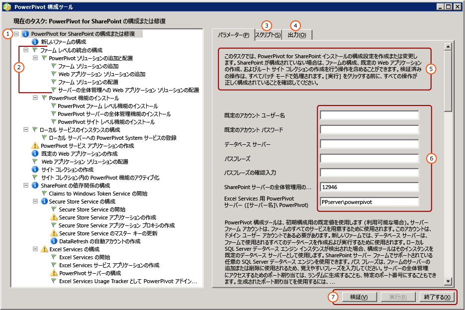

# <a name="configure-or-repair-power-pivot-for-sharepoint-2013"></a>構成または Power Pivot for SharePoint 2013 を修復します。
[!INCLUDE[ssas-appliesto-sqlas](../../includes/ssas-appliesto-sqlas.md)]構成またはのインストールを修復する[!INCLUDE[ssCurrent](../../includes/sscurrent-md.md)] [!INCLUDE[ssGemini](../../includes/ssgemini-md.md)] for SharePoint 2013 を使用して、 [!INCLUDE[ssGemini](../../includes/ssgemini-md.md)] for SharePoint 構成ツール。 構成ツールはまずシステムをスキャンし、インストールを完了または修復するために必要なアクションの一覧を返します。 [!INCLUDE[ssCurrent](../../includes/sscurrent-md.md)] セットアップ ウィザードでは、SharePoint 2010 用 [!INCLUDE[ssGemini](../../includes/ssgemini-md.md)] 構成ツールと SharePoint 2013 用 [!INCLUDE[ssGemini](../../includes/ssgemini-md.md)] 構成ツールがインストールされます。 このトピックでは、SharePoint 2013 用 [!INCLUDE[ssGemini](../../includes/ssgemini-md.md)] 構成ツールについて説明します。 SharePoint 2010 の詳細については、「 [PowerPivot for SharePoint 2010 の構成または修復 (PowerPivot 構成ツール)](http://msdn.microsoft.com/en-us/d61f49c5-efaa-4455-98f2-8c293fa50046)」を参照してください。  
  
 **[!INCLUDE[applies](../../includes/applies-md.md)]**  SharePoint 2013  
  
 **このトピックの内容:**  
  
 [開始前の準備](#bkmk_before)  
  
 [PowerPivot for SharePoint 2013 構成ツールを使用するには](#bkmk_using)  
  
 [構成手順](#bkmk_steps)  
  
 [サーバーの構成に使用する入力値](#bkmk_input)  
  
 [次の手順](#bkmk_nextsteps)  
  
##  <a name="bkmk_before"></a> 開始前の準備  
 [!INCLUDE[ssGemini](../../includes/ssgemini-md.md)] SharePoint 2013 構成ツールでは、プログラム ファイル、レジストリ設定、および使用可能なポートをスキャンします。 ツールを最も有効に利用するには、次をご確認ください。  
  
-   構成ツール [Power Pivot Configuration Tools](../../analysis-services/power-pivot-sharepoint/power-pivot-configuration-tools.md)を実行するための一般的な要件。  
  
-   [!INCLUDE[ssGemini](../../includes/ssgemini-md.md)] for SharePoint 2013 では、要求ベースの認証用に構成された Web アプリケーションが優先されます。 [!INCLUDE[ssGemini](../../includes/ssgemini-md.md)] for SharePoint 2013 構成ツールでアプリケーションを作成すると、アプリケーションは要求ベースの Windows 認証を使用するように構成されます。 認証要件の詳細については、「 [Power Pivot Authentication and Authorization](../../analysis-services/power-pivot-sharepoint/power-pivot-authentication-and-authorization.md)」を参照してください。  
  
-   [!INCLUDE[ssGemini](../../includes/ssgemini-md.md)] for SharePoint 2013 構成ツールで Web アプリケーションを作成するには、ポート 80 が利用できることが必要です。  
  
##  <a name="bkmk_using"></a> PowerPivot for SharePoint 2013 構成ツールを使用するには  
 このツールの最初のページには、SharePoint ファームの構成に使用する入力値の概要が示されます。 システムの構成には、ユーザーが指定する入力値のほか、既定値が使用されます。 サービス アプリケーション、サービス アプリケーション データベース、およびサービス アプリケーション プロパティには既定の名前が使用されます。  
  
> [!TIP]  
>  構成ツールがコンピューターをスキャンし、左ペインに空のタスク一覧が返された場合、構成を必要とする機能や設定は検出されません。 SharePoint または [!INCLUDE[ssGemini](../../includes/ssgemini-md.md)] の構成を変更するには、Windows PowerShell または SharePoint サーバーの全体管理の管理ページを使用します。 詳細については、「 [サーバーの全体管理での Power Pivot サーバーの管理と構成](../../analysis-services/power-pivot-sharepoint/power-pivot-server-administration-and-configuration-in-central-administration.md)」を参照してください。  
  
 サービス アカウントの値は複数のサービスに利用されます。 たとえば、この構成ツールの最初のページの既定のアカウントがすべてのアプリケーション プール ID の設定に使用されます。 これらのアカウントは、サーバーの全体管理のサービス アプリケーション プロパティを変更することで、後から変更できます。  
  
 このツールにはタブ付きインターフェイスが用意されており、パラメーターの入力、Windows PowerShell スクリプト、および状態メッセージが含まれています。  
  
 このツールでは、Windows PowerShell を使用してサーバーを構成します。 **[スクリプト]** タブをクリックすると、サーバーの構成に使用される Windows PowerShell スクリプトを確認できます。  
  
   
  
||Description|  
|-|-----------------|  
|**(1)**|タスク一覧ウィンドウ。|  
|**(2)**|個々のアクション。|  
|**(3)**|構成ツールによって作成された Windows PowerShell スクリプト。|  
|**(4)**|検証の開始時またはアクションの実行時に作成されたログ メッセージ。|  
|**(5)**|ページの説明。|  
|**(6)**|入力パラメーター。|  
|**(7)**|**[実行]** は、アクションの検証後に有効になります。|  
  
##  <a name="bkmk_steps"></a> 構成手順  
 構成ツールへのリンクは、 [!INCLUDE[ssGemini](../../includes/ssgemini-md.md)] for SharePoint 2013 がローカル サーバーにインストールされている場合にのみ表示されます。  
  
1.  **[スタート]** ボタンをクリックし、 **[すべてのプログラム]**をポイントして、[ [!INCLUDE[ssCurrentUI](../../includes/sscurrentui-md.md)]]、 **[構成ツール]**、 **[!INCLUDE[ssGemini](../../includes/ssgemini-md.md)] for SharePoint 2013 構成**の順にクリックします。  
  
2.  **[[!INCLUDE[ssGemini](../../includes/ssgemini-md.md)] for SharePoint の構成または修復]** をクリックします。  
  
3.  ウィンドウを最大化します。 ウィンドウの下部に **[検証]**、 **[実行]**、および **[終了]** の各コマンドを含むボタン バーが表示されます。  
  
4.  **既定のアカウント:** [パラメーター] タブで、 **[既定のアカウント ユーザー名]**にドメイン ユーザー アカウントを入力します。 このアカウントは、 [!INCLUDE[ssGemini](../../includes/ssgemini-md.md)] サービス アプリケーション プールなどの重要なサービスを準備する場合に使用されます。 Network Service や Local System などのビルトイン アカウントは指定しないでください。 ビルトイン アカウントを指定する構成はブロックされます。  
  
     **パスフレーズ:** パスフレーズを入力します。 SharePoint ファームが新しい場合、SharePoint ファームに新しいサーバーまたはアプリケーションを追加するたびにこのパスフレーズが使用されます。 ファームが存在する場合、ファームにサーバー アプリケーションを追加するためのパスフレーズを入力してください。  
  
5.  **ポート:** 必要に応じて、サーバーの全体管理 Web アプリケーションに接続するポート番号を入力するか、ランダムに生成される番号を使用します。 オプションとして提示される番号は、使用できるかどうかがあらかじめチェックされています。  
  
6.  メイン ページで、SharePoint モードで実行されている [!INCLUDE[ssCurrent](../../includes/sscurrent-md.md)][!INCLUDE[ssGemini](../../includes/ssgemini-md.md)] サーバーの名前を入力します。  
  
7.  必要に応じて、各アクションを完了するために使用された残りの入力値を確認します。 それぞれの入力値の詳細については、このトピックの [サーバーの構成に使用する入力値](#bkmk_input) をご覧ください。  
  
8.  必要に応じて、処理しないすべてのアクションを削除します。 たとえば、Secure Store Service を後で構成する場合は、 **[Secure Store Service の構成]**をクリックし、 **[この操作をタスク一覧に含めます]**チェック ボックスをオフにします。  
  
9. **[検証]** をクリックして、一覧のアクションを処理するための十分な情報があるかどうかを確認します。  
  
10. **[実行]** をクリックして、タスクの一覧にあるすべてのアクションを処理します。 **[実行]** はアクションの検証後に有効になります。 **[実行]** が有効になっていない場合は、まず **[検証]** をクリックしてください。  
  
     次のようなエラー メッセージが表示されたら、SQL Server データベース インスタンスが開始されていることを確認します。  
  
    ```  
    Cannot connect to the database server instance  
    ```  
  
11. [Verify a Power Pivot for SharePoint Installation](../../analysis-services/instances/install-windows/verify-a-power-pivot-for-sharepoint-installation.md)。  
  
##  <a name="bkmk_input"></a> サーバーの構成に使用する入力値  
 [!INCLUDE[ssGemini](../../includes/ssgemini-md.md)] 構成ツールでは、ユーザーが入力する入力値と自動的に検出または使用される既定値を組み合わせて使用します。  
  
 構成ツールによって表示されるアクションの一覧は、SharePoint ファームの現在の構成によって異なります。 たとえば、SharePoint ファームが既に構成されている場合は、ファームを構成するアクションまたは Web アプリケーションを作成するアクションが表示されません。 いつでもこのツールを実行して、構成、構成エラーの修復、または検出を行うことができます。 Excel Services や Secure Store Service などの必要なサービスがファームで実行されていない場合は、そのサービスが検出され、それを有効にするオプションが提供されます。 必要なアクションがない場合、タスクの一覧は空になります。  
  
 次の表は、サーバーの構成に使用する値を示しています。  
  
|ページ|入力値|Source|Description|  
|----------|-----------------|------------|-----------------|  
|**[!INCLUDE[ssGemini](../../includes/ssgemini-md.md)] for SharePoint の構成または修復**|既定のアカウント|現在のユーザー|既定のアカウントは、ファーム内の共有サービスの準備に使用されるドメイン Windows ユーザー アカウントです。 これは、次の準備に使用されます。|  
||||-<br />                    [!INCLUDE[ssGemini](../../includes/ssgemini-md.md)] サービス アプリケーション|  
||||- Secure Store Service|  
||||- Excel Services|  
||||- Web アプリケーション プールの ID|  
||||- サイト コレクション管理者|  
||||- [!INCLUDE[ssGemini](../../includes/ssgemini-md.md)] 自動データ更新アカウント|  
||||既定では、現在のユーザーのドメイン アカウントを使用します。<br /><br /> 注: 評価や運用以外の目的でサーバーを構成する場合を除いて、既定値を置き換えることをお勧めします。<br /><br /> サービス ID は、サーバーの全体管理を使用して、構成または修復後に変更できます。<br /><br /> 必要に応じて、 [!INCLUDE[ssGemini](../../includes/ssgemini-md.md)] 構成ツールで次の専用のアカウントを指定します。|  
||||- Web アプリケーション。 **[既定の Web アプリケーションの作成]** ページを使用 (このツールでファームの Web アプリケーションを作成する場合)。|  
||||-<br />                    [!INCLUDE[ssGemini](../../includes/ssgemini-md.md)] 自動データ更新アカウント。このツールの **[DataRefresh の自動アカウントの作成]** ページを使用。|  
||[データベース サーバー]|ローカルの [!INCLUDE[ssGemini](../../includes/ssgemini-md.md)] 名前付きインスタンス (存在する場合)|データベース エンジン インスタンスが [!INCLUDE[ssGemini](../../includes/ssgemini-md.md)] 名前付きインスタンスとしてインストールされている場合は、データベース サーバー フィールドにこのインスタンス名が入力されます。 データベース エンジンをインストールしていない場合は、このフィールドは空です。<br /><br /> **[データベース サーバー]**  は必須パラメーターです。 SharePoint ファームでサポートされる SQL Server であれば、バージョンやエディションは問いません。|  
||パスフレーズ|ユーザー入力|新しいファームを作成する場合、ユーザーが入力するパスフレーズがファームのパスフレーズとして使用されます。 既存のファームに [!INCLUDE[ssGemini](../../includes/ssgemini-md.md)] for SharePoint を追加する場合は、既存のファームのパスフレーズを入力します。|  
||SharePoint サーバーの全体管理のポート|既定 (必要な場合)|ファームを構成していない場合は、サーバーの全体管理への HTTP エンドポイントの作成など、ファームを作成するためのオプションが提供されます。 使用されていない、ランダムに生成されたポート番号がツールによって選択されます。|  
||[!INCLUDE[ssGemini](../../includes/ssgemini-md.md)] for Excel Services ([ServerName]\ [!INCLUDE[ssGemini](../../includes/ssgemini-md.md)])|ユーザー入力|Excel Services で主要な [!INCLUDE[ssGemini](../../includes/ssgemini-md.md)] 機能を有効にするには [!INCLUDE[ssGemini](../../includes/ssgemini-md.md)] サーバーが必須です。 このページで入力するサーバー名も、**[[!INCLUDE[ssGemini](../../includes/ssgemini-md.md)] サーバーの構成]** ページの一覧に追加されます。|  
|**新しいファームの構成**|[データベース サーバー]<br /><br /> ファーム アカウント<br /><br /> パスフレーズ<br /><br /> SharePoint サーバーの全体管理のポート|既定 (必要な場合)|既定では、メイン ページで入力した設定になります。|  
|**[!INCLUDE[ssGemini](../../includes/ssgemini-md.md)] サービス アプリケーションの作成**|サービス アプリケーション名|既定値|[!INCLUDE[ssGemini](../../includes/ssgemini-md.md)] サービス アプリケーション名。既定の名前は " **既定値 [!INCLUDE[ssGemini](../../includes/ssgemini-md.md)] Service Application**」を参照してください。 ツールで別の値に置き換えることができます。|  
||[データベース サーバー]|既定値|[!INCLUDE[ssGemini](../../includes/ssgemini-md.md)] サービス アプリケーション データベースをホストするデータベース サーバー。 既定のサーバー名は、ファームに使用するのと同じデータベース サーバーです。 既定のサーバー名以外の値に置き換えることもできます。|  
||データベース名|既定値|[!INCLUDE[ssGemini](../../includes/ssgemini-md.md)] サービス アプリケーション データベース用に作成するデータベースの名前。 既定のデータベース名は、サービス アプリケーション名の後ろに GUID を付けて一意の名前にしたものです。 ツールで別の値に置き換えることができます。|  
|**[既定の Web アプリケーションの作成]**|Web アプリケーション名|既定 (必要な場合)|Web アプリケーションが存在しない場合は、Web アプリケーションが 1 つ作成されます。 Web アプリケーションがクラシック モード認証用に構成され、ポート 80 でリッスンするようになります。 ファイルの最大アップロード サイズは、SharePoint で許容される最大値の 2047 に設定されます。 サイズの大きい [!INCLUDE[ssGemini](../../includes/ssgemini-md.md)] ファイルがサーバーにアップロードされる場合は、これに対応するため、これより大きいファイル アップロード サイズが使用されます。|  
||[URL]|既定 (必要な場合)|SharePoint と同じファイル名前付け規則を使用して、サーバー名に基づく URL が作成されます。|  
||アプリケーション プール|既定 (必要な場合)|IIS で既定のアプリケーション プールが作成されます。|  
||アプリケーション プール アカウントとパスワード|既定 (必要な場合)|アプリケーション プール アカウントは既定のアカウントに基づいていますが、このツールで上書きできます。|  
||[データベース サーバー]|既定 (必要な場合)|アプリケーション コンテンツ データベースの格納先として既定のデータベース インスタンスがあらかじめ選択されていますが、このツールで別の SQL Server インスタンスを指定できます。|  
||データベース名|既定 (必要な場合)|アプリケーション データベースの名前。 データベース名は SharePoint のファイル名前付け規則に基づいていますが、別の名前を選択できます。|  
|**Web アプリケーション ソリューションの配置**|[URL]|既定 (必要な場合)|既定の URL は、既定の Web アプリケーションから取得されます。|  
||ファイルの最大サイズ (MB)|既定 (必要な場合)|既定の設定は 2047 です。 SharePoint ドキュメント ライブラリにも最大サイズがあり、 [!INCLUDE[ssGemini](../../includes/ssgemini-md.md)] の設定がドキュメント ライブラリの設定を超えないようにする必要があります。 詳細については、「[アップロードするファイルの最大サイズの構成 &#40;Power Pivot for SharePoint&#41;](../../analysis-services/power-pivot-sharepoint/configure-maximum-file-upload-size-power-pivot-for-sharepoint.md)」を参照してください。|  
|**サイト コレクションの作成**|サイト管理者|既定 (必要な場合)|既定のアカウントが使用されます。 これは **[サイト コレクションの作成]** ページで上書きできます。|  
||連絡先の電子メール|既定 (必要な場合)|サーバーに Microsoft Outlook が構成されている場合は、現在のユーザーの電子メール アドレスが使用されます。 それ以外の場合は、プレースホルダー値が使用されます。|  
||サイトの URL|既定 (必要な場合)|SharePoint と同じ URL 名前付け規則を使用して、サイト URL が作成されます。|  
||サイトのタイトル|既定 (必要な場合)|既定のタイトルとして **[!INCLUDE[ssGemini](../../includes/ssgemini-md.md)] サイト** が追加されます。|  
|**サイト コレクション内の [!INCLUDE[ssGemini](../../includes/ssgemini-md.md)] 機能のアクティブ化**|サイトの URL||[!INCLUDE[ssGemini](../../includes/ssgemini-md.md)] 機能をアクティブにするサイト コレクションの URL。|  
||このサイトのプレミアム機能を有効にします||SharePoint サイトの機能 "PremiumSite" を有効にします。|  
|**Secure Store Service アプリケーションの作成**|サービス アプリケーション名|既定 (必要な場合)|Secure Store Service アプリケーションの名前を入力します。|  
||[データベース サーバー]|ユーザー入力|Secure Store Service アプリケーションに使用するデータベース サーバーの名前を入力します。|  
|**Secure Store Service アプリケーション プロキシの作成**|サービス アプリケーション名|既定 (必要な場合)|前のページで入力した Secure Store Service アプリケーションの名前を入力します。|  
||サービス アプリケーション プロキシ|既定 (必要な場合)|Secure Store Service アプリケーション プロキシの名前を入力します。 この名前は、アプリケーションと SharePoint コンテンツ Web アプリケーションを関連付ける既定の接続グループに表示されます。|  
|**Secure Store Service のマスター キーの更新**|サービス アプリケーション プロキシ|既定 (必要な場合)|前のページで入力した Secure Store Service アプリケーション プロキシの名前を入力します。|  
||パスフレーズ|ユーザー入力|データ暗号化に使用されるマスター キー。 既定では、キーの生成に使用されるパスフレーズは、ファーム内の新しいサーバーの準備に使用されるパスフレーズと同じです。 既定のパスフレーズを一意のパスフレーズに置き換えることができます。|  
|**DataRefresh の自動アカウントの作成**|ターゲット アプリケーションの ID|既定 (必要な場合)|[!INCLUDE[ssGemini](../../includes/ssgemini-md.md)] 自動データ更新の資格情報を格納する対象アプリケーションを作成します。<br /><br /> アプリケーション ID は、説明的なテキストにすることができます。|  
||ターゲット アプリケーションのフレンドリ名|既定 (必要な場合)||  
||自動アカウントのユーザー名とパスワード|既定 (必要な場合)|対象アプリケーションで自動データ更新の実行に使用される Windows ユーザー アカウントの資格情報を入力します。 詳細については、「 [SharePoint Server 2013 で無人サービス アカウントを使用して Excel Services データ更新を構成する](http://technet.microsoft.com/library/hh525344\(office.15\).aspx) 」(http://technet.microsoft.com/en-us/library/hh525344(office.15).aspx) を参照してください。|  
||サイトの URL|既定 (必要な場合)|ターゲット アプリケーションが関連付けられるサイト コレクションのサイト URL を入力します。 追加のサイト コレクションに関連付けるには、SharePoint サーバーの全体管理を使用します。|  
|**Excel Services サービス アプリケーションの作成**|サービス アプリケーション名|既定 (必要な場合)|サービス アプリケーションの名前を入力します。 SharePoint ファームのデータベース サーバーに同じ名前のサービス アプリケーション データベースが作成されます。|  
|**[!INCLUDE[ssGemini](../../includes/ssgemini-md.md)] サーバーの構成**|サービス アプリケーション名|既定 (必要な場合)|前のページで入力したサービス アプリケーションの名前。|  
||[!INCLUDE[ssGemini](../../includes/ssgemini-md.md)] サーバーの名前||登録済みの [!INCLUDE[ssGemini](../../includes/ssgemini-md.md)] サーバーの一覧。<br /><br /> メイン ページで入力したサーバー名は、このページに自動的に追加されます。|  
|**Excel Services Usage Tracker として [!INCLUDE[ssGemini](../../includes/ssgemini-md.md)] アドインを登録します**|サービス アプリケーション名||前のページで入力したサービス アプリケーションの名前。|  
|||||  
  
 [!INCLUDE[ssGemini](../../includes/ssgemini-md.md)] for SharePoint 2013 構成ツールでファームを作成すると、SharePoint と同じファイル名前付け規則を使用してデータベース サーバーに必要なデータベースが作成されます。 ファーム データベース名は変更できません。  
  
 このツールでサイト コレクションを作成すると、SharePoint と同じファイル名前付け規則を使用してデータベース サーバーにコンテンツ データベースが作成されます。 コンテンツ データベース名は変更できません。  
  
## <a name="verify-the-configuration"></a>構成の確認  
 「[Power Pivot の構成とソリューションの配置 (SharePoint 2013)](../../analysis-services/instances/install-windows/configure-power-pivot-and-deploy-solutions-sharepoint-2013.md)」の「[!INCLUDE[ssGemini](../../includes/ssgemini-md.md)] の構成の確認」を参照してください。  
  
##  <a name="bkmk_nextsteps"></a> 次の手順  
 サーバーのインストールを完了した後、以下のインストール後のタスクを実行する必要があります。  
  
-   個人やグループに SharePoint 権限を付与します。 このタスクは、サイトとコンテンツにアクセスできるようにするために必要です。  
  
-   別のアカウントで実行するように、サービス アプリケーション プール ID を変更します。 サービスとアプリケーションに別の ID を指定することは、SharePoint を安全に配置するための推奨事項の 1 つです。  
  
-   [!INCLUDE[ssGemini](../../includes/ssgemini-md.md)] データ アクセスに最も効果的な権限と構成設定に変更できるように、Excel Services に追加の信頼できるサイトを作成します。  
  
-   サーバー側のデータ更新を有効にするには、一般的に使用されるデータ プロバイダーをインストールします。  
  
### <a name="grant-sharepoint-permissions-to-workbook-users"></a>ブックのユーザーへの SharePoint 権限の付与  
 ユーザーがブックをパブリッシュまたは表示するには、SharePoint 権限が必要です。 パブリッシュ済みのブックを表示する必要があるユーザーには **表示** 権限を付与し、ブックをパブリッシュまたは管理するユーザーには **投稿** 権限を付与します。 権限を付与するには、サイト コレクションの管理者である必要があります。  
  
1.  SharePoint 2013 サイトで設定アイコンをクリックして をクリックし、**サイト設定**です。  
  
2.  **[ユーザーと権限]** グループの **[サイトの権限]** をクリックします。  
  
3.  **投稿** 権限を持つ一連のユーザーと **表示** 権限のみを持つ一連のユーザーの別のグループが必要な場合は、必要に応じてグループを作成します。  
  
4.  グループのメンバーシップを持っている Windows ドメインのユーザー アカウントまたはグループ アカウントを入力します。 上で説明した手順と同様に、アプリケーションで従来の認証が構成されている場合は、電子メール アドレスまたは配布グループを使用しないでください。  
  
### <a name="install-data-providers-used-in-data-refresh-and-check-user-permissions"></a>データ更新で使用するデータ プロバイダーのインストールとユーザー権限の確認  
 サーバー側のデータ更新により、ユーザーは更新されたデータをブックに自動モードで再インポートできます。 データ更新を正常に行うには、Analysis Services が SharePoint モードで実行されているサーバーに、最初にデータをインポートするために使用したものと同じデータ プロバイダーが必要になります。 さらに、通常は、データ更新を実行するユーザー アカウントに外部データ ソースに対する読み取り権限が必要です。 データ更新を正常に実行できるように、データ更新の有効化と構成の要件をご確認ください。 詳細については、「 [SharePoint 2010 での PowerPivot データ更新](http://msdn.microsoft.com/en-us/01b54e6f-66e5-485c-acaa-3f9aa53119c9)」を参照してください。  
  
> [!NOTE]  
>  [!INCLUDE[ssCurrent](../../includes/sscurrent-md.md)][!INCLUDE[ssGemini](../../includes/ssgemini-md.md)] spPowerPivot.msi **インストーラー、および** for SharePoint 2013 の構成ツールを実行すると、 [!INCLUDE[ssGemini](../../includes/ssgemini-md.md)] for SharePoint 2013、およびデータ プロバイダーがインストールされます。 詳細については、「 [Power Pivot for SharePoint アドインのインストールまたはアンインストール &#40;SharePoint 2013&#41;](../../analysis-services/instances/install-windows/install-or-uninstall-the-power-pivot-for-sharepoint-add-in-sharepoint-2013.md)」を参照してください。  
  
### <a name="change-application-pool-and-service-identities-in-sharepoint"></a>SharePoint のアプリケーション プールおよびサービス ID の変更  
 [!INCLUDE[ssGemini](../../includes/ssgemini-md.md)] 構成ツールでは、ファーム機能、アプリケーション、およびサービスが 1 つのアカウントを使用して実行されるように準備されます。 これによりインストールは簡略化されますが、SharePoint ファームのセキュリティ要件を満たす配置にはなりません。 配置の堅牢性を高めるには、セットアップの完了後に、異なるアカウントで実行するためにアプリケーション プールおよびサービス ID を変更します。 詳細については、「 [Power Pivot サービス アカウントの構成](../../analysis-services/power-pivot-sharepoint/configure-power-pivot-service-accounts.md)」を参照してください。  
  
### <a name="create-additional-trusted-sites-in-excel-services"></a>Excel Services に追加の信頼できるサイトの作成  
 Excel Services に信頼できるサイトを追加して、Excel ブックおよび [!INCLUDE[ssGemini](../../includes/ssgemini-md.md)] のデータを提供するサイトの権限および構成設定を変更できます。 詳細については、「 [Create a trusted location for Power Pivot sites in Central Administration](../../analysis-services/power-pivot-sharepoint/create-a-trusted-location-for-power-pivot-sites-in-central-administration.md)」を参照してください。  
  
### <a name="build-a-includessgeminiincludesssgemini-mdmd-workbook"></a>[!INCLUDE[ssGemini](../../includes/ssgemini-md.md)] ブックの作成  
 ファームにサーバー コンポーネントをインストールしたら、 [!INCLUDE[ssGemini](../../includes/ssgemini-md.md)] データが埋め込まれた最初の Excel 2013 ブックを作成して、SharePoint ライブラリにパブリッシュすることができます。 または、サンプルの [!INCLUDE[ssGemini](../../includes/ssgemini-md.md)] ブックをアップロードまたはパブリッシュすると、SharePoint での [!INCLUDE[ssGemini](../../includes/ssgemini-md.md)] データ アクセスを確認できます。 詳細については、以下を参照してください。  
  
-   [Power Pivot のヘルプ](https://support.office.com/en-us/article/Power-Pivot-Help-241aac41-92e3-4e46-ae58-2f2cd7dbcf4f)(https://support.office.com/en-us/article/Power-Pivot-Help-241aac41-92e3-4e46-ae58-2f2cd7dbcf4f)。  
  
-   [Power Pivot in Excel 2013 アドインを開始する](http://office.microsoft.com/excel-help/start-powerpivot-in-excel-2013-add-in-HA102837097.aspx?CTT=5&origin=HA102837110) (http://office.microsoft.com/excel-help/start-powerpivot-in-excel-2013-add-in-HA102837097.aspx?CTT=5&origin=HA102837110)  
  
### <a name="add-additional-analysis-services-servers-in-sharepoint-mode"></a>SharePoint モードの Analysis Services サーバーの追加  
 後でデータ ストレージや処理能力を追加する必要が生じた場合は、SharePoint モードで Analysis Services が実行されているサーバーをファームに追加できます。 [!INCLUDE[ssCurrent](../../includes/sscurrent-md.md)][!INCLUDE[ssGemini](../../includes/ssgemini-md.md)] for SharePoint 2013 の場合、新しい [!INCLUDE[ssASnoversion](../../includes/ssasnoversion-md.md)] サーバーを SharePoint モードでインストールして、Excel Services を構成します。 詳細については、「 [Power Pivot モードでの Analysis Services のインストール](../../analysis-services/instances/install-windows/install-analysis-services-in-power-pivot-mode.md)」の「シングル サーバー インストールではない場合」を参照してください。  
  
## <a name="additional-resources"></a>その他のリソース  
  [ご意見および連絡先情報は、Microsoft SQL Server に関するフィードバックの送信ページ](https://connect.microsoft.com/SQLServer/Feedback) (https://connect.microsoft.com/SQLServer/Feedback) からお送りください。  
  
## <a name="see-also"></a>参照  
 [Power Pivot for SharePoint アドインのインストールまたはアンインストール &#40;SharePoint 2013&#41;](../../analysis-services/instances/install-windows/install-or-uninstall-the-power-pivot-for-sharepoint-add-in-sharepoint-2013.md)   
 [Power Pivot Configuration Tools](../../analysis-services/power-pivot-sharepoint/power-pivot-configuration-tools.md)   
 [サーバーの全体管理での Power Pivot サーバーの管理と構成](../../analysis-services/power-pivot-sharepoint/power-pivot-server-administration-and-configuration-in-central-administration.md)   
 [ブックのアップグレードと定期データ更新 &#40;SharePoint 2013&#41;](../../analysis-services/instances/install-windows/upgrade-workbooks-and-scheduled-data-refresh-sharepoint-2013.md)  
  
  
