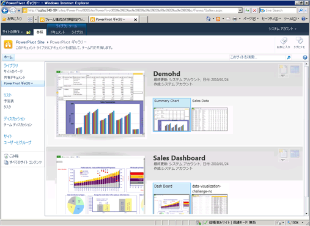

# Create and Customize Power Pivot Gallery
[!INCLUDE[ssas-appliesto-sqlas](../../includes/ssas-appliesto-sqlas.md)]
  [!INCLUDE[ssGemini](../../includes/ssgemini-md.md)] ギャラリーは、特殊な種類の SharePoint ドキュメント ライブラリです。 [!INCLUDE[ssGemini](../../includes/ssgemini-md.md)] データを含むパブリッシュ済みの Excel ブックおよび Reporting Services レポートを対象とする、豊富なプレビュー機能とドキュメント管理機能を提供します。  
  
##   このトピックの内容  
  
-   [前提条件](#prereq)  
  
-   [概要](#overview)  
  
-   [PowerPivot ギャラリーの作成](#createlib)  
  
-   [PowerPivot ギャラリー ライブラリのカスタマイズ](#customize)  
  
-   [[最新の情報に更新] ボタンの無効化または非表示](#bkmk_hide_refresh_button)  
  
-   [シアター ビューまたはギャラリー ビューへの切り替え](#switch)  
  
##   前提条件  
  
-   Silverlight が必要です。 Silverlight は、Microsoft Update でダウンロードし、インストールできます。 Silverlight がインストールされていない状態でブラウザーを使用して [!INCLUDE[ssGemini](../../includes/ssgemini-md.md)] ギャラリー ライブラリを表示する場合は、Silverlight をインストールするためのページ上のリンクをクリックします。 Silverlight をインストールしたら、ブラウザーを閉じてもう一度開く必要があります。  
  
    > [!NOTE]  
    >  Power Pivot ギャラリーには、Microsoft Silverlight が必要です。  Microsoft Edge ブラウザーでは、Silverlight がサポートされていません。   
    > Edge でライブラリ コンテンツを表示するには、Power Pivot ギャラリーの **[ライブラリ]** タブをクリックして、ドキュメント ライブラリ ビューを **[すべてのドキュメント]** に変更します。    
    > 既定のビューを変更するには、 **[ライブラリ]** タブをクリックしてから、[ビューの変更] をクリックします。 [このビューを既定のビューにする] をクリックし、[OK] をクリックして既定のビューを保存します。  
    >  Microsoft Edge のサポート対象について詳しくは、Windows ブログ「 [過去からの離別、第 2 部: ActiveX、VBScript... に別れを告げる](https://blogs.windows.com/msedgedev/2015/05/06/a-break-from-the-past-part-2-saying-goodbye-to-activex-vbscript-attachevent/)」をご覧ください。  
  
-   ライブラリを作成するには、サイト所有者である必要があります。  
  
-   ファイルをパブリッシュまたはアップロードするには、投稿権限以上の権限が必要です。  
  
-   [!INCLUDE[ssGemini](../../includes/ssgemini-md.md)] ギャラリーを制限付きサイトに入れることはできません。 信頼済みサイトやローカル イントラネット ゾーンのいずれかに、 [!INCLUDE[ssGemini](../../includes/ssgemini-md.md)] ギャラリーを含む親サイトを追加する必要があります。  
  
-   [!INCLUDE[ssGemini](../../includes/ssgemini-md.md)] Web アプリケーション ソリューションをアプリに配置し、サイト コレクション用に [!INCLUDE[ssGemini](../../includes/ssgemini-md.md)] 機能をアクティブにしておく必要があります。 詳しくは、「 [Deploy Power Pivot Solutions to SharePoint](../../analysis-services/power-pivot-sharepoint/deploy-power-pivot-solutions-to-sharepoint.md) 」と「[Activate Power Pivot Feature Integration for Site Collections in Central Administration](../../analysis-services/power-pivot-sharepoint/activate-power-pivot-integration-for-site-collections-in-ca.md)」をご覧ください。  
  
-   [!INCLUDE[ssGemini](../../includes/ssgemini-md.md)] ブックに基づく Reporting Services レポートを表示または作成するには、ブックとレポートが同じ [!INCLUDE[ssGemini](../../includes/ssgemini-md.md)] ギャラリーに含まれている必要があります。 埋め込みデータを含む [!INCLUDE[ssGemini](../../includes/ssgemini-md.md)] ブックをレポートで使うか、 [!INCLUDE[ssGemini](../../includes/ssgemini-md.md)] ブックである外部データ ソースがブックに 1 つだけ含まれている必要があります。  
  
##   概要  
 [!INCLUDE[ssGemini](../../includes/ssgemini-md.md)] ギャラリーは、SharePoint サーバーに [!INCLUDE[ssGeminiLong](../../includes/ssgeminilong-md.md)] をインストールしたときに使用可能になるライブラリ テンプレートです。 [!INCLUDE[ssGemini](../../includes/ssgemini-md.md)] ギャラリーには、ファイルのコンテンツを正確にプレビューしたものとドキュメントのパブリッシュ元に関する情報を組み合わせたテンプレートが格納されます。 ドキュメントの作成者と最終変更日時をすぐに確認できます。 プレビュー イメージを作成するには、 [!INCLUDE[ssGemini](../../includes/ssgemini-md.md)] ギャラリーで [!INCLUDE[ssGemini](../../includes/ssgemini-md.md)] データを含む [!INCLUDE[ssGemini](../../includes/ssgemini-md.md)] ブックと Reporting Services レポートを読み取ることのできるスナップショット サービスを使用します。 スナップショット サービスで読み取ることのできないファイルをパブリッシュした場合、そのファイルのプレビュー イメージは表示されません。  
  
 プレビュー イメージは、Excel Services がブックを表示する方法に基づいています。 [!INCLUDE[ssGemini](../../includes/ssgemini-md.md)] ギャラリーでの表示は、通常、 [!INCLUDE[ssGemini](../../includes/ssgemini-md.md)] ブックをブラウザーで表示したときと同じです。 ただし、プレビュー領域は限られており、 使用可能な領域に合わせてブックやレポートの一部が省略される場合があります。 ドキュメント全体を表示するために、ブックまたはレポートを開くことが必要になる場合があります。  
  
 [!INCLUDE[ssGemini](../../includes/ssgemini-md.md)] ギャラリーでは、外部データ ソースの [!INCLUDE[ssGemini](../../includes/ssgemini-md.md)] ブックのデータを更新する操作が完全にサポートされていますが、追加の構成が必要です。 ファームまたはサービスの管理者は [!INCLUDE[ssGemini](../../includes/ssgemini-md.md)] ギャラリーを Excel Services の信頼できる場所として追加する必要があります。 詳細については、「 [サーバーの全体管理での Power Pivot サイト用の信頼できる場所の作成](../../analysis-services/power-pivot-sharepoint/create-a-trusted-location-for-power-pivot-sites-in-central-administration.md)」を参照してください。  
  
##   PowerPivot ギャラリーの作成  
 [!INCLUDE[ssGemini](../../includes/ssgemini-md.md)] をインストールすると、 [!INCLUDE[ssGeminiLong](../../includes/ssgeminilong-md.md)] ギャラリーが自動的に作成されます。 既存のファームに [!INCLUDE[ssGeminiShort](../../includes/ssgeminishort-md.md)] を追加した場合、または追加のライブラリが必要な場合は、アプリケーションまたはサイト用の新しいライブラリを作成できます。  
  
1.  1.  **SharePoint 2010**: サイトのホーム ページの左上にある **[サイトの操作]** をクリックします。  
  
    2.  **[その他のオプション]** をクリックします。  
  
    3.  [ライブラリ] の **[!INCLUDE[ssGemini](../../includes/ssgemini-md.md)] ギャラリー**をクリックします。  
  
    1.  **SharePoint 2013**: 設定アイコンをクリックしてです。 **[サイト コンテンツ]** をクリックします。  
  
    2.  **[アプリケーションの追加]** をクリックします。  
  
    3.  **[!INCLUDE[ssGemini](../../includes/ssgemini-md.md)] ギャラリー**をクリックします。  
  
2.  ライブラリの名前を入力します。 このライブラリが [!INCLUDE[ssGemini](../../includes/ssgemini-md.md)] ブックおよび Reporting Services レポートのリッチ プレビューであることがユーザーにわかるように説明情報を入力してください。  
  
3.  **[作成]** をクリックします。  
  
4.  [!INCLUDE[ssGemini](../../includes/ssgemini-md.md)] ギャラリーを Excel Services の信頼できる場所として追加するように、ファーム管理者またはサービス管理者に依頼します。 この手順は、ユーザーが [!INCLUDE[ssGemini](../../includes/ssgemini-md.md)] データの更新をブックに構成した場合にエラーが発生するのを防ぐために必要です。 このタスクの詳細については、「 [サーバーの全体管理での Power Pivot サイト用の信頼できる場所の作成](../../analysis-services/power-pivot-sharepoint/create-a-trusted-location-for-power-pivot-sites-in-central-administration.md)」を参照してください。  
  
 [!INCLUDE[ssGemini](../../includes/ssgemini-md.md)] ギャラリー ライブラリへのリンクが、現在のサイトのナビゲーションのクイック起動ペインに表示されます。  
  
 他のサイト コレクションまたは個々のサイトに対して異なる権限を適用する場合は、追加の [!INCLUDE[ssGemini](../../includes/ssgemini-md.md)] ギャラリー ライブラリを作成できます。  
  
##   PowerPivot ギャラリー ライブラリのカスタマイズ  
 [!INCLUDE[ssGemini](../../includes/ssgemini-md.md)] ギャラリーは、SharePoint ドキュメント ライブラリです。 そのため、SharePoint の標準のライブラリ ツールを使用して、ライブラリ設定を変更したり、ライブラリ内の個々のドキュメントを操作したりできます。 作成した各ライブラリは、別のビューまたはライブラリ設定を使用するように個別にカスタマイズできます。  
  
 並べ替え順序またはフィルターを変更して、一覧内でのブックの表示場所を変更できます。 既定では、ドキュメントは追加された順序で表示されます。つまり、最後にパブリッシュされたドキュメントは、一覧の末尾に表示されます。 ドキュメントをパブリッシュしたら、一覧内でのドキュメントの表示場所はそのまま保持されます。 ドキュメントを更新して再パブリッシュすると、一覧内でのドキュメントの場所が更新されます。  
  
 特定のドキュメントのプレビューを有効または無効にすることはできません。 スナップショット サービスは、同じライブラリに保存されている [!INCLUDE[ssGemini](../../includes/ssgemini-md.md)] ブックに基づいて、すべての [!INCLUDE[ssGemini](../../includes/ssgemini-md.md)] ブックおよび Reporting Services レポートのプレビュー イメージを生成します。 これらのイメージは、ドキュメントに対して表示権限を持つすべてのユーザーが表示できます。  
  
 [!INCLUDE[ssGemini](../../includes/ssgemini-md.md)] ギャラリーを拡張して、他のドキュメントの種類のプレビューを生成することはできません。 プレビューは、 [!INCLUDE[ssGemini](../../includes/ssgemini-md.md)] データを含む Excel 2010 ブックまたは SQL Server 2008 R2 Reporting Services レポートでのみサポートされています。  
  
 ドキュメントの元の情報を制御する設定を変更することはできません。 個々のドキュメントに関して表示される情報 (ブックを追加したユーザーやブックを最後に変更したユーザーなど) は、変更できない固定の列セットによって決定されます。  
  
#### 並べ替え順の変更、フィルターの追加、またはドキュメントの数の制限  
 [!INCLUDE[ssGemini](../../includes/ssgemini-md.md)] ギャラリーには、常に [最終更新日] と [作成者] の値が表示されます。 これらの列を無効にしたり、 ライブラリの他の列を有効にすることはできません。並べ替え順の変更、フィルターの追加、または表示されるドキュメントの数の制限を行うには、次の手順に従ってください。  
  
1.  SharePoint サイトで [!INCLUDE[ssGemini](../../includes/ssgemini-md.md)] ギャラリーを開きます。  
  
2.  リボンで、 **[ライブラリ]** をクリックします。  
  
3.  **SharePoint 2010:** [ユーザー設定のビュー] で、 **[このビューの変更]** をクリックします。  
  
     **SharePoint 2013:** **[ビューの管理]** で、 **[ビューの変更]** をクリックします。  
  
4.  [並べ替え] で、一覧でのブックの表示方法を決定するために使用される基準を指定します。 既定では、ドキュメントは追加された順序で表示されます。  
  
5.  [フィルター] で、列で設定されている条件値に基づいてブックの表示/非表示を切り替えるために使用される基準を指定します。 たとえば、特定の日付より前に作成されたブックをすべて非表示にすることができます。  
  
6.  [アイテムの制限] で、 [!INCLUDE[ssGemini](../../includes/ssgemini-md.md)] ギャラリー ライブラリに非常に多くのドキュメントが含まれている場合に役立つオプションを指定します。 一覧に実際に表示されるアイテムの数を制限したり、アイテムをグループ化して表示することができます。  
  
7.  **[OK]** をクリックして変更を保存します。  
  
####   [最新の情報に更新] ボタンの無効化または非表示  
 **[データ更新の管理]** ボタンを非表示にすることはできません。 ただし、十分なアクセス許可がユーザーにない場合は、このボタンは無効になります。  
  
   
  
 ブックに対するデータ更新をスケジュールするには、ブックの所有者または作成者が **投稿** 権限を持っている必要があります。 投稿権限のあるユーザーは、ブックのデータ更新構成ページを開いて編集し、データの更新に使用する資格情報およびスケジュール情報を指定できます。  
  
 したがって、 **表示** または **読み取り** 権限レベルのみを持つユーザーは、最新の情報に更新ボタンにアクセスできません。 最新の情報に更新ボタンは表示されますが、無効になっています。 詳細については、「 [SharePoint 2013 のユーザー権限とアクセス許可レベル](http://technet.microsoft.com/library/cc721640.aspx)」を参照してください。  
  
##   シアター ビューまたはギャラリー ビューへの切り替え  
 ライブラリのビューの構成方法に応じて、プレビューの形式が変わります。 ギャラリー ビューでは、マウス ポインターをブック内の個別のワークシート上に置くと、プレビュー領域でそのシートにフォーカスが移ります。  
  
   
  
 プレビューした各ページのサムネイル スケッチを表示する各種レイアウトの説明を次の表に示します。  
  
|表示|Description|  
|----------|-----------------|  
|ギャラリー ビュー (既定)|ギャラリーは、 [!INCLUDE[ssGemini](../../includes/ssgemini-md.md)] ギャラリーの既定のビューです。 プレビューは左側に表示されます。 その横に、各ワークシートの小さいサムネイルが左から右の順に表示されます。|  
|[すべてのドキュメント]|これはドキュメント ライブラリの標準のレイアウトです。 個々のドキュメントを管理する場合、またはライブラリ コンテンツを一覧形式で表示する場合にこのビューを選択できます。   プロパティを編集したり、個々のドキュメントを削除または移動するには、このビューを使用します。   バージョン管理を有効にしている場合は、このビューを使用して、ライブラリでドキュメントをチェックインまたはチェックアウトする必要があります。|  
|シアター ビューとカルーセル ビュー|これらのビューは、少数の関連ドキュメントを表示する場合に最も適した特殊なビューです。 サムネイルの 360 度回転には、ライブラリ内のすべてのドキュメントのすべてのページが含まれます。 ドキュメント数が多い場合、特定の [!INCLUDE[ssGemini](../../includes/ssgemini-md.md)] ブックを検索するか開く必要があるユーザーにとってこれらのビューは非実用的である可能性があります。   シアター ビュー: プレビュー領域は中央にあります。 各ワークシートの小さいサムネイルがページの下部の右側または左側に表示されます。   カルーセル ビュー: プレビュー領域は中央にあります。 現在のサムネイルの直前および直後のサムネイルがプレビュー領域に隣接します。|  
  
### 別のビューへの切り替え  
  
1.  SharePoint サイトで [!INCLUDE[ssGemini](../../includes/ssgemini-md.md)] ギャラリーを開きます。  
  
2.  リボンで、 **[ライブラリ]** をクリックします。  
  
3.  [ビューの管理] の [現在のビュー] で、使用するビューを一覧から選択します。 デザイン済みのビューは、ギャラリー ビュー、シアター ビュー、およびカルーセル ビューです。 また、ライブラリのドキュメントを移動、削除、管理する場合は、[すべてのドキュメント] を選択することもできます。  
  
## 参照  
 [Power Pivot for SharePoint インストールのトラブルシューティング](../../analysis-services/troubleshoot-a-power-pivot-for-sharepoint-installation.md)   
 [Power Pivot ギャラリーを使用](../../analysis-services/power-pivot-sharepoint/use-power-pivot-gallery.md)   
 [Power Pivot サイト用の信頼できる場所の作成](../../analysis-services/power-pivot-sharepoint/create-a-trusted-location-for-power-pivot-sites-in-central-administration.md)   
 [Power Pivot ギャラリーの削除](../../analysis-services/power-pivot-sharepoint/delete-power-pivot-gallery.md)  
  
  
