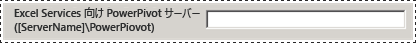
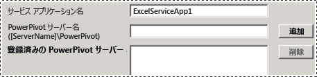
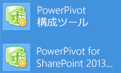
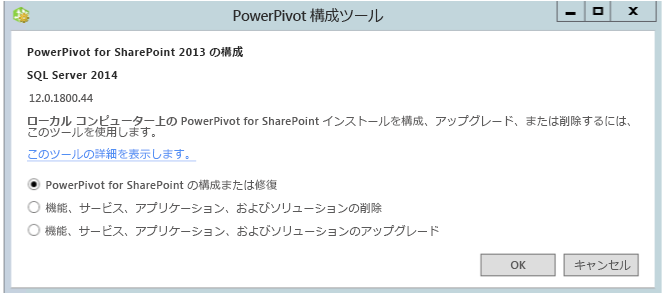

# Power Pivot Configuration Tools
[!INCLUDE[ssas-appliesto-sqlas](../../includes/ssas-appliesto-sqlas.md)]
[!INCLUDE[ssGemini](../../includes/ssgemini-md.md)] の構成ツールを使用すると、[!INCLUDE[ssCurrent](../../includes/sscurrent-md.md)] [!INCLUDE[ssGeminiShort](../../includes/ssgeminishort-md.md)] を構成、修復、または削除できます。  
  
 [!INCLUDE[ssCurrent](../../includes/sscurrent-md.md)] のセットアップ ウィザードでは、SharePoint の [!INCLUDE[ssGemini](../../includes/ssgemini-md.md)] 構成ツールはインストールされません。 構成ツールは、 [!INCLUDE[ssCurrent](../../includes/sscurrent-md.md)]の今後のリリースでダウンロードできるようになる予定です。  
  
 このトピックでは、 [!INCLUDE[ssGemini](../../includes/ssgemini-md.md)] ツールの一般的な用途とそれらの相違点について説明します。  
  
 **[!INCLUDE[applies](../../includes/applies-md.md)]**  SharePoint 2013  
  
 **このトピックの内容**  
  
-   [構成ツールを使用するための要件](#bkmk_requirements)  
  
-   [構成ツールの 2 つのバージョン](#bkmk_twoversions)  
  
-   [Power Pivot 構成ツールの使用の概要](#bkmk_overview)  
  
-   [いずれかの PowerPivot 構成ツールを起動する](#bmkm_start_tool)  
  
##   構成ツールを使用するための要件  
  
-   ファーム管理者である必要があります。  
  
-   Analysis Services インスタンスでサーバー管理者である必要があります (SharePoint 2010 のみ)。  
  
-   ファームの構成データベースで db_owner である必要があります。  
  
-   構成ツールを使用するための TCP/IP ポートの要件はないため、構成ツールに対応するようファイアウォールを構成する必要はありません。 構成ツールを使用するには、Web アプリケーションおよび共有サービスを SharePoint プラットフォームの一部として使用できることが必要です。 [!INCLUDE[ssASnoversion](../../includes/ssasnoversion-md.md)] サーバー用にファイアウォールを構成することが必要な場合があります。 詳細については、「 [Analysis Services のアクセスを許可するための Windows ファイアウォールの構成](../../analysis-services/instances/configure-the-windows-firewall-to-allow-analysis-services-access.md)」をご参照ください。  
  
##   構成ツールの 2 つのバージョン  
 [!INCLUDE[ssCurrent](../../includes/sscurrent-md.md)] セットアップ ウィザードでは、SharePoint 2010 用 [!INCLUDE[ssGemini](../../includes/ssgemini-md.md)] 構成ツールと SharePoint 2013 用 [!INCLUDE[ssGemini](../../includes/ssgemini-md.md)] 構成ツールがインストールされます。  
  
 このツールは、 [!INCLUDE[ssCurrent](../../includes/sscurrent-md.md)] の [!INCLUDE[ssSQL11SP1](../../includes/sssql11sp1-md.md)] または [!INCLUDE[ssGeminiShort](../../includes/ssgeminishort-md.md)]インスタンスでのみ使用できます。 [!INCLUDE[ssKilimanjaro](../../includes/sskilimanjaro-md.md)] インストールでツールを使用しないでください。  
  
|名前|サポートされている SharePoint のバージョン|詳細な構成|  
|----------|-------------------------------------|----------------------------|  
|[!INCLUDE[ssGemini](../../includes/ssgemini-md.md)] for SharePoint 2013 の構成|SharePoint 2013|[PowerPivot for SharePoint 2013 の構成または修復 &#40;PowerPivot 構成ツール&#41;](../../analysis-services/power-pivot-sharepoint/configure-or-repair-power-pivot-for-sharepoint-2013.md)|  
|[!INCLUDE[ssGemini](../../includes/ssgemini-md.md)] 構成ツール|SharePoint 2010 と SharePoint 2010 の組み合わせ|[Pivot for SharePoint 2010 の構成または修復 (Power Pivot 構成ツール)](http://msdn.microsoft.com/en-us/d61f49c5-efaa-4455-98f2-8c293fa50046)|  
  
###   2 つの構成ツールの相違点  
 2 つのバージョンの構成ツールは似ていますが、実行する構成手順に違いがあります。 この違いは、SharePoint 2010 と SharePoint 2013 の間の変更と、 [!INCLUDE[ssGemini](../../includes/ssgemini-md.md)] for SharePoint の SQL Server 2012 SP1 バージョンとそれ以前のバージョンの [!INCLUDE[ssGemini](../../includes/ssgemini-md.md)] for SharePoint とのアーキテクチャの違いに起因します。  
  
 次の表では、 **[!INCLUDE[ssGemini](../../includes/ssgemini-md.md)] for SharePoint 2013 構成** ツールの新機能および変更された機能について説明します。 また、 **[!INCLUDE[ssGemini](../../includes/ssgemini-md.md)] for SharePoint 2013 構成ツールに含まれていない** 構成ツール [!INCLUDE[ssGemini](../../includes/ssgemini-md.md)] の機能についても説明します。 表の行は、構成ツールのタブと同じ順序で並んでます。  
  
|[!INCLUDE[ssGemini](../../includes/ssgemini-md.md)] for SharePoint 2013 の構成|[!INCLUDE[ssGemini](../../includes/ssgemini-md.md)] 構成ツール|  
|--------------------------------------------------------------|-----------------------------------------------|  
|メイン ページには、 **[!INCLUDE[ssGemini](../../includes/ssgemini-md.md)] サーバー**という新しいオプションがあります。 このオプションでは、SharePoint ファームの外部で [!INCLUDE[ssASnoversion](../../includes/ssasnoversion-md.md)] を実行できる新しいアーキテクチャがサポートされます。 SharePoint モードで実行されている 1 つ以上の [!INCLUDE[ssASnoversion](../../includes/ssasnoversion-md.md)] サーバーを使用するように Excel Services を構成します。   ||  
||2010 ツールには、[!INCLUDE[ssASnoversion](../../includes/ssasnoversion-md.md)] のローカル インスタンスを構成する **[ローカル サーバーへの SQL Server Analysis Services ([!INCLUDE[ssGemini](../../includes/ssgemini-md.md)]) の登録]** ページがあります。 このページは 2013 ツールにはありません。 [!INCLUDE[ssASnoversion](../../includes/ssasnoversion-md.md)]のローカル インスタンスが存在しないためです。   |  
||**[[!INCLUDE[ssGemini](../../includes/ssgemini-md.md)] サービス アプリケーションの作成]** ページには、**[ブックをアップグレードして、データ更新を有効にします]** という追加のオプションがあります。 このオプションは、2013 ツールでは使用できません。   |  
|2013 ツールには、**[[!INCLUDE[ssGemini](../../includes/ssgemini-md.md)] サーバーの構成]** という新しいページがあります。 このページでは、SharePoint ファームの外部で [!INCLUDE[ssASnoversion](../../includes/ssasnoversion-md.md)] を実行できる新しいアーキテクチャがサポートされます。 既定では、メイン ページの **[Excel Services 用 [!INCLUDE[ssGemini](../../includes/ssgemini-md.md)] サーバー]** テキスト ボックスに入力したサーバー名も **[[!INCLUDE[ssGemini](../../includes/ssgemini-md.md)] サーバーの構成]** に表示されます。   ||  
|2013 ツールには、**[Excel Services Usage Tracker として [!INCLUDE[ssGemini](../../includes/ssgemini-md.md)] アドインを登録します]** という新しいページがあります。 SharePoint 2010 の Excel Services では、 [!INCLUDE[ssGemini](../../includes/ssgemini-md.md)]の使用状況データを追跡しません。||  
||2010 ツールには、SharePoint 2010 の Excel Services で **モデルを読み込むことができるように MSOLAP を登録する** [MSOLAP.5 を信頼できるプロバイダーとして追加] [!INCLUDE[ssGemini](../../includes/ssgemini-md.md)] ページがあります。 このページは、2013 ツールにはありません。 SharePoint 2013 の Excel Services では、モデルの読み込みに MSOLAP プロバイダーを使用しません。|  
  
##   Power Pivot 構成ツールの使用の概要  
 どちらの [!INCLUDE[ssGemini](../../includes/ssgemini-md.md)] 構成ツールも起動すると、既存のインストールが評価され、適用可能な操作が確認されます。 新しいインストールでは、構成タスクのみが利用可能です。 サーバーを構成した後は、削除タスクが表示されます。 [!INCLUDE[ssKilimanjaro](../../includes/sskilimanjaro-md.md)] インスタンスで起動した場合は、利用可能なタスクの一覧でアップグレードも有効になります。  
  
 サーバーの全体管理または Windows PowerShell に慣れていない場合は、代わりに構成ツールを実行して、 [!INCLUDE[ssGeminiShort](../../includes/ssgeminishort-md.md)] インストールを完了します。  
  
 また、このツールを使用すると、ファームが構成済みか、または必要な機能が不足しているかを検出できます。 SharePoint プログラム ファイルがインストールされている一方でファームが構成されていない場合、このツールは、ファームと [!INCLUDE[ssGeminiShort](../../includes/ssgeminishort-md.md)] インストールの両方を構成するためのアクションを提供します。  
  
 **[スクリプト]** タブを確認すると、Windows PowerShell を使用して、 [!INCLUDE[ssGemini](../../includes/ssgemini-md.md)] および SharePoint を構成する方法を学習し、理解できます。 詳細については、以下を参照してください。  
  
-   [Windows PowerShell を使用した Power Pivot の構成](../../analysis-services/power-pivot-sharepoint/power-pivot-configuration-using-windows-powershell.md)  
  
-   [Power Pivot for SharePoint 用 PowerShell リファレンス](../../analysis-services/powershell/powershell-reference-for-power-pivot-for-sharepoint.md)  
  
> [!NOTE]  
>  このツールでは、Reporting Services は構成できません。 Reporting Services を SharePoint 環境に追加する場合は、Reporting Services を個別にインストールし、構成する必要があります。 詳細については、以下を参照してください。  
>   
>  -   [SharePoint モードでの最初のレポート サーバーのインストール](../../reporting-services/install-windows/install-the-first-report-server-in-sharepoint-mode.md)。  
> -   [SharePoint 2010 用 Reporting Services の SharePoint モードのインストール](http://msdn.microsoft.com/en-us/47efa72e-1735-4387-8485-f8994fb08c8c)。  
  
##   いずれかの PowerPivot 構成ツールを起動する  
  
1.  **[スタート]** 画面で、「 **powerpivot**」と入力します。  
  
     **[スタート]** 画面で「 **powerpivot** 」と入力するか、 **[スタート]** メニューの **[すべてのプログラム]**をクリックし、[ [!INCLUDE[ssCurrentUI](../../includes/sscurrentui-md.md)]] をクリックします。次に、 **[構成ツール]**をクリックし、次のいずれかをクリックします。  
  
    -   **[!INCLUDE[ssGemini](../../includes/ssgemini-md.md)] 構成ツール**。  
  
    -   **OR**  
  
    -   **[!INCLUDE[ssGemini](../../includes/ssgemini-md.md)] for SharePoint 2013 の構成**。  
  
       
  
     **注:** このツールは、ローカル サーバーに [!INCLUDE[ssGeminiShort](../../includes/ssgeminishort-md.md)] がインストールされている場合にのみ使用できます。  
  
2.  構成ツールが起動されると、インストールのステータスがチェックされ、インストールに有効なタスクが提供されます。  
  
3.  インストールの現在の状態に応じて、次の 1 つ以上のタスクを実行できます。  
  
    1.  **[[!INCLUDE[ssGemini](../../includes/ssgemini-md.md)] for SharePoint の構成または修復]** をクリックして、インストール後のタスクを実行するか、またはインストールを修復します。  
  
    2.  **[機能、サービス、アプリケーション、およびソリューションの削除]** をクリックして、ファームから機能とソリューションを削除します。  
  
    3.  **[機能、サービス、アプリケーション、およびソリューションのアップグレード]** をクリックして、以前のバージョンの [!INCLUDE[ssGeminiShort](../../includes/ssgeminishort-md.md)]を使用してインストールされた機能とソリューションをアップグレードします。  
  
     たとえば、次の図は [!INCLUDE[ssGemini](../../includes/ssgemini-md.md)] for SharePoint 2013 構成ツールの最初のページを示しています。  
  
       
  
 各タスクは、サーバーの構成のいくつかの側面に対応する個々のアクションで構成されます。 たとえば、構成タスクには、ソリューションの配置、 [!INCLUDE[ssGemini](../../includes/ssgemini-md.md)] サービス アプリケーションの作成、機能のアクティブ化、データ更新の構成などのアクションが含まれます。 アクションの一覧は、インストールの現在の状態によって異なります。 必要でないアクションは、タスクの一覧から除外されます。  
  
 [実行] をクリックすると、すべてのアクションがバッチ モードで処理されます。 各アクションはタスクの一覧で別個のアイテムとして表示されますが、タスクに含まれるすべてのアクションが一度に処理されます。 検証チェックに合格したアクションのみが処理されます。 検証チェックに合格するために、いくつかの入力値を追加または変更することが必要になる場合があります。  
  
## 関連コンテンツ  
 [Upgrade Power Pivot for SharePoint](../../database-engine/install-windows/upgrade-power-pivot-for-sharepoint.md) ファームにある既存のインストールをアップグレードするためのワークフローについて説明します。  
  
 [Power Pivot for SharePoint のアンインストール](../../sql-server/install/uninstall-power-pivot-for-sharepoint.md) [!INCLUDE[ssGemini](../../includes/ssgemini-md.md)] SharePoint サービス、ソリューション、およびアプリケーション ページをファームから削除するためのワークフローについて説明します。  
  
 [Windows PowerShell を使用した Power Pivot の構成](../../analysis-services/power-pivot-sharepoint/power-pivot-configuration-using-windows-powershell.md)  
  
 [サーバーの全体管理での Power Pivot サーバーの管理と構成](../../analysis-services/power-pivot-sharepoint/power-pivot-server-administration-and-configuration-in-central-administration.md)  
  
  
