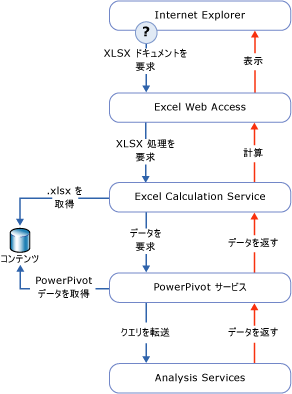

# Power Pivot データ アクセス
[!INCLUDE[ssas-appliesto-sqlas](../../includes/ssas-appliesto-sqlas.md)]
このトピックでは、SharePoint ライブラリにパブリッシュされる [!INCLUDE[ssGemini](../../includes/ssgemini-md.md)] ブックからデータを取得する方法について説明します。  
  
 [!INCLUDE[ssGemini](../../includes/ssgemini-md.md)] データは Excel ブック内に格納されます。 接続文字列は、SharePoint サイト上のブックの URL です。  
  
 [!INCLUDE[ssGemini](../../includes/ssgemini-md.md)] データは、そのデータが含まれるブックによってピボットテーブルとピボットグラフのデータとして頻繁に使用されます。 または、 [!INCLUDE[ssGemini](../../includes/ssgemini-md.md)] データを外部データ ソースとして使用することもできます。その場合は、ブック、ダッシュボード、またはレポートが SharePoint で別の Excel (.xlsx) ファイルに接続してデータを取得し、そのデータを後で使用します。 [!INCLUDE[ssGemini](../../includes/ssgemini-md.md)] データをよく使用するクライアント ツールは Excel、 [!INCLUDE[ssCrescent](../../includes/sscrescent-md.md)]、他の Reporting Services レポート、および PerformancePoint です。  
  
 デスクトップでは、 [!INCLUDE[ssGemini](../../includes/ssgemini-md.md)] アドインは AMO と ADOMD.NET を使用して、クライアント ワークスペースで [!INCLUDE[ssGemini](../../includes/ssgemini-md.md)] データの作成、処理、およびクエリを実行します。  
  
 SharePoint ファームでは、Excel Services はローカル MSOLAP OLE DB プロバイダーを使用して [!INCLUDE[ssGemini](../../includes/ssgemini-md.md)] データに接続します。 プロバイダーは、この接続要求をファーム内の [!INCLUDE[ssGemini](../../includes/ssgemini-md.md)] for SharePoint サーバーに送信します。 このサーバーがデータをロードし、クエリを実行し、結果セットを返します。  
  
##   SharePoint 内の Power Pivot データのクエリ  
 [!INCLUDE[ssGemini](../../includes/ssgemini-md.md)] ブックを SharePoint ライブラリから表示すると、ブック内の [!INCLUDE[ssGemini](../../includes/ssgemini-md.md)] データがファームにある Analysis Services サーバー インスタンスで個別に検出、抽出、および処理されて、同時に Excel Services によってプレゼンテーション層が描画されます。 完全に処理されたブックは、ブラウザー ウィンドウ、または [!INCLUDE[ssGemini](../../includes/ssgemini-md.md)] アドインを持つ Excel 2010 デスクトップ アプリケーションで表示できます。  
  
 次の図は、クエリ処理の要求がファーム内をどのように移動するかを示しています。 [!INCLUDE[ssGemini](../../includes/ssgemini-md.md)] データは Excel 2010 ブックの一部なので、クエリ処理の要求は、ユーザーが Excel ブックを SharePoint ライブラリから開いて、 [!INCLUDE[ssGemini](../../includes/ssgemini-md.md)] データを含むピボットテーブルまたはピボットグラフを操作したときに発生します。  
  
   
  
 Excel Services と [!INCLUDE[ssGemini](../../includes/ssgemini-md.md)] for SharePoint コンポーネントは、同じブック (.xlsx) ファイルの異なる部分を処理します。 Excel Services は、 [!INCLUDE[ssGemini](../../includes/ssgemini-md.md)] データを検出して、ファーム内の [!INCLUDE[ssGemini](../../includes/ssgemini-md.md)] サーバーに処理を要求します。 [!INCLUDE[ssGemini](../../includes/ssgemini-md.md)] サーバーは、 [!INCLUDE[ssGeminiSrv](../../includes/ssgeminisrv-md.md)] インスタンスに要求を割り当て、このインスタンスがコンテンツ ライブラリのブックからデータを抽出して読み込みます。 メモリに格納されたデータは描画されたブックにマージされ、ブラウザー ウィンドウに表示するために Excel Web Access に返されます。  
  
 [!INCLUDE[ssGemini](../../includes/ssgemini-md.md)] ブックのデータの一部は、 [!INCLUDE[ssGemini](../../includes/ssgemini-md.md)] for SharePoint によって処理されません。 ワークシートのテーブルおよびセル データは Excel Services によって処理されます。 [!INCLUDE[ssGemini](../../includes/ssgemini-md.md)] for SharePoint によって処理されるのは、 [!INCLUDE[ssGemini](../../includes/ssgemini-md.md)] データに合わないピボットテーブル、ピボットグラフ、およびスライサーだけです。  
  
## 参照  
 [Analysis Services に接続します。](../../analysis-services/instances/connect-to-analysis-services.md)   
 [表形式モデルのデータ アクセス](../../analysis-services/tabular-models/tabular-model-data-access.md)  
  
  
