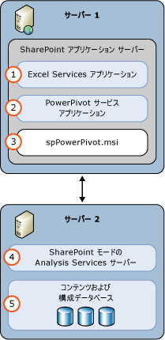

# Power Pivot for SharePoint (SSAS)
  [!INCLUDE[ssASnoversion](../../includes/ssasnoversion-md.md)] モードの [!INCLUDE[ssGemini](../../includes/ssgemini-md.md)] サーバーは、SharePoint ファームの [!INCLUDE[ssGemini](../../includes/ssgemini-md.md)] データをサーバーでホストします。 [!INCLUDE[ssGemini](../../includes/ssgemini-md.md)] データは、次のいずれかを使用して構築する分析データ モデルです。  
  
-   [!INCLUDE[ssGemini](../../includes/ssgemini-md.md)] for Excel 2010 アドイン  
  
-   Excel 2013  
  
-   Excel 2016  
  
 **[!INCLUDE[applies](../../includes/applies-md.md)]**  [!INCLUDE[ssGeminiShort](../../includes/ssgeminishort-md.md)] 2016 | [!INCLUDE[ssGeminiShort](../../includes/ssgeminishort-md.md)] 2013  
  
 そのデータをサーバーでホストするには、SharePoint、Excel Services、および [!INCLUDE[ssGemini](../../includes/ssgemini-md.md)] for SharePoint のインストールが必要です。 [!INCLUDE[ssGemini](../../includes/ssgemini-md.md)] for SharePoint インスタンスにデータが読み込まれます。このデータは、 [!INCLUDE[ssGemini](../../includes/ssgemini-md.md)] データ更新機能を使用してスケジュール設定された間隔で更新できます。この更新機能は、Excel 2010 ブックの場合はサーバーによって、Excel 2013 と 2016 ブックの場合は [!INCLUDE[ssGemini](../../includes/ssgemini-md.md)] によって提供されます。  
  
## Power Pivot for SharePoint 2016  
 [!INCLUDE[ssCurrent](../../includes/sscurrent-md.md)] [!INCLUDE[ssGeminiShort](../../includes/ssgeminishort-md.md)] は、 [!INCLUDE[msCoName](../../includes/msconame-md.md)] SharePoint 2016 と [!INCLUDE[offOnlineServer](../../includes/offonlineserver-md.md)] による、データ モデルと [!INCLUDE[ssRSnoversion](../../includes/ssrsnoversion-md.md)] Power View レポートを含む Excel ブックの使用をサポートします。  
  
 Excel は、 [!INCLUDE[offOnlineServer](../../includes/offonlineserver-md.md)] 内では、ブラウザーで [!INCLUDE[ssGemini](../../includes/ssgemini-md.md)] ブックを操作できるようにするためのデータ モデル機能を含みます。 ファームに [!INCLUDE[ssGemini](../../includes/ssgemini-md.md)] for SharePoint 2016 アドインを配置する必要はありません。 必要なのは、 [!INCLUDE[ssASnoversion](../../includes/ssasnoversion-md.md)] サーバーを [!INCLUDE[ssGemini](../../includes/ssgemini-md.md)] モードでインストールし、そのサーバーを [!INCLUDE[offOnlineServer](../../includes/offonlineserver-md.md)]に登録することだけです。  
  
 [!INCLUDE[ssGemini](../../includes/ssgemini-md.md)] for SharePoint 2016 アドインを配置すると、SharePoint ファームで追加の機能を有効にすることができます。 追加の機能には、 [!INCLUDE[ssGemini](../../includes/ssgemini-md.md)] ギャラリーとデータ更新のスケジュールがあります。  
  
   
  
## Power Pivot for SharePoint 2013  
 [!INCLUDE[ssCurrent](../../includes/sscurrent-md.md)] [!INCLUDE[ssGeminiShort](../../includes/ssgeminishort-md.md)] は、 [!INCLUDE[msCoName](../../includes/msconame-md.md)] SharePoint 2013 Excel Services による、データ モデルと [!INCLUDE[ssRSnoversion](../../includes/ssrsnoversion-md.md)] Power View レポートを含む Excel ブックの使用をサポートします。  
  
 SharePoint 2013 の Excel Services には、ブラウザーで [!INCLUDE[ssGemini](../../includes/ssgemini-md.md)] ブックを操作できるようにするためのデータ モデル機能が含まれます。 ファームに [!INCLUDE[ssGemini](../../includes/ssgemini-md.md)] for SharePoint 2013 アドインを配置する必要はありません。 必要な操作は、 [!INCLUDE[ssASnoversion](../../includes/ssasnoversion-md.md)] サーバーを SharePoint モードでインストールし、Excel Services の **[データ モデルの設定]** でサーバーを登録するだけです。  
  
 [!INCLUDE[ssGemini](../../includes/ssgemini-md.md)] for SharePoint 2013 アドインを配置すると、SharePoint ファームで追加の機能を有効にすることができます。 追加の機能には、 [!INCLUDE[ssGemini](../../includes/ssgemini-md.md)] ギャラリー、データ更新のスケジュール、および [!INCLUDE[ssGemini](../../includes/ssgemini-md.md)] 管理ダッシュボードがあります。  
  
   
  
##   このセクションの内容  
 [サーバーの全体管理での Power Pivot サーバーの管理と構成](../../analysis-services/power-pivot-sharepoint/power-pivot-server-administration-and-configuration-in-central-administration.md)  
  
 [Windows PowerShell を使用した Power Pivot の構成](../../analysis-services/power-pivot-sharepoint/power-pivot-configuration-using-windows-powershell.md)  
  
 [Power Pivot の構成ツール](../../analysis-services/power-pivot-sharepoint/power-pivot-configuration-tools.md)  
  
 [Power Pivot の認証および承認](../../analysis-services/power-pivot-sharepoint/power-pivot-authentication-and-authorization.md)  
  
 [Power Pivot の正常性ルールの構成](../../analysis-services/power-pivot-sharepoint/configure-power-pivot-health-rules.md)  
  
 [Power Pivot 管理ダッシュボードと使用状況データ](../../analysis-services/power-pivot-sharepoint/power-pivot-management-dashboard-and-usage-data.md)  
  
 [Power Pivot ギャラリー](http://msdn.microsoft.com/library/2a0db616-e08e-4062-aac8-979f8cad7794)  
  
 [Power Pivot データ アクセス](../../analysis-services/power-pivot-sharepoint/power-pivot-data-access.md)  
  
 [Power Pivot データ更新](../../analysis-services/power-pivot-sharepoint/power-pivot-data-refresh.md)  
  
 [Power Pivot データ フィード](../../analysis-services/power-pivot-sharepoint/power-pivot-data-feeds.md)  
  
 [Power Pivot BI セマンティック モデル接続 &#40;.bism&#41;](../../analysis-services/power-pivot-sharepoint/power-pivot-bi-semantic-model-connection-bism.md)  
  
 **他のセクション**  
  
## その他のトピック  
 [Power Pivot for SharePoint のアップグレード](../../database-engine/install-windows/upgrade-power-pivot-for-sharepoint.md)  
  
 [Power Pivot モードでの Analysis Services のインストール](../../analysis-services/instances/install-windows/install-analysis-services-in-power-pivot-mode.md)  
  
 [Power Pivot for SharePoint 用 PowerShell リファレンス](../../analysis-services/powershell/powershell-reference-for-power-pivot-for-sharepoint.md)  
  
 [SQL Server 2016 Business Intelligence のライセンスのトポロジおよびコストの例](http://msdn.microsoft.com/library/682b8711-407a-48d1-9807-415d4c24dad6)  
  
## 参照  
 [Power Pivot Planning and Deployment (Power Pivot の計画と配置)](http://go.microsoft.com/fwlink/?linkID=220972)   
 [Power Pivot for SharePoint の災害復旧](http://go.microsoft.com/fwlink/p/?LinkId=389570)  
  
  
