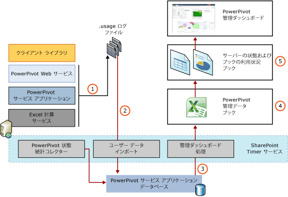

# Power Pivot 使用状況データ収集
[!INCLUDE[ssas-appliesto-sqlas](../../includes/ssas-appliesto-sqlas.md)]
使用状況データ収集は、ファーム レベルの SharePoint 機能です。 [!INCLUDE[ssGemini_md](../../includes/ssgemini-md.md)] for SharePoint では、このシステムを使用および拡張して、 [!INCLUDE[ssGemini_md](../../includes/ssgemini-md.md)] のデータやサービスがどのように使用されているかを示すレポートが [!INCLUDE[ssGemini_md](../../includes/ssgemini-md.md)] 管理ダッシュボードに用意されています。 SharePoint のインストール方法によっては、使用状況データ収集がファームに対して無効になっていることがあります。 ファーム管理者は、使用状況のログ記録を有効にして、 [!INCLUDE[ssGemini_md](../../includes/ssgemini-md.md)] 管理ダッシュボードに表示される使用状況データを作成する必要があります。  
  
 [!INCLUDE[ssGemini_md](../../includes/ssgemini-md.md)] 管理ダッシュボードの使用状況データの詳細については、「 [PowerPivot 管理ダッシュボードと使用状況データ](../../analysis-services/power-pivot-sharepoint/power-pivot-management-dashboard-and-usage-data.md)」を参照してください。  
  
  
##   使用状況データ収集とレポート アーキテクチャ  
 [!INCLUDE[ssGemini_md](../../includes/ssgemini-md.md)] 使用状況データを収集すると、格納、および SharePoint インフラストラクチャおよび Power Pivot サーバーのコンポーネントの機能の組み合わせを使用して管理します。 SharePoint インフラストラクチャには、集中管理された使用状況サービスと組み込みのタイマー ジョブが用意されています。 [!INCLUDE[ssGemini_md](../../includes/ssgemini-md.md)] for SharePoint により、SharePoint サーバーの全体管理で表示される [!INCLUDE[ssGemini_md](../../includes/ssgemini-md.md)] 使用状況データとレポートのための長期的な保存機能も追加されます。  
  
 使用状況データ収集システムでは、イベント情報が、アプリケーション サーバーまたは Web フロント エンド上の使用状況コレクション システムに入力されます。 使用状況データは、タイマー ジョブに応じてシステム内を移動します。タイマー ジョブにより、データは物理サーバー上の一時データ ファイルからデータベース サーバー上の永続的なストレージに移動します。 次の図に、使用状況データをデータ コレクションおよびレポート システム内で移動させるコンポーネントとプロセスを示します。  
  
 **注:** 使用状況データ収集が有効になっていることを確認してください。 確認するには、SharePoint サーバーの全体管理の **[監視]** に移動します。 詳細については、「 [使用状況データ収集の構成 &#40;対象は Power Pivot for SharePoint&#41;](../../analysis-services/power-pivot-sharepoint/configure-usage-data-collection-for-power-pivot-for-sharepoint.md)」を参照してください。  
  
   
  
|フェーズ|Description|  
|-----------|-----------------|  
|1|使用状況データ収集は、SharePoint 配置の [!INCLUDE[ssGemini_md](../../includes/ssgemini-md.md)] コンポーネントと [!INCLUDE[ssASnoversion_md](../../includes/ssasnoversion-md.md)] データ プロバイダーで生成されるイベントによってトリガーされます。 有効または無効にできる構成可能なイベントには、接続要求、読み込み要求とアンロード要求、およびアプリケーション サーバー上の [!INCLUDE[ssGemini_md](../../includes/ssgemini-md.md)] サービスによって監視されるクエリ応答タイミング イベントがあります。 その他のイベントは、サーバーのみによって管理され、無効にすることはできません。 このようなイベントには、データ更新イベントとサーバー状態イベントがあります。   最初に、使用状況データは SharePoint システムのデータ収集機能を使用して収集され、ローカル ログ ファイルに格納されます。 ファイルとファイルの場所は、SharePoint の標準の使用状況データ収集システムの一部になります。 ファイルの場所は、ファーム内のすべてのサーバーで同じです。 ログ ディレクトリの場所を表示または変更するには、SharePoint サーバーの全体管理の **[監視]** に移動し、 **[Usage and Health data collection の構成]**をクリックします。|  
|2|スケジュール設定された間隔 (既定では毎時) で、Microsoft SharePoint Foundation 利用状況データのインポート タイマー ジョブは、ローカル ファイルから [!INCLUDE[ssGemini_md](../../includes/ssgemini-md.md)] サービス アプリケーション データベースに使用状況データを移動します。 ファーム内に複数の [!INCLUDE[ssGemini_md](../../includes/ssgemini-md.md)] サービス アプリケーションが存在する場合、それぞれが独自のデータベースを持ちます。 イベントには、イベントを生成した [!INCLUDE[ssGemini_md](../../includes/ssgemini-md.md)] サービス アプリケーションを識別する内部情報が含まれます。 このアプリケーション識別子により、使用状況データがその作成元のアプリケーションにバインドされるようになります。|  
|3|データは、サーバーの全体管理の [!INCLUDE[ssGemini_md](../../includes/ssgemini-md.md)] 管理ダッシュボードで使用できる内部レポート データベースにコピーされます。|  
|4|データ ソースは、Excel でカスタム レポートを作成するためにアクセスできる [!INCLUDE[ssGemini_md](../../includes/ssgemini-md.md)] ブックです。 ソースとなるブックのインスタンスは 1 つだけです。 ローカライズされたレポートはすべて、同じソースのブックに基づいています。|  
|5|使用状況データは、サーバーのパフォーマンスと可用性を管理する管理者に対して、 [!INCLUDE[ssGemini_md](../../includes/ssgemini-md.md)] サービス アプリケーションのレポートで表示されます。 SharePoint でサポートされている言語向けに、ブックのローカライズされたインスタンスが作成されます。 詳細については、このトピックの「 [使用状況データのレポート](#reporting) 」を参照してください。|  
  
##   使用状況データのソース  
 使用状況データ収集が有効の場合、次のサーバー イベントに対してデータが生成されます。  
  
|イベント|Description|構成可能|  
|-----------|-----------------|------------------|  
|接続|Excel ブックの [!INCLUDE[ssGemini_md](../../includes/ssgemini-md.md)] データに対してクエリを実行しているユーザーに代わって実行されるサーバー接続。 接続イベントは、 [!INCLUDE[ssGemini_md](../../includes/ssgemini-md.md)] ブックへの接続を開いたユーザーを特定します。 レポートでは、この情報を使用して、最も頻繁に使用するユーザー、同じユーザーによってアクセスされる [!INCLUDE[ssGemini_md](../../includes/ssgemini-md.md)] データ ソース、および長期的な接続の傾向が提示されます。|有効化または無効化が可能 [使用状況データ収集の構成 &#40;対象は Power Pivot for SharePoint&#41;](../../analysis-services/power-pivot-sharepoint/configure-usage-data-collection-for-power-pivot-for-sharepoint.md)」を参照してください。|  
|クエリ応答時間|完了に要する時間に基づいてクエリを分類するクエリ応答統計。 クエリ応答統計は、サーバーがクエリ要求への応答に要する時間のパターンを示します。|有効化または無効化が可能 [使用状況データ収集の構成 &#40;対象は Power Pivot for SharePoint&#41;](../../analysis-services/power-pivot-sharepoint/configure-usage-data-collection-for-power-pivot-for-sharepoint.md)」を参照してください。|  
|データ読み込み|[!INCLUDE[ssGeminiSrv](../../includes/ssgeminisrv-md.md)]によるデータ読み込み操作。 データ読み込みイベントは、最も頻繁に使用されるデータ ソースを特定します。|有効化または無効化が可能 [使用状況データ収集の構成 &#40;対象は Power Pivot for SharePoint&#41;](../../analysis-services/power-pivot-sharepoint/configure-usage-data-collection-for-power-pivot-for-sharepoint.md)」を参照してください。|  
|データ アンロード|[!INCLUDE[ssGemini_md](../../includes/ssgemini-md.md)] サービス アプリケーションによるデータ アンロード操作。 [!INCLUDE[ssGeminiSrv](../../includes/ssgeminisrv-md.md)] は、 [!INCLUDE[ssGemini_md](../../includes/ssgemini-md.md)] データ ソースが使用されていない場合、またはサーバーのメモリが不足しているかデータ更新ジョブを実行するために追加のメモリが必要な場合に、非アクティブな Power Pivot データ ソースをアンロードします。|有効化または無効化が可能 [使用状況データ収集の構成 &#40;対象は Power Pivot for SharePoint&#41;](../../analysis-services/power-pivot-sharepoint/configure-usage-data-collection-for-power-pivot-for-sharepoint.md)」を参照してください。|  
|サーバー状態|CPU およびメモリの使用率で測定されたサーバー状態を示すサーバー操作。 このデータは、履歴的なデータです。 サーバーの現在の処理負荷に関するリアルタイム情報は提供されません。|不可。 このイベントに対して使用状況データは常に収集されます。|  
|データ更新|スケジュール設定されたデータ更新に応じて [!INCLUDE[ssGemini_md](../../includes/ssgemini-md.md)] サービスにより開始されるデータ更新操作。 データ更新の使用状況履歴は、運用レポート用にアプリケーション レベルで収集され、個々のブックの [データ更新の管理] ページに反映されます。   **注:** [!INCLUDE[ssSQL11SP1_md](../../includes/sssql11sp1-md.md)] および SharePoint 2013 の配置では、Analysis Services サーバーではなく Excel Services によってデータ更新が管理されます。|不可。 [!INCLUDE[ssGemini_md](../../includes/ssgemini-md.md)] サービス アプリケーション用のデータ更新を有効にした場合、データ更新の使用状況データは常に収集されます。|  
  
##   サービスおよびタイマー ジョブ  
 次の表に、使用状況データ収集システムのサービスとデータ コレクション ストアを示します。 サーバー状態と使用状況データのデータ更新を強制する手順については、タイマー ジョブ スケジュールを上書きする方法の[!INCLUDE[ssGemini_md](../../includes/ssgemini-md.md)]管理ダッシュ ボード レポートを参照してください[リンクは、ここの説明を入力](../../analysis-services/power-pivot-sharepoint/power-pivot-data-refresh-with-sharepoint-2013.md)です。 タイマー ジョブは、SharePoint サーバーの全体管理で確認できます。 **[監視]**に移動し、 **[ジョブ状態の確認]**をクリックして、 **[ジョブ定義の確認]**をクリックします。  
  
|コンポーネント|既定のスケジュール|Description|  
|---------------|----------------------|-----------------|  
|SharePoint Timer Service (SPTimerV4)||この Windows サービスは、ファーム内のすべてのメンバー コンピューターでローカルに実行され、ファーム レベルで定義されるすべてのタイマー ジョブを処理します。|  
|Microsoft SharePoint Foundation 利用状況データのインポート (Microsoft SharePoint Foundation Usage Data Import)|30 分ごと (SharePoint 2010 の場合)。 5 分ごと (SharePoint 2013 の場合)。|このタイマー ジョブは、ファーム レベルでグローバルに構成されます。 このタイマー ジョブは、使用状況データをローカルの使用状況ログ ファイルから中央の使用状況データ収集データベースに移動します。 このタイマー ジョブを手動で実行して、データ インポート操作を強制的に実行できます。|  
|Microsoft SharePoint Foundation 使用状況データ処理タイマー ジョブ|毎日午前 3 時|SQL Server 2012 [!INCLUDE[ssGemini_md](../../includes/ssgemini-md.md)] for SharePoint 以降では、SharePoint 利用状況データベースに古い使用状況データが残っている可能性があるアップグレード シナリオまたは移行シナリオでこのタイマー ジョブがサポートされています。 SQL Server 2012 [!INCLUDE[ssGemini_md](../../includes/ssgemini-md.md)] for SharePoint 以降、 [!INCLUDE[ssGemini_md](../../includes/ssgemini-md.md)] の使用状況データ収集および管理ダッシュボード ワークフローには、SharePoint 利用状況データベースが使用されません。 このタイマー ジョブを手動で実行して、SharePoint 利用状況データベースに残っている [!INCLUDE[ssGemini_md](../../includes/ssgemini-md.md)] の関連データを [!INCLUDE[ssGemini_md](../../includes/ssgemini-md.md)] サービス アプリケーション データベースに移動することができます。   このタイマー ジョブは、ファーム レベルでグローバルに構成されます。 このタイマージョブは、中央の使用状況データ収集データベース内にある期限切れになった使用状況データ (つまり、30 日を超えているすべてのレコード) を調べます。 ファーム内の [!INCLUDE[ssGemini_md](../../includes/ssgemini-md.md)] サーバーに対して、このタイマー ジョブは [!INCLUDE[ssGemini_md](../../includes/ssgemini-md.md)] 使用状況データの追加確認を実行します。 [!INCLUDE[ssGemini_md](../../includes/ssgemini-md.md)] 使用状況データを検出した場合、このタイマー ジョブは、アプリケーション識別子を使用して適切なデータベースを検索し、データをそのデータベース アプリケーション データベースに移動します。   このタイマー ジョブを手動で実行して、期限切れになったデータを強制的に確認したり、 [!INCLUDE[ssGemini_md](../../includes/ssgemini-md.md)] サービス アプリケーション データベースへ [!INCLUDE[ssGemini_md](../../includes/ssgemini-md.md)] 使用状況データを強制的にインポートしたりできます。|  
|[!INCLUDE[ssGemini_md](../../includes/ssgemini-md.md)] 管理ダッシュボード処理タイマー ジョブ|毎日午前 3 時|このタイマー ジョブは、管理データを [!INCLUDE[ssGemini_md](../../includes/ssgemini-md.md)] 管理ダッシュボードに提供する内部 [!INCLUDE[ssGemini_md](../../includes/ssgemini-md.md)] ブックを更新します。 これは、ダッシュボード レポートまたは Web パーツに表示されるサーバー名、ユーザー名、アプリケーション名、およびファイル名など、SharePoint により管理される更新情報を取得します。|  
  
##   使用状況データのレポート  
 [!INCLUDE[ssGemini_md](../../includes/ssgemini-md.md)] データの使用状況データを表示するには、 [!INCLUDE[ssGemini_md](../../includes/ssgemini-md.md)] 管理ダッシュボードで組み込みレポートを表示します。 組み込みレポートは、サービス アプリケーション データベースのレポート データ構造から取得された使用状況データを統合します。 基になるレポート データが毎日更新されるため、組み込みの使用状況レポートで更新済みの情報が表示されるのは、Microsoft SharePoint Foundation 利用状況データの処理タイマー ジョブによりデータが [!INCLUDE[ssGemini_md](../../includes/ssgemini-md.md)] サービス アプリケーション データベースにコピーされた後に限られます。 既定では、この処理は 1 日 1 回行われます。  
  
 レポートの表示方法の詳細については、「 [Power Pivot Management Dashboard and Usage Data](../../analysis-services/power-pivot-sharepoint/power-pivot-management-dashboard-and-usage-data.md)」を参照してください。  
  
## 参照  
 [PowerPivot 管理ダッシュボードと使用状況データ](../../analysis-services/power-pivot-sharepoint/power-pivot-management-dashboard-and-usage-data.md)   
 [構成設定のリファレンス &#40;Power Pivot for SharePoint&#41;](../../analysis-services/power-pivot-sharepoint/configuration-setting-reference-power-pivot-for-sharepoint.md)   
 [使用状況データ収集の構成 (Power Pivot for SharePoint)](../../analysis-services/power-pivot-sharepoint/configure-usage-data-collection-for-power-pivot-for-sharepoint.md)  
  
  
