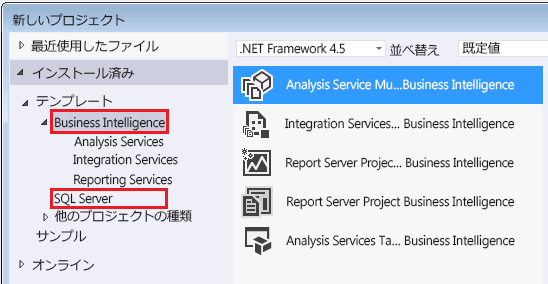

# Analysis Services で使用するツールとアプリケーション
  Analysis Services モデルの構築と Analysis Services インスタンス上で関連付けられているデータベースの管理に必要なツールやアプリケーションを紹介します。  
  
## Analysis Services モデルのデザイナー  
 表形式モデルと多次元モデルは、Visual Studio シェル内で構築されたソリューションのプロジェクト テンプレートから作成されます。 プロジェクト テンプレートには、Analysis Services ソリューションを構成するテーブル、リレーションシップ、キューブ、ディメンション、およびロールを作成するためのデザイナーが用意されています。 シェルが備えるビジュアル ワークスペース、プロパティ ページ、およびコマンド フレームワーク内にプロジェクトが作成されます。 シェルとテンプレートの両方が提供されるモデル デザイナーは、Web から無料でダウンロードできます。  
  
 モデルの互換性レベルの設定により、利用できる機能と、モデルを実行する Analysis Services のリリースが決まります。  特定の互換性レベルを指定できるかどうかは、モデル デザイナーによってある程度決定されます。  
  
 表形式の JSON 形式での BIM ファイルや、双方向のクロス フィルターなど、SQL Server 2016 の最新機能を使った表形式モデルは、SQL Server 2016 に付属している SQL Server Data Tools for Visual Studio 2015 のバージョンを使用して (下にダウンロード リンクがあります)、互換性レベル 1200 で作成する必要があります。  
  
 以前のバージョンの Analysis Services 上にモデルを配置する場合など、より低い互換性レベルが必要なときでも、SSDT for Visual Studio 2015 のモデル デザイナーを使用できます。 新しいバージョンのツールでは、任意の互換性レベルで、任意のモデル タイプ (表形式または多次元) の作成をサポートしています。 古いモデルの構築や編集を行うためだけに以前のバージョンのツールを保持する必要はありません。  
  
### モデル デザイナーのダウンロード  
 [!INCLUDE[ssBIDevStudio](../includes/ssbidevstudio-md.md)] は、以前は SQL Server Data Tools for Business Intelligence (SSDT-BI)、さらにその前は Business Intelligence Development Studio (BIDS) と呼ばれていました。このツールを使用すると、Analysis Services モデルを作成できます。  
  
||  
|-|  
|**[SSDT for Visual Studio 2015 のダウンロード](https://msdn.microsoft.com/mt429383)**|  
  
 以前のバージョンのデザイナーでも SQL Server Data Tools for Visual Studio 2015 を使用することをお勧めします。 このツールには、リレーショナル データベース、Analysis Services モデル、Reporting Services レポート、および Integration Services パッケージなど、すべての SQL Server コンテンツ タイプに対するプロジェクト テンプレートが含まれています。  
  
 SSDT は、Visual Studio 2015 のシェルで動作します。 Visual Studio 2015 がインストール済みの場合、SSDT セットアップによりプロジェクト テンプレートのみが追加されます。 Visual Studio 2015 をお持ちでない場合は、シェルとテンプレートの両方がインストールされます。  
  
 SSDT-BI または BIDS の以前のバージョンをコンピューターにインストールしていた場合は、新しいバージョンが以前のバージョンと共にサイド バイ サイドでインストールされます。  
  
 SSDT をインストールすると、[新しいプロジェクト] ダイアログ ボックスにビジネス インテリジェンス テンプレートが表示されます。  
  
   
  
## 管理ツール  
  
### SQL Server Management Studio のダウンロード  
 Management Studio は、Analysis Services を含むすべての SQL Server 機能用の主要な管理ツールです。 このツールを個別にダウンロードできるようになりました。  
  
||  
|-|  
|**[SQL Server Management Studio のダウンロード](https://msdn.microsoft.com/library/mt238290.aspx)**|  
  
 SQL Server 2016 では、Management Studio に含まれている Analysis services 向けの拡張イベント (xEvents) を SQL Server Profiler トレースの軽量な代替手段として使用し、アクティビティを監視して、サーバーの問題を診断することができます。 詳細については、「 [Monitor Analysis Services with SQL Server Extended Events](../analysis-services/instances/monitor-analysis-services-with-sql-server-extended-events.md) 」を参照してください。  
  
### SQL Server Profiler  
 xEvents のサポートに伴い、正式には非推奨となりましたが、SQL Server Profiler は引き続き、接続、MDX クエリの実行、その他のサーバー操作を監視するための使い慣れたツールとして利用できます。 SQL Server Profiler は既定でインストールされます。 SQL Server アプリケーションと一緒に Windows Server 2012 のアプリ ページにあります。  
  
### PowerShell  
 PowerShell コマンドを使用すると、多くの管理タスクを実行できます。 詳細については、「[Analysis Services での PowerShell スクリプティング](../analysis-services/instances/powershell-scripting-in-analysis-services.md)」を参照してください。  
  
### コミュニティとサード パーティのツール  
 コミュニティ コードの例については、「 [Analysis Services Codeplex ページ](http://sqlsrvanalysissrvcs.codeplex.com/) 」を参照してください。 Analysis Services をサポートするサード パーティのツールの推奨事項を確認するには、「[フォーラム](http://social.msdn.microsoft.com/Forums/sqlserver/home?forum=sqlanalysisservices)」が役立ちます。  
  
## 参照  
 [多次元データベースの互換性レベル (Analysis Services)](../analysis-services/multidimensional-models/compatibility-level-of-a-multidimensional-database-analysis-services.md)   
 [Analysis Services での表形式モデルの互換性レベル](../analysis-services/tabular-models/compatibility-level-for-tabular-models-in-analysis-services.md)  
  
  