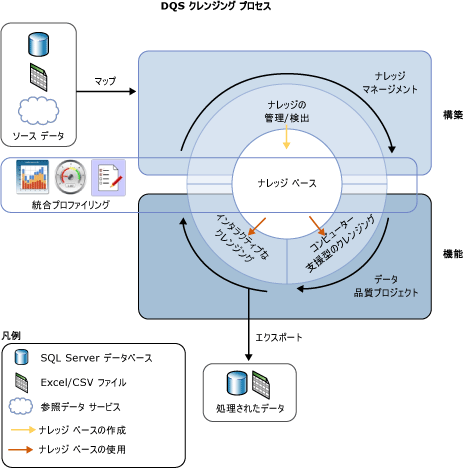
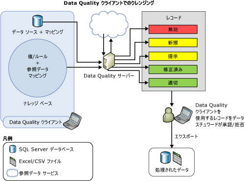

# Data Cleansing

[!INCLUDE[appliesto-ss-xxxx-xxxx-xxx-md-winonly](../includes/appliesto-ss-xxxx-xxxx-xxx-md-winonly.md)]

  データ クレンジングは、データ ソース内のデータの品質を分析し、システムによる推奨事項を手動で承認または拒否し、それによってデータを変更するプロセスです。 
  [!INCLUDE[ssDQSnoversion](../includes/ssdqsnoversion-md.md)] (DQS) でのデータ クレンジングには、ナレッジ ベースのナレッジにデータがどの程度準拠しているのかを分析するコンピューター支援型のプロセスと、データ スチュワードがコンピューター支援型プロセスの結果を検討および変更してデータ クレンジングが意図したとおりに行われるようにするための対話型プロセスが含まれます。  
  
 データ スチュワードは、Integration Services パッケージ化プロセスでデータ クレンジングを実行することもできます。 この場合、データ スチュワードは [!INCLUDE[ssDQSCleansingLong](../includes/ssdqscleansinglong-md.md)]を使用します。このコンポーネントでは、既存のナレッジ ベースを使用してデータ クレンジングが自動的に行われます。 詳細については、「[DQS クレンジング変換](../integration-services/data-flow/transformations/dqs-cleansing-transformation.md)」を参照してください。  
  
 DQS のデータ クレンジング機能には、次の利点があります。  
  
-   データ ソース (Excel ファイルまたは SQL Server データベース) 内の不完全なデータまたは正しくないデータを識別し、修正したり、無効なデータについてユーザーに通知したりします。  
  
-   
  *コンピューター支援型* と *対話型*の 2 手順のプロセスでデータをクレンジングします。 コンピューター支援型プロセスでは、DQS ナレッジ ベースのナレッジを使用して、データを自動的に処理し、置換/修正を提案します。 次の対話型手順では、データ スチュワードはコンピューター支援型クレンジングの間に DQS によって提案された変更を承認、拒否、または修正できます。  
  
-   ドメイン値、ドメイン ルール、および参照データを使用して、顧客データを標準化および拡充します。 たとえば、"St." を "Street" に変更することで用語の使用を標準化し、 "1 Microsoft way Redmond 98006" を "1 Microsoft Way, Redmond, WA 98006" に変更して足りない要素を補充することによりデータを拡充します。  
  
-   単一の直感的な一貫性のあるウィザードに似たインターフェイスを提供し、ユーザーがデータ内を移動して、非常に大きいデータ セットのエラーを検査できるようにします。  
  
 次の図は、DQS でのデータ クレンジングの実行方法を示したものです。  
  
   
  
##  コンピューター支援型のクレンジング  
 DQS のデータ クレンジング プロセスでは、クレンジング対象のデータにナレッジ ベースが適用され、データに対する変更内容が提示されます。 データ スチュワードは提示された変更内容にアクセスして、それを評価および修正します。 データ クレンジングを行うには、データ スチュワードは次の手順を実行します。  
  
1.  データ品質プロジェクトを作成し、ソース データの分析とクレンジングに使用するナレッジ ベースを選択し、 **クレンジング** アクティビティを選択します。 複数のデータ品質プロジェクトで、同一のナレッジ ベースを使用できます。  
  
2.  クレンジング対象のソース データが含まれるデータベース テーブル/ビューまたは Excel ファイルを指定します。 データベースまたは Excel ファイルは、ナレッジ検出に使用したものと同じでも、別のデータベースまたは Excel ファイルでもかまいません。  
  
    > [!NOTE]  
    >  ナレッジ検出とクレンジング アクティビティに同じデータ ソースを選択すると、データは変更されません。 サンプル データに対してナレッジ検出を実行した後、ナレッジ検出アクティビティの間に構築されたナレッジでソース データをクレンジングすることをお勧めします。  
  
3.  クレンジング対象のデータ フィールドを、ナレッジ ベースの適切なドメイン/複合ドメインにマップします。 複合ドメインにフィールドをマップした場合は、フィールドと複合ドメインの間でマッピングが行われます。複合ドメイン内の個別のドメインとの間ではマッピングは行われません。 また、マップされたフィールドのデータ クレンジングは、複合ドメインに指定されているルールに基づいて行われます。複合ドメイン内の個別のドメインに指定されているルールでは行われません。 複合ドメインの詳細については、「 [DQS Knowledge Bases and Domains](../data-quality-services/dqs-knowledge-bases-and-domains.md)」を参照してください。  
  
4.  
  **[最適化]** ページの **[開始]** をクリックして、コンピューター支援型のクレンジング プロセスを実行します。  
  
 データ クレンジング プロセスでは、既知のデータ ドメイン値と最も一致するデータ インスタンスが検索されます。 一部のサンプル データで実行されるナレッジ検出プロセスとは異なり、このプロセスでは、すべてのソース データに対してデータ品質ナレッジが適用されます。  
  
 コンピューター支援型のプロセスでは、 [!INCLUDE[ssDQSClient](../includes/ssdqsclient-md.md)] に、対話型クレンジング プロセスで使用するデータ品質情報が表示されます。 構文エラー規則への準拠を除き、DQS では、参照データと高度なアルゴリズムを使用して、 *信頼レベル*に基づいてデータが分類されます。 信頼レベルは、DQS の修正または候補に対する確実性の度合いを示します。 信頼レベルは、次のしきい値に基づきます。  
  
-   
  *自動修正のしきい値* : この値を上回る場合 DQS によって変更内容が提示され、データ スチュワードが拒否しない限り修正されます。 自動修正しきい値は、 **[構成]** 画面の **[全般設定]** タブで指定できます。 詳細については、「 [クレンジングと照合のしきい値の構成](../data-quality-services/configure-threshold-values-for-cleansing-and-matching.md)」をご参照ください。  
  
-   
  *自動提案のしきい値* : この値を上回り、自動修正のしきい値以下である場合、DQS によって変更内容が提示され、データ スチュワードが承認した場合に修正されます。 自動提案しきい値は、 **[構成]** 画面の **[全般設定]** タブで指定できます。 詳細については、「 [クレンジングと照合のしきい値の構成](../data-quality-services/configure-threshold-values-for-cleansing-and-matching.md)」をご参照ください。  
  
 自動提案のしきい値より信頼レベルが低いすべての値は、データ スチュワードが変更を指定しない限り、そのまま維持されます。  
  
##  インタラクティブなクレンジング  
 コンピューター支援型のクレンジング プロセスに基づいて、データを変更するかどうかの判断に必要な情報がデータ スチュワードに示されます。 データは次の 5 つのタブに分類されます。  
  
-   **提案**済み: DQS が、*自動提案しきい*値よりも優先度が高いものの、*自動修正しきい*値より低い候補を見つけた値。 これらの値は、確認して、必要に応じ承認または拒否する必要があります。  
  
-   **新規**: DQS に十分な情報 (提案) がないため、他のタブにマップできない有効な値。さらに、このタブには、信頼レベルが*自動提案しきい*値よりも低いが、有効としてマークするのに十分な値が含まれています。  
  
-   **無効**: ナレッジベースのドメインで無効とマークされた値、またはドメインルールまたは参照データに失敗した値。 このタブには、対話型クレンジング プロセスの間にユーザーが他の 4 つのタブで拒否した値も表示されます。  
  
-   **修正**済み: 自動クレンジングプロセス中に dqs によって修正された値 (dqs が*自動修正しきい*値を超えた信頼レベルで値の修正を検出した場合)。 このタブには、ユーザーが対話型クレンジングの間に **[次に修正]** 列で正しい値を指定した後、他の 4 つのタブのいずれかで **[承認]** 列のオプション ボタンをクリックして承認した値も表示されます。  
  
-   **正しい**: 正しく検出された値。 たとえば、ドメイン値に一致した値が表示されます。 必要な場合には、このタブで値を拒否することにより、または **[次に修正]** 列で代わりの用語を指定してから **[承認]** 列でラジオ ボタンをクリックすることにより、DQS のクレンジングをオーバーライドできます。 また、ユーザーが対話型クレンジングの間に **[新規]** タブまたは **[無効]** タブで **[承認]** 列のオプション ボタンをクリックして承認した値もこのタブに含まれます。  
  
> [!NOTE]  
>  
  **[提案]**、 **[修正済み]**、 **[適切]** の各タブでは、該当する場合は、ドメインの先頭の値がそれぞれのドメイン値に対する **[次に修正]** 列に表示されます。  
  
 データ スチュワードは [!INCLUDE[ssDQSClient](../includes/ssdqsclient-md.md)] を使用して、DQS が提示した変更内容を確認し、その変更を適用するかどうかを判断します。 データ スチュワードは、正しい値として DQS が提示した用語が実際に正しいかどうかを検証できます。 また、信頼レベルが高く、既に DQS によって適用済みの変更内容についても、変更が適切かどうかを検証できます。 自動提案される変更内容については、承認するかどうかを判断できます。 さらに、変更されていない値を確認して、コンピューター支援型のプロセスでは検出されなかった変更内容がないかどうかを確認できます。  
  
 DQS では、コンピューター支援型のデータ クレンジングの結果に対してデータ スチュワードが加えた変更がマージされます。 これらの変更はプロジェクト内で維持されますが、ナレッジ ベースには追加されません。 データ クレンジングでは、関連付けられているナレッジ ベースは読み取り専用です。  
  
 データ クレンジング プロセスが完了したら、処理されたデータを、SQL Server データベースの新しいテーブル、.csv ファイル、または Excel ファイルにエクスポートできます。 クレンジングが実行されたソース データは、元の状態のまま維持されます。 データ スチュワードは、別のクレンジング データを使用して、実際のソース データを修正できます。  
  
 次の図は、 [!INCLUDE[ssDQSClient](../includes/ssdqsclient-md.md)] アプリケーションを使用してデータ クレンジングを実行する方法を示したものです。  
  
   
  
##  先頭の値の修正  
 先頭の値の修正は、シノニムのあるドメイン値に対して適用されます。値の表現が一貫するように、シノニム値の 1 つを他の値の代わりに先頭の値として使用できます。 たとえば、"New York"、"NYC"、および "big apple" はシノニムであり、"NYC" および "Big Apple" の代わりに "New York" を先頭の値として使用できます。 DQS では、データを標準化できるように、クレンジング プロセスにおいて先頭の値の修正がサポートされています。 先頭の値の修正は、ドメインの作成時にドメインでこの機能が有効になっている場合にのみ行われます。 ドメインの作成時に **[先頭の値を使用]** チェック ボックスをオフにしない限り、先頭の値の修正はすべてのドメインにおいて既定で有効になります。 このチェック ボックスの詳細については、「 [Set Domain Properties](../data-quality-services/set-domain-properties.md)」を参照してください。  
  
##  クレンジング済みデータの標準化  
 ドメインで定義されている出力形式に基づいてクレンジング済みのデータを標準化された形式でエクスポートするかどうかを選択できます。 ドメインの作成時に、ドメイン内のデータ値が出力されるときに適用される書式設定を選択できます。 ドメインの出力形式の指定の詳細については、「 **Set Domain Properties** 」の「 [形式の出力先](../data-quality-services/set-domain-properties.md)」を参照してください。  
  
 クレンジング データ品質プロジェクト ウィザードの **[エクスポート]** ページでクレンジング済みデータをエクスポートするときに、 **[出力の標準化]** チェック ボックスで、クレンジング済みデータを標準形式でエクスポートするかどうかを指定します。 既定では、このチェック ボックスはオンになっており、クレンジング済みデータは標準化された形式でエクスポートされます。 クレンジング済みデータをエクスポートする方法の詳細については、「[DQS &#40;内部&#41; ナレッジを使用したデータのクレンジング](../data-quality-services/cleanse-data-using-dqs-internal-knowledge.md)」を参照してください。  
  
##  関連タスク  
  
|タスクの説明|トピック|  
|----------------------|-----------|  
|クレンジング アクティビティのしきい値を構成する方法について説明します。|[クレンジングと照合のしきい値の構成](../data-quality-services/configure-threshold-values-for-cleansing-and-matching.md)|  
|DQS に組み込まれたナレッジを使用してデータをクレンジングする方法について説明します。|[DQS &#40;内部&#41; ナレッジを使用してデータをクレンジングする](../data-quality-services/cleanse-data-using-dqs-internal-knowledge.md)|  
|参照データ サービスのナレッジを使用してデータをクレンジングする方法について説明します。|[参照データ &#40;外部&#41; ナレッジを使用してデータをクレンジングする](../data-quality-services/cleanse-data-using-reference-data-external-knowledge.md)|  
|複合ドメインをクレンジングする方法について説明します。|[複合ドメインでのデータのクレンジング](../data-quality-services/cleanse-data-in-a-composite-domain.md)|  
  
## 参照  
 [DQS&#41;&#40;データ品質プロジェクト](../data-quality-services/data-quality-projects-dqs.md)   
 [データ照合](../data-quality-services/data-matching.md)  
  
  
