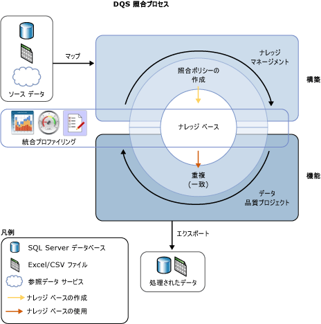

# データ照合

[!INCLUDE[appliesto-ss-xxxx-xxxx-xxx-md-winonly](../includes/appliesto-ss-xxxx-xxxx-xxx-md-winonly.md)]

  
  [!INCLUDE[ssDQSnoversion](../includes/ssdqsnoversion-md.md)] (DQS) のデータ照合プロセスでは、データの重複を減らし、データ ソースのデータの精度を高めることができます。 照合では、1 つのデータ ソースのすべてのレコードにおける重複の度合いを分析し、比較したレコードのセットごとに重み付けした一致率を返します。 これにより、一致と見なすレコードを決定し、ソース データに対して適切な処理を実行することができます。  
  
 DQS の照合プロセスには次の利点があります。  
  
-   同等と見なされるデータ値の間の違いをなくすことで、適切な値を特定し、データの違いによって生じる可能性があるエラーを減らすことができます。 たとえば、名前や住所によってデータ ソースのデータ (特に顧客データなど) を識別することがよくありますが、時間がたつとデータがダーティになったり悪化したりすることがあります。 照合によってそれらのエラーを特定して修正すると、データがはるかに使用しやすくなり、保守も簡単になります。  
  
-   異なる形式やスタイルで入力されている同等の値の表示を統一することができます。  
  
-   完全一致とあいまい一致が識別され、定義に従って重複データを除去することができます。 この処理の定義では、あいまい一致を一致と見なすポイント、 および照合対象として評価するフィールドと評価しないフィールドを指定します。  
  
-   コンピューター支援型のプロセスを使用して照合ポリシーを作成し、照合結果に基づいて対話形式で変更したり、再利用可能なナレッジ ベースに追加したりできます。  
  
-   ソースからステージング テーブルにコピーしたデータのインデックスを再作成するかどうかを、照合ポリシーやソース データの状態に応じて選択できます。 インデックスの再作成を省略すると、パフォーマンスが向上することがあります。  
  
 照合プロセスは、他のデータ クレンジング プロセスと組み合わせて実行できます。これにより、データ全体の品質を向上させることができます。 また、データの重複除去は、マスター データ サービスに組み込まれた DQS の機能を使用して実行することもできます。 詳しくは、「[マスター データ サービスの概要 &#40;MDS&#41;](../master-data-services/master-data-services-overview-mds.md)」をご覧ください。  
  
 次の図は、DQS でのデータ照合の実行方法を示したものです。  
  
   
  
##  データ照合を実行する方法  
 照合を実行するには、DQS の他のデータ品質プロセスと同様に、次の手順でナレッジ ベースを構築し、データ品質プロジェクトで照合アクティビティを実行します。  
  
1.  ナレッジ ベースの照合ポリシーを作成します。  
  
2.  データ品質プロジェクトの一部である照合アクティビティで重複除去プロセスを実行します。  
  
###  照合ポリシーの作成  
 ナレッジ ベースを使用して照合を実行するための準備として、ナレッジ ベースの照合ポリシーを作成して、一致率を割り当てる方法を定義します。 照合ポリシーには、レコードが別のレコードにどの程度一致するかを評価するときに使用するドメインを識別し、一致率を割り当てるときの各ドメイン値の重みを指定する、1 つ以上の照合ルールを含めます。 このルールでは、完全に一致するドメイン値だけを一致と見なすか、類似性のレベルが指定した値を超えるドメイン値も一致と見なすかを指定します。 また、ドメインが一致する必要があるかどうかも指定します。  
  
 ナレッジ ベース管理ウィザードの照合ポリシー アクティビティでは、対象となるすべてのレコードについて、各照合ルールを適用して一度に 2 つずつレコードを比較することでサンプル データを分析します。 指定した最小値よりも照合スコアが大きいレコードは、照合結果でクラスターにグループ化されます。 これらの照合結果は、照合ルールの調整に使用するためのものであり、ナレッジ ベースには追加されません。 照合ポリシーの作成は反復的なプロセスで、照合結果やプロファイル統計情報に基づいて照合ルールを変更することができます。  
  
 特定のドメインに対して、データ ソースからドメインにデータを読み込むときにデータ文字列を正規化するように指定することができます。 このプロセスで、特殊文字を null またはスペースで置き換えることで、2 つの文字列間の違いがなくなることがよくあります。 これにより、照合の精度が高まり、正規化を行わないと一致と見なされない照合結果が最小一致しきい値を上回るようになることがあります。  
  
> [!NOTE]  
>  2 つのレコードの対応するフィールドの値が null の場合、それらは一致と見なされます。  
  
 照合ポリシーは、サンプル データにマップされたドメインで実行されます。 照合ポリシーの実行時にデータ ソースからステージング テーブルにデータをコピーしてインデックスを再作成するかどうかを指定することができます。 これは、ナレッジ ベースの構築時にも、照合プロジェクトの実行中にも指定できます。 インデックスの再作成を省略すると、パフォーマンスが向上することがあります。 インデックスの再作成を省略できるのは、照合ポリシーが変更されていない場合です。照合ポリシーに変更がなく、データ ソースの更新、ポリシーのマップし直し、新しいデータ ソースの選択、新しいドメインのマップを行っていなければ、インデックスを再作成する必要はありません。  
  
 作成した各照合ルールはナレッジ ベースに保存されます。 ただし、ナレッジ ベースは、発行されていないとデータ品質プロジェクトで使用できません。 また、別のユーザーが作成したナレッジ ベースの照合ポリシーは、ナレッジ ベースが発行されるまでは変更できません。  
  
###  照合プロジェクトの実行  
 DQS では、ソース データの各行を他のすべての行と比較し、ナレッジ ベースで定義されている照合ポリシーを使用して行が一致する確率を特定することで、データの重複除去が実行されます。 この処理は、データ品質プロジェクトで照合と一緒に行われます。 照合はデータ品質プロジェクトの主要な手順の 1 つです。 この手順は、データ クレンジングの実行後に、照合するデータにエラーがない状態で実行すると最適な結果が得られます。 照合プロセスを実行する前に、クレンジング プロジェクトの結果をデータ テーブルまたは .csv ファイルにエクスポートしておくことで、照合プロジェクトを作成し、その照合プロジェクトでクレンジング結果をドメインにマップすることができます。  
  
 データ照合プロジェクトは、コンピューター支援型のプロセスと対話形式のプロセスで構成されます。 照合プロジェクトでは、評価するデータ ソースに対して照合ポリシーの照合ルールを適用し、 任意の 2 つの行が一致する確率を照合スコアで評価します。 照合ポリシーでデータ スチュワードが設定した値よりも一致率が高いレコードだけが一致と見なされます。  
  
 DQS で照合分析を実行すると、一致と見なされたレコードのクラスターが作成され、 各クラスター内の 1 つのレコードがピボット レコード (先頭のレコード) としてランダムに選択されます。 データ スチュワードは、照合結果を確認し、クラスターに対する適切な一致ではないレコードを拒否します。 その後、データ スチュワードは、サバイバーシップ ルールを選択します。選択したサバイバーシップ ルールに基づいて、照合プロセスで保持するレコードが特定され、一致レコードがそのレコードに置き換えられます。 サバイバーシップ ルールは、"ピボット レコード" (既定値)、"最も完全で最長のレコード"、"最も完全なレコード"、または "最長のレコード" から選択できます。 各クラスターで保持するレコード (先頭のレコード) を決めるときは、サバイバーシップ ルールの条件に基づいて最も近いレコードが選択されます。 特定のクラスターにサバイバーシップ ルールに適合するレコードが複数ある場合は、それらのレコードから 1 つのレコードがランダムに選択されます。 [show non-overlapping clusters]\(重複するクラスターを表示します\) を選択すると、共通のレコードを持つクラスターを 1 つのクラスターとして表示することができます。 この設定に従って結果を表示するには、照合プロセスを実行する必要があります。  
  
 照合プロセスの結果は、SQL Server のテーブルまたは .csv ファイルにエクスポートすることができます。 照合結果をエクスポートする方法は 2 種類あり、一致レコードと不一致レコードをエクスポートするか、クラスターで保持するレコードだけを含むサバイバーシップ レコードと不一致レコードをエクスポートできます。 サバイバーシップ レコードでは、保持するレコードとして複数のクラスターで同じレコードが特定された場合、そのレコードが 1 回だけエクスポートされます。  
  
## このセクションの内容  
 DQS では、照合に関連する次のタスクを実行できます。  
  
|||  
|-|-|  
|照合ポリシーの照合ルールの作成とテスト|[照合ポリシーの作成](../data-quality-services/create-a-matching-policy.md)|  
|データ品質プロジェクトでの照合の実行|[照合プロジェクトの実行](../data-quality-services/run-a-matching-project.md)|  
  
  
