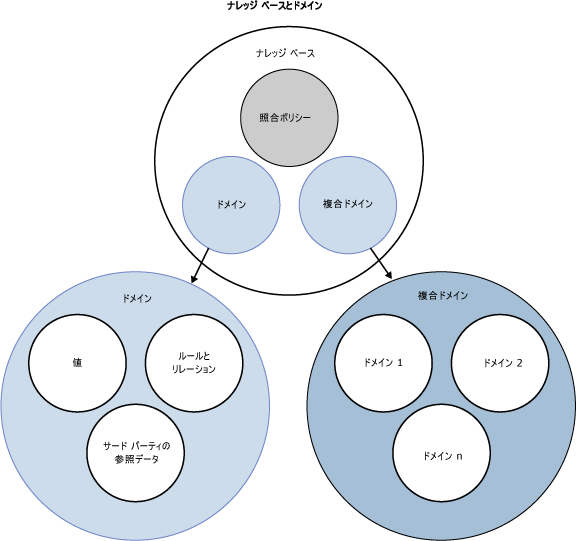

# DQS のナレッジ ベースとドメイン

[!INCLUDE[appliesto-ss-xxxx-xxxx-xxx-md-winonly](../includes/appliesto-ss-xxxx-xxxx-xxx-md-winonly.md)]

  このトピックでは、 [!INCLUDE[ssDQSnoversion](../includes/ssdqsnoversion-md.md)] (DQS) でのナレッジ ベースについて説明します。 データをクレンジングするには、データについての知識 (ナレッジ) が必要です。 データ品質プロジェクト用のナレッジを準備するには、ナレッジ ベース (KB) を構築して保守します。DQS はこれを使用して、正しくないデータまたは無効なデータを識別できます。 DQS では、コンピューター支援型と対話型の両方のプロセスを使用して、ナレッジ ベースを作成、構築、および更新できます。 ナレッジ ベース内のナレッジはドメインに保持され、各ドメインはデータ フィールドに固有です。 ナレッジ ベースはデータに関するナレッジのリポジトリです。ナレッジ ベースを使用して、データを理解し、その整合性を維持できます。  
  
 DQS のナレッジ ベースには次の利点があります。  
  
-   データについてのナレッジの構築は詳細なプロセスです。 DQS のプロセスはサンプル データからデータについてのナレッジを自動的に抽出するので、プロセスがはるかに簡単になります。  
  
-   DQS を使用して、データの分析を確認し、ルールを作成したりデータ値を変更したりすることによってナレッジ ベース内のナレッジを拡張できます。 時間をかけて拡張を繰り返し、ナレッジを改善できます。  
  
-   既存のナレッジ ベース (KB) を基にして KB を作成したり、ファイルから KB にドメインのナレッジをインポートしたり、プロジェクトから KB にナレッジをインポートしたり、DQS の既定の KB である DQS データを使用したりすることにより、既存のデータ品質ナレッジを活用できます。  
  
-   得られたデータと参照データ プロバイダーで保持されているデータを比較することにより、データの品質を確保できます。  
  
-   ナレッジ ベースの構築と、データ修正プロセスにおけるナレッジ ベースの適用は明確に分離されているので、ナレッジ ベースを柔軟に構築および更新できます。  
  
 データ スチュワードは [!INCLUDE[ssDQSClient](../includes/ssdqsclient-md.md)] アプリケーションを使用して、コンピューター支援型の手順の実行および制御と、対話形式での手順の実行の両方を行うことができます。  
  
 次の図では、DQS のナレッジ ベースとドメインのさまざまなコンポーネントを示します。  
  
   
  
##  DQS ナレッジベースを作成してビルドする方法  
 DQS ナレッジ ベースの構築には、以下のプロセスおよびコンポーネントが含まれます。  
  
 **ナレッジ検出**  
 データ サンプルを処理することによってナレッジからナレッジ ベースを構築するコンピューター支援型のプロセス  
  
 **ドメイン管理**  
 データ スチュワードがデータ フィールドと関連付けられたナレッジ ベース ドメイン内のナレッジを検証して変更できる対話型のプロセス。 これには、フィールド全体のプロパティの設定、ルールの作成、特定の値の変更、参照データ サービスの使用、用語ベースのリレーションシップまたはフィールド間のリレーションシップの設定などが含まれます。  
  
 **参照 Data Services**  
 得られたデータを参照データ プロバイダーによって保持および保証されているデータと比較して検証できるドメイン管理のプロセス。  
  
 **照合ポリシー**  
 コンピューター支援型および対話型のプロセスでナレッジ ベースに組み込まれる、DQS がレコードを処理して重複および不一致の可能性を識別する方法が定義されているポリシー。  
  
##  ナレッジ検出  
 ナレッジ ベースの作成は、最初はコンピューター支援型のプロセスです。 ナレッジ検出アクティビティでは、データ品質基準に基づいてデータ サンプルを分析し、一貫性に欠けるデータや構文エラーを検索し、データに対する変更を提示することによって、ナレッジ ベースが構築されます。 この分析は DQS に組み込まれているアルゴリズムに基づいて行われます。  
  
 データ スチュワードは、ナレッジ ベースを SQL Server データベースのテーブルまたはビューにリンクしてプロセスの準備を行います。このテーブルまたはビューには、ナレッジ ベースを使用して分析するデータと類似したサンプル データが格納されています。 データ スチュワードは、次に、ナレッジ ベース ドメインを、分析対象のサンプル データの各列にマップします。 ドメインには、単一のフィールドにマップされる単一ドメインと、単一フィールド内のデータの一部分にそれぞれがマップされる複数の単一ドメインで構成される複合ドメイン (後の「複合ドメイン」を参照) があります。 ナレッジ検出を実行すると、DQS によって、ナレッジ ベース内のドメインにサンプル データからデータ品質情報が抽出されます。 ナレッジ検出分析を実行するとナレッジ ベースが作成され、それを使用してデータの修正を実行できます。  
  
 DQS のナレッジ ベースは拡張できます。 コンピューター支援型のナレッジ検出分析を実行した後、ナレッジ検出アクティビティの中から、対話形式でナレッジをナレッジ ベースに追加できます。 値の変更を手動で追加でき、ドメインの値を Excel ファイルからインポートできます。 さらに、サンプルのデータが変更された場合は、ナレッジ検出プロセスを後で再び実行できます。 ドメイン管理アクティビティやデータ照合アクティビティからさらにナレッジを適用できます (後述を参照)。  
  
 データ修正の実行対象である同じデータに対して、ナレッジ検出プロセスを実行する必要はありません。 DQS には、データベース フィールドの 1 つのセットからナレッジを作成して、クレンジングを実行する必要のある関連データの別のセットにそれを適用する柔軟性があります。 データ スチュワードは、新しいナレッジ ベースを最初から作成することも、既存のナレッジ ベースに基づいて作成することもでき、データ ファイルからナレッジ ベースをインポートすることもできます。 また、既存のナレッジ ベースに対してナレッジ検出を再実行することもできます。 単一の [!INCLUDE[ssDQSServer](../includes/ssdqsserver-md.md)]で、複数のナレッジ ベースを管理できます。 また、アプリケーションの複数のインスタンスを単一のナレッジ ベースに接続することもできます。 DQS は、ナレッジ マネージメント セッションでナレッジ ベースを開いたユーザーに対してナレッジ ベースをロックすることで、コンカレンシーの競合を回避します。  
  
### DQS での大文字と小文字の区別  
 DQS では、値の大文字と小文字は区別されません。 つまり、DQS は、ナレッジ検出、ドメイン管理、または照合を実行するとき、大文字と小文字で値を区別しません。 値の管理で大文字と小文字の使い分けだけが異なる複数の値を追加した場合、それらは同じ値と見なされ、シノニムとは見なされません。 大文字と小文字の使い分けだけが異なる 2 つの値を照合プロセスで比較した場合、それらは完全に一致しているものと見なされます。  
  
 ただし、クレンジングの結果でエクスポートする値では、大文字と小文字を制御できます。 そのためには、**[形式の出力先]** ドメイン プロパティを設定し (「[ドメインのプロパティの設定](../data-quality-services/set-domain-properties.md)」を参照)、クレンジング結果をエクスポートするときに **[出力の標準化]** チェック ボックスを使います (「[DQS &#40;内部&#41; ナレッジを使用したデータのクレンジング](../data-quality-services/cleanse-data-using-dqs-internal-knowledge.md)」を参照)。  
  
##  ドメイン管理  
 データ スチュワードはドメイン管理で、コンピューター支援型のナレッジ検出アクティビティによって生成されたメタデータを、対話形式で変更および拡張できます。 各変更はナレッジ ベースのドメインに対して行われます。 ドメイン管理アクティビティでは、次の操作を実行できます。  
  
-   新しいドメインを作成します。 新しいドメインは、既存のドメインにリンクしたり、既存のドメインからコピーしたりできます。  
  
-   ドメイン内の各用語に適用されるドメインのプロパティを設定します。  
  
-   定義した範囲の値に対して検証または標準化を実行するドメイン ルールを適用します。  
  
-   ドメイン内の任意の特定データ値に対話方式で変更を適用します。  
  
-   DQS スペル チェックを使用して、文字列値の構文、スペル、および文構造をチェックします。  
  
-   .dqs データ ファイルからドメインを、または Microsoft Excel ファイルからドメインの値をインポートします。  
  
-   データ品質プロジェクトのクレンジング プロセスによって発見された値を、インポートしてナレッジ ベースに戻します。  
  
-   ドメインを参照データ プロバイダーによって保持されている参照データにアタッチすることで、ドメインの値と参照データを比較して整合性と正確さを判定します。 データ プロバイダーの設定もできます。  
  
-   1 つのドメインに用語ベースのリレーションシップを適用します。  
  
 ドメイン管理アクティビティが完了すると、データ プロジェクトで使用できるようにナレッジ ベースを発行できます。  
  
### ドメインのプロパティの設定  
 ドメインのプロパティでは、関連付けられた値に適用される処理を定義して実行します。 値のデータ型と言語を設定することや、ソース データが先頭の値でクレンジングされるように指定することができます (このオプションをオフにすると、ソース データは正しい用語でクレンジングされますが、先頭の値ではクレンジングされません)。また、データを確実に標準化するために、ドメイン内のデータ値を出力するときに適用される書式設定を構成することができます。さらに、どのアルゴリズム (構文エラー、スペル チェック、および文字列の正規化) を適用するかを指定することもできます。  
  
### 参照データ サービス  
 ドメイン管理プロセスでは、ドメインにオンライン参照データをアタッチできます。 それによって、ドメイン内のデータと、参照データ プロバイダーで保持されているデータを比較できます。 最初に、 **の** [管理] [!INCLUDE[ssDQSClient](../includes/ssdqsclient-md.md)] セクションの DQS 構成機能を使用して、参照データ プロバイダーを構成する必要があります。 詳細については、「 [Reference Data Services in DQS](../data-quality-services/reference-data-services-in-dqs.md)」をご覧ください。  
  
### ドメイン ルールの適用  
 データ検証用のドメイン ルールを作成できます。 ドメイン ルールを使用して、文字列値が取り得る用語のような基本的な制約から、電子メール アドレスの有効な形式のような複雑な正規表現まで、データの正確さを確認できます。  
  
 複合ドメインの場合は、同じ複合ドメインの一部である 2 つの単一ドメインの値の間にある関係を指定する CD ルールを作成できます。  
  
### ドメインの値の設定  
 ナレッジ ベースを構築した後は、ナレッジ ベースの各ドメインにデータ値を設定して表示できます。 ナレッジ検出の後、DQS では各用語が使用されている回数、各用語の状態、修正候補が表示されます。 このナレッジを次のように管理できます。  
  
-   値の状態を正常、エラー、または無効に変更します  
  
-   特定の値をナレッジ ベースに追加したり、ナレッジ ベースから削除したりします  
  
-   2 つの値の間の関係を変更します (エラーまたは無効である用語の置換の指定など)  
  
-   ドメインに関連付けられたナレッジを追加、削除、変更します  
  
 値は、ユーザーが明示的に作成することも、データ検出機能またはインポート機能の一部として作成することもできます。 これにより、ドメインをビジネスと整合させて、簡単に拡張できるようにすることができます。  
  
 ドメインの値は、ドメイン管理アクティビティで、またはナレッジ検出アクティビティの最後のドメイン値管理手順で、設定できます。 ドメイン値機能は、どちらのアクティビティでも同じです。  
  
### 用語の関係の設定  
 ドメイン管理では、単一のドメインに対して用語ベースの関係を指定し、1 つの値に対する変更を指定できます。  
  
### 複合ドメイン  
 複合ドメインは、それぞれが共通データに関するナレッジを含む 2 つ以上の単一ドメインで構成される構造です。 複合ドメインで扱うことができるデータの例としては、氏名フィールドの名、ミドル ネーム、性や、住所フィールドの棟番号、番地、市区町村、都道府県、郵便番号、国などがあります。 1 つのフィールドを複合ドメインにマップすると、DQS はそのフィールドからのデータを、複合ドメインを構成する複数のドメインに解析します。  
  
 単一ドメインがフィールドのデータを完全に表していない場合があります。 2 つ以上のドメインを複合ドメインにグループ化すると、データを効率よく表すことができるようになります。 複合ドメインを使用する利点を次に示します。  
  
-   複合ドメインを構成する複数の単一ドメインを分析する方が、データの品質を評価するためのより有効な方法である場合があります。  
  
-   複合ドメインを使用すると、複数のドメインのデータ間のリレーションシップが適切であることを確認できるドメイン間のルールも作成できます。 たとえば、都市ドメインの文字列 "London" が国ドメインの文字列 "England" に対応することを確認できます。 ドメイン間のルールはドメイン ルールの後で考慮されることに注意してください。  
  
-   複合ドメインのデータは、参照データ ソースにアタッチできます。このようにすると、複合ドメインは参照データ プロバイダーに送信されます。 これは住所データでよく行われます。  
  
 複合ドメインによって表されるデータの解析方法は、複合ドメインのプロパティによって決まります。 データは、区切り記号、ドメインの順序、または複合ドメインにアタッチされたドメインでのナレッジに基づいて (複合ドメインの **[ナレッジ ベース解析を使用します]** プロパティを選択することにより) 解析できます。 詳細については、「 [Set Composite Domain Properties](../data-quality-services/create-a-composite-domain.md#CompositeDomainProperties)」をご覧ください。  
  
 複合ドメインは、単一ドメインとは別に管理されます。 値は複合ドメインでは管理しません。値の管理は、複合ドメインを構成する単一ドメインで行います。 ただし、ドメイン管理アクティビティのドメイン リストでは、複合ドメイン内の異なる値の間の関係、および値に適用される統計情報を確認できます。 たとえば、同じ 5 つの文字列値で構成される 1 つの住所であるインスタンスの数を確認できます。 ナレッジ検出アクティビティの検出手順では、複合ドメインに対してではなく、複合ドメイン内の単一ドメインに対してプロファイリングが実行されます。 ただし、対話形式のクレンジングでは、単一ドメインではなく複合ドメイン内のデータをクレンジングします。  
  
 照合は、複合ドメインを構成する単一ドメインに対しては実行できますが、複合ドメイン自体に対しては実行できません。  
  
##  データ照合  
 ドメイン管理を使用してナレッジ ベースを手動で変更するだけでなく、照合ナレッジをナレッジ ベースに追加できます。 データ重複除去プロセス用に DQS を準備するには、DQS が一致の確率を計算するために使用する照合ポリシーを作成する必要があります。 このポリシーには、データ スチュワードが DQS によるデータ行の比較方法を示すために作成する 1 つ以上の照合ルールが含まれます。 データ スチュワードは、行のデータ フィールドで比較に使用するもの、および比較において各フィールドに設定する重みを決定します。 また、一致と見なす確率の高さも決定します。 DQS は、データ品質プロジェクトで照合アクティビティを実行するときに使用できるように、照合ルールをナレッジ ベースに追加します。  
  
 ナレッジ ベースおよびデータ照合の詳細については、「 [データ照合](../data-quality-services/data-matching.md)で、複数のナレッジ ベースを管理できます。  
  
## このセクションの内容  
 ナレッジ ベースとそのドメインに対して以下の操作を実行できます。  
  
|||  
|-|-|  
|ナレッジ ベースを作成し、開き、ナレッジ ベースに対してナレッジを追加し、検出を実行する|[ナレッジ ベースの作成](../data-quality-services/building-a-knowledge-base.md)|  
|ドメインおよびナレッジ ベースに対してインポートおよびエクスポート操作を実行する|[ナレッジのインポートとエクスポート](../data-quality-services/importing-and-exporting-knowledge.md)|  
|単一ドメイン、ドメイン ルール、用語ベースのリレーションシップを作成し、ドメインの値を変更する|[ドメインの管理](../data-quality-services/managing-a-domain.md)|  
|複合ドメインおよびドメイン間のルールを作成し、値の関係を使用する|[複合ドメインの管理](../data-quality-services/managing-a-composite-domain.md)|  
|DQS に組み込まれた既定の DQS データ ナレッジ ベースを使用する|[DQS の既定のナレッジ ベースの使用](../data-quality-services/using-the-dqs-default-knowledge-base.md)|  
  
  
