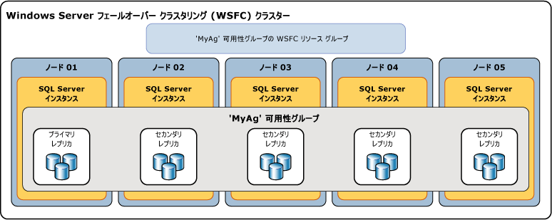

# AlwaysOn 可用性グループの概要 (SQL Server)
[!INCLUDE[appliesto-ss-xxxx-xxxx-xxx-md](../../../includes/appliesto-ss-xxxx-xxxx-xxx-md.md)]

 このトピックでは、 [!INCLUDE[ssHADR](../../../includes/sshadr-md.md)] の概念について説明します。これは、 [!INCLUDE[ssCurrent](../../../includes/sscurrent-md.md)]での 1 つ以上の可用性グループの構成と管理において重要です。 可用性グループの利点の要約および [!INCLUDE[ssHADR](../../../includes/sshadr-md.md)]用語の概要については、「[AlwaysOn 可用性グループ&#40;SQL Server&#41;](../../../database-engine/availability-groups/windows/always-on-availability-groups-sql-server.md)」をご覧ください。  
  
 *可用性グループ*は、*可用性データベース*として知られる、個別のユーザー データベース セットのための複製環境をサポートします。 高可用性 (HA) または読み取りスケールの可用性グループを作成できます。 HA グループは、共にフェールオーバーするデータベースのグループです。 読み取りスケール可用性グループは、読み取り専用ワークロードのために、SQL Server の他のインスタンスにコピーされるデータベースのグループです。 可用性グループは、プライマリ データベースの 1 セットをサポートし、1 ～ 8 セットの対応するセカンダリ データベースをサポートします。 セカンダリ データベースは、バックアップではあ*りません*。 継続してデータベースおよびそのトランザクション ログを定期的にバックアップします。  
  
> [!TIP]  
>  プライマリ データベースのバックアップの種類を作成できます。 または、セカンダリ データベースのログ バックアップとコピーのみの完全バックアップを作成できます。 詳細については、「[アクティブなセカンダリ:セカンダリ レプリカでのバックアップ &#40;Always On 可用性グループ&#41;](../../../database-engine/availability-groups/windows/active-secondaries-backup-on-secondary-replicas-always-on-availability-groups.md)」を参照してください。   

 可用性データベースの各セットは、 *可用性レプリカ*によりホストされます。 可用性レプリカには、2 つの種類があります。1 つは、単一の *プライマリ レプリカ*で、 プライマリ データベースをホストします。もう 1 種類は、1 ～ 8 つの *セカンダリ レプリカ*で、それぞれがセカンダリ データベースのセットをホストし、可用性グループの潜在的なフェールオーバー ターゲットとして機能します。 可用性グループは、可用性レプリカのレベルでフェールオーバーします。 可用性レプリカでは、データセット レベル (1 つの可用性グループのデータベースのセット) でのみ冗長性が提供されます。 データベースの問題 (たとえば、データ ファイルの損失やトランザクション ログの破損による障害が疑われる場合など) が発生してもフェールオーバーは行われません。  
  
 プライマリ レプリカは、クライアントからプライマリ データベースへの読み取り/書き込み接続を可能にします。 プライマリ レプリカは、各プライマリ データベースのトランザクション ログ レコードをすべてのセカンダリ データベースに送信します。 *データの同期*と呼ばれているこのプロセスはデータベース レベルで行われます。 すべてのセカンダリ レプリカは、トランザクション ログ レコードをキャッシュし (ログの*書き込み* )、それを対応するセカンダリ データベースに適用します。 データの同期は、プライマリ データベースと接続されているそれぞれのセカンダリ データベースとの間で、他のデータベースとは無関係に発生します。 したがって、セカンダリ データベースの中断や障害が発生した場合でも他のセカンダリ データベースはその影響を受けません。また、プライマリ データベースの中断や障害が発生した場合でも他のプライマリ データベースはその影響を受けません。  
  
 必要に応じて、1 つ以上のセカンダリ レプリカでセカンダリ データベースへの読み取り専用アクセスをサポートするように構成できます。また、任意のセカンダリ レプリカでセカンダリ データベースのバックアップを許容するように構成できます。  

 SQL Server 2017 では、可用性グループのために 2 つの異なるアーキテクチャが導入されています。 *Always On 可用性グループ*は、高可用性、ディザスター リカバリー、読み取りスケール分散を提供します。 これらの可用性グループでは、クラスター マネージャーが必要です。 Windows では、フェールオーバー クラスタリングがクラスター マネージャーを提供します。 Linux では、Pacemaker を使用できます。 その他のアーキテクチャは*読み取りスケール可用性グループ*です。 読み取りスケール可用性グループは、読み取り専用ワークロードのためのレプリカを提供しますが、高可用性は提供しません。 読み取りスケール可用性グループには、クラスター マネージャーがありません。 
 
 Windows の HA のために [!INCLUDE[ssHADR](../../../includes/sshadr-md.md)] を配置するには、Windows Server フェールオーバー クラスター (WSFC) が必要です。 指定された可用性グループの各可用性レプリカは、同一の WSFC の異なるノード上に存在する必要があります。 唯一の例外は、別の WSFC クラスターに移行するときに、可用性グループは一時的に 2 つのクラスターにまたがることができるという点です。 

 >[!NOTE]
 >Linux の可用性グループについては、[SQL Server on Linux の Always On 可用性グループ](../../../linux/sql-server-linux-availability-group-overview.md)に関するページを参照してください。 

 HA 構成では、作成されたすべての可用性グループに対してクラスター ロールが作成されます。 WSFC クラスターは、このロールを監視し、プライマリ レプリカの正常性を評価します。 [!INCLUDE[ssHADR](../../../includes/sshadr-md.md)] のクォーラムは、クラスター ノードが可用性レプリカをホストしているかどうかに関係なく、WSFC クラスター内のすべてのノードに基づきます。 データベース ミラーリングとは異なり、 [!INCLUDE[ssHADR](../../../includes/sshadr-md.md)]には監視ロールはありません。  
  
> [!NOTE]  
>  SQL Server AlwaysOn コンポーネントと WSFC クラスターとの関係については、「[Windows Server フェールオーバー クラスタリング &#40;WSFC&#41; と SQL Server](../../../sql-server/failover-clusters/windows/windows-server-failover-clustering-wsfc-with-sql-server.md)」をご覧ください。  
  
 次の図は、1 つのプライマリ レプリカと 4 つのセカンダリ レプリカを含む可用性グループを示しています。 最大 8 つのセカンダリ レプリカ (1 つのプライマリ レプリカと 2 つの同期コミット セカンダリ レプリカ) がサポートされています。  
  
   
  
##   Availability Databases  
 可用性グループに追加するデータベースは、オンラインの読み取り/書き込みデータベースであることが必要であり、プライマリ レプリカをホストするサーバー インスタンスに置かれている必要があります。 追加されたデータベースは、プライマリ データベースとして可用性グループに参加しますが、引き続きクライアントから使用できます。 新しいプライマリ データベースのバックアップが、セカンダリ レプリカをホストするサーバー インスタンスに復元されない限り (RESTORE WITH NORECOVERY を使用します)、対応するセカンダリ データベースは存在しません。 新しいセカンダリ データベースは、可用性グループに参加するまでは RESTORING 状態です。 詳細については、「 [AlwaysOn セカンダリ データベース上のデータ移動の開始 &#40;SQL Server&#41;](../../../database-engine/availability-groups/windows/start-data-movement-on-an-always-on-secondary-database-sql-server.md)」を参照してください。  
  
 可用性グループに参加すると、セカンダリ データベースは ONLINE 状態になり、対応するプライマリ データベースとのデータ同期が開始されます。 *データ同期* は、プライマリ データベースへの変更をセカンダリ データベースに再現するプロセスです。 データ同期では、プライマリ データベースがトランザクション ログ レコードをセカンダリ データベースに送信します。  
  
> [!IMPORTANT]  
>  可用性データベースは、 *、PowerShell、および SQL Server 管理オブジェクト (SMO) の名前では、* データベース レプリカ [!INCLUDE[tsql](../../../includes/tsql-md.md)]と呼ばれることがあります。 たとえば、可用性データベースに関する情報を返す AlwaysOn 動的管理ビューの名前では、  **sys.dm_hadr_database_replica_states** や **sys.dm_hadr_database_replica_cluster_states**のように、"データベース レプリカ (database replica)" という語が使用されています。 ただし、SQL Server オンライン ブックでは、"レプリカ" という用語は一般に可用性レプリカを指します。 たとえば、"プライマリ レプリカ" と "セカンダリ レプリカ" は、常に可用性レプリカを指します。  
  
##   可用性レプリカ  
 各可用性グループは、可用性レプリカと呼ばれる 2 つ以上のフェールオーバー パートナーを定義します。 *可用性レプリカ* は、可用性グループのコンポーネントです。 各可用性レプリカは、可用性グループ内の可用性データベースのコピーをホストします。 各可用性グループで、個々の可用性レプリカは、1 つの WSFC クラスターの別々のノード上に存在する [!INCLUDE[ssNoVersion](../../../includes/ssnoversion-md.md)] の個々のインスタンスによってホストされる必要があります。 これらのサーバー インスタンスそれぞれで、AlwaysOn を有効にする必要があります。  
  
 指定したインスタンスで、1 つの可用性グループにつき 1 つだけ可用性レプリカをホストすることができます。 ただし、各インスタンスを多数の可用性グループに使用することはできます。 指定したインスタンスは、スタンドアロン インスタンスまたは [!INCLUDE[ssNoVersion](../../../includes/ssnoversion-md.md)] フェールオーバー クラスター インスタンス (FCI) として使用できます。 サーバー レベルの冗長性が必要な場合は、フェールオーバー クラスター インスタンスを使用します。  
  
 すべての可用性レプリカには、初期ロールとして、*プライマリ ロール*または*セカンダリ ロール*が割り当てられています。これが、レプリカの可用性データベースによって継承されます。 指定されたレプリカのロールにより、読み取り/書き込みデータベースと読み取り専用のデータベースのどちらがホストされるかが決定されます。 *プライマリ レプリカ*と呼ばれる 1 つのレプリカには、プライマリ ロールが割り当てられ、 *プライマリ データベース*と呼ばれる読み取り/書き込みデータベースをホストします。 それ以外の 1 つ以上のレプリカは *セカンダリ レプリカ*と呼ばれ、セカンダリ ロールが割り当てられます。 セカンダリ レプリカは、セカンダリ データベースと呼ばれる読み取り専用のデータベースをホストします。  
  
> [!NOTE]  
>  フェールオーバー中など、可用性レプリカのロールが不確定である場合、そのデータベースは一時的に NOT SYNCHRONIZING 状態になります。 可用性レプリカのロールが解決されるまで、それらのロールは RESOLVING に設定されます。 可用性レプリカがプライマリ ロールに解決された場合、そのデータベースはプライマリ データベースになります。 可用性レプリカがセカンダリ ロールに解決された場合、そのデータベースはセカンダリ データベースになります。  
  
##   可用性モード  
 可用性モードは、各可用性レプリカのプロパティです。 可用性モードによって、特定のセカンダリ レプリカがディスクにトランザクション ログ レコードを書き込む (ログ書き込み) まで、プライマリ レプリカによるデータベースへのトランザクションのコミットを待機するかどうかが決定されます。 [!INCLUDE[ssHADR](../../../includes/sshadr-md.md)] は、*非同期コミット モード*と*同期コミット モード*という 2 種類の可用性モードをサポートします。  
  
-   **Asynchronous-commit mode**  
  
     この可用性モードを使用する可用性レプリカは、*非同期コミット レプリカ*と呼ばれます。 非同期コミット モードでは、非同期コミット セカンダリ レプリカによりログが書き込まれことが確認されるまで待機せずに、プライマリ レプリカがトランザクションをコミットします。 非同期コミット モードでは、セカンダリ データベースでのトランザクションの遅延が最小になりますが、セカンダリ データベースがプライマリ データベースよりも遅延する場合があるため、一部のデータが失われる可能性があります。  
  
-   **Synchronous-commit mode**  
  
     この可用性モードを使用する可用性レプリカは、 *同期コミット レプリカ*と呼ばれます。 同期コミット モードの場合、同期コミット プライマリ レプリカは、同期コミット セカンダリ レプリカによるログ書き込みが確認されるまで待機した後で、トランザクションをコミットします。 同期コミット モードでは、特定のセカンダリ データベースがプライマリ データベースに 1 回同期されれば、コミットされたトランザクションが完全に保護されることが保証されます。 この保護の欠点は、トランザクションの遅延が増加することです。  
  
 詳細については、「[可用性モード &#40;Always On 可用性グループ&#41;](../../../database-engine/availability-groups/windows/availability-modes-always-on-availability-groups.md)」を参照してください。  
  
##   フェールオーバーの種類  
 プライマリ レプリカとセカンダリ レプリカとのセッションのコンテキスト内で、プライマリ ロールとセカンダリ ロールが *フェールオーバー*と呼ばれるプロセスで交換されることがあります。 フェールオーバー中に、対象のセカンダリ レプリカがプライマリ ロールに移行し、新しいプライマリ レプリカになります。 新しいプライマリ レプリカのデータベースがプライマリ データベースとしてオンラインになります。クライアント アプリケーションから、これらのデータベースに接続できるようになります。 元のプライマリ レプリカは使用可能になるとセカンダリ ロールに移行し、セカンダリ レプリカになります 元のプライマリ データベースはセカンダリ データベースになり、データ同期が再開されます。  
  
 フェールオーバーには、自動、手動、および強制 (データ損失の可能性あり) という 3 つの形式があります。 特定のセカンダリ レプリカでサポートされるフェールオーバーの形式は、可用性モードによって決まります。同期コミット モードでは、プライマリ レプリカのフェールオーバー モードおよび対象のセカンダリ レプリカによって決まります。次に例を示します。  
  
-   同期コミット モードでは、対象のセカンダリ レプリカが現在、プライマリ レプリカと同期されている場合、*計画的な手動フェールオーバー* と*自動フェールオーバー* という 2 つの形式のフェールオーバーがサポートされます。 これらのフェールオーバーの形式のサポートは、フェールオーバー パートナーの *フェールオーバー モード プロパティ* の設定によって決まります。 プライマリ レプリカとセカンダリ レプリカのどちらかのフェールオーバー モードが "手動" に設定されている場合、そのセカンダリ レプリカに対しては手動フェールオーバーのみがサポートされます。 プライマリ レプリカとセカンダリ レプリカのどちらのフェールオーバー モードも "自動" に設定されている場合、そのセカンダリ レプリカでは自動フェールオーバーと手動フェールオーバーの両方がサポートされます。  
  
    -   **計画的な手動フェールオーバー** (データ損失なし)  
  
         データベース管理者がフェールオーバー コマンドを発行した後に手動フェールオーバーが開始され、同期されたセカンダリ レプリカがプライマリ ロールに移行し (データ保護の保証あり)、プライマリ レプリカはセカンダリ ロールに移行します。 手動フェールオーバーには、プライマリ レプリカと対象のセカンダリ レプリカの両方が同期コミット モードで実行されていることが必要です。また、セカンダリ レプリカが既に同期されている必要があります。  
  
    -   **自動フェールオーバー** (データ損失なし)  
  
         エラーが発生すると、自動フェールオーバーが開始されて、同期されたセカンダリ レプリカがプライマリ ロールに移行します (データ保護が保証されます)。 元のプライマリ レプリカは、使用可能になるとセカンダリ ロールに移行します。 自動フェールオーバーでは、プライマリ レプリカと対象のセカンダリ レプリカの両方が同期コミット モードで実行されていることが必要です。また、フェールオーバー モードが "自動" に設定されている必要があります。 さらに、セカンダリ レプリカが既に同期され、WSFC クォーラムを持ち、可用性グループの [柔軟なフェールオーバー ポリシー](../../../database-engine/availability-groups/windows/flexible-automatic-failover-policy-availability-group.md)で指定された条件を満たしている必要があります。  
  
        > [!IMPORTANT]  
        >  SQL Server フェールオーバー クラスター インスタンス (FCI) は可用性グループによる自動フェールオーバーをサポートしないため、FCI によってホストされる可用性レプリカは手動フェールオーバー用にのみ構成できます。  
  
    > [!NOTE]  
    >  同期されたセカンダリ レプリカ上で強制フェールオーバー コマンドを発行した場合、セカンダリ レプリカは計画された手動フェールオーバーの場合と同様に動作します。  
  
-   非同期コミット モードで使用されるフェールオーバーは、 *強制フェールオーバー*と通常呼ばれる強制手動フェールオーバーのみです (データ損失の可能性あり)。 強制フェールオーバーは手動のみで開始できるため、手動フェールオーバーの一種と見なされます。 強制フェールオーバーは、障害復旧オプションです。 対象のセカンダリ レプリカがプライマリ レプリカに同期されない場合に使用できる唯一のフェールオーバー形式です。  
  
 詳細については、「 [フェールオーバーとフェールオーバー モード &#40;AlwaysOn 可用性グループ&#41;](../../../database-engine/availability-groups/windows/failover-and-failover-modes-always-on-availability-groups.md)、または PowerShell を使用して、AlwaysOn 可用性グループ上で計画的な手動フェールオーバーまたは強制手動フェールオーバー (強制フェールオーバー) を実行する方法について説明します。  
  
##   クライアント接続  
 可用性グループ リスナーを作成することによって、特定の可用性グループのプライマリ レプリカへのクライアント接続を提供できます。 *可用性グループ リスナー* には、クライアント接続を適切な可用性レプリカに送るために特定の可用性グループにアタッチされる一連のリソースが用意されています。  
  
 可用性グループ リスナーは、仮想ネットワーク名 (VNN) として機能する一意の DNS 名、1 つ以上の仮想 IP アドレス (VIP)、および TCP ポート番号に関連付けられています。 詳細については、「 [可用性グループ リスナー、クライアント接続、およびアプリケーションのフェールオーバー &#40;SQL Server&#41;](../../../database-engine/availability-groups/windows/listeners-client-connectivity-application-failover.md)での 1 つ以上の可用性グループの構成と管理において重要です。  
  
> [!TIP]  
>  可用性グループに 2 つしか可用性レプリカが存在せず、なおかつ、その可用性グループが、セカンダリ レプリカへの読み取りアクセスを許可する設定になっていない場合、クライアントは、 [データベース ミラーリングの接続文字列](../../../database-engine/database-mirroring/connect-clients-to-a-database-mirroring-session-sql-server.md)を使用してプライマリ レプリカに接続できます。 この方法は、データベースをデータベース ミラーリングから [!INCLUDE[ssHADR](../../../includes/sshadr-md.md)]に移行した後で、一時的に役に立つ場合があります。 他のセカンダリ レプリカを追加する前に、可用性グループの可用性グループ リスナーを作成し、そのリスナーのネットワーク名を使用するようにアプリケーションを更新する必要があります。  
  
##   アクティブなセカンダリ レプリカ  
 [!INCLUDE[ssHADR](../../../includes/sshadr-md.md)] は、アクティブなセカンダリ レプリカをサポートします。 アクティブなセカンダリ機能では以下をサポートしています。  
  
-   **セカンダリ レプリカでのバックアップ操作の実行**  
  
     セカンダリ レプリカでは、ログ バックアップと、データベース全体、ファイル、またはファイル グループの [コピーのみの](../../../database-engine/availability-groups/windows/active-secondaries-backup-on-secondary-replicas-always-on-availability-groups.md) バックアップを実行できます。 可用性グループを構成して、バックアップを実行する優先順位を指定できます。 優先順位は SQL Server によって適用されるものではないので、アドホック バックアップには影響がないことを理解しておくことが重要です。 この優先順位の解釈は、特定の可用性グループの各データベースに対するバックアップ ジョブのスクリプトでのロジックに依存します (ある場合)。 同じ可用性グループ内の個々の可用性レプリカで実行されるバックアップの優先順位を指定できます。 詳細については、「[アクティブなセカンダリ:セカンダリ レプリカでのバックアップ &#40;Always On 可用性グループ&#41;](../../../database-engine/availability-groups/windows/active-secondaries-backup-on-secondary-replicas-always-on-availability-groups.md)」を参照してください。  
  
-   **1 つ以上のセカンダリ レプリカへの読み取り専用アクセス (読み取り可能なセカンダリ レプリカ)**  
  
     ローカル データベースへの読み取り専用アクセスのみを許可するようにセカンダリ可用性レプリカを構成できます (ただし、一部の操作は完全にはサポートされていません)。 これにより、セカンダリ レプリカへの読み取り/書き込み接続を試行できなくなります。 読み取り/書き込みアクセスのみを許可することで、_プライマリ_ レプリカに対する読み取り専用ワークロードを防止することもできます。 これにより、プライマリ レプリカに対して読み取り専用接続が行われなくなります。 詳細については、「[アクティブなセカンダリ:読み取り可能なセカンダリ レプリカ &#40;Always On 可用性グループ&#41;](../../../database-engine/availability-groups/windows/active-secondaries-readable-secondary-replicas-always-on-availability-groups.md)」を参照してください。  
  
     可用性グループに、現在、可用性グループ リスナーと 1 つ以上の読み取り可能なセカンダリ レプリカが存在する場合、 [!INCLUDE[ssNoVersion](../../../includes/ssnoversion-md.md)] は読み取りを目的とした接続要求をそれらのいずれかにルーティングできます (*読み取り専用ルーティング*)。 詳細については、「 [可用性グループ リスナー、クライアント接続、およびアプリケーションのフェールオーバー &#40;SQL Server&#41;](../../../database-engine/availability-groups/windows/listeners-client-connectivity-application-failover.md)での 1 つ以上の可用性グループの構成と管理において重要です。  
  
##   セッション タイムアウト期間  
 セッション タイムアウト期間は、可用性レプリカのプロパティで、他の可用性レプリカとの接続を閉じるまでに非アクティブに保持できる時間を決定します。 プライマリ レプリカとセカンダリ レプリカは、アクティブであることを通知するために互いに ping を実行します。 他のレプリカからタイムアウト期間内に ping を受信した場合は、その接続がまだ開いており、サーバー インスタンスが通信していることを示します。 可用性レプリカは、ping を受信すると、接続のセッション タイムアウト カウンターをリセットします。  
  
 セッション タイムアウト期間を設定することにより、相手レプリカからの ping を受信するまで無期限に待機することがなくなります。 セッション タイムアウト期間中に相手のレプリカから ping を受信しなかった場合、レプリカはタイムアウトします。レプリカの接続は閉じられ、タイムアウトしたレプリカは DISCONNECTED 状態になります。 切断されたレプリカが同期コミット モード用に構成されている場合でも、トランザクションは、そのレプリカが再接続および再同期するのを待機しません。  
  
 各可用性レプリカの既定のセッション タイムアウト期間は 10 秒です。 この値はユーザーが構成でき、最小値は 5 秒です。 通常は、タイムアウト期間を 10 秒以上にしておくことをお勧めします。 値を 10 秒未満に設定すると、負荷の高いシステムで誤認エラーが示される可能性があります。  
  
> [!NOTE]  
>  解決中のロールでは、ping が発生しないため、セッション タイムアウト期間は適用されません。  
  
##   ページの自動修復  
 各可用性レプリカでは、ローカル データベースに破損ページがあると、データ ページの読み取りを妨げるエラーを解決して自動的に復旧しようとします。 セカンダリ レプリカがページを読み取ることができない場合、プライマリ レプリカに対してページの新しいコピーを要求します。 プライマリ レプリカがページを読み取ることができない場合、すべてのセカンダリ レプリカに新しいコピーの要求をブロードキャストし、最初に応答したレプリカからページを取得します。 要求が受け入れられ、新しいコピーを取得できた場合は、読み取り不可能なページがそのコピーに置き換えられます。通常、これによりエラーは解決します。  
  
 詳細については、「[ページの自動修復 &#40;可用性グループ:データベース ミラーリング&#41;](../../../sql-server/failover-clusters/automatic-page-repair-availability-groups-database-mirroring.md)」を参照してください。  
  
##   関連タスク  
  
-   [Always On 可用性グループの概要 &#40;SQL Server&#41;](../../../database-engine/availability-groups/windows/getting-started-with-always-on-availability-groups-sql-server.md)  
  
##   関連コンテンツ  
  
-   **ブログ:**  
  
     [Always On - HADRON 学習シリーズ:HADRON 対応データベースでのワーカー プールの使用](https://blogs.msdn.com/b/psssql/archive/2012/05/17/Always%20On-hadron-learning-series-worker-pool-usage-for-hadron-enabled-databases.aspx)  
  
     [SQL Server Always On チーム ブログ:SQL Server Always On チームのオフィシャル ブログ](https://blogs.msdn.microsoft.com/sqlalwayson/)  
  
     [CSS SQL Server エンジニアのブログ](https://blogs.msdn.com/b/psssql/)  
  
-   **ビデオ:**  
  
     [Microsoft SQL Server コードネーム "Denali" Always On シリーズ パート 1: 次世代高可用性ソリューションの概要](https://channel9.msdn.com/Events/TechEd/NorthAmerica/2011/DBI302)  
  
     [Microsoft SQL Server コードネーム "Denali" Always On シリーズ パート 2: Always On を使用したミッション クリティカルな高可用性ソリューションの構築](https://channel9.msdn.com/Events/TechEd/NorthAmerica/2011/DBI404)  
  
-   **ホワイト ペーパー:**  
  
     [高可用性と災害復旧のための Microsoft SQL Server AlwaysOn ソリューション ガイド](https://go.microsoft.com/fwlink/?LinkId=227600)  
  
     [SQL Server 2012 に関する Microsoft ホワイト ペーパー](https://msdn.microsoft.com/library/hh403491.aspx)  
  
     [SQL Server ユーザー諮問チームのホワイト ペーパー](https://techcommunity.microsoft.com/t5/DataCAT/bg-p/DataCAT/)  
  
## 参照  
 [可用性モード &#40;AlwaysOn 可用性グループ&#41;](../../../database-engine/availability-groups/windows/availability-modes-always-on-availability-groups.md)   
 [フェールオーバーとフェールオーバー モード &#40;AlwaysOn 可用性グループ&#41;](../../../database-engine/availability-groups/windows/failover-and-failover-modes-always-on-availability-groups.md)   
 [Always On 可用性グループの Transact-SQL ステートメントの概要 &#40;SQL Server&#41;](../../../database-engine/availability-groups/windows/transact-sql-statements-for-always-on-availability-groups.md)   
 [Always On 可用性グループの PowerShell コマンドレットの概要 &#40;SQL Server&#41;](../../../database-engine/availability-groups/windows/overview-of-powershell-cmdlets-for-always-on-availability-groups-sql-server.md)   
 [インメモリ OLTP データベースにおける高可用性のサポート](../../../relational-databases/in-memory-oltp/high-availability-support-for-in-memory-oltp-databases.md)   
 [AlwaysOn 可用性グループの前提条件、制限事項、および推奨事項 &#40;SQL Server&#41;](../../../database-engine/availability-groups/windows/prereqs-restrictions-recommendations-always-on-availability.md)   
 [可用性グループの作成と構成 &#40;SQL Server&#41;](../../../database-engine/availability-groups/windows/creation-and-configuration-of-availability-groups-sql-server.md)   
 [アクティブなセカンダリ:読み取り可能なセカンダリ レプリカ &#40;Always On 可用性グループ&#41;](../../../database-engine/availability-groups/windows/active-secondaries-readable-secondary-replicas-always-on-availability-groups.md)   
 [アクティブなセカンダリ:セカンダリ レプリカでのバックアップ &#40;Always On 可用性グループ&#41;](../../../database-engine/availability-groups/windows/active-secondaries-backup-on-secondary-replicas-always-on-availability-groups.md)   
 [可用性グループ リスナー、クライアント接続、およびアプリケーションのフェールオーバー &#40;SQL Server&#41;](../../../database-engine/availability-groups/windows/listeners-client-connectivity-application-failover.md)  
  
   
