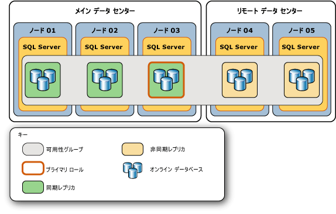
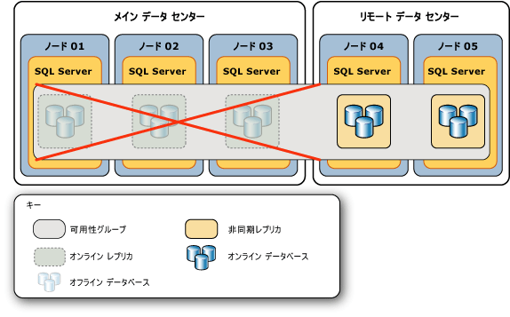
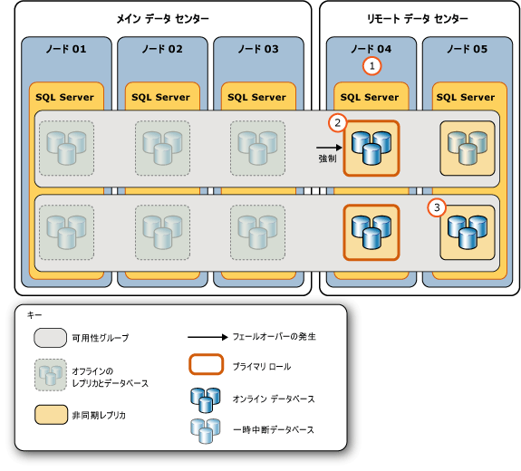
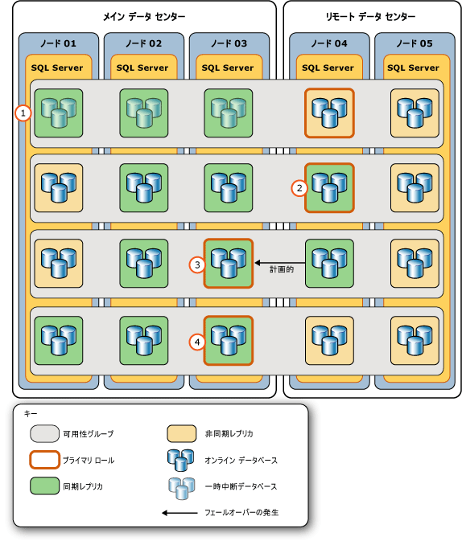

# <a name="perform-a-forced-manual-failover-of-an-always-on-availability-group-sql-server"></a>Always On 可用性グループの強制手動フェールオーバーの実行 (SQL Server)
[!INCLUDE[appliesto-ss-xxxx-xxxx-xxx-md](../../../includes/appliesto-ss-xxxx-xxxx-xxx-md.md)]
  このトピックでは、 [!INCLUDE[ssManStudioFull](../../../includes/ssmanstudiofull-md.md)]、 [!INCLUDE[tsql](../../../includes/tsql-md.md)]、または [!INCLUDE[ssCurrent](../../../includes/sscurrent-md.md)]の PowerShell を使用して、AlwaysOn 可用性グループに対する強制フェールオーバー (データ損失の可能性あり) を実行する方法について説明します。 強制フェールオーバーは、[計画的な手動フェールオーバー](../../../database-engine/availability-groups/windows/perform-a-planned-manual-failover-of-an-availability-group-sql-server.md)を実行できない場合に、ディザスター リカバリーのみを目的として実行する手動フェールオーバーです。 非同期のセカンダリ レプリカに対して強制フェールオーバーを実行した場合、データ損失の可能性があります。 したがって、強制フェールオーバーは、データ損失のリスクを引き受けたうえで、可用性グループに対するサービスを直ちに復旧する必要がある場合のみ実行することを強くお勧めします。  
  
 強制フェールオーバーの実行後、可用性グループのフェールオーバー先であるフェールオーバー ターゲットが新しいプライマリ レプリカになります。 残りのセカンダリ レプリカ内のセカンダリ データベースは中断され、手動で再開する必要があります。 元のプライマリ レプリカは、使用可能になったときにセカンダリ ロールに移行し、元のプライマリ データベースがセカンダリ データベースになり、SUSPENDED 状態に移行します。 特定のセカンダリ データベースを再開する前に、そのデータベースから失われたデータを復元できる場合があります。 ただし、プライマリ データベースでは、いずれかのセカンダリ データベースが中断している間、トランザクション ログの切り捨てが遅延されることに注意してください。  
  
> [!IMPORTANT]  
>  セカンダリ データベースが再開されるまでは、プライマリ データベースとのデータ同期は実行されません。 セカンダリ データベースの再開の詳細については、この記事の後半にある「[補足情報: 強制フェールオーバー後の必須タスク](#FollowUp)」を参照してください。  
  
 強制フェールオーバーは、次のような緊急事態が発生した場合に実行する必要があります。  
  
-   WSFC クラスターに対してクォーラムを強制した後 ( *"強制クォーラム"* )、各可用性グループに対して強制フェールオーバーを実行する必要があります (このとき、データ損失の可能性もあります)。 強制フェールオーバーが必要なのは、WSFC クラスター値の実際の状態が失われている可能性があるためです。 ただし、強制クォーラムを実行する前にプライマリ レプリカであったレプリカをホストしていたサーバー インスタンスで強制フェールオーバーを実行できる場合、または強制クォーラムを実行する前に同期されていたセカンダリ レプリカに対してフェールオーバーを実行できる場合は、データ損失を回避できます。 詳細については、このトピックの「 [クォーラム強制後のデータ損失を回避できる方法](#WaysToAvoidDataLoss)」を参照してください。  
  
    > [!IMPORTANT]  
    >  クォーラムが強制ではなく通常の方法で再取得される場合、可用性レプリカは通常の方法で復元されます。 クォーラムの再取得後にプライマリ レプリカがまだ使用できない場合は、同期セカンダリ レプリカに対して計画的な手動フェールオーバーを実行できます。  
  
     強制フォーラムの詳細については、「 [WSFC の強制クォーラムによる災害復旧 &#40;SQL Server&#41;](../../../sql-server/failover-clusters/windows/wsfc-disaster-recovery-through-forced-quorum-sql-server.md)の PowerShell を使用して、AlwaysOn 可用性グループに対する強制フェールオーバー (データ損失の可能性あり) を実行する方法について説明します。 強制フォーラム後に強制フェールオーバーが必要な理由については、「 [フェールオーバーとフェールオーバー モード &#40;AlwaysOn 可用性グループ&#41;](../../../database-engine/availability-groups/windows/failover-and-failover-modes-always-on-availability-groups.md)の PowerShell を使用して、AlwaysOn 可用性グループに対する強制フェールオーバー (データ損失の可能性あり) を実行する方法について説明します。  
  
-   WSFC クラスターに正常なクォーラムがあるときにプライマリ レプリカが使用不能になった場合は、ロールが SECONDARY または RESOLVING 状態である任意のレプリカに、強制フェールオーバー (データ損失の可能性あり) を実行できます。 可能であれば、プライマリ レプリカが失われたときに同期されていた、同期コミット セカンダリ レプリカへの強制フェールオーバーを実行します。  
  
    > [!TIP]  
    >  WSFC クラスターに正常なクォーラムがあるときに、同期セカンダリ レプリカで強制フェールオーバー コマンドを発行した場合、レプリカが実際に実行するのは、計画的な手動フェールオーバーです。  
  
> [!NOTE]  
>  フェールオーバーを強制する場合の前提条件と推奨事項の詳細、および強制フェールオーバーを使用して重大なエラーから復旧するシナリオの例については、この記事の後半にある「[サンプル シナリオ: 重大なエラーから復旧するための強制フェールオーバーの使用](../../../database-engine/availability-groups/windows/perform-a-forced-manual-failover-of-an-availability-group-sql-server.md#ExampleRecoveryFromCatastrophy)」を参照してください。  
  
  
##  <a name="Restrictions"></a> 制限事項と制約事項  
  
-   強制フェールオーバーは、Windows server フェールオーバー クラスタリング (WSFC) にクォーラムが存在しない場合のみ実行できません。  
  
-   可用性グループの強制フェールオーバー中にはデータ損失の可能性があります。 さらに、強制フェールオーバーを開始したときにプライマリ レプリカが実行されている場合は、クライアントがまだ元のプライマリ データベースに接続している可能性があります。 したがって、プライマリ レプリカが動作しておらず、データ損失のリスクを許容できる場合にのみ、可用性グループのデータベースへのアクセスを復旧するために強制フェールオーバーを実行することを強くお勧めします。  
  
-   セカンダリ データベースが REVERTING または INITIALIZING 状態の場合、強制フェールオーバーを実行すると、そのデータベースはプライマリ データベースとして起動できなくなります。 データベースが INTIAILIZGING 状態だった場合は、欠落しているログ レコードをデータベース バックアップから適用するか、データベースを最初から完全に復元する必要があります。 データベースが REVERTING 状態だった場合は、データベースをバックアップから完全に復元する必要があります。  
  
-   フェールオーバー コマンドは、フェールオーバー ターゲットがコマンドを受け入れた直後に戻ります。 ただし、データベースの復旧は、可用性グループがフェールオーバーを完了した後に非同期で行われます。  
  
-   フェールオーバー時に、可用性グループ内のデータベース間の一貫性が維持されない場合があります。  
  
    > [!NOTE]  
    >  複数のデータベースにまたがるトランザクションと分散トランザクションのサポートは、SQL Server とオペレーティング システムのバージョンによって異なります。 詳細については、「[Always On 可用性グループとデータベース ミラーリングでの複数データベースにまたがるトランザクションと分散トランザクション &#40;SQL Server&#41;](../../../database-engine/availability-groups/windows/transactions-always-on-availability-and-database-mirroring.md)」を参照してください。  
  
##  <a name="Prerequisites"></a> 前提条件  
  
-   WSFC クラスターにクォーラムがあること。 クラスターにクォーラムが存在しない場合は、「 [WSFC の強制クォーラムによる災害復旧 &#40;SQL Server&#41;](../../../sql-server/failover-clusters/windows/wsfc-disaster-recovery-through-forced-quorum-sql-server.md)の PowerShell を使用して、AlwaysOn 可用性グループに対する強制フェールオーバー (データ損失の可能性あり) を実行する方法について説明します。  
  
-   ロールが SECONDARY または RESOLVING 状態であるレプリカをホストするサーバー インスタンスに接続できる必要があります。  
  
##  <a name="Recommendations"></a> 推奨事項  
  
-   プライマリ レプリカが実行中である間は、強制フェールオーバーを実行しないでください。  
  
-   可能な場合は、セカンダリ データベースが NOT SYNCHRONIZED、SYNCHRONIZED、SYNCHRONIZING のいずれかの状態であるセカンダリ レプリカにのみ、強制フェールオーバーを実行します。 セカンダリ データベースが INTIAILIZGING または REVERTING 状態の場合の強制フェールオーバーの影響については、このトピックの「 [制限事項と制約事項](#Restrictions)」を参照してください。  
  
-   通常は、特定のセカンダリ データベースの待機時間は、プライマリ データベースに比べて、別の非同期コミット セカンダリ レプリカでも同じくらいになります。 ただし、強制フェールオーバーを行う場合は、データ損失が重要な問題になります。 そのため、異なるセカンダリ レプリカ上でのデータベースのコピーに関する相対的な待機時間を検討するようにしてください。 特定のセカンダリ データベースのどのコピーが最小の待機時間かを判断するには、ログの最後の LSN を比較します。 ログの最後の LSN の値が大きいほど、待機時間が小さいことを示します。  
  
    > [!TIP]  
    >  ログの最後の LSN の値を比較するには、それぞれのオンライン セカンダリ レプリカに接続し、 [sys.dm_hadr_database_replica_states](../../../relational-databases/system-dynamic-management-views/sys-dm-hadr-database-replica-states-transact-sql.md) に対して各ローカル セカンダリ データベースの **end_of_log_lsn** 値を照会します。 次に、各データベースの異なるコピーで、ログの最後の LSN を比較します。 データベースによって、LSN の値が最も大きいセカンダリ レプリカが異なる場合もあることに注意してください。 この場合、最も適切なフェールオーバー ターゲットは、各データベース内のデータの相対的な重要度によって決まります。 つまり、どのデータベースでのデータ損失の可能性を最小限に抑えたいか、という問題になります。  
  
-   クライアントが元のプライマリに接続できる場合は、強制フェールオーバーによってスプリット ブレイン動作のリスクが発生します。 強制フェールオーバーを実行する前に、クライアントが元のプライマリ レプリカにアクセスできないようにすることを強くお勧めします。 そうしないと、強制フェールオーバーの実行後に元のプライマリ データベースと現在のプライマリ データベースがそれぞれ、他方とは無関係に更新されることがあります。  
  
##  <a name="WaysToAvoidDataLoss"></a> クォーラム強制後のデータ損失を回避できる方法  
 クォーラムが失われた後のエラー状態中は、以下に示すように、データ損失を回避できます。  
  
-   **元のプライマリ レプリカがオンラインになる場合**  
  
     クォーラムが失われ、WSFC クォーラムの強制によって可用性グループのプライマリ レプリカをホストするクラスター ノードが復元される場合は、その可用性グループのデータ損失を回避できます。 プライマリ レプリカに接続し、強制フェールオーバー (FAILOVER_ALLOW_DATA_LOSS) を実行します。 これにより、プライマリ レプリカがオンラインに戻ります。 元のプライマリ レプリカへの強制フェールオーバーを実行するため、データ損失は起こりません。  
  
-   **同期コミット セカンダリ レプリカがオンラインになる場合**  
  
     クォーラムが失われ、WSFC クォーラムの強制によって可用性グループの同期セカンダリ レプリカをホストするクラスター ノードが復元される場合は、その可用性グループのデータ損失を回避できます。 復元されるノードが、クォーラムの消失時に起動していた場合は、 **sys.dm_hadr_database_replica_cluster_states** 動的管理ビューの [is_failover_ready](../../../relational-databases/system-dynamic-management-views/sys-dm-hadr-database-replica-cluster-states-transact-sql.md) 列を照会することで、特定のデータベースでデータ損失が発生した可能性があるかどうかを確認できます。 たとえば、 `sql108w2k8r22`という名前のサーバー インスタンスに対して、次のクエリを発行します。  
  
    ```  
    SELECT * FROM sys.dm_hadr_database_replica_cluster_states  
       WHERE replica_id=(SELECT replica_id FROM sys.availability_replicas   
          WHERE replica_server_name ='sql108w2k8r22')  
    ```  
  
    > [!CAUTION]  
    >  復元されるノードがクォーラムの消失時に起動していなかった場合、 **is_failover_ready** は、プライマリ レプリカがオフラインになった時点のクラスターの実際の状態を反映していない可能性があります。 したがって、 **is_failover_ready** 値は、エラー発生時のホスト ノードにのみ有効です。 詳細については、「 [フェールオーバーとフェールオーバー モード &#40;AlwaysOn 可用性グループ&#41;](../../../database-engine/availability-groups/windows/failover-and-failover-modes-always-on-availability-groups.md)の PowerShell を使用して、AlwaysOn 可用性グループに対する強制フェールオーバー (データ損失の可能性あり) を実行する方法について説明します。  
  
     **is_failover_ready** = 1 の場合、データベースはクラスター内で同期済みとマークされ、フェールオーバーの準備ができています。 特定のセカンダリ レプリカのすべてのデータベースで **is_failover_ready** = 1 の場合は、そのセカンダリ レプリカに対して、データ損失なしで強制フェールオーバー (FORCE_FAILOVER_ALLOW_DATA_LOSS) を実行できます。 同期セカンダリ レプリカは、すべてのデータを保持したまま、新しいプライマリ レプリカとしてプライマリ ロールでオンラインになります。  
  
     **is_failover_ready** = 0 の場合、データベースはクラスター内で同期済みとマークされておらず、計画的な手動フェールオーバーの準備が *"できていません"* 。 ホスト セカンダリ レプリカに対して強制フェールオーバーを実行した場合、そのデータベースのデータは失われます。  
  
    > [!NOTE]  
    >  セカンダリ レプリカに対して強制フェールオーバーを実行する場合、データ損失の量は、フェールオーバー ターゲットがどの程度プライマリ レプリカより遅れているかによって決まります。 残念ながら、WSFC クラスターにクォーラムが存在しない、またはクォーラムが強制されている場合は、失われる可能性があるデータの量を評価できません。 ただし、WSFC クラスターが正常なクォーラムを再取得した後、データ損失の可能性を追跡できます。 詳細については、「 [フェールオーバーとフェールオーバー モード &#40;AlwaysOn 可用性グループ&#41;](../../../database-engine/availability-groups/windows/failover-and-failover-modes-always-on-availability-groups.md)の PowerShell を使用して、AlwaysOn 可用性グループに対する強制フェールオーバー (データ損失の可能性あり) を実行する方法について説明します。  
  
  
##  <a name="Permissions"></a> Permissions  
 可用性グループの ALTER AVAILABILITY GROUP 権限、CONTROL AVAILABILITY GROUP 権限、ALTER ANY AVAILABILITY GROUP 権限、または CONTROL SERVER 権限が必要です。  
  
##  <a name="SSMSProcedure"></a> SQL Server Management Studio の使用  
 **強制フェールオーバー (データ損失の可能性あり) を実行するには**  
  
1.  オブジェクト エクスプローラーで、フェールオーバーを行う必要がある可用性グループでロールが SECONDARY または RESOLVING 状態であるレプリカをホストするサーバー インスタンスに接続し、サーバー ツリーを展開します。  
  
2.  **[AlwaysOn 高可用性]** ノードと **[可用性グループ]** ノードを展開します。  
  
3.  フェールオーバーする [可用性グループ] ノードを右クリックし、 **[フェールオーバー]** を選択します。  
  
4.  可用性グループのフェールオーバー ウィザードが起動します。 詳細については、「[可用性グループのフェールオーバー ウィザードの使用 &#40;SQL Server Management Studio&#41;](../../../database-engine/availability-groups/windows/use-the-fail-over-availability-group-wizard-sql-server-management-studio.md)」を参照してください。  
  
5.  可用性グループを強制的にフェールオーバーした後で、必要なフォローアップ手順を実行します。 詳細については、このトピックで後述する「[補足情報:強制フェールオーバー後の必須タスク](#FollowUp)」を参照してください。  
  
##  <a name="TsqlProcedure"></a> Transact-SQL の使用  
 **強制フェールオーバー (データ損失の可能性あり) を実行するには**  
  
1.  フェールオーバーを行う必要がある可用性グループでロールが SECONDARY または RESOLVING 状態であるレプリカをホストするサーバー インスタンスに接続し、サーバー ツリーを展開します。  
  
2.  [ALTER AVAILABILITY GROUP](../../../t-sql/statements/alter-availability-group-transact-sql.md) ステートメントを使用します。次にその例を示します。  
  
     ALTER AVAILABILITY GROUP *group_name* FORCE_FAILOVER_ALLOW_DATA_LOSS  
  
     *group_name* は可用性グループの名前です。  
  
     次の例では、 `AccountsAG` 可用性グループのローカル セカンダリ レプリカへのフェールオーバーを強制的に実行します。  
  
    ```  
    ALTER AVAILABILITY GROUP AccountsAG FORCE_FAILOVER_ALLOW_DATA_LOSS;  
    ```  
  
3.  可用性グループを強制的にフェールオーバーした後で、必要なフォローアップ手順を実行します。 詳細については、このトピックで後述する「[補足情報:強制フェールオーバー後の必須タスク](#FollowUp)」を参照してください。  
  
##  <a name="PowerShellProcedure"></a> PowerShell の使用  
 **強制フェールオーバー (データ損失の可能性あり) を実行するには**  
  
1.  フェールオーバーを行う必要がある可用性グループでロールが SECONDARY または RESOLVING 状態であるレプリカをホストするサーバー インスタンスにディレクトリを変更 (**cd**) します。  
  
2.  次のいずれかの形式で **AllowDataLoss** パラメーターを指定して、 **Switch-SqlAvailabilityGroup** コマンドレットを使用します。  
  
    -   **-AllowDataLoss**  
  
         既定では、 **Switch-SqlAvailabilityGroup** に **-AllowDataLoss** パラメーターを指定した場合、強制フェールオーバーを実行するとコミットされていないトランザクションが失われる可能性があることが通知され、操作を続行するかどうかの確認を求められます。 続けるには「 **Y**」を入力し、操作をキャンセルするには「 **N**」を入力します。  
  
         次の例では、可用性グループ `MyAg` に対して、 `SecondaryServer\InstanceName`というサーバー インスタンスのセカンダリ レプリカへの強制フェールオーバー (データ損失の可能性あり) が実行されます。 この操作の確認を求めるメッセージが表示されます。  
  
        ```  
        Switch-SqlAvailabilityGroup `  
           -Path SQLSERVER:\Sql\SecondaryServer\InstanceName\AvailabilityGroups\MyAg `  
           -AllowDataLoss  
        ```  
  
    -   **-AllowDataLoss-Force**  
  
         確認を求めずに強制フェールオーバーを実行するには、 **-AllowDataLoss** パラメーターと **-Force** パラメーターを両方とも指定します。 これは、コマンドをスクリプトに組み込んで自動的に実行する場合に役立ちます。  ただし、強制フェールオーバーによって可用性グループに参加しているデータベースでデータ損失が発生する可能性があるため、 **-Force** オプションは慎重に使用する必要があります。  
  
         次の例では、可用性グループ `MyAg` に対して、 `SecondaryServer\InstanceName`というサーバー インスタンスへの強制フェールオーバー (データ損失の可能性あり) が実行されます。 **-Force** オプションにより、この操作の確認は表示されません。  
  
        ```  
        Switch-SqlAvailabilityGroup `  
           -Path SQLSERVER:\Sql\SecondaryServer\InstanceName\AvailabilityGroups\MyAg `  
           -AllowDataLoss -Force  
        ```  
  
    > [!NOTE]  
    >  コマンドレットの構文を表示するには、 **PowerShell 環境で** Get-Help [!INCLUDE[ssNoVersion](../../../includes/ssnoversion-md.md)] コマンドレットを使用します。 詳細については、「 [Get Help SQL Server PowerShell](../../../relational-databases/scripting/get-help-sql-server-powershell.md)」を参照してください。  
  
3.  可用性グループを強制的にフェールオーバーした後で、必要なフォローアップ手順を実行します。 詳細については、このトピックで後述する「[補足情報:強制フェールオーバー後の必須タスク](#FollowUp)」を参照してください。  
  
 **SQL Server PowerShell プロバイダーを設定して使用するには**  
  
-   [SQL Server PowerShell プロバイダー](../../../relational-databases/scripting/sql-server-powershell-provider.md)  
  
##  <a name="FollowUp"></a>補足情報: 強制フェールオーバー後の必須タスク  
  
1.  強制フェールオーバーの後で、フェールオーバー先のセカンダリ レプリカが新しいプライマリ レプリカになります。 ただし、この可用性レプリカにクライアントからアクセスできるようにするには、WSFC クォーラムの再構成または可用性グループの可用性モード構成の調整が必要な場合があります。次の手順を実行してください。  
  
    -   **[!INCLUDE[ssFosAuto](../../../includes/ssfosauto-md.md)] の外側でフェールオーバーした場合:** WSFC ノードのクォーラム投票を調整して新しい可用性グループの構成を反映します。 対象のセカンダリ レプリカがホストされている WSFC ノードに WSFC クォーラム投票がない場合、強制的に WSFC クォーラムを適用することが必要な場合があります。  
  
        > [!NOTE]  
        >  [!INCLUDE[ssFosAuto](../../../includes/ssfosauto-md.md)] は、2 つの可用性レプリカ (元のプライマリ レプリカを含む) に、自動フェールオーバーが指定され、同期コミット モードが構成されている場合のみ存在します。  
  
         **クォーラム投票を調整するには:**  
  
        -   [クラスター クォーラムの NodeWeight 設定を表示](../../../sql-server/failover-clusters/windows/view-cluster-quorum-nodeweight-settings.md)  
  
        -   [クラスター クォーラムの NodeWeight の設定の構成](../../../sql-server/failover-clusters/windows/configure-cluster-quorum-nodeweight-settings.md)  
  
        -   [クォーラムを使用せずに WSFC クラスターを強制的に起動する](../../../sql-server/failover-clusters/windows/force-a-wsfc-cluster-to-start-without-a-quorum.md)  
  
    -   **[!INCLUDE[ssFosSync](../../../includes/ssfossync-md.md)] の外側でフェールオーバーした場合:** 新しいプライマリ レプリカおよび残りのセカンダリ レプリカで、可用性モードとフェールオーバー モードを調整して、目的の同期コミット構成および自動フェールオーバー構成にすることをお勧めします。  
  
        > [!NOTE]  
        >  [!INCLUDE[ssFosSync](../../../includes/ssfossync-md.md)] は、現在のプライマリ レプリカに同期コミット モードが構成されている場合にのみ存在します。  
  
         **可用性モードとフェールオーバー モードを変更するには**  
  
        -   [可用性レプリカの可用性モードの変更 &#40;SQL Server&#41;](../../../database-engine/availability-groups/windows/change-the-availability-mode-of-an-availability-replica-sql-server.md)  
  
        -   [可用性レプリカのフェールオーバー モードの変更 &#40;SQL Server&#41;](../../../database-engine/availability-groups/windows/change-the-failover-mode-of-an-availability-replica-sql-server.md)  
  
2.  強制フェールオーバー後は、すべてのセカンダリ データベースが中断されます。 これには、元のプライマリ データベースも含まれます (元のプライマリ レプリカは、オンラインに戻った後でセカンダリ レプリカになります)。 各セカンダリ レプリカで、中断されたデータベースをそれぞれ手動で再開する必要があります。  
  
     セカンダリ データベースは、再開時に、対応するプライマリ データベースとのデータ同期を開始します。 新しいプライマリ データベースで 1 回もコミットされなかったログ レコードは、すべてロールバックされます。 そのため、フェールオーバー後のプライマリ データベースでデータ損失の可能性が懸念される場合は、同期コミットのセカンダリ データベースの 1 つで、中断されたデータベースにデータベース スナップショットの作成を試みる必要があります。  
  
    > [!IMPORTANT]  
    >  プライマリ データベースでは、いずれかのセカンダリ データベースが中断している間は、トランザクション ログの切り捨てが遅延されます。 また、同期コミット セカンダリ レプリカの同期状態は、いずれかのローカル データベースが中断している間は、HEALTHY に移行できません。  
  
     **データベース スナップショットを作成するには**  
  
    -   [データベース スナップショットの作成 &#40;Transact-SQL&#41;](../../../relational-databases/databases/create-a-database-snapshot-transact-sql.md)  
  
     **可用性データベースを再開するには**  
  
    -   [可用性データベースの再開 &#40;SQL Server&#41;](../../../database-engine/availability-groups/windows/resume-an-availability-database-sql-server.md)  
  
    > [!CAUTION]  
    >  すべてのセカンダリ データベースを再開した後で、グループのフェールオーバーを再度試行する前に、次のフェールオーバー ターゲットのすべてのセカンダリ データベースが SYNCHRONIZING 状態になるまで待機します。 どのデータベースもまだ SYNCHRONIZING 状態ではない場合、データベースをプライマリ データベースとしてオンラインにすることができません。また、データベースへのデータ同期を再確立するには、トランザクション ログの復元、データベース バックアップ全体の復元、または元のプライマリ レプリカへのフェールオーバーが必要となる場合があります。  
  
3.  停止した可用性レプリカがその可用性レプリカに戻らないか、戻るのが遅すぎて新しいプライマリ データベースでのトランザクション ログの切り捨てを遅延できない場合、停止したレプリカを可用性グループから削除してログ ファイル用のディスク領域の不足を回避することを検討してください。  
  
     **セカンダリ レプリカを削除するには**  
  
    -   [可用性グループからのセカンダリ レプリカの削除 &#40;SQL Server&#41;](../../../database-engine/availability-groups/windows/remove-a-secondary-replica-from-an-availability-group-sql-server.md)  
  
4.  強制フェールオーバー後、さらに追加で強制フェールオーバーを 1 回以上実行すると、連続する追加の強制フェールオーバーごとにログ バックアップが実行されます。 この理由については、「 [フェールオーバーとフェールオーバー モード &#40;AlwaysOn 可用性グループ&#41;](../../../database-engine/availability-groups/windows/failover-and-failover-modes-always-on-availability-groups.md)の PowerShell を使用して、AlwaysOn 可用性グループに対する強制フェールオーバー (データ損失の可能性あり) を実行する方法について説明します。  
  
     **ログ バックアップを実行するには**  
  
    -   [トランザクション ログのバックアップ &#40;SQL Server&#41;](../../../relational-databases/backup-restore/back-up-a-transaction-log-sql-server.md)  
  
##  <a name="ExampleRecoveryFromCatastrophy"></a> サンプル シナリオ:重大なエラーから復旧するための強制フェールオーバーの使用  
 プライマリ レプリカが失敗し、使用可能な同期されたセカンダリ レプリカがない場合は、可用性グループの強制フェールオーバーが適切な対応であることがあります。 フェールオーバーの強制が適切かどうかは、(1) プライマリ レプリカがオフラインになっている時間がサービス レベル契約 (SLA) で許容される時間よりも長くなると見込まれるかどうかと、(2) プライマリ データベースをすぐに使用できるようにする目的でデータ損失の可能性のリスクを許容できるかどうかという 2 点によって決まります。 可用性グループに強制フェールオーバーが必要だと判断したとしても、実際の強制フェールオーバーは、複数の手順から成るプロセスの中の 1 つの手順です。  
  
 重大なエラーからの強制フェールオーバーによる復旧に必要な手順を説明するために、このトピックでは 1 つのディザスター リカバリー シナリオを示します。 このサンプル シナリオで想定する可用性グループは、元のトポロジがメイン データ センターとリモート データ センターで構成されています。メイン データ センターは、3 つの同期コミット可用性レプリカをホストしており、これにはプライマリ レプリカが含まれています。リモート データ センターは、2 つの非同期コミット セカンダリ レプリカをホストしています。 次の図は、この例の可用性グループの元のトポロジを示しています。 可用性グループは、メイン データ センターに 3 つのノード (**Node 01**、 **Node 02**、および **Node 03**) があり、リモート データ センターに 2 つのノード (**Node 04** と **Node 05**) があるマルチサブネット WSFC クラスターによってホストされています。  
  
   
  
 メイン データ センターが、予期せずシャットダウンされました。 3 つの可用性レプリカがオフラインになり、データベースは使用できなくなります。 次の図は、可用性グループのトポロジに対するこのエラーの影響を示しています。  
  
   
  
 データベース管理者 (DBA) は、リモートの非同期コミット セカンダリ レプリカのいずれかに可用性グループを強制フェールオーバーすることが最善の対応であると判断しました。 この例では、可用性グループをリモート レプリカに強制フェールオーバーし、最終的には可用性グループを元のトポロジに戻す場合に必要な、一般的な手順について説明します。  
  
 ここで示されているエラー対応は、次の 2 つのフェーズで構成されています。  
  
-   [メイン データ センターの重大なエラーへの対応](#FailureResponse)  
  
-   [可用性グループの元のトポロジへの復帰](#ReturnToOrigTopology)  
  
###  <a name="FailureResponse"></a> Responding to the Catastrophic Failure of the Main Data Center  
 次の図は、メイン データ センターでの重大なエラーに対応して、リモート データ センターで実行される一連の操作を示しています。  
  
   
  
 この図の手順は、次の手順を示しています。  
  
|手順|アクション|リンク|  
|----------|------------|-----------|  
|**1.**|DBA またはネットワーク管理者は、WSFC クラスターに正常なクォーラムがあることを確認します。 この例では、クォーラムが強制される必要があります。|[WSFC クォーラム モードと投票の構成 &#40;SQL Server&#41;](../../../sql-server/failover-clusters/windows/wsfc-quorum-modes-and-voting-configuration-sql-server.md)<br /><br /> [WSFC の強制クォーラムによる災害復旧 &#40;SQL Server&#41;](../../../sql-server/failover-clusters/windows/wsfc-disaster-recovery-through-forced-quorum-sql-server.md)|  
|**2.**|DBA は、待機時間が最も少ないサーバー インスタンス ( **Node 04**) に接続し、強制手動フェールオーバーを実行します。 強制フェールオーバーにより、このセカンダリ レプリカがプライマリ ロールに移行され、残りのセカンダリ レプリカ ( **Node 05**) のセカンダリ データベースが中断されます。|[sys.dm_hadr_database_replica_states &#40;Transact-SQL&#41;](../../../relational-databases/system-dynamic-management-views/sys-dm-hadr-database-replica-states-transact-sql.md) ( **end_of_log_lsn** 列に対するクエリ)。 詳細については、このトピックの「 [推奨事項](#Recommendations)」を参照してください。)|  
|**3.**|DBA は、残りのセカンダリ レプリカの各セカンダリ データベースを手動で再開します。|[可用性データベースの再開 &#40;SQL Server&#41;](../../../database-engine/availability-groups/windows/resume-an-availability-database-sql-server.md)|  
  
###  <a name="ReturnToOrigTopology"></a> 可用性グループの元のトポロジへの復帰  
 次の図は、メイン データ センターがオンラインに戻り、WSFC ノードが WSFC クラスターとの通信を再確立した後で、可用性グループを元のトポロジに復帰させる一連の操作を示しています。  
  
> [!IMPORTANT]  
>  WSFC クラスター クォーラムが強制された場合、オフラインのノードは 2 つの条件が満たされれば、再開するときに新しいクォーラムを形成できます。2 つの条件とは、(a) 強制されたクォーラムのセット内のいずれのノード間にもネットワーク接続がなく、(b) 再開するノードがクラスター ノードの過半数を占めていることです。 この結果として、可用性グループに 2 つの独立したプライマリ レプリカ (各データ センターに 1 つ) が含まれる、"スプリット ブレイン" 状態が発生します。 クォーラムで強制的にマイノリティ クォーラム セットを作成する前に、「 [WSFC の強制クォーラムによる災害復旧 &#40;SQL Server&#41;](../../../sql-server/failover-clusters/windows/wsfc-disaster-recovery-through-forced-quorum-sql-server.md)の PowerShell を使用して、AlwaysOn 可用性グループに対する強制フェールオーバー (データ損失の可能性あり) を実行する方法について説明します。  
  
   
  
 この図の手順は、次の手順を示しています。  
  
||手順|リンク|  
|-|----------|-----------|  
|**1.**|メイン データ センターのノードがオンラインに戻り、WSFC クラスターとの通信を再確立します。 その可用性レプリカは、中断されたデータベースと共にセカンダリ レプリカとしてオンラインに戻り、DBA は直ちに手動で各データベースを再開する必要があります。|[可用性データベースの再開 &#40;SQL Server&#41;](../../../database-engine/availability-groups/windows/resume-an-availability-database-sql-server.md)<br /><br /> ヒント:フェールオーバー後のプライマリ データベースでデータ損失の可能性が懸念される場合は、同期コミットのセカンダリ データベースの 1 つで、中断されたデータベースにデータベース スナップショットの作成を試みる必要があります。 プライマリ データベースでは、いずれかのセカンダリ データベースが中断している間、トランザクション ログの切り捨てが遅延されることに注意してください。 また、同期コミット セカンダリ レプリカの同期状態は、いずれかのローカル データベースが中断している間、HEALTHY に移行できません。|  
|**2.**|データベースが再開されたら、DBA は新しいプライマリ レプリカを一時的に同期コミット モードに変更します。 これには、次の 2 つの手順があります。<br /><br /> 1) 1 つのオフライン可用性レプリカを非同期コミット モードに変更する。<br /><br /> 2) 新しいプライマリ レプリカを同期コミット モードに変更する。 注:この手順により、再開された同期コミット セカンダリ データベースを SYNCHRONIZED にすることができます。|[可用性レプリカの可用性モードの変更 &#40;SQL Server&#41;](../../../database-engine/availability-groups/windows/change-the-availability-mode-of-an-availability-replica-sql-server.md)|  
|**3.**|**Node 03** の同期コミット セカンダリ レプリカ (元のプライマリ レプリカ) が HEALTHY 同期状態になったら、DBA はそのレプリカに計画的な手動フェールオーバーを実行して、プライマリ レプリカに戻します。 **Node 04** のレプリカは、セカンダリ レプリカに戻ります。|[sys.dm_hadr_database_replica_states &#40;Transact-SQL&#41;](../../../relational-databases/system-dynamic-management-views/sys-dm-hadr-database-replica-states-transact-sql.md)<br /><br /> [Always On ポリシーを使用した可用性グループの正常性の確認 &#40;SQL Server&#41;](../../../database-engine/availability-groups/windows/use-always-on-policies-to-view-the-health-of-an-availability-group-sql-server.md)<br /><br /> [可用性グループの計画的な手動フェールオーバーの実行 &#40;SQL Server&#41;](../../../database-engine/availability-groups/windows/perform-a-planned-manual-failover-of-an-availability-group-sql-server.md)|  
|**4.**|DBA は、新しいプライマリ レプリカに接続し、次の操作を行います。<br /><br /> 1) 元のプライマリ レプリカ (リモート センター内) を非同期コミット モードに戻します。<br /><br /> 2) メイン データ センターの非同期コミット セカンダリ レプリカを同期コミット モードに戻します。|[可用性レプリカの可用性モードの変更 &#40;SQL Server&#41;](../../../database-engine/availability-groups/windows/change-the-availability-mode-of-an-availability-replica-sql-server.md)|  
  
##  <a name="RelatedTasks"></a> 関連タスク  
 **クォーラム投票を調整するには:**  
  
-   [クラスター クォーラムの NodeWeight 設定を表示](../../../sql-server/failover-clusters/windows/view-cluster-quorum-nodeweight-settings.md)  
  
-   [クラスター クォーラムの NodeWeight の設定の構成](../../../sql-server/failover-clusters/windows/configure-cluster-quorum-nodeweight-settings.md)  
  
-   [クォーラムを使用せずに WSFC クラスターを強制的に起動する](../../../sql-server/failover-clusters/windows/force-a-wsfc-cluster-to-start-without-a-quorum.md)  
  
 **計画的な手動フェールオーバー:**  
  
-   [可用性グループの計画的な手動フェールオーバーの実行 &#40;SQL Server&#41;](../../../database-engine/availability-groups/windows/perform-a-planned-manual-failover-of-an-availability-group-sql-server.md)  
  
-   [可用性グループのフェールオーバー ウィザードの使用 &#40;SQL Server Management Studio&#41;](../../../database-engine/availability-groups/windows/use-the-fail-over-availability-group-wizard-sql-server-management-studio.md)  
  
 **トラブルシューティングするには:**  
  
-   [AlwaysOn 可用性グループの構成のトラブルシューティング &#40;SQL Server&#41;](../../../database-engine/availability-groups/windows/troubleshoot-always-on-availability-groups-configuration-sql-server.md)  
  
-   [失敗したファイルの追加操作のトラブルシューティング &#40;AlwaysOn 可用性グループ&#41;](../../../database-engine/availability-groups/windows/troubleshoot-a-failed-add-file-operation-always-on-availability-groups.md)  
  
##  <a name="RelatedContent"></a> 関連コンテンツ  
  
-   **ブログ:**  
  
     [SQL Server Always On チーム ブログ:SQL Server Always On チームのオフィシャル ブログ](https://blogs.msdn.microsoft.com/sqlalwayson/)  
  
     [CSS SQL Server エンジニアのブログ](https://blogs.msdn.com/b/psssql/)  
  
-   **ホワイト ペーパー:**  
  
     [高可用性と災害復旧のための Microsoft SQL Server AlwaysOn ソリューション ガイド](https://go.microsoft.com/fwlink/?LinkId=227600)  
  
     [SQL Server 2012 に関する Microsoft ホワイト ペーパー](https://msdn.microsoft.com/library/hh403491.aspx)  
  
     [SQL Server ユーザー諮問チームのホワイト ペーパー](https://techcommunity.microsoft.com/t5/DataCAT/bg-p/DataCAT/)  
  
## <a name="see-also"></a>参照  
 [AlwaysOn 可用性グループの概要 &#40;SQL Server&#41;](../../../database-engine/availability-groups/windows/overview-of-always-on-availability-groups-sql-server.md)   
 [可用性モード &#40;AlwaysOn 可用性グループ&#41;](../../../database-engine/availability-groups/windows/availability-modes-always-on-availability-groups.md)   
 [フェールオーバーとフェールオーバー モード &#40;AlwaysOn 可用性グループ&#41;](../../../database-engine/availability-groups/windows/failover-and-failover-modes-always-on-availability-groups.md)   
 [可用性レプリカに対するクライアント接続アクセスについて &#40;SQL Server&#41;](../../../database-engine/availability-groups/windows/about-client-connection-access-to-availability-replicas-sql-server.md)   
 [可用性グループの監視 &#40;SQL Server&#41;](../../../database-engine/availability-groups/windows/monitoring-of-availability-groups-sql-server.md)   
 [Windows Server フェールオーバー クラスタリング &#40;WSFC&#41; と SQL Server](../../../sql-server/failover-clusters/windows/windows-server-failover-clustering-wsfc-with-sql-server.md)  
  
  
