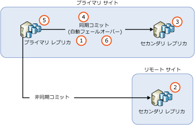
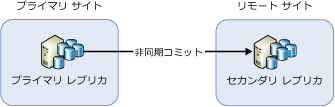
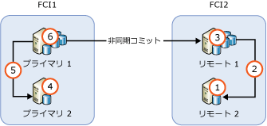

# <a name="upgrading-always-on-availability-group-replica-instances"></a>AlwaysOn 可用性グループのレプリカ インスタンスのアップグレード
[!INCLUDE[appliesto-ss-xxxx-xxxx-xxx-md](../../../includes/appliesto-ss-xxxx-xxxx-xxx-md.md)]

Always On 可用性グループ (AG) をホストする [!INCLUDE[ssNoVersion](../../../includes/ssnoversion-md.md)] インスタンスを新しい [!INCLUDE[ssCurrent](../../../includes/sscurrent-md.md)] バージョン、新しい [!INCLUDE[ssNoVersion](../../../includes/ssnoversion-md.md)]サービス パックまたは累積更新プログラムにアップグレードしている場合、または新しい Windows サービス パックまたは累積更新プログラムにインストールしている場合、ローリング アップグレードを実行して、単一の手動フェールオーバー (または、元のプライマリにフェールバックする場合は、2 回の手動フェールオーバー) におけるプライマリ レプリカのダウンタイムを減らすことができます。 アップグレード プロセス中に、セカンダリ レプリカはフェールオーバーや読み取り専用操作を行うことができなくなります。また、アップグレード後は、プライマリ レプリカ ノード上のアクティビティ量に応じて、プライマリ レプリカ ノードを検出するセカンダリ レプリカの時間がかかる場合があります (そのため、高いネットワーク トラフィック量が予想されます)。 また、新しいバージョンの SQL Server を実行しているセカンダリ レプリカに最初にフェールオーバーした後は、その可用性グループのデータベースは、最新バージョンに移動するためにアップグレード プロセス経由で実行されることに注意してください。 この間、これらのいずれのデータベースにも読み取り可能なレプリカはありません。 最初のフェールオーバー後のダウンタイムは、可用性グループに含まれるデータベースの数によって異なります。 元のプライマリへのフェールバックを計画する場合、フェールバックするときに、この手順が繰り返されることはありません。
  
>[!NOTE]  
>この記事では、SQL Server 自体のアップグレードについてのみ説明します。 これには、Windows Server フェールオーバー クラスター (WSFC) を含む、オペレーティング システムのアップグレードは含まれません。 フェールオーバー クラスターをホストしている Windows オペレーティング システムのアップグレードは、Windows Server 2012 R2 より前のオペレーティング システムではサポートされません。 Windows Server 2012 R2 で実行されているクラスター ノードのアップグレードについては、「[Cluster Operating System Rolling Upgrade](https://docs.microsoft.com/windows-server/failover-clustering/cluster-operating-system-rolling-upgrade)」(クラスター オペレーティング システムのローリング アップグレード) を参照してください。  
  
## <a name="prerequisites"></a>前提条件  
作業を開始する前に、次の重要な情報を確認してください。  
  
- [サポートされているバージョンとエディションのアップグレード](../../../database-engine/install-windows/supported-version-and-edition-upgrades.md):使用している Windows オペレーティング システムと SQL Server のバージョンから SQL Server 2016 にアップグレードできることを確認します。 たとえば、SQL Server 2005 インスタンスから [!INCLUDE[ssCurrent](../../../includes/sscurrent-md.md)]に直接アップグレードすることはできません。  
  
- [データベース エンジンのアップグレード方法の選択](../../../database-engine/install-windows/choose-a-database-engine-upgrade-method.md):正しい順序でアップグレードするには、サポートされるバージョンとエディションのアップグレードの確認と、環境にインストールされているその他のコンポーネントに基づいて、適切なアップグレードの方法と手順を選択します。  
  
- [データベース エンジンのアップグレード計画の策定およびテスト](../../../database-engine/install-windows/plan-and-test-the-database-engine-upgrade-plan.md):リリース ノート、アップグレードに関する既知の問題、アップグレード前のチェックリストを確認して、アップグレードの計画を作成およびテストします。  
  
- [SQL Server のインストールに必要なハードウェアおよびソフトウェア](../../../sql-server/install/hardware-and-software-requirements-for-installing-sql-server.md):[!INCLUDE[ssCurrent](../../../includes/sscurrent-md.md)] のインストールにおけるソフトウェア要件を確認します。 その他のソフトウェアが必要な場合は、ダウンタイムを最小限に抑えるために、アップグレード プロセスを開始する前に、各ノードにソフトウェアをインストールします。  

- [変更データ キャプチャまたはレプリケーションを AG データベースに使用するかどうかの確認](#special-steps-for-change-data-capture-or-replication):AG のデータベースを変更データ キャプチャ (CDC) に対して有効にする場合は、この[手順](#special-steps-for-change-data-capture-or-replication)を完了してください。

>[!NOTE]  
>同じ AG 内で SQL Server インスタンスのバージョンが混在することは、ローリング アップグレード以外ではサポートされていません。また、アップグレードはすぐに実行されるため、長期間その状態のままにしないでください。 SQL Server 2016 以降をアップグレードするには、分散可用性グループを使用する方法もあります。

## <a name="rolling-upgrade-basics-for-always-on-ags"></a>Always On AG のローリング アップグレードの基本  
サーバーのアップグレードまたは更新を行う時に、AG のダウンタイムとデータ損失を最小限に抑えるには、次のガイドラインに従ってください。  
  
- ローリング アップグレードを開始する前に、次の操作を実行します。  
  
    - 少なくとも 1 つの同期コミット レプリカ インスタンスで試験的に手動フェールオーバーを実行する。  
  
    - すべての可用性データベースを対象にデータベースの完全バックアップを実行し、データを保護する。  
  
    - すべての可用性データベースに対して DBCC CHECKDB コマンドを実行する。  
  
-   常に、最初はリモートのセカンダリ レプリカ ノード、次にローカルのセカンダリ レプリカ インスタンス、最後にプライマリ レプリカ インスタンスという順序でアップグレードしてください。  
  
-   アップグレード中のデータベースでバックアップを実行することはできません。  セカンダリ レプリカをアップグレードする前に、プライマリ レプリカでのみバックアップを実行するように自動バックアップ設定を構成します。  バージョンのアップグレード中に、レプリカをバックアップ用に読み取ったり、使用したりすることはできません。 バージョン以外のアップグレード時には、プライマリ レプリカをアップグレードする前に、セカンダリ レプリカで実行するように自動化されたバックアップを構成できます。  
  
-   バージョン アップグレード時に、読み取り可能なセカンダリのアップグレード後、または、プライマリ レプリカがアップグレード済みのセカンダリにフェールオーバーされるか、プライマリ レプリカがアップグレードされる前のいずれかに、読み取り可能なセカンダリを読み取ることはできません。  
  
-   アップグレード プロセスの間に AG が誤ってフェールオーバーされることを防ぐために、作業開始前にすべての同期コミット レプリカから可用性フェールオーバーを削除してください。  
  
-   最初にセカンダリ レプリカを使用して AG をアップグレード済みインスタンスにフェールオーバーした後で、プライマリ レプリカ インスタンスをアップグレードするようにしてください。 このベスト プラクティスに従わなかった場合、プライマリ レプリカ インスタンスでのアップグレード時にクライアント アプリケーションで長時間のダウンタイムが発生する可能性があります。  
  
-   AG は常に同期コミット セカンダリ レプリカ インスタンスにフェールオーバーしてください。 非同期コミット セカンダリ レプリカ インスタンスにフェールオーバーした場合、データベースでデータ損失が発生しやすく、データ移動が自動的に中断されます。データ移動を再開するには、手動で操作する必要があります。  
  
-   他のセカンダリ レプリカ インスタンスをアップグレードまたは更新する前に、プライマリ レプリカ インスタンスをアップグレードしないでください。 アップグレードされたプライマリ レプリカから、同じバージョンにまだアップグレードされていない [!INCLUDE[ssCurrent](../../../includes/sscurrent-md.md)] インスタンスのあるセカンダリ レプリカにログを送信できなくなります。 セカンダリ レプリカへのデータ移動が中断されているときには、そのレプリカに対する自動フェールオーバーは実行されず、可用性データベースでデータ損失が発生する危険性が高まります。 これは、古いプライマリから新しいプライマリに手動でフェールオーバーするローリング アップグレード中にも適用されます。 そのため、古いプライマリをアップグレードした後、同期の再開が必要になる場合があります。
  
-   AG をフェールオーバーする前に、フェールオーバー ターゲットの同期状態が SYNCHRONIZED であることを確認してください。  

  > [!WARNING]
  > 古いバージョンの SQL Server がインストールされているサーバーに、SQL Server の新しいインスタンスまたは新しいバージョンをインストールすると、誤って**古いバージョンの SQL Server でホストされていた可用性グループが停止する可能性があります。** これは、SQL Server のインスタンスまたはバージョンのインストールの間に、SQL Server の高可用性モジュール (RHS.EXE) がアップグレードされるためです。 これにより、サーバー上のプライマリ ロール内の既存の可用性グループが一時的に中断します。 そのため、可用性グループが使用されている古いバージョンの SQL Server を既にホストしているシステムに、新しいバージョンの SQL Server をインストールするときは、次のいずれかのようにすることを強くお勧めします。
  > - メンテナンス期間中に、新しいバージョンの SQL Server をインストールします。 
  > - 可用性グループをセカンダリ レプリカにフェールオーバーして、新しい SQL Server インスタンスのインストールの間はプライマリではないようにします。 
  
## <a name="rolling-upgrade-process"></a>ローリング アップグレード プロセス  
 実際のプロセスは、AG の配置トポロジや各レプリカのコミット モードなどの要因によって変わります。 ただし、最も単純なシナリオにおけるローリング アップグレードは、次の手順で構成される単純な複数段階のプロセスになります。  
  
   
  
1.  すべての同期コミット レプリカの自動フェールオーバーを削除する。  
  
2.  すべての非同期コミット セカンダリ レプリカ インスタンスをアップグレードする。 
  
3.  すべてのリモート同期コミット セカンダリ レプリカ インスタンスをアップグレードする。 

4.  すべてのローカル同期コミット セカンダリ レプリカ インスタンスをアップグレードする。 
  
4.  AG を手動で (新規にアップグレードした) ローカルの同期コミット セカンダリ レプリカにフェールオーバーする。  
  
5.  それまでプライマリ レプリカをホストしていたローカルのレプリカ インスタンスをアップグレードまたは更新する。  
  
6.  必要に応じて自動フェールオーバー パートナーを構成する。
  
 必要であれば、さらに手動でフェールオーバーを実行して、AG を元の構成に戻すこともできます。  
 
   > [!NOTE]
   > - 同期コミット レプリカをアップグレードしてそれをオフラインにしても、プライマリのトランザクションは遅延しません。 セカンダリ レプリカを切断すると、セカンダリ レプリカにログが書き込まれるのを待たずに、トランザクションはプライマリにコミットされます。 
   > - `REQUIRED_SYNCHRONIZED_SECONDARIES_TO_COMMIT` が `1` または `2` に設定されている場合、更新処理中に対応する数の同期セカンダリ レプリカが使用できない場合、プライマリ レプリカから読み書きできない場合があります。 
  
## <a name="ag-with-one-remote-secondary-replica"></a>1 つのリモート セカンダリ レプリカを含む AG  
 ディザスター リカバリーのみを目的として AG を配置していた場合、AG を非同期コミット セカンダリ レプリカにフェールオーバーする必要がある場合があります。 次の図に、そのような構成の例を示します。  
  
   
  
 この場合には、ローリング アップグレード時に AG を非同期コミット セカンダリ レプリカにフェールオーバーする必要があります。 データ損失を防ぐために、コミット モードを同期コミットに変更し、セカンダリ レプリカが同期されるまで待ってから、AG をフェールオーバーします。 そのため、ローリング アップグレードのプロセスは次のようになります。  
  
1.  リモート サイトのセカンダリ レプリカ インスタンスをアップグレードする。  
  
2.  コミット モードを同期コミットに変更する。  
  
3.  同期状態が SYNCHRONIZED になるまで待機する。  
  
4.  AG をリモート サイトのセカンダリ レプリカにフェールオーバーする  
  
5.  ローカル (プライマリ サイト) のレプリカ インスタンスをアップグレードまたは更新する。  
  
6.  AG をプライマリ サイトにフェールオーバーして戻す  
  
7.  コミット モードを非同期コミットに変更する。  
  
 同期コミット モードはリモート サイトとのデータ同期には推奨されない設定であるため、設定の変更後、クライアント アプリケーションでデータベース待機時間が急増する可能性があります。 さらに、フェールオーバーを実行すると未確認のログ メッセージがすべて破棄されます。 2 つのサイト間のネットワーク待機時間が長いと、破棄されるログ メッセージの数が膨大になり、クライアントで大量のトランザクション エラーが発生することがあります。 クライアント アプリケーションへの影響を最小限に抑えるには、次の操作を行います。  
  
-   クライアント トラフィックが少ない時間帯にメンテナンス予定を設定する。  
  
-   プライマリ サイトの [!INCLUDE[ssCurrent](../../../includes/sscurrent-md.md)] をアップグレードまたは更新するときに、可用性モードを非同期コミットに戻し、もう一度プライマリ サイトへのフェールオーバーの準備が完了したときに、同期コミットに戻す。  
  
## <a name="ag-with-failover-cluster-instance-nodes"></a>フェールオーバー クラスター インスタンス ノードを含む AG  
 AG にフェールオーバー クラスター インスタンス (FCI) ノードが含まれている場合、非アクティブなノードをアップグレードした後で、アクティブなノードをアップグレードする必要があります。 次の図では、ローカルでの可用性を高めるために FCI を使用し、リモートのディザスター リカバリーのために FCI 間の非同期コミットを使用する、一般的な AG のシナリオを示します。さらに、アップグレード手順も示しています。  
  
   
  
1.  REMOTE2 をアップグレードまたは更新する。  
  
2.  FCI2 を REMOTE2 にフェールオーバーする。  
  
3.  REMOTE1 をアップグレードまたは更新する。  
  
4.  PRIMARY2 をアップグレードまたは更新する。  
  
5.  FCI1 を PRIMARY2 にフェールオーバーする。  
  
6.  PRIMARY1 をアップグレードまたは更新する。  
  
## <a name="upgrade-or-update-sql-server-instances-with-multiple-ags"></a>複数の AG を含む SQL Server インスタンスのアップグレードまたは更新  
 プライマリ レプリカが別々のサーバー ノード (アクティブ/アクティブ構成) に存在する AG が複数実行されている場合、アップグレード時にはプロセスの高可用性を維持するためのフェールオーバー手順を追加で実行する必要があります。 次の表に示すように、3 つのサーバー ノードで 3 つの AG が実行され、すべてのレプリカが同期コミット モードで実行されているとします。  
  
|AG|Node1|Node2|Node3|  
|------------------------|-----------|-----------|-----------|  
|AG1|プライマリ|||  
|AG2||プライマリ||  
|AG3|||プライマリ|  
  
 この状況では、次の順序で負荷分散ローリング アップグレードを実行することが適切であると考えられます。  
  
1.  AG2 を Node3 にフェールオーバーする (Node2 を解放)。  
  
2.  Node2 をアップグレードまたは更新する。  
  
3.  AG1 を Node2 にフェールオーバーする (Node1 を解放)。  
  
4.  Node1 をアップグレードまたは更新する。  
  
5.  AG2 および AG3 を Node1 にフェールオーバーする (Node3 を解放)。  
  
6.  Node3 をアップグレードまたは更新する。  
  
7.  AG3 を Node3 にフェールオーバーする。  
  
 この順序でアップグレードを実行した場合、1 つの AG に対して 2 回のフェールオーバーを実行するよりも平均ダウンタイムが短くなります。 実行後の構成は、次の表のようになります。  
  
|AG|Node1|Node2|Node3|  
|------------------------|-----------|-----------|-----------|  
|AG1||プライマリ||  
|AG2|プライマリ|||  
|AG3|||プライマリ|  
  
 実際の実装方法に応じて、アップグレードの手順が変わる可能性があります。また、クライアント アプリケーションで発生するダウンタイムも変わります。  
  
> [!NOTE]  
>  多くの場合は、ローリング アップグレードが完了すると、元のプライマリ レプリカにフェールバックします。 

## <a name="rolling-upgrade-of-a-distributed-availability-group"></a>分散型可用性グループのローリング アップグレード
分散型可用性グループのローリング アップグレードを実行するには、まずすべてのセカンダリ レプリカをアップグレードします。 次に、フォワーダーがフェールオーバーされ、セカンダリ可用性グループの最後の残りのインスタンスがアップグレードされます。 その他すべてのレプリカがアップグレードされると、グローバル プライマリがフェールオーバーされ、最初の可用性グループの最後の残りのインスタンスがアップグレードされます。 手順を含む詳細な図を次に示します。 

 実際の実装方法に応じて、アップグレードの手順が変わる可能性があります。また、クライアント アプリケーションで発生するダウンタイムも変わります。  
  
> [!NOTE]  
>  多くの場合は、ローリング アップグレードが完了すると、元のプライマリ レプリカにフェールバックされます。 

### <a name="general-steps-to-upgrade-a-distributed-availability-group"></a>分散型可用性グループをアップグレードする一般的な手順
1. すべてのデータベース (システム データベースなど) および可用性グループに参加しているデータベースがバックアップされます。 
2. セカンダリ可用性グループ (ダウンストリーム) のセカンダリ レプリカがすべてアップグレードおよび再起動されます。 
3. 最初の可用性グループ (アップストリーム) のセカンダリ レプリカがすべてアップグレードおよび再起動されます。 
4. フォワーダー プライマリがセカンダリ可用性グループのアップグレードされたセカンダリ レプリカにフェールオーバーされます。
5. データ同期を待ちます。 データベースはすべての同期コミット レプリカ上で同期されたと示され、グローバル プライマリはフォワーダーと同期されます。  
6. セカンダリ可用性グループの最後の残りのインスタンスがアップグレードして再起動されます。 
7. グローバル プライマリが最初の可用性グループのアップグレードされたセカンダリにフェールオーバーされます。  
8. プライマリ可用性グループの最後の残りのインスタンスがアップグレードされます。
9. 新しくアップグレードされたサーバーが再起動されます。 
10. (省略可能) 両方の可用性グループが元のプライマリ レプリカにフェールバックされます。  

>[!IMPORTANT]
>- すべてのステップ間の同期を確認します。 次のステップに進む前に、同期コミット レプリカが可用性グループ内で同期され、グローバル プライマリが分散型 AG 内のフォワーダーと同期されていることを確認します。 
>- **推奨事項**:同期を確認するたびに、データベース ノードと SQL Server Management Studio 内の分散型 AG ノードの両方を更新してください。 すべてが同期された後に、各レプリカの状態のスクリーンショットを保存します。 これは、現在のステップを追跡したり、次のステップに進む前にすべてが正常に作業されたという証拠を提供したり、問題が発生した場合にトラブルシューティングでサポートを行ったりするのに役立ちます。 


### <a name="diagram-example-for-a-rolling-upgrade-of-a-distributed-availability-group"></a>分散型可用性グループのローリング アップグレードの例の図

| 可用性グループ | プライマリ レプリカ | セカンダリ レプリカ|
| :------ | :----------------------------- |  :------ |
| AG1 | NODE1\SQLAG | NODE2\SQLAG|
| AG2 | NODE3\SQLAG | NODE4\SQLAG|
| Distributedag| AG1 (グローバル) | AG2 (フォワーダー) |
| &nbsp; | &nbsp; | &nbsp; |


この図のインスタンスをアップグレードするステップ 

1. すべてのデータベース (システム データベースなど) および可用性グループに参加しているデータベースがバックアップされます。 
2. NODE4\SQLAG (AG2 のセカンダリ) がアップグレードされ、サーバーが再起動されます。 
3. NODE2\SQLAG (AG1 のセカンダリ) がアップグレードされ、サーバーが再起動されます。 
4. AG2 を NODE3\SQLAG から NODE4\SQLAG にフェールオーバーされます。 
5. NODE3\SQLAG がアップグレードされ、サーバーが再起動されます。 
6. AG1 を NODE1\SQLAG から NODE2\SQLAG にフェールオーバーされます。 
7. NODE1\SQLAG がアップグレードされ、サーバーが再起動されます。 
8. (省略可能) 元のプライマリ レプリカにフェールバックされます。
    1. AG2 が NODE4\SQLAG から NODE3\SQLAG にフェールバックされます。  
    2. AG1 が NODE2\SQLAG から NODE1\SQLAG にフェールバックされます。 

各可用性グループに 3 番目のレプリカが存在する場合は、NODE3\SQLAG と NODE1\SQLAG の前にアップグレードされます。 

>[!IMPORTANT]
>- すべてのステップ間の同期を確認します。 次のステップに進む前に、同期コミット レプリカが可用性グループ内で同期され、グローバル プライマリが分散型 AG 内のフォワーダーと同期されていることを確認します。 
>- 推奨事項:同期を確認するたびに、データベース ノードと SQL Server Management Studio 内の分散型 AG ノードの両方を更新してください。 すべてが同期された後は、スクリーンショットを取得して保存します。 これは、現在のステップを追跡したり、次のステップに進む前にすべてが正常に作業されたという証拠を提供したり、問題が発生した場合にトラブルシューティングでサポートを行ったりするのに役立ちます。 


## <a name="special-steps-for-change-data-capture-or-replication"></a>変更データ キャプチャまたはレプリケーションの特別な手順

更新が適用されているかによって、変更データ キャプチャまたはレプリケーションを有効にしている AG レプリカ データベースに対して追加の手順が必要な場合があります。 次の手順が必要かどうかを確認するには、更新プログラムのリリース ノートを参照してください。

1. 各セカンダリ レプリカをアップグレードします。

1. すべてのセカンダリ レプリカがアップグレードされてから、AG をアップグレードされたインスタンスにフェール オーバーします。 

1. プライマリ レプリカをホストするインスタンスで、次の Transact-SQL を実行します。

   ```sql
   EXECUTE [master].[sys].[sp_vupgrade_replication];
   ```

   >[!NOTE]
   >このコマンドの実行には数分かかることがあります。 

1. 元はプライマリ レプリカであったインスタンスをアップグレードします。

背景情報については、[最新の CU へのアップグレード後に CDC の機能が動作しない場合](https://blogs.msdn.microsoft.com/sql_server_team/cdc-functionality-may-break-after-upgrading-to-the-latest-cu-for-sql-server-2012-2014-and-2016/)に関するページを参照してください。

  
## <a name="see-also"></a>参照  
 [インストール ウィザードを使用した SQL Server 2016 へのアップグレード &#40;セットアップ&#41;](../../../database-engine/install-windows/upgrade-sql-server-using-the-installation-wizard-setup.md)   

 [コマンド プロンプトからの SQL Server 2016 のインストール](../../../database-engine/install-windows/install-sql-server-2016-from-the-command-prompt.md)  
  
  
