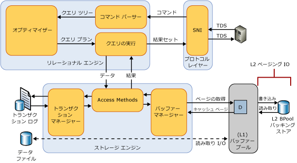

# バッファー プール拡張
[!INCLUDE[appliesto-ss-xxxx-xxxx-xxx-md](../../includes/appliesto-ss-xxxx-xxxx-xxx-md.md)]
  [!INCLUDE[ssSQL14](../../includes/sssql14-md.md)]で導入されたバッファー プール拡張は、不揮発性ランダム アクセス メモリ (ソリッドステート ドライブ) 拡張としての [!INCLUDE[ssDE](../../includes/ssde-md.md)] バッファー プールへのシームレスな統合を実現することで、I/O スループットを大幅に向上させます。 バッファー プール拡張は、 [!INCLUDE[ssNoVersion](../../includes/ssnoversion-md.md)] の一部のエディションでは使用できません。 詳細については、「 [SQL Server 2016 の各エディションがサポートする機能](~/sql-server/editions-and-supported-features-for-sql-server-2016.md)」を参照してください。  
  
## バッファー プール拡張の利点  
 [!INCLUDE[ssNoVersion](../../includes/ssnoversion-md.md)] データベースの主な目的はデータの格納と取得であるため、データベース エンジンの主要な特性は頻繁なディスク I/O ということになります。 ディスク I/O 操作は多くのリソースを消費するうえ、完了するのに比較的長い時間がかかるため、 [!INCLUDE[ssNoVersion](../../includes/ssnoversion-md.md)] では I/O の効率を上げることに重点を置いています。 バッファー プールは、 [!INCLUDE[ssNoVersion](../../includes/ssnoversion-md.md)]のプライマリ メモリの割り当て元となります。 バッファー管理は、この効率向上を実現するための重要なコンポーネントです。 バッファー管理コンポーネントは 2 つのメカニズムから構成されています。1 つはデータベース ページに対するアクセスと更新を行うバッファー マネージャーで、もう 1 つはデータベース ファイルの I/O 数を削減するためのバッファー プールです。  
  
 データ ページとインデックス ページがディスクからバッファー プールに読み込まれ、変更されたページ (ダーティ ページとも呼ばれます) がディスクに書き戻されます。 サーバー チェックポイントおよびデータベース チェックポイントでメモリ不足が発生すると、バッファー キャッシュ内のホットな (アクティブな) ダーティ ページがキャッシュから削除され、機械式ディスクに書き込まれた後、再度キャッシュに読み込まれます。 通常、これらの I/O 操作は、4 ～ 16 KB という小規模なデータのランダム読み取り/書き込みです。 小規模なランダム I/O パターンの場合、頻繁なシークが発生して機械式ディスクのアームが動き続けるため、I/O 待機時間が長くなり、システムの総 I/O スループットが低下します。  
  
 このような I/O ボトルネックを解決するための一般的な方法は、DRAM を増設するか、または高パフォーマンス SAS スピンドルを追加する方法です。 これらのオプションは効果的ですが、重大な欠点があります。DRAM は、データ ストレージ ドライブよりも高価です。スピンドル数を追加すると、ハードウェアの購入経費が増えるだけでなく、電力消費量の増加およびコンポーネントの故障の可能性の増加に伴い運用コストが増加します。  
  
 バッファー プール拡張機能は、不揮発性ストレージ (通常は SSD) でバッファー プール キャッシュを拡張します。 この拡張により、より大きなデータベースのワーキング セットをバッファー プールに格納でき、その結果、RAM と SSD の間の I/O のページングが強制的に実行されます。 これによって、小規模なランダム I/O の処理が実質的に機械式ディスクから SSD に移行されます。 SSD は待機時間が短くランダム I/O のパフォーマンスに優れているため、バッファー プール拡張によって I/O スループットが大幅に向上します。  
  
 バッファー プール拡張機能の利点を次の一覧に示します。  
  
-   ランダム I/O のスループットの向上  
  
-   I/O 待機時間の削減  
  
-   トランザクションのスループットの向上  
  
-   より大きなハイブリッド バッファー プールによる読み取りパフォーマンスの向上  
  
-   現在および将来の低コストのメモリ ドライブを使用できるキャッシュ アーキテクチャ  
  
### 概念  
 バッファー プール拡張機能に関連する用語を次に示します。  
  
 ソリッドステート ドライブ (SSD)  
 ソリッドステート ドライブは、データをメモリ (RAM) に永続的に格納します。 詳細については、 [この定義](https://en.wikipedia.org/wiki/Solid-state_drive)を参照してください。  
  
 バッファー  
 [!INCLUDE[ssNoVersion](../../includes/ssnoversion-md.md)]では、バッファーはメモリ内の 8 KB のページで、データ ページやインデックス ページと同じサイズです。 したがって、バッファー キャッシュは 8 KB 単位のページに分割されます。 バッファー マネージャーが別のデータを読み取るためのバッファー領域を必要とするまで、そのページはバッファー キャッシュ内に残ります。 データに変更が加えられた場合だけ、そのデータがディスクに書き戻されます。 これらのメモリ内の修正されたページは、"ダーティ ページ" と呼ばれます。 ページは、ディスク上のデータベース イメージと等価であるときにクリーンです。 バッファー キャッシュ内のデータは、ディスクに書き戻す前に何度でも変更できます。  
  
 バッファー プール  
 バッファー キャッシュとも呼ばれます。 バッファー プールは、キャッシュされたデータ ページを利用するためにすべてのデータベースで共有されるグローバル リソースです。 バッファー プール キャッシュの最大サイズと最小サイズは、起動時か、または SQL Server のインスタンスが sp_configure を使用して動的に再構成されるときに決定されます。 このサイズにより、実行中のインスタンスで任意のときにバッファー プールにキャッシュできる最大ページ数が決まります。  
  
 バッファー プール拡張機能によってコミットできる最大メモリは、コンピューター上で実行中の他のアプリケーションが深刻なメモリ不足を引き起こした場合に、そのアプリケーションによって制限されることがあります。  
  
 Checkpoint  
 チェックポイントによって、予期しないシャットダウンやクラッシュの後の復旧中に、トランザクション ログに格納されている変更を [!INCLUDE[ssDE](../../includes/ssde-md.md)] が適用するための最適なポイントが作成されます。 チェックポイントは、変更されたページとトランザクション ログ情報をメモリからディスクに書き込み、さらにトランザクション ログに関する情報を記録します。 詳細については、「[データベース チェックポイント &#40;SQL Server&#41;](../../relational-databases/logs/database-checkpoints-sql-server.md)」を参照してください。  
  
## バッファー プール拡張の詳細  
 SSD ストレージは、ディスク ストレージ サブシステムではなく、メモリ サブシステムの拡張として使用されます。 つまり、バッファー プール拡張ファイルによって、バッファー プール マネージャーが DRAM と NAND フラッシュ メモリの両方を使用し、SSD を使用した不揮発性ランダム アクセス メモリ上に "微温" ページ用のはるかに大きなバッファー プールを保持できるようになります。 これにより、DRAM としてのレベル 1 (L1) と SSD 上のバッファー プール拡張ファイルとしてのレベル 2 (L2) から成る複数レベルのキャッシュ階層が作成されます。 データの安全性を維持するため、L2 キャッシュにはクリーンなページのみが書き込まれます。 バッファー マネージャーは、L1 キャッシュと L2 キャッシュの間のクリーンなページの移動を処理します。  
  
 次の図は、バッファー プールのアーキテクチャを他の [!INCLUDE[ssNoVersion](../../includes/ssnoversion-md.md)] コンポーネントに関連して示した概要図です。  
  
   
  
 有効な場合、バッファー プール拡張は、SSD 上のバッファー プール キャッシュ ファイルのサイズおよびファイル パスを指定します。 このファイルは SSD 上のストレージの連続的なエクステントで、 [!INCLUDE[ssNoVersion](../../includes/ssnoversion-md.md)]インスタンスの起動時に静的に構成されます。 ファイルの構成パラメーターの変更は、バッファー プール拡張機能が無効になっている場合にのみ実行できます。 バッファー プール拡張を無効にすると、すべての関連する構成設定がレジストリから削除されます。 バッファー プール拡張ファイルは、SQL Server インスタンスがシャットダウンされると削除されます。  
  
## ベスト プラクティス  
 次のベスト プラクティスに従うことをお勧めします。  
  
-   初めてバッファー プール拡張を有効にした後は、パフォーマンス上の利点を最大限に活用するために SQL Server インスタンスを再起動することをお勧めします。  
  
-   バッファー プールの拡張サイズは、最大で max_server_memory の値の 32 倍に設定できます。  物理メモリのサイズ (max_server_memory) とバッファー プール拡張のサイズの比率を 1:16 以下にすることをお勧めします。 1:4 ～ 1:8 の範囲の低い比率が最適な場合もあります。 max_server_memory オプションの設定の詳細については、「 [サーバー メモリーに関するサーバー構成オプション](../../database-engine/configure-windows/server-memory-server-configuration-options.md)」を参照してください。  
  
-   運用環境で実装する前にバッファー プール拡張を徹底的にテストします。 運用環境では、ファイルの構成を変更したり、機能をオフにしたりしないでください。 これらの操作を行うと、機能が無効にされたときにバッファー プールのサイズが大幅に縮小されるため、サーバー パフォーマンスにマイナスの影響がある場合があります。 無効にすると、SQL Server のインスタンスが再起動されるまで、機能をサポートするために使用されたメモリが再利用されません。 しかし、機能を再度有効にすると、インスタンスを再起動しなくてもメモリが再利用されます。  
  
## バッファー プール拡張に関する情報の取得  
 次の動的管理ビューを使用して、バッファー プール拡張の構成を表示し、拡張のデータ ページに関する情報を取得できます。  
  
-   [sys.dm_os_buffer_pool_extension_configuration &#40;Transact-SQL&#41;](../../relational-databases/system-dynamic-management-views/sys-dm-os-buffer-pool-extension-configuration-transact-sql.md)  
  
-   [sys.dm_os_buffer_descriptors &#40;Transact-SQL&#41;](../../relational-databases/system-dynamic-management-views/sys-dm-os-buffer-descriptors-transact-sql.md)  
  
 SQL Server ではパフォーマンス カウンターが用意されており、Buffer Manager オブジェクトを使用して、バッファー プール拡張ファイル内のデータ ページを追跡することができます。 詳細については、「 [バッファー プール拡張のパフォーマンス カウンター](../../relational-databases/performance-monitor/sql-server-buffer-manager-object.md)」を参照してください。  
  
 次の XEvent を使用できます。  
  
|XEvent|[説明]|パラメーター|  
|------------|-----------------|----------------|  
|sqlserver.buffer_pool_extension_pages_written|ページまたはページのグループがバッファー プールから削除され、バッファー プール拡張ファイルに書き込まれると発生します。|*number_page*   *first_page_id*   *first_page_offset*   *initiator_numa_node_id*|  
|sqlserver.buffer_pool_extension_pages_read|ページがバッファー プール拡張ファイルからバッファー プールに読み取られると発生します。|*number_page*   *first_page_id*   *first_page_offset*   *initiator_numa_node_id*|  
|sqlserver.buffer_pool_extension_pages_evicted|ページがバッファー プール拡張ファイルから削除されると発生します。|*number_page*   *first_page_id*   *first_page_offset*   *initiator_numa_node_id*|  
|sqlserver.buffer_pool_eviction_thresholds_recalculated|削除しきい値が計算されると発生します。|*warm_threshold*   *cold_threshold*   *pages_bypassed_eviction*   *eviction_bypass_reason*   *eviction_bypass_reason_description*|  
  
## Related Tasks  
  
|||  
|-|-|  
|**タスクの説明**|**トピック**|  
|バッファー プール拡張を有効化および構成する|[ALTER SERVER CONFIGURATION &#40;Transact-SQL&#41;](../../t-sql/statements/alter-server-configuration-transact-sql.md)|  
|バッファー プール拡張の構成を変更する|[ALTER SERVER CONFIGURATION &#40;Transact-SQL&#41;](../../t-sql/statements/alter-server-configuration-transact-sql.md)|  
|バッファー プール拡張の構成を表示する|[sys.dm_os_buffer_pool_extension_configuration &#40;Transact-SQL&#41;](../../relational-databases/system-dynamic-management-views/sys-dm-os-buffer-pool-extension-configuration-transact-sql.md)|  
|バッファー プール拡張を監視する|[sys.dm_os_buffer_descriptors &#40;Transact-SQL&#41;](../../relational-databases/system-dynamic-management-views/sys-dm-os-buffer-descriptors-transact-sql.md)   [パフォーマンス カウンター](../../relational-databases/performance-monitor/sql-server-buffer-manager-object.md)|  
  
  
