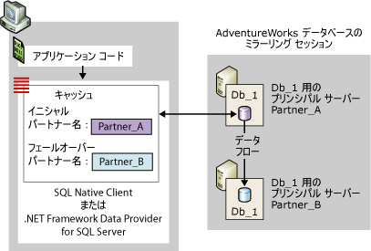
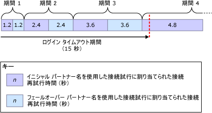
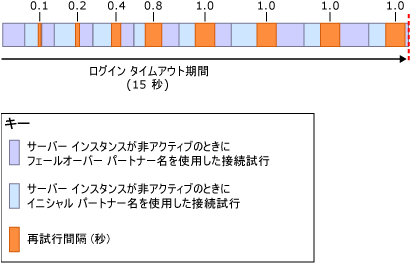

# <a name="connect-clients-to-a-database-mirroring-session-sql-server"></a>データベース ミラーリング セッションへのクライアントの接続 (SQL Server)
[!INCLUDE[appliesto-ss-xxxx-xxxx-xxx-md](../../includes/appliesto-ss-xxxx-xxxx-xxx-md.md)]
  データベース ミラーリング セッションに接続するには、クライアント側で [!INCLUDE[ssNoVersion](../../includes/ssnoversion-md.md)] Native Client または .NET Framework Data Provider for [!INCLUDE[ssNoVersion](../../includes/ssnoversion-md.md)]を使用できます。 これらのデータ アクセス プロバイダーは、 [!INCLUDE[ssCurrent](../../includes/sscurrent-md.md)] データベース用に構成されると、両方ともデータベース ミラーリングを完全にサポートします。 ミラー化されたデータベースの使用に関するプログラミングの注意点については、「 [Using Database Mirroring](../../relational-databases/native-client/features/using-database-mirroring.md)」を参照してください。 さらに、現在のプリンシパル サーバー インスタンスは使用可能であり、クライアントのログインがサーバー インスタンス上に作成されている必要があります。 詳細については、「 [孤立ユーザーのトラブルシューティング &#40;SQL Server&#41;](../../sql-server/failover-clusters/troubleshoot-orphaned-users-sql-server.md)を実行します。 データベース ミラーリング セッションへのクライアント接続では、ミラーリング監視サーバー インスタンスが存在していても使用されません。  
  
  
##  <a name="InitialConnection"></a> データベース ミラーリング セッションへの最初の接続  
 クライアントはミラー化されたデータベースに初めて接続するときに、最低限サーバー インスタンスの名前を含む接続文字列を指定する必要があります。 この必須のサーバー名は、現在のプリンシパル サーバー インスタンスを特定するもので、 *イニシャル パートナー名*と呼びます。  
  
 接続文字列には、必要に応じて、別のサーバー インスタンスの名前を指定することもできます。この名前は、現在のミラー サーバー インスタンスを特定するもので、最初の接続試行でイニシャル パートナーを使用できない場合に使用されます。 この 2 つ目の名前を *フェールオーバー パートナー名*と呼びます。  
  
 また、接続文字列にはデータベース名も指定する必要があります。 データベース名は、データ アクセス プロバイダーがフェールオーバーを試行できるようにするために必要です。  
  
 データ アクセス プロバイダーは接続文字列を受け取ると、イニシャル パートナー名とフェールオーバー パートナー名 (指定された場合) をクライアントの揮発性メモリのキャッシュに格納します (マネージド コードの場合、キャッシュはアプリケーション ドメインにスコープが設定されます)。 キャッシュに保存されたイニシャル パートナー名は、データ アクセス プロバイダーによって更新されません。 クライアントがフェールオーバー パートナー名を指定した場合、データ アクセス プロバイダーでは、イニシャル パートナー名を使用して接続できなかった場合に備えて、このフェールオーバー パートナー名も一時的に保存します。  
  
 データベース ミラーリング セッションによる保護は、クライアント コンピューターでネットワーク通信に関する問題が発生した場合など、サーバーへのアクセスに関するクライアント固有の問題には対処できません。 ミラー化されたデータベースへの接続は、データ アクセス プロバイダーに関連しない原因で失敗することもあります。たとえば、データベースがフェールオーバー中である場合や、ネットワーク エラーが発生した場合に、プリンシパル サーバー インスタンスがアクティブでないことが原因で接続試行が失敗することがあります。  
  
 データ アクセス プロバイダーでは、まずイニシャル パートナー名を使用して接続を試行します。 通常、指定したサーバー インスタンスが使用可能で、それが現在のプリンシパル サーバー インスタンスであれば接続は成功します。  
  
> [!NOTE]  
>  ミラーリング セッションが一時停止した場合、通常、クライアントはプリンシパル サーバーに接続し、パートナー名をダウンロードします。 ただし、ミラーリングが再開されるまで、クライアントはデータベースにアクセスできません。  
  
 イニシャル パートナー名で接続できない場合、フェールオーバー パートナー名 (指定された場合) で接続を試行します。 いずれかのパートナー名で現在のプリンシパル サーバーを正しく特定できると、正常に最初の接続を開くことができます。 この接続が完了すると、現在のミラー サーバーのサーバー インスタンス名をダウンロードします。 この名前はフェールオーバー パートナー名としてキャッシュに保存され、クライアントが指定したフェールオーバー パートナー名 (存在する場合) が上書きされます。 その後、.NET Framework Data Provider for [!INCLUDE[ssNoVersion](../../includes/ssnoversion-md.md)] はこのフェールオーバー パートナー名を更新しません。 それに対して、 [!INCLUDE[ssNoVersion](../../includes/ssnoversion-md.md)] Native Client は、その後の接続や接続のリセットにより異なるパートナー名が返されたときはキャッシュを更新します。  
  
 次の図は、 **Db_1**という名前のミラー化されたデータベースのイニシャル パートナーである **Partner_A**へのクライアント接続を示しています。 この図では、クライアントが指定したイニシャル パートナー名が現在のプリンシパル サーバーである **Partner_A**を正しく特定しています。 最初の接続試行が成功し、データ アクセス プロバイダーのローカル キャッシュに、ミラー サーバーの名前 (現在は **Partner_B**) がフェールオーバー パートナー名として保存されます。 最後に、クライアントが **Db_1** データベースのプリンシパル コピーに接続されます。  
  
   
  
 最初の接続試行は、ネットワーク エラーやアクティブでないサーバー インスタンスが原因で失敗する場合があります。 最初のパートナーが使用できないときに、データ アクセス プロバイダーがフェールオーバー パートナーへの接続を試行するには、クライアントが接続文字列にフェールオーバー パートナー名を指定している必要があります。  
  
 フェールオーバー パートナー名が指定されていなければ、ネットワーク接続がタイムアウトになるかエラーが返されるまで、元の接続試行が続行されます (データベースがミラー化されていない場合と同じ動作です)。  
  
 接続文字列にフェールオーバー パートナー名を指定した場合、データ アクセス プロバイダーの動作は、クライアントのネットワーク プロトコルとオペレーティング システムによって次のように異なります。  
  
-   TCP/IP では、データベース ミラーリング固有の接続再試行アルゴリズムによって接続試行が規制されます。 *接続再試行アルゴリズム* は、1 回の接続試行で接続を開くのに割り当てる最大時間 ( *再試行時間*) を決定します。  
  
-   その他のネットワーク プロトコル  
  
     エラーが発生するか、イニシャル パートナーを使用できない場合、最初の接続試行は、ネットワーク接続がタイムアウトになるか、データ アクセス プロバイダーのログインがタイムアウトになるまで待機します。 通常、この待機時間は 20 ～ 30 秒です。 データ アクセス プロバイダーがタイムアウトしなければ、フェールオーバー パートナーへの接続が試行されます。 接続が成功する前に接続がタイムアウトになるか、フェールオーバー パートナーを使用できない場合、接続試行は失敗します。 ログインがタイムアウトになる前に、フェールオーバー パートナーが使用でき、そのパートナーがその時点のプリンシパル サーバーの場合、接続試行は成功します。  
  
  
### <a name="connection-strings-for-a-mirrored-database"></a>ミラー化されたデータベースの接続文字列  
 クライアントが指定する接続文字列には、データ アクセス プロバイダーがデータベースへの接続に使用する情報が含まれています。 ここでは特に、ミラー化されたデータベースに [!INCLUDE[ssNoVersion](../../includes/ssnoversion-md.md)] Native Client の ODBC ドライバー接続を使用して接続する場合のキーワードについて説明します。  
  
#### <a name="network-attribute"></a>Network 属性  
 接続文字列には、ネットワーク プロトコルを指定するための **Network** 属性を含めます。 この属性を含めると、異なるパートナーに接続を切り替えても、指定したネットワーク プロトコルが保持されます。 ミラー化されたデータベースへの接続に最も適したプロトコルは TCP/IP です。 クライアントがパートナーへのすべての接続に TCP/IP を要求するには、接続文字列に次の属性を指定します。  
  
```  
Network=dbmssocn;   
```  
  
> [!IMPORTANT]  
>  TCP/IP はクライアントのプロトコル一覧の先頭に指定することをお勧めします。 ただし、接続文字列に **Network** 属性を指定した場合は、そのプロトコルが一覧の順序をオーバーライドします。  
  
 また、クライアントがパートナーへのすべての接続に名前付きパイプを要求するには、接続文字列に次の属性を指定します。  
  
```  
Network=dbnmpntw;   
```  
  
> [!IMPORTANT]  
>  名前付きパイプでは TCP/IP の再試行アルゴリズムを使用しないので、多くの場合、名前付きパイプによる接続試行はミラー化されたデータベースに接続される前にタイムアウトします。  
  
#### <a name="server-attribute"></a>Server 属性  
 接続文字列には、イニシャル パートナー名を指定する **Server** 属性を含める必要があります。この名前で現在のプリンシパル サーバー インスタンスを特定します。  
  
 サーバー インスタンスを特定する最も簡単な方法は、 *<server_name>* [ **\\** _<SQL_Server_instance_name>_ ] の形式でインスタンス名を指定することです。 次に例を示します。  
  
 `Server=Partner_A;`  
  
 or  
  
 `Server=Partner_A\Instance_2;`  
  
 ただし、システム名を使用するときは、クライアントは DNS 参照を実行してサーバーの IP アドレスを取得し、SQL Server Browser クエリを実行してパートナーが存在するサーバーのポート番号を取得する必要があります。 **Server** 属性にパートナーのサーバー名ではなく IP アドレスとポート番号を指定すると、こうした参照やクエリを回避できます。 パートナーへの接続中に外部遅延が発生する可能性を最小限に抑えるために、この指定を行うことをお勧めします。  
  
> [!NOTE]  
>  接続文字列に名前付きインスタンス名を指定し、ポート名を指定しない場合は、SQL Server Browser クエリの実行が必要です。  
  
 **Server** 属性では、`Server=` *<ip_address>* `,`\<*port*> という形式で IP アドレスとポートを指定します。次に例を示します。  
  
```  
Server=123.34.45.56,4724;   
```  
  
> [!NOTE]  
>  IP アドレスには、IP Version 4 (IPv4) または IP Version 6 (IPv6) を使用できます。  
  
#### <a name="database-attribute"></a>Database 属性  
 接続文字列には、ミラー化されたデータベースの名前を指定する **Database** 属性も指定する必要があります。 クライアントが接続を試行したときにデータベースを使用できない場合は、例外が発生します。  
  
 たとえば、プリンシパル サーバー Partner_A の **AdventureWorks** データベースに明示的に接続するには、クライアントで次の接続文字列を使用します。  
  
 `" Server=Partner_A; Database=AdventureWorks "`  
  
> [!NOTE]  
>  この文字列では、認証情報が省略されています。  
  
> [!IMPORTANT]  
>  **Server** 属性にプロトコル プレフィックスを指定すると (`Server=tcp:`\<*servername>* )、**Network** 属性と互換性がなくなります。また、両方の属性にプロトコルを指定すると、エラーが発生する可能性が高くなります。 このため、接続文字列でプロトコルを指定するときには **Network** 属性を使用し、**Server** 属性にはサーバー名だけを指定することをお勧めします。つまり、`"Network=dbmssocn; Server=`\<*servername>* `"` という形式を使用します。  
  
#### <a name="failover-partner-attribute"></a>Failover Partner 属性  
 クライアントは、イニシャル パートナー名以外に、現在のミラー サーバー インスタンスを特定するフェールオーバー パートナー名も指定できます。 フェールオーバー パートナーは、Failover Partner 属性を表すいずれかのキーワードで指定します。 この属性を表すキーワードは、使用する API によって異なります。 次の表は、これらのキーワードを示しています。  
  
|API|Failover Partner 属性を表すキーワード|  
|---------|--------------------------------------------|  
|OLE DB プロバイダー|**FailoverPartner**|  
|ODBC ドライバー|**Failover_Partner**|  
|ActiveX Data Objects (ADO)|**Failover Partner**|  
  
 サーバー インスタンスを特定する最も簡単な方法は、そのインスタンスのシステム名を *<server_name>* [ **\\** _<SQL_Server_instance_name>_ ] という形式で指定することです。  
  
 また、 **Failover Partner** 属性に IP アドレスとポート番号を指定することもできます。 これにより、最初の接続試行がデータベースへの最初の接続に失敗した場合、DNS と SQL Server Browser に依存しないでフェールオーバー パートナーへの接続を試行できます。 接続が確立されると、指定したフェールオーバー パートナー名が接続時のフェールオーバー パートナー名に上書きされるので、次にフェールオーバーが発生した場合、リダイレクトされた接続では DNS と SQL Server Browser が必要になります。  
  
> [!NOTE]  
>  イニシャル パートナー名のみを指定すると、アプリケーション開発者が操作を実行したり、再接続方法以外のコードを記述したりする必要はありません。  
  
> [!NOTE]  
>  マネージド コード アプリケーションの開発者は **ConnectionString** オブジェクトの **SqlConnection** でフェールオーバー パートナー名を指定します。 この接続文字列の使用方法については、 [!INCLUDE[msCoName](../../includes/msconame-md.md)] .NET Framework SDK に含まれている ADO.NET マニュアルの「Database Mirroring Support in the .NET Framework Data Provider for SQL Server」を参照してください。  
  
#### <a name="example-connection-string"></a>接続文字列の例  
 たとえば、TCP/IP を使用して Partner_A または Partner_B の **AdventureWorks** データベースに明示的に接続するには、ODBC ドライバーを使用するクライアント アプリケーションで次の接続文字列を指定します。  
  
```  
"Server=Partner_A; Failover_Partner=Partner_B; Database=AdventureWorks; Network=dbmssocn"  
```  
  
 また、クライアントはイニシャル パートナーの Partner_A を特定するために、IP アドレスとポート番号を指定できます。たとえば、IP アドレスが 250.65.43.21 でポート番号が 4734 の場合、接続文字列は次のようになります。  
  
```  
"Server=250.65.43.21,4734; Failover_Partner=Partner_B; Database=AdventureWorks; Network=dbmssocn"  
```  
  
##  <a name="RetryAlgorithm"></a> 接続再試行アルゴリズム (TCP/IP 接続用)  
 TCP/IP 接続では、両方のパートナー名がキャッシュ内に存在すると、データ アクセス プロバイダーは接続再試行アルゴリズムに従います。 これは、セッションに初めて接続する場合にも、確立した接続が切断された後に再接続する場合にも当てはまります。 接続を開いた後の場合、ログイン前およびログイン時の手順を完了するのにさらに時間がかかります。  
  
> [!NOTE]  
>  接続を開くときにかかる時間は、外部要因が原因で再試行時間を超える場合があります。外部要因には、速度の遅い DNS 参照、処理速度の遅いドメイン コントローラーや Kerberos キー配布センター (KDC)、SQL Server Browser への接続にかかる時間、ネットワークの混雑などがあります。 このような外部要因により、クライアントはミラー化されたデータベースに接続できなくなる場合があります。 また、接続を開くとき、割り当てられた再試行時間より長い時間がかかる場合もあります。 イニシャル パートナーへの接続試行時の DNS および SQL Server Browser のバイパスについては、このトピックの「 [データベース ミラーリング セッションへの最初の接続](#InitialConnection)」を参照してください。  
  
 接続試行が失敗したり、接続試行が成功する前に再試行時間がタイムアウトした場合、データ アクセス プロバイダーは他のパートナーを使用します。 この時点までに接続が開かれていない場合は、接続が開かれるかログイン期間がタイムアウトするまで、プロバイダーはイニシャル パートナー名とフェールオーバー パートナー名を交互に使用します。既定のログイン タイムアウト期間は 15 秒です。 ログイン タイムアウト期間は 5 秒以上にすることをお勧めします。 タイムアウト期間を 5 秒未満にすると、接続試行が成功しない場合があります。  
  
 再試行時間は、ログイン タイムアウト期間の比率で決まります。 接続試行の再試行時間は、連続する各ラウンドでラウンドごとに長くなります。 最初のラウンドでは、2 回の接続試行それぞれの再試行時間は、合計ログイン タイムアウト期間の 8% です。 その後に続く各ラウンドでは、再試行アルゴリズムによって、最大再試行時間が一定の比率で増加します。 したがって、最初の 8 回の接続試行の再試行時間は次のようになります。  
  
 8%, 8%, 16%, 16%, 24%, 24%, 32%, 32%  
  
 再試行時間は、次の式を使用して計算されます。  
  
 _RetryTime_ **=** _PreviousRetryTime_ **+(** 0.08 ***** _LoginTimeout_ **)**  
  
 ここでは、 *PreviousRetryTime* の初期値は 0 です。  
  
 たとえば、15 秒という既定のログイン タイムアウト期間を使用すると、*LoginTimeout* *= 15* となります。 この場合、最初の 3 ラウンドに割り当てられる再試行時間は次のようになります。  
  
|Round|*RetryTime* の計算|接続試行ごとの再試行時間|  
|-----------|-----------------------------|----------------------------|  
|1|0 **+(** 0.08 **&#42;** 15 **)**|1.2 秒|  
|2|1.2 **+(** 0.08 **&#42;** 15 **)**|2.4 秒|  
|3|2.4 **+(** 0.08 **&#42;** 15 **)**|3.6 秒|  
|4|3.6 **+(** 0.08 **&#42;** 15 **)**|4.8 秒|  
  
 次の図では、連続する接続試行のそれぞれがタイムアウトする再試行時間を示しています。  
  
   
  
 既定のログイン タイムアウト期間に対して、接続試行の最初の 3 ラウンドに割り当てられた最大時間は 14.4 秒です。 各接続試行で割り当てられた時間をすべて使用してしまった場合、ログイン期間がタイムアウトするまでに 0.6 秒しか残っていません。その場合、4 ラウンド目は短縮されるので、最後は、イニシャル パートナー名を使用した簡単な接続試行しか行うことができません。 ただし、特に後半のラウンドでは、割り当てられた再試行時間が経過しないうちに接続試行が失敗する場合があります。 たとえば、ネットワーク エラーが発生すると、再試行時間がタイムアウトする前に、試行が終了する場合があります。 初期の接続試行がネットワーク エラーによって失敗すると、4 ラウンド目とおそらくは追加のラウンドで、使用できる時間が追加されることがあります。  
  
 接続試行に失敗するもう 1 つの原因として、サーバー インスタンスがそのデータベースをフェールオーバーしている場合に発生するような、非アクティブなサーバー インスタンスがあります。 この場合、クライアントが短時間の連続的な接続試行によってパートナーに負荷をかけ過ぎないように、再試行間隔が指定されます。  
  
> [!NOTE]  
>  両方のパートナー名が使用できる場合、ログイン タイムアウト期間に制限がないと、クライアントは、イニシャル パートナー名とフェールオーバー パートナー名を交互に使いながら、無制限にサーバーへの再接続を試みます。  
  
  
### <a name="retry-delays-during-failover"></a>フェールオーバー中の再試行間隔  
 フェールオーバーしているパートナーにクライアントが接続を試みると、パートナーはすぐに非アクティブであることを応答します。 この場合、接続試行の各ラウンドは、割り当てられた再試行時間よりかなり短くなります。 つまり、接続試行の多くのラウンドは、ログイン期間がタイムアウトする前に発生する場合があります。フェールオーバー中に短時間で連続した接続試行を行ってパートナーに負荷がかかり過ぎるのを回避するために、データ アクセス プロバイダーは、各再試行サイクルの後に短い再試行間隔を追加します。 指定された再試行間隔の長さは、再試行間隔アルゴリズムによって決まります。 最初のラウンドの後の間隔は 100 ミリ秒です。 それ以降の再試行間隔は 3 ラウンドごとに、200、400、800 と倍になっていきます。 その後のすべてのラウンドでは、接続試行が成功するかタイムアウトするまで再試行間隔は 1 秒になります。  
  
> [!NOTE]  
>  サーバー インスタンスが停止すると、接続要求はすぐに失敗します。  
  
 次の図では、手動フェールオーバー中の再試行間隔による接続試行への影響を示しています。ここでは、パートナーは役割を交換しています。 ログイン タイムアウト期間は 15 秒です。  
  
   
  
##  <a name="Reconnecting"></a> データベース ミラーリング セッションへの再接続  
 データベース ミラーリングのフェールオーバーなどの理由でデータベース ミラーリング セッションに対して確立された接続が失敗し、アプリケーションが最初のサーバーに再接続を試みると、データ アクセス プロバイダーは、クライアントのキャッシュに保存されたフェールオーバー パートナー名を使用して再接続を試みる場合があります。 ただし、再接続は自動的には行われず、 アプリケーションではエラーを検出することになります。 その後、アプリケーションは失敗した接続を閉じて、同じ接続文字列属性を使用して新しい接続を開く必要があります。 この時点で、データ アクセス プロバイダーがフェールオーバー パートナーに接続をリダイレクトします。 この名前で識別されるサーバー インスタンスが現在のプリンシパル サーバーの場合は、通常、接続試行は成功します。 トランザクションがコミットされたかロールバックされたかはっきりしない場合、アプリケーションでは、スタンドアロンのサーバー インスタンスに再接続するときと同じように、トランザクションの状態を確認する必要があります。  
  
 再接続は、接続文字列でフェールオーバー パートナー名を指定した最初の接続と同様に行われます。 最初の接続試行が失敗すると、クライアントがプリンシパル サーバーに接続するか、データ アクセス プロバイダーがタイムアウトするまで、イニシャル パートナー名とフェールオーバー パートナー名を交互に使用して接続が試行されます。  
  
> [!NOTE]  
>  [!INCLUDE[ssNoVersion](../../includes/ssnoversion-md.md)] Native Client では、クライアントからプリンシパル サーバー インスタンスへの接続は確認しますが、接続したインスタンスが接続文字列のイニシャル パートナー名に指定されたサーバー インスタンスのパートナーかどうかは確認しません。  
  
 接続に TCP/IP を使用している場合は、接続再試行アルゴリズムによって、接続試行の各ラウンドに割り当てられる時間が決まります。  
  
> [!IMPORTANT]  
>  クライアントとデータベース間の接続が切断された場合、データ アクセス プロバイダーでは再接続が試行されません。 クライアントから新規接続要求を実行する必要があります。 また、接続が切断されたためにアプリケーションがシャットダウンされると、キャッシュに保存されているパートナー名は失われます。 プリンシパル サーバーが使用できなくなったために接続が切断されると、接続文字列でフェールオーバー パートナー名を指定する以外に、アプリケーションがミラー サーバーに再接続できる方法はありません。  
  
  
### <a name="impact-of-redirection-on-a-client-application"></a>クライアント アプリケーションでのリダイレクトの影響  
 フェールオーバー後、データ アクセス プロバイダーは、現在のプリンシパル サーバー インスタンスに接続をリダイレクトします。 ただし、リダイレクトはクライアント側では認識されません。 リダイレクトされた接続は、クライアントにはイニシャル パートナー名で特定されたサーバー インスタンスへの接続のように見えます。 イニシャル パートナーが現在ミラー サーバーの場合、クライアントはミラー サーバーに接続され、ミラー データベースを更新しているように見えます。 ただし、実際には、クライアントは現在のプリンシパル データベースであるフェールオーバー パートナーにリダイレクトされています。また、クライアントは、新しいプリンシパル データベースを更新しています。  
  
 クライアントがフェールオーバー パートナーにリダイレクトされた後、 [!INCLUDE[tsql](../../includes/tsql-md.md)] USE ステートメントを使用して別のデータベースを使用すると、予期しない結果が発生する場合があります。 これは、現在のプリンシパル サーバー インスタンス (フェールオーバー パートナー) で元のプリンシパル サーバー (イニシャル パートナー) とは異なるデータベースを使用している場合に発生することがあります。  
  
##  <a name="Benefits"></a>   
  
##  <a name="StalePartnerName"></a> 古いフェールオーバー パートナー名の影響  
 データベース管理者はフェールオーバー パートナーをいつでも変更できます。 このため、クライアントが指定したフェールオーバー パートナー名が *古い*場合があります。 たとえば、別のサーバー インスタンス Partner_C で置き換えられる Partner_B というフェールオーバー パートナーを考えてみます。 クライアントがフェールオーバー パートナー名として Partner_B を指定した場合、それは古い名前です。 クライアント指定のフェールオーバー パートナー名が古い場合、データ アクセス プロバイダーは、クライアントでフェールオーバー パートナー名が指定されていない場合と同じように動作します。  
  
 たとえば、クライアントによって 1 つの接続文字列が 4 回の接続試行に使用される場合を検討します。 この接続文字列では、次のようにイニシャル パートナー名が Partner_A で、フェールオーバー パートナー名が Partner_B です。  
  
```  
"Server=Partner_A; Failover Partner=Partner_B; Database=AdventureWorks"  
```  
  
 次の表は、4 つのパートナー構成と、それぞれの構成でこの接続文字列がクライアントの初回接続時に機能するかどうかを示しています。  
  
> [!NOTE]  
>  アプリケーションでは、構成の変更を追跡し、その変更に応じて接続文字列を変更することができます。 これには追加のコードが必要ですが、管理上の負担は軽減されます。  
  
|構成|プリンシパル サーバー|ミラー サーバー|Partner_A と Partner_B を指定して接続を試行するときの動作|  
|-------------------|----------------------|-------------------|------------------------------------------------------------------------------|  
|元のミラー化構成|Db_1|Partner_B|Partner_A はイニシャル パートナー名としてキャッシュに保存されます。 クライアントは、Partner_A への接続に成功します。 クライアントは、Partner_B というミラー サーバーの名前をダウンロードしてキャッシュに保存し、クライアント指定のフェールオーバー パートナー名を無視します。|  
|Partner_A でハードウェア障害が発生し、フェールオーバーを実行 (クライアントの接続を切断)|Partner_B|なし|Partner_A はイニシャル パートナー名としてキャッシュに保存されていますが、クライアント指定のフェールオーバー パートナー名 Partner_B を使用して、クライアントは現在のプリンシパル サーバーに接続できます。|  
|データベース管理者がミラー化を停止し (クライアントの接続を切断)、Partner_A を Partner_C に置き換えて、ミラー化を再開|Partner_B|Partner_C|クライアントは Partner_A への接続を試行して失敗します。その後、Partner_B (現在のプリンシパル サーバー) への接続を試行して成功します。 データ アクセス プロバイダーは現在のミラー サーバー名である Partner_C をダウンロードし、現在のフェールオーバー パートナー名としてキャッシュに保存します。|  
|サービスを手動で Partner_C にフェールオーバー (クライアントの接続を切断)|Partner_C|Partner_B|クライアントはまず Partner_A に接続してから Partner_B に接続しようとします。 どちらの名前でも接続に失敗し、最終的には接続要求がタイムアウトになって失敗します。|  
  
  
## <a name="see-also"></a>参照  
 [データベース ミラーリング &#40;SQL Server&#41;](../../database-engine/database-mirroring/database-mirroring-sql-server.md)   
 [データベース ミラーリング中に発生する可能性のあるエラー](../../database-engine/database-mirroring/possible-failures-during-database-mirroring.md)  
  
  
