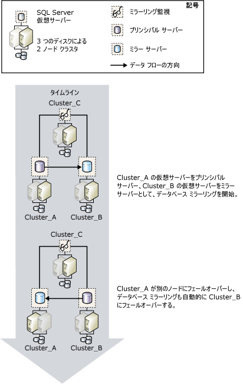

# データベース ミラーリングと SQL Server フェールオーバー クラスター インスタンス
[!INCLUDE[appliesto-ss-xxxx-xxxx-xxx-md](../../includes/appliesto-ss-xxxx-xxxx-xxx-md.md)]
  フェールオーバー クラスターは、リソース グループと呼ばれる [!INCLUDE[msCoName](../../includes/msconame-md.md)] Cluster Service (MSCS) クラスター グループに含まれる、クラスターのノードに参加している物理ディスクのうち、1 つ以上を組み合わせたものです。 リソース グループは、 [!INCLUDE[ssNoVersion](../../includes/ssnoversion-md.md)]のインスタンスをホストするフェールオーバー クラスター インスタンスとして構成されます。 [!INCLUDE[ssNoVersion](../../includes/ssnoversion-md.md)] フェールオーバー クラスター インスタンスはネットワーク上では 1 台のコンピューターのように認識されますが、あるノードが利用できなくなった場合に、別のノードへフェールオーバーする機能を備えています。 詳細については、「[Always On フェールオーバー クラスター インスタンス &#40;SQL Server&#41;](../../sql-server/failover-clusters/windows/always-on-failover-cluster-instances-sql-server.md)」を参照してください。  
  
 フェールオーバー クラスターにより、[!INCLUDE[msCoName](../../includes/msconame-md.md)] [!INCLUDE[ssNoVersion](../../includes/ssnoversion-md.md)] インスタンス全体の高可用性が確保されます。一方、データベース ミラーリングは、単一データベースの高可用性を確保します。 データベース ミラーリングは、フェールオーバー クラスター間のほか、フェールオーバー クラスターと非クラスター化ホスト間でも機能します。  
  
> [!NOTE]  
>  データベース ミラーリングの概要については、「 [データベース ミラーリング &#40;SQL Server&#41;](../../database-engine/database-mirroring/database-mirroring-sql-server.md)」を参照してください。  
  
## ミラーリングおよびクラスタリング  
 通常、ミラーリングとクラスタリングを併せて使用する場合は、プリンシパル サーバーもミラー サーバーもクラスター上に配置し、プリンシパル サーバーとミラー サーバーをそれぞれ異なるクラスターのフェールオーバー クラスター インスタンス上で実行します。 ただし、パートナーの一方をクラスター内のフェールオーバー クラスター インスタンスに配置し、もう一方を別の非クラスター化コンピューターに配置するというミラーリング セッションを確立することもできます。  
  
 クラスターのフェールオーバーによりプリンシパル サーバーが一時的に利用できなくなった場合、データベースへのクライアント接続は切断されます。 クラスター フェールオーバーが完了すると、クライアントは、 [動作モード](../../database-engine/database-mirroring/database-mirroring-operating-modes.md)に応じて同じクラスター、別のクラスター、または非クラスター化コンピューター上のプリンシパル サーバーに再接続できるようになります。 そのため、クラスター化環境でデータベース ミラーリングをどのように構成するかを決める場合は、ミラーリングで使用する動作モードが大きな意味を持ちます。  
  
### 自動フェールオーバーを伴う高い安全性モードのセッション  
 自動フェールオーバーを伴う高い安全性モードのデータベースをミラー化する場合は、パートナーに 2 クラスター構成を使用することをお勧めします。 この構成であれば、最高の可用性が得られます。 ミラーリング監視サーバーは、別のクラスターに配置するか、非クラスター化コンピューターに配置できます。  
  
 現在のプリンシパル サーバーを実行しているノードで障害が発生した場合は、クラスターの別のノードへのフェールオーバーが進められている間に、データベースの自動フェールオーバーが数秒のうちに開始されます。 データベース ミラーリング セッションは、もう一方のクラスターにあるミラー サーバー、または非クラスター化コンピューターにフェールオーバーされ、これまでミラー サーバーであったサーバーがプリンシパル サーバーになります。 新しいプリンシパル サーバーは、可能な限り短時間でそのサーバーにあるデータベースのコピーをロールフォワードし、プリンシパル データベースとしてこれをオンラインにします。 クラスターのフェールオーバーが完了すると (通常、数分で完了します)、それまでプリンシパル サーバーであったフェールオーバー クラスター インスタンスがミラー サーバーになります。  
  
 次の図は、ミラーリング監視サーバー (自動フェールオーバーをサポート) を配置した高い安全性モードで運用されているミラーリング セッションにおけるクラスター間の自動フェールオーバーを表しています。  
  
   
  
 ミラーリング セッションを構成する 3 つのサーバー インスタンスが、それぞれ異なる次のクラスターに配置されています: **Cluster_A**、**Cluster_B**、**Cluster_C**。 各クラスターでは、 [!INCLUDE[ssNoVersion](../../includes/ssnoversion-md.md)] の既定のインスタンスが [!INCLUDE[ssNoVersion](../../includes/ssnoversion-md.md)] フェールオーバー クラスター インスタンスとして実行されています。 ミラーリング セッションが開始されると、 **Cluster_A** のフェールオーバー クラスター インスタンスはプリンシパル サーバー、 **Cluster_B** のフェールオーバー クラスター インスタンスはミラー サーバー、 **Cluster_C** のフェールオーバー クラスター インスタンスはミラーリング監視サーバーとして機能します。 ここで、 **Cluster_A** でのアクティブなノードで障害が発生し、プリンシパル サーバーが利用できなくなったとします。  
  
 クラスターがフェールオーバーを行う前に、ミラーリング監視サーバーを併用することにより、プリンシパル サーバーが使用できなくなったことがミラー サーバーによって検出されます。 ミラー サーバーは、可能な限り短時間でこのサーバーにあるデータベースをロールフォワードし、プリンシパル データベースとしてこれをオンラインにします。 **Cluster_A** のフェールオーバーが完了すると、これまでのプリンシパル サーバーは現在はミラー サーバーになり、このサーバーのデータベースが **Cluster_B**の現在のプリンシパル データベースと同期されます。  
  
### 自動フェールオーバーを伴わない高い安全性モードのセッション  
 自動フェールオーバーを伴わない高い安全性モードのデータベースをミラー化する場合は、現在のプリンシパル サーバーを実行しているノードで障害が発生すると、クラスター内の別のノードがプリンシパル サーバーとして機能するようになります。 クラスターが利用できない間は、データベースも利用できないことに注意してください。  
  
### 高パフォーマンス モードのセッション  
 高パフォーマンス モードのデータベースをミラー化する場合は、プリンシパル サーバーをクラスター上のフェールオーバー クラスター インスタンスに、ミラー サーバーをリモートの非クラスター化サーバーに配置することをお勧めします。 クラスターが別のノードにフェールオーバーした場合、ミラーリング セッションではフェールオーバー クラスター インスタンスが引き続きプリンシパル サーバーとして機能します。 クラスター全体に問題がある場合、ミラー サーバーにサービスを強制できます。  
  
 **新しい SQL Server フェールオーバー クラスターをセットアップするには**  
  
-   [新しい SQL Server フェールオーバー クラスターの作成 &#40;セットアップ&#41;](../../sql-server/failover-clusters/install/create-a-new-sql-server-failover-cluster-setup.md)  
  
 **データベース ミラーリングをセットアップするには**  
  
-   [データベース ミラーリングの設定 &#40;SQL Server&#41;](../../database-engine/database-mirroring/setting-up-database-mirroring-sql-server.md)  
  
-   [Windows 認証を使用してデータベース ミラーリング セッションを確立する &#40;SQL Server Management Studio&#41;](../../database-engine/database-mirroring/establish-database-mirroring-session-windows-authentication.md)  
  
## 参照  
 [データベース ミラーリング &#40;SQL Server&#41;](../../database-engine/database-mirroring/database-mirroring-sql-server.md)   
 [データベース ミラーリングの動作モード](../../database-engine/database-mirroring/database-mirroring-operating-modes.md)   
 [Always On フェールオーバー クラスター インスタンス &#40;SQL Server&#41;](../../sql-server/failover-clusters/windows/always-on-failover-cluster-instances-sql-server.md)  
  
  
