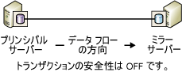
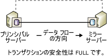
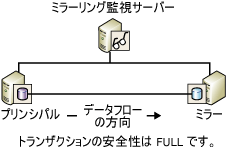

# <a name="database-mirroring-operating-modes"></a>データベース ミラーリングの動作モード
[!INCLUDE[appliesto-ss-xxxx-xxxx-xxx-md](../../includes/appliesto-ss-xxxx-xxxx-xxx-md.md)]
  このトピックでは、データベース ミラーリング セッションの同期動作モードおよび非同期動作モードについて説明します。  
  
> [!NOTE]  
>  データベース ミラーリングの概要については、「 [データベース ミラーリング &#40;SQL Server&#41;](../../database-engine/database-mirroring/database-mirroring-sql-server.md)」を参照してください。  
  
  
##  <a name="TermsAndDefinitions"></a> 用語と定義  
 ここでは、このトピックの中心となるいくつかの用語を紹介します。  
  
 高パフォーマンス モード  
 データベース ミラーリング セッションは非同期に動作し、プリンシパル サーバーとミラー サーバーのみを使用します。 役割の交代の形式は、強制されたサービス (データ損失の可能性あり) のみです。  
  
 高い安全性モード (High-safety mode)  
 データベース ミラーリング セッションは同期して動作し、必要に応じてミラーリング監視サーバー、およびプリンシパル サーバーとミラー サーバーを使用します。  
  
 トランザクションの安全性  
 データベース ミラーリング セッションが同期して動作するか、非同期で動作するかを決定する、ミラーリング固有のデータベース プロパティ。 安全性レベルには次の 2 種類があります: FULL と OFF。  
  
 ミラーリング監視サーバー  
 高い安全性モードの場合にのみ使用します。必要に応じて配置できる SQL Server のインスタンスです。ミラーリング監視サーバーを使用することにより、ミラー サーバーが自動フェールオーバーを開始するかどうかを決定できるようになります。 2 つのフェールオーバー パートナーとは異なり、ミラーリング監視サーバーではデータベースの操作は行いません。 ミラーリング監視サーバーの唯一の役割は、自動フェールオーバーをサポートすることです。  
  
## <a name="asynchronous-database-mirroring-high-performance-mode"></a>非同期データベース ミラーリング (高パフォーマンス モード)  
 ここでは、非同期データベース ミラーリングのしくみ、高パフォーマンス モードの使用に適した状況、およびプリンシパル サーバーで障害が発生した場合の対処法について説明します。  
  
> [!NOTE]  
>  [!INCLUDE[ssCurrent](../../includes/sscurrent-md.md)] のほとんどのエディションでは、同期データベース ミラーリングのみ (安全性レベルが FULL の場合のみ) をサポートしています。 データベース ミラーリングを完全にサポートするエディションについては、「[SQL Server 2016 の各エディションとサポートされている機能](../../sql-server/editions-and-supported-features-for-sql-server-2016.md)」の「高可用性 (Always On)」を参照してください。
  
 トランザクションの安全性が OFF に設定されていると、データベース ミラーリング セッションが非同期に動作します。 非同期動作は、高パフォーマンス モードという動作モードのみでサポートされています。 このモードでは高可用性という点を譲歩してパフォーマンスが強化されています。 高パフォーマンス モードでは、プリンシパル サーバーおよびミラー サーバーのみを使用します。 ミラー サーバーで発生した問題がプリンシパル サーバーに影響を及ぼすことはありません。 プリンシパル サーバーが停止した場合、ミラー データベースは DISCONNECTED になりますがウォーム スタンバイ状態で利用できます。  
  
 高パフォーマンス モードでサポートされている役割の交代方法は、"強制されたサービス" のみです (データ損失の可能性があります)。この方法では、ミラー サーバーをウォーム スタンバイ サーバーとして使用します。 強制されたサービスは、プリンシパル サーバーの障害に対して取ることのできる対応の 1 つです。 データの損失が発生する可能性があるので、ミラーにサービスを強制する前に、まず別の対応策がないか検討してください。 詳細については、このトピックの後半の「 [プリンシパルの障害への対応](#WhenPrincipalFails)」を参照してください。  
  
 下図に、高パフォーマンス モードのセッション構成を示します。  
  
   
  
 高パフォーマンス モードでは、プリンシパル サーバーはミラー サーバーにトランザクションのログを送信すると、その直後にミラー サーバーからの受信確認を待機することなくクライアントに確認を送信します。 トランザクションは、ミラー サーバーでログがディスクに書き込まれるのを待機することなく、コミットされます。 非同期動作では、トランザクションの遅延を最小限に抑えてプリンシパル サーバーを実行できます。  
  
 ミラー サーバーはプリンシパル サーバーから送信されるログ レコードとの時間差を埋めようとします。 ミラー データベースは、プリンシパル データベースよりやや遅れることがありますが、データベース間の時間差は通常小さくなります。 ただし、プリンシパル サーバーのワークロードが高い場合やミラー サーバーのシステムの負荷が限界を超えた場合は、この時間差が大きくなることがあります。  
  
 **このセクションの内容**  
  
-   [高パフォーマンス モードの使用を推奨するケース](#WhenUseHighPerf)  
  
-   [高パフォーマンス モードのミラーリング監視の影響](#WitnessImpactOnHighPerf)  
  
-   [プリンシパルの障害への対応](#WhenPrincipalFails)  
  
###  <a name="WhenUseHighPerf"></a> 高パフォーマンス モードの使用を推奨するケース  
 プリンシパル サーバーから非常に離れた場所にミラー サーバーを設置していたり、軽度のエラーによるプリンシパル サーバーへの影響でも不都合が生じる災害復旧シナリオでは、高パフォーマンス モードが適切である場合があります。  
  
> [!NOTE]  
>  ログ配布はデータベース ミラーリングを補うことができ、非同期データベース ミラーリングの有効な代替手段です。 ログ配布の利点については、「[高可用性ソリューション &#40;SQL Server&#41;](../../sql-server/failover-clusters/high-availability-solutions-sql-server.md)」を参照してください。 ログ配布とデータベース ミラーリングの使用方法の詳細については、「[データベース ミラーリングとログ配布 &#40;SQL Server&#41;](../../database-engine/database-mirroring/database-mirroring-and-log-shipping-sql-server.md)」を参照してください。  
  
###  <a name="WitnessImpactOnHighPerf"></a> 高パフォーマンス モードのミラーリング監視の影響  
 Transact-SQL を使用して高パフォーマンス モードを構成する場合、SAFETY プロパティを OFF に設定した際には常に、WITNESS プロパティも OFF に設定することを強くお勧めします。 ミラーリング監視は高パフォーマンス モードでも使用できますが、使用による利点はなく、リスクが増えるだけです。  
  
 いずれかのパートナーがダウンし、ミラーリング監視がセッションから切断された場合、データベースは使用できなくなります。 この理由は、高パフォーマンス モードにミラーリング監視は本来必要でないにもかかわらず、ミラーリング監視が設定されている場合、セッションには 2 つ以上のサーバー インスタンスから構成されるクォーラムが必要になるからです。 セッションがクォーラムを失った場合、データベースとして機能することができません。  
  
 ミラーリング監視が高パフォーマンス モード セッションで設定された場合、クォーラムを適用すると次のようになります。  
  
-   ミラー サーバーが失われた場合、プリンシパル サーバーをミラーリング監視サーバーに接続する必要があります。 クォーラムがない場合、プリンシパル サーバーは、ミラーリング監視サーバーまたはミラー サーバーのいずれかが再度セッションに参加するまで、データベースをオフラインにします。  
  
-   プリンシパル サーバーが失われた場合、ミラー サーバーにサービスを強制するには、ミラー サーバーがミラーリング監視に接続している必要があります。  
  
> [!NOTE]  
>  クォーラムの種類の詳細については、「[クォーラム: データベースの可用性にミラーリング監視サーバーが与える影響 (データベース ミラーリング)](../../database-engine/database-mirroring/quorum-how-a-witness-affects-database-availability-database-mirroring.md)」を参照してください。  
  
###  <a name="WhenPrincipalFails"></a> プリンシパルの障害への対応  
 プリンシパルに障害が発生した場合、データベースの所有者は次のいずれかを選択できます。  
  
-   プリンシパルが再度使用できるようになるまで、データベースを復旧しない。  
  
     プリンシパル データベースおよびそのトランザクション ログが破損していない場合、コミットされたすべてのトランザクションを維持できますが、可用性の点で譲歩が必要になります。  
  
-   データベース ミラーリング セッションを停止し、手動でデータベースを更新してから、新しいデータベース ミラーリング セッションを開始する。  
  
     プリンシパル データベースが損失していても、プリンシパル サーバーが実行中であればプリンシパル データベースのログ末尾を早急にバックアップします。 ログ末尾のバックアップに成功したら、ミラーリングを削除することが通常は最善の選択肢です。 ミラーリングを削除した後は、すべてのデータが保存されている、以前のミラー データベースにログを復元できます。  
  
    > [!NOTE]  
    >  ログ末尾のバックアップに失敗してプリンシパル サーバーの復旧を待てない場合、サービスの強制を検討してください。この方法には、セッションの状態を維持できるという利点があります。  
  
-   ミラー サーバーにサービスを強制する (データが損失する可能性があります)。  
  
     強制されたサービスは、厳密には災害時の復旧方法なので、慎重に使用する必要があります。 サービスを強制できるのは、プリンシパル サーバーがダウンし、セッションが非同期である (トランザクションの安全性が OFF に設定されている) 状態で、セッションにミラーリング監視サーバーが存在しない (WITNESS プロパティが OFF に設定されている) か、ミラーリング監視サーバーがミラー サーバーに接続している (つまり、クォーラムがある) かのいずれかの場合に限ります。  
  
     サービスを強制されたミラー サーバーは、プリンシパルの役割を引き継ぎ、サーバー内にあるデータベースのコピーをクライアントに提供します。 サービスが強制された時点でミラー サーバーに送信されていないプリンシパルのトランザクション ログは、すべて失われます。 このため、強制されたサービスを使用する方法は、データを損失する可能性を許容でき、データベースの早急な復旧が最優先される場合にのみ使用するようにしてください。 サービス強制のしくみ、およびそれを使用する際のベスト プラクティスの詳細については、「[データベース ミラーリング セッション中の役割の交代 &#40;SQL Server&#41;](../../database-engine/database-mirroring/role-switching-during-a-database-mirroring-session-sql-server.md)」を参照してください。  
  
##  <a name="Sync"></a> 同期データベース ミラーリング (高い安全性モード)  
 ここでは、同期データベース ミラーリングのしくみ、高い安全性モード (自動フェールオーバーを伴うモードと伴わないモード)、および自動フェールオーバーにおけるミラーリング監視サーバーの役割について説明します。  
  
 トランザクションの安全性が FULL に設定されている場合、データベース ミラーリング セッションは高い安全性モードで実行され、初期同期フェーズの後に同期操作を行います。 ここでは、同期操作を行うように構成されているデータベース ミラーリング セッションについて詳しく説明します。  
  
 セッションの同期をとるには、ミラー サーバーがミラー データベースとプリンシパル データベースの同期をとる必要があります。 セッションが開始されると、プリンシパル サーバーはアクティブなログをミラー サーバーに送信し始めます。 ミラー サーバーは、できるだけ早く、受信したすべてのログ レコードをディスクに書き込みます。 受信したログ レコードがすべてディスクに書き込まれると、データベースが同期されます。 データベースの同期は、パートナーが互いに通信している限り保持されます。  
  
> [!NOTE]  
>  データベース ミラーリング セッションでの状態変更を監視するには、 **Database Mirroring State Change** イベント クラスを使用します。 詳しくは、「 [Database Mirroring State Change Event Class](../../relational-databases/event-classes/database-mirroring-state-change-event-class.md)」をご覧ください。  
  
 同期が完了したら、プリンシパル データベースにコミットされるトランザクションはすべてミラー サーバーにもコミットされるので、データが確実に保護されます。 これは、トランザクションのログがディスクに再実行用として書き込まれたことを伝えるメッセージをプリンシパル サーバーがミラー サーバーから受信するまで、プリンシパル データベースへのトランザクションのコミットを待機することで実現します。 このメッセージを待機することで、トランザクションの待機時間が長くなることに注意してください。  
  
 同期に必要な時間は、主にセッションの開始時にミラー データベースがプリンシパル データベースからどれだけ遅れたか (プリンシパル サーバーから最初に受信したログ レコード数によって測定)、プリンシパル データベースのワークロード、およびミラー システムの速度に依存します。 セッションが同期された後、再実行用として書き込まれたログのうち、ミラー データベースでまだ再実行されていないものは、再実行キューに残ります。  
  
 ミラー データベースの同期がとられると、データベースの両方のコピーの状態が同期済みに変わります。  
  
 同期操作は次のように行われます。  
  
1.  プリンシパル サーバーは、クライアントからトランザクションを受け取ると、そのトランザクションのログをトランザクション ログに書き込みます。  
  
2.  プリンシパル サーバーはこのトランザクションをデータベースに書き込むと同時に、ログ レコードをミラー サーバーに送信します。 プリンシパル サーバーは、ミラー サーバーから送信される確認を待ってから、トランザクションのコミットまたはロールバックのいずれかをクライアントに確認します。  
  
3.  ミラー サーバーはログをディスクに再実行用として書き込み、確認をプリンシパル サーバーに返します。  
  
4.  プリンシパル サーバーは、ミラー サーバーから確認を受け取ると、確認メッセージをクライアントに送信します。  
  
 高い安全性モードでは、2 か所間のデータの同期を要求することによってデータを保護します。 コミットされているトランザクションはすべて、ミラー サーバー上のディスクに書き込まれることが保証されています。  
  
 **このセクションの内容**  
  
-   [自動フェールオーバーを伴わない高い安全性モード](#HighSafetyWithOutAutoFailover)  
  
-   [自動フェールオーバーを伴う高い安全性モード](#HighSafetyWithAutoFailover)  
  
###  <a name="HighSafetyWithOutAutoFailover"></a> 自動フェールオーバーを伴わない高い安全性モード  
 自動フェールオーバーを伴わない高い安全性モードの構成を次の図に示します。 この構成は、2 つのパートナーのみで構成されています。  
  
   
  
 パートナーが接続され、データベースが既に同期されている場合、手動フェールオーバーがサポートされます。 ミラー サーバー インスタンスがダウンしても、プリンシパル サーバー インスタンスは影響を受けず、公開された状態で (つまり、データをミラー化せずに) 実行されます。 プリンシパル サーバーが利用できなくなると、ミラーリングが中断されますが、サービスをミラー サーバーに強制的に引き継ぐことができます (データを損失する可能性もあります)。 詳細については、「 [データベース ミラーリング セッション中の役割の交代 &#40;SQL Server&#41;](../../database-engine/database-mirroring/role-switching-during-a-database-mirroring-session-sql-server.md)をダウンロードしてください。  
  
###  <a name="HighSafetyWithAutoFailover"></a> 自動フェールオーバーを伴う高い安全性モード  
 自動フェールオーバーは、1 台のサーバーが機能しなくなった後もデータベースが動作し続けるようにすることで、高可用性を実現します。 自動フェールオーバーでは、セッションに 3 番目のサーバー インスタンスとして *ミラーリング監視サーバー*が存在する必要があります。このサーバーは、第 3 のコンピューターに常駐するのが理想的です。 自動フェールオーバーをサポートする高い安全性モードのセッションの構成を次の図に示します。  
  
   
  
 2 つのパートナーとは異なり、ミラーリング監視サーバーではデータベースの操作は行いません。 ミラーリング監視サーバーは、プリンシパル サーバーが正常に動作しているかどうかを確認することにより、自動フェールオーバーをサポートするだけです。 ミラー サーバーが自動フェールオーバーを開始するのは、ミラー サーバーとミラーリング監視サーバーの両方がプリンシパル サーバーから切断された後、そのまま相互に接続されている場合だけです。  
  
 ミラーリング監視サーバーが設定されると、セッションでは *クォーラム*が必要になります。クォーラムとは、データベースを使用できるようにする、少なくとも 2 つのサーバー インスタンス間のリレーションシップのことです。 詳細については、「[データベース ミラーリング監視サーバー](../../database-engine/database-mirroring/database-mirroring-witness.md)」と「[クォーラム: データベースの可用性にミラーリング監視サーバーが与える影響 (データベース ミラーリング)](../../database-engine/database-mirroring/quorum-how-a-witness-affects-database-availability-database-mirroring.md)」を参照してください。  
  
 自動フェールオーバーを行うには以下の条件を満たしている必要があります。  
  
-   データベースが既に同期されている。  
  
-   3 つのサーバー インスタンスがすべて接続されているときに障害が発生し、ミラーリング監視サーバーとミラー サーバーが接続されたままになっている。  
  
 パートナーの損失による影響は次のとおりです。  
  
-   プリンシパル サーバーが使用できなくなると、上記の条件で自動フェールオーバーが発生します。 ミラー サーバーはプリンシパル ロールに切り替わり、そのデータベースをプリンシパル データベースとして提供します。  
  
-   上記の条件が満たされていない場合にプリンシパル サーバーが使用できなくなると、サービスの強制が可能になる場合があります (ただし、データ損失の可能性があります)。 詳細については、「[データベース ミラーリング セッション中の役割の交代 &#40;SQL Server&#41;](../../database-engine/database-mirroring/role-switching-during-a-database-mirroring-session-sql-server.md)」を参照してください。  
  
-   ミラー サーバーのみが使用できなくなっても、プリンシパル サーバーとミラーリング監視サーバーはそのままの状態を維持します。  
  
 セッションでそのミラーリング監視サーバーへの接続が失われた場合、クォーラムを確立するには両方のパートナーが必要です。 いずれかのパートナーがクォーラムを失った場合、両方のパートナーがクォーラムを失い、クォーラムが再確立されるまでデータベースは使用できなくなります。 このクォーラムの要件によって、ミラーリング監視サーバーが存在しない場合は、データベースが *公開された状態*(つまり、ミラー化されていない状態) では実行されないことが保証されます。  
  
> [!NOTE]  
>  ミラーリング監視サーバーが長時間切断されたままであることが予想される場合は、使用できるようになるまでミラーリング監視サーバーをセッションから削除することをお勧めします。  
  
##  <a name="TsqlSettingsAndOpModes"></a> Transact-SQL の設定とデータベース ミラーリングの動作モード  
 ここでは、ALTER DATABASE の設定、ミラー化されたデータベースの状態、およびミラーリング監視サーバー (存在する場合) という観点から、データベース ミラーリング セッションについて説明します。 このセクションは、 [!INCLUDE[tsql](../../includes/tsql-md.md)]ではなく、主に [!INCLUDE[ssManStudioFull](../../includes/ssmanstudiofull-md.md)]を使用してデータベース ミラーリングを管理するユーザーを対象としています。  
  
> [!TIP]  
>  [!INCLUDE[tsql](../../includes/tsql-md.md)]を使用する代わりに、 **[データベースのプロパティ]** ダイアログ ボックスの **[ミラーリング]** ページを使用して、オブジェクト エクスプローラーでセッションの動作モードを制御できます。 詳細については、このトピックの後半の「 [Windows 認証を使用してデータベース ミラーリング セッションを確立する &#40;SQL Server Management Studio&#41;](../../database-engine/database-mirroring/establish-database-mirroring-session-windows-authentication.md)」を参照してください。  
  
 **このセクションの内容**  
  
-   [トランザクションの安全性とミラーリング監視サーバーの状態の動作モードへの影響](#TxnSafetyAndWitness)  
  
-   [安全性設定とミラーリング監視サーバーの状態の表示](#ViewWitness)  
  
-   [プリンシパル サーバーの消失時の動作に影響する要因](#FactorsOnLossOfPrincipal)  
  
###  <a name="TxnSafetyAndWitness"></a> トランザクションの安全性とミラーリング監視サーバーの状態の動作モードへの影響  
 セッションの動作モードは、トランザクションの安全性設定とミラーリング監視サーバーの状態の組み合わせによって決まります。 データベース所有者はいつでも、トランザクションの安全性レベルを変更でき、ミラーリング監視サーバーを追加または削除できます。  
  
 **このセクションの内容**  
  
-   [Transaction Safety](#TxnSafety)  
  
-   [ミラーリング監視サーバーの状態](#WitnessState)  
  
####  <a name="TxnSafety"></a> Transaction Safety  
 トランザクションの安全性とは、データベース ミラーリング セッションが同期して動作するか、非同期で動作するかを決定する、ミラーリング固有のデータベース プロパティです。 安全性レベルには次の 2 種類があります: FULL と OFF。  
  
-   SAFETY FULL  
  
     トランザクションの安全性を FULL に設定すると、セッションは高い安全性モードで同期して動作します。 ミラーリング監視サーバーが存在する場合、セッションでは自動フェールオーバーがサポートされます。  
  
     ALTER DATABASE ステートメントを使用してセッションを確立すると、SAFETY プロパティが FULL に設定された状態でセッションが開始します。つまり、セッションは高い安全性モードで開始されます。 セッションの開始後、ミラーリング監視サーバーを追加できます。  
  
     詳細については、このトピック前半の「 [同期データベース ミラーリング (高い安全性モード)](#Sync)」を参照してください。  
  
-   SAFETY OFF  
  
     トランザクションの安全性を OFF に設定すると、セッションは非同期の高パフォーマンス モードで動作します。 SAFETY プロパティを OFF に設定する場合は、WITNESS プロパティも OFF (既定値) に設定する必要があります。 高パフォーマンス モードのミラーリング監視サーバーによる影響については、このトピック後半の「 [ミラーリング監視サーバーの状態](#WitnessState)」を参照してください。 トランザクションの安全性を無効にした状態での実行の詳細については、「 [非同期データベース ミラーリング (高パフォーマンス モード)](#asynchronous-database-mirroring-high-performance-mode)」を参照してください。  
  
 データベースのトランザクションの安全性設定は、各パートナーについて **sys.database_mirroring** カタログ ビューの **mirroring_safety_level** 列と **mirroring_safety_level_desc** 列に記録されます。 詳細については、「[sys.database_mirroring &#40;Transact-SQL&#41;](../../relational-databases/system-catalog-views/sys-database-mirroring-transact-sql.md)」を参照してください。  
  
 データベース所有者であれば、トランザクションの安全性レベルをいつでも変更できます。  
  
####  <a name="WitnessState"></a> ミラーリング監視サーバーの状態  
 ミラーリング監視サーバーが設定されている場合、クォーラムが必要なため、ミラーリング監視サーバーの状態は常に重要です。  
  
 ミラーリング監視サーバーが存在する場合、その状態は以下の 2 つの状態のいずれかになります。  
  
-   ミラーリング監視サーバーをパートナーに接続している場合、ミラーリング監視サーバーはそのパートナーに対して CONNECTED 状態になり、そのパートナーのクォーラムを持ちます。 この場合、いずれかのパートナーが使用できない場合でも、データベースは使用できるようになります。  
  
-   ミラーリング監視サーバーが存在してもパートナーに接続されていない場合は、ミラーリング監視サーバーはそのパートナーに対して UNKOWN 状態または DISCONNECTED 状態になります。 この場合、ミラーリング監視サーバーではそのパートナーのクォーラムが不足します。また、パートナーが相互に接続されていない場合、データベースは使用できなくなります。  
  
 クォーラムの詳細については、「[クォーラム: データベースの可用性にミラーリング監視サーバーが与える影響 (データベース ミラーリング)](../../database-engine/database-mirroring/quorum-how-a-witness-affects-database-availability-database-mirroring.md)」を参照してください。  
  
 サーバー インスタンス上の各ミラーリング監視サーバーの状態は、**sys.database_mirroring** カタログ ビューの **mirroring_witness_state** 列と **mirroring_witness_state_desc** 列に記録されます。 詳細については、「[sys.database_mirroring &#40;Transact-SQL&#41;](../../relational-databases/system-catalog-views/sys-database-mirroring-transact-sql.md)」を参照してください。  
  
 次の表に、セッションの動作モードと、トランザクションの安全性設定やミラーリング監視サーバーの状態との依存関係の概要を示します。  
  
|動作モード|トランザクションの安全性|ミラーリング監視サーバーの状態|  
|--------------------|------------------------|-------------------|  
|高パフォーマンス モード|OFF|NULL (ミラーリング監視サーバーなし)**|  
|自動フェールオーバーを伴わない高い安全性モード|FULL|NULL (ミラーリング監視サーバーなし)|  
|自動フェールオーバーを伴う高い安全性モード*|FULL|CONNECTED|  
  
 \* ミラーリング監視サーバーが切断された場合は、そのミラーリング監視サーバー インスタンスが使用できるようになるまで、WITNESS を OFF に設定することをお勧めします。  
  
 ** ミラーリング監視サーバーが高パフォーマンス モードで存在する場合、このミラーリング監視サーバーはセッションに参加しません。 ただし、データベースを使用できるようにするには、少なくとも 2 つのサーバー インスタンスが接続された状態にしておく必要があります。 そのため、高パフォーマンス モードのセッションでは、WITNESS プロパティを OFF に設定しておくことをお勧めします。 詳細については、「[クォーラム: データベースの可用性にミラーリング監視サーバーが与える影響 (データベース ミラーリング)](../../database-engine/database-mirroring/quorum-how-a-witness-affects-database-availability-database-mirroring.md)」を参照してください。  
  
###  <a name="ViewWitness"></a> 安全性設定とミラーリング監視サーバーの状態の表示  
 安全性設定やデータベースのミラーリング監視サーバーの状態を表示するには、 **sys.database_mirroring** カタログ ビューを使用します。 関連する列は次のとおりです。  
  
|要素|[列]|[説明]|  
|------------|-------------|-----------------|  
|トランザクションの安全性|**mirroring_safety_level** または **mirroring_safety_level_desc**|ミラー データベース上での更新に関するトランザクションの安全性設定。次のいずれかになります。<br /><br /> UNKNOWN<br /><br /> OFF<br /><br /> FULL<br /><br /> NULL= データベースがオンラインではありません。|  
|ミラーリング監視サーバーの有無|**mirroring_witness_name**|データベース ミラーリングのミラーリング監視サーバー名または NULL。NULL はミラーリング監視サーバーが存在しないことを示します。|  
|ミラーリング監視サーバーの状態|**mirroring_witness_state** または **mirroring_witness_state_desc**|特定のパートナー上のデータベースでのミラーリング監視サーバーの状態。<br /><br /> UNKNOWN<br /><br /> CONNECTED<br /><br /> DISCONNECTED<br /><br /> NULL = ミラーリング監視サーバーが存在しないか、データベースがオンラインではありません。|  
  
 たとえば、プリンシパル サーバーまたはミラー サーバーのいずれかで、次のクエリを入力します。  
  
```  
SELECT mirroring_safety_level_desc, mirroring_witness_name, mirroring_witness_state_desc FROM sys.database_mirroring  
```  
  
 このカタログ ビューの詳細については、「[sys.database_mirroring &#40;Transact-SQL&#41;](../../relational-databases/system-catalog-views/sys-database-mirroring-transact-sql.md)」を参照してください。  
  
###  <a name="FactorsOnLossOfPrincipal"></a> プリンシパル サーバーの消失時の動作に影響する要因  
 次の表に、トランザクションの安全性設定、データベースの状態、およびミラーリング監視サーバーの状態の組み合わせが、プリンシパル サーバーの消失時のミラーリング セッションの動作にどのように影響するかを示します。  
  
|トランザクションの安全性|ミラー データベースのミラーリングの状態|ミラーリング監視サーバーの状態|プリンシパルが停止しているときの動作|  
|------------------------|----------------------------------------|-------------------|-------------------------------------|  
|FULL|SYNCHRONIZED|CONNECTED|自動フェールオーバーが発生します。|  
|FULL|SYNCHRONIZED|DISCONNECTED|ミラー サーバーが停止します。フェールオーバーはできません。データベースを使用できません。|  
|OFF|SUSPENDED または DISCONNECTED|NULL (ミラーリング監視サーバーなし)|サービスがミラー サーバーに強制的に引き継がれます (データが消失する可能性があります)。|  
|FULL|SYNCHRONIZING または SUSPENDED|NULL (ミラーリング監視サーバーなし)|サービスがミラー サーバーに強制的に引き継がれます (データが消失する可能性があります)。|  
  
##  <a name="RelatedTasks"></a> 関連タスク  
  
-   [データベース ミラーリング監視サーバーを追加または置き換える方法 &#40;SQL Server Management Studio&#41;](../../database-engine/database-mirroring/add-or-replace-a-database-mirroring-witness-sql-server-management-studio.md)  
  
-   [Windows 認証を使用してデータベース ミラーリング セッションを確立する &#40;SQL Server Management Studio&#41;](../../database-engine/database-mirroring/establish-database-mirroring-session-windows-authentication.md)  
  
-   [Windows 認証を使用してデータベースのミラーリング監視を追加する &#40;Transact-SQL&#41;](../../database-engine/database-mirroring/add-a-database-mirroring-witness-using-windows-authentication-transact-sql.md)  
  
-   [データベース ミラーリング セッションからのミラーリング監視サーバーの削除 &#40;SQL Server&#41;](../../database-engine/database-mirroring/remove-the-witness-from-a-database-mirroring-session-sql-server.md)  
  
-   [データベース ミラーリング セッションでのトランザクションの安全性の変更 &#40;Transact-SQL&#41;](../../database-engine/database-mirroring/change-transaction-safety-in-a-database-mirroring-session-transact-sql.md)  
  
## <a name="see-also"></a>参照  
 [データベース ミラーリングの監視 &#40;SQL Server&#41;](../../database-engine/database-mirroring/monitoring-database-mirroring-sql-server.md)   
 [データベース ミラーリング監視サーバー](../../database-engine/database-mirroring/database-mirroring-witness.md)  
  
  
