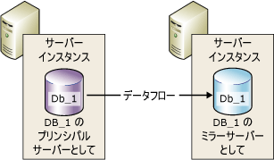
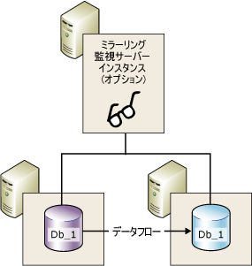
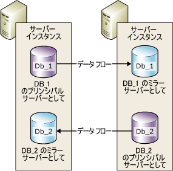

# データベース ミラーリング (SQL Server)
[!INCLUDE[appliesto-ss-xxxx-xxxx-xxx-md](../../includes/appliesto-ss-xxxx-xxxx-xxx-md.md)]
    
> [!NOTE]  
>  [!INCLUDE[ssNoteDepFutureAvoid](../../includes/ssnotedepfutureavoid-md.md)]代わりに [!INCLUDE[ssHADR](../../includes/sshadr-md.md)] を使います。  
  
 *データベース ミラーリング* は、 [!INCLUDE[ssNoVersion](../../includes/ssnoversion-md.md)] データベースの可用性を高めるためのソリューションです。 ミラーリングはデータベースごとに実装され、完全復旧モデルを使用するデータベースでのみ機能します。  
  
> [!IMPORTANT]  
>  データベース ミラーリングのサポート、制限事項、推奨事項、パートナー サーバーの構成に関する前提条件については、「 [データベース ミラーリングの前提条件、制限事項、推奨事項](../../database-engine/database-mirroring/prerequisites-restrictions-and-recommendations-for-database-mirroring.md)」を参照してください。  
  
  
##   データベース ミラーリングの利点  
 データベース ミラーリングは単純なストラテジで、次に示す利点があります。  
  
-   データベースの可用性が向上します。  
  
     障害が発生した場合、自動フェールオーバーを伴う高い安全性モードでは、フェールオーバーによりデータベースのスタンバイ コピーが即座にオンラインになります (データ損失の可能性はありません)。 他の動作モードでは、データベース管理者はデータベースのスタンバイ コピーにサービスを強制する代替の方法 (データ損失の可能性あり) を使用できます。 詳細については、このトピックの「 [役割の交代](#RoleSwitching)」を参照してください。  
  
-   データの保護が強化されます。  
  
     データベース ミラーリングを使用すると、動作モードが高い安全性モードであるか高パフォーマンス モードであるかに応じて、データの冗長化が完全に、またはほぼ完全に行われます。 詳細については、このトピックの「 [動作モード](#OperatingModes)」を参照してください。  
  
     [!INCLUDE[ssEnterpriseEd10](../../includes/ssenterpriseed10-md.md)] 以降のバージョンで動作するデータベース ミラーリング パートナーには、データ ページの読み取りを妨げるエラーを自動的に解決するための機能が備わっています。 ミラーリング セッションを構成する一方のパートナーは、ページを読み取れない場合、もう一方のパートナーに新しいコピーを要求します。 要求が受け入れられ、新しいコピーを取得できた場合は、読み取り不可能なページがそのコピーに置き換えられます。通常、これによりエラーは解決します。 詳細については、「[ページの自動修復 &#40;可用性グループ:データベース ミラーリング&#41;](../../sql-server/failover-clusters/automatic-page-repair-availability-groups-database-mirroring.md)」を参照してください。  
  
-   アップグレード中の実稼働データベースの可用性が向上します。  
  
     ミラー化されたデータベースのダウンタイムを最小限に抑えるために、フェールオーバー パートナーをホストしている [!INCLUDE[ssNoVersion](../../includes/ssnoversion-md.md)] のインスタンスを順次アップグレードできます。 これにより、ダウンタイムはフェールオーバー 1 回分のみになります。 このようなアップグレード形態を *ローリング アップグレード*と呼びます。 詳細については、「 [ミラー化されたインスタンスのアップグレード](../../database-engine/database-mirroring/upgrading-mirrored-instances.md)」を参照してください。  
  
  
##   データベース ミラーリングの用語と定義  
 自動フェールオーバー (automatic failover)  
 プリンシパル サーバーが使用できなくなった場合に、ミラー サーバーがプリンシパル サーバーの役割を引き継ぎ、ミラー サーバーのデータベースのコピーをプリンシパル データベースとしてオンラインにする処理のこと。  
  
 フェールオーバー パートナー (failover partners)  
 ミラー化されたデータベースに関する役割交代用のパートナーとして動作する、2 つのサーバー インスタンス (プリンシパル サーバーまたはミラー サーバー)。  
  
 強制的なサービスの起動 (forced service)  
 プリンシパル サーバーの障害発生時にデータベース所有者が開始するフェールオーバー。その状態が不明である間、ミラー データベースにサービスが転送されます。  
  
 高パフォーマンス モード  
 データベース ミラーリング セッションは非同期に動作し、プリンシパル サーバーとミラー サーバーのみを使用します。 役割の交代の形式は、強制されたサービス (データ損失の可能性あり) のみです。  
  
 高い安全性モード (High-safety mode)  
 データベース ミラーリング セッションは同期して動作し、必要に応じてミラーリング監視サーバー、およびプリンシパル サーバーとミラー サーバーを使用します。  
  
 手動フェールオーバー (manual failover)  
 プリンシパル サーバーがまだ稼働しているときにデータベース所有者が開始するフェールオーバー。同期された状態のまま、プリンシパル データベースからミラー データベースにサービスが転送されます。  
  
 ミラー データベース (mirror database)  
 通常はプリンシパル データベースと完全に同期されるデータベースのコピー。  
  
 ミラー サーバー (mirror server)  
 データベース ミラーリング構成で、ミラー データベースが存在するサーバー インスタンス。  
  
 プリンシパル データベース (principal database)  
 データベース ミラーリングで、そのトランザクション ログ レコードがデータベース (ミラー データベース) の読み取り専用コピーに適用される読み書き可能なデータベース。  
  
 プリンシパル サーバー (principal server)  
 データベース ミラーリングで、現在のプリンシパル データベースを保持するパートナー。  
  
 再実行キュー (redo queue)  
 ミラー サーバーのディスクで待機している、受信したトランザクション ログ レコード。  
  
 ロール (role)  
 プリンシパル サーバーおよびミラー サーバーは補完的にプリンシパルおよびミラーの役割を果たします。 必要に応じて、3 番目のサーバー インスタンスがミラーリング監視の役割を果たします。  
  
 役割の交代  
 プリンシパルの役割がミラーに引き継がれること。  
  
 送信キュー (send queue)  
 プリンシパル サーバーのログ ディスクに蓄積されている未送信のトランザクション ログ レコード。  
  
 セッション  
 プリンシパル サーバー、ミラー サーバー、およびミラーリング監視サーバー (存在する場合) 間でデータベース ミラーリング時に発生するリレーションシップ。  
  
 ミラーリング セッションが開始または再開された後で、プリンシパル サーバーに蓄積されたプリンシパル データベースのログ レコードがミラー サーバーに送信される処理のこと。この処理では、遅延を解消するために、送信されたログ レコードをできるだけ短時間でディスクに書き込みます。  
  
 トランザクションの安全性  
 データベース ミラーリング セッションが同期して動作するか、非同期で動作するかを決定する、ミラーリング固有のデータベース プロパティ。 安全性レベルには次の 2 種類があります: FULL と OFF。  
  
 ミラーリング監視サーバー  
 高い安全性モードの場合にのみ使用します。必要に応じて配置できる SQL Server のインスタンスです。ミラーリング監視サーバーを使用することにより、ミラー サーバーが自動フェールオーバーをいつ開始するかを認識できるようになります。 2 つのフェールオーバー パートナーとは異なり、ミラーリング監視サーバーではデータベースの操作は行いません。 ミラーリング監視サーバーの唯一の役割は、自動フェールオーバーをサポートすることです。  
  
  
##   データベース ミラーリングの概要  
 データベース ミラーリングでは、データベースのコピーが 2 つ保持されます。2 つのコピーは、 [!INCLUDE[ssDEnoversion](../../includes/ssdenoversion-md.md)]の異なるサーバー インスタンスにそれぞれ配置する必要があります。 通常、これらのサーバー インスタンスは、別の場所のコンピューターに存在します。 データベース上でデータベース ミラーリングを開始すると、これらのサーバー インスタンス間で *データベース ミラーリング セッション*と呼ばれるリレーションシップが開始されます。  
  
 一方のサーバー インスタンスは、クライアントにデータベースを提供します ( *プリンシパル サーバー*)。 もう一方のインスタンスは、ミラーリング セッションの構成と状態に応じて、ホット スタンバイ サーバーまたはウォーム スタンバイ サーバーとして動作します ( *ミラー サーバー*)。 データベース ミラーリング セッションが同期されていれば、データベース ミラーリングにより、高速のフェールオーバーをサポートするホット スタンバイ サーバーが提供され、コミット済みのトランザクションのデータが失われることはありません。 セッションが同期されない場合、ミラー サーバーは通常ウォーム スタンバイ サーバーとして使用できます (データ損失の可能性があります)。  
  
 プリンシパル サーバーとミラー サーバーは、 *データベース ミラーリング セッション* の中で *パートナー*として相互に通信および連携します。 2 つのパートナーは、セッション内で *プリンシパル* および *ミラー*という相互に補完する役割を担います。 任意の時点で、一方のパートナーがプリンシパルの役割を担い、もう一方のパートナーがミラーの役割を担います。 それぞれのパートナーは現在の役割を *所有* しているといいます。 プリンシパルの役割を所有するパートナーを *プリンシパル サーバー*といい、このパートナーのデータベースのコピーが現在のプリンシパル データベースになります。 ミラーの役割を所有するパートナーを *ミラー サーバー*といい、このパートナーのデータベースのコピーが現在のミラー データベースになります。 データベース ミラーリングを実稼働環境に配置した場合、プリンシパル データベースが *実稼働データベース*となります。  
  
 データベース ミラーリングでは、プリンシパル データベースで発生したすべての挿入、更新、および削除操作が、可能な限り早くミラー データベースで *再実行されます* 。 再実行は、アクティブなトランザクション ログ レコードのストリームをミラー サーバーに送信することにより行われます。ログ レコードは、できるだけ早く順番にミラー データベースに適用されます。 論理レベルで機能するレプリケーションとは異なり、データベース ミラーリングは物理ログ レコードのレベルで機能します。 [!INCLUDE[ssKatmai](../../includes/sskatmai-md.md)]以降では、トランザクション ログ レコードのストリームが、ミラー サーバーへの送信前にプリンシパル サーバーで圧縮されます。 このログ圧縮はすべてのミラーリング セッションで行われます。  
  
> [!NOTE]  
>  特定のサーバー インスタンスを、同じパートナーまたは別のパートナーを含む複数の同時実行データベース ミラーリング セッションに参加させることができます。 また、サーバー インスタンスを、あるセッションではパートナーとし、別のセッションではミラーリング監視にすることができます。 ミラー サーバー インスタンスでは、同じエディションの [!INCLUDE[ssNoVersion](../../includes/ssnoversion-md.md)]を実行している必要があります。  
  
 **このセクションの内容**  
  
-   [動作モード](#OperatingModes)  
  
-   [役割の交代](#RoleSwitching)  
  
-   [同時実行セッション](#ConcurrentSessions)  
  
-   [クライアント接続](#ClientConnections)  
  
-   [プリンシパルのトランザクション ログに対するセッションの一時停止の影響](#ImpactOfPausing)  
  
  
###   動作モード  
 データベース ミラーリング セッションは、同期動作または非同期動作のどちらかで実行されます。 非同期動作では、ミラー サーバーでログがディスクに書き込まれるのを待機することなくトランザクションがコミットされるので、パフォーマンスが最大限に高められます。 同期動作では、トランザクションが両方のパートナーでコミットされる反面、トランザクションの遅延が大きくなるというデメリットがあります。  
  
 ミラーリングには、2 つの動作モードがあります。 1 つ目の動作モードである *高い安全性モード* では、同期操作がサポートされています。 このモードでは、セッションが開始すると、可能な限り早くミラー サーバーのミラー データベースとプリンシパル データベースが同期されます。 トランザクションの遅延が大きくなるというデメリットもありますが、2 つのデータベースが同期されると、トランザクションは直ちに両方のパートナーでコミットされます。  
  
 2 つ目の動作モードである *高パフォーマンス モード*で非同期的に実行されます。 ミラー サーバーはプリンシパル サーバーから送信されるログ レコードとの時間差を埋めようとします。 ミラー データベースは、プリンシパル データベースよりやや遅れることがあります。 ただし、通常はデータベース間の差は小さなものです。 ところが、プリンシパル サーバーのワークロードが高い場合やミラー サーバーのシステムの負荷が過剰に高い場合は、この時間差が大きくなることがあります。  
  
 高パフォーマンス モードでは、プリンシパル サーバーはミラー サーバーにログ レコードを送信すると、その直後にクライアントに確認を送信します。 ミラー サーバーからの受信確認を待機することはありません。 これは、ミラー サーバーでログがディスクに書き込まれるのを待機することなくトランザクションがコミットされることを意味します。 このような非同期動作では、トランザクションの遅延を最小限に抑えてプリンシパル サーバーを実行できますが、データが損失する可能性があります。  
  
 すべてのデータベース ミラーリング セッションでは、1 つのプリンシパル サーバーと 1 つのミラー サーバーだけがサポートされます。 この構成を次の図に示します。  
  
   
  
 自動フェールオーバーを伴う高い安全性モードでは、 *ミラーリング監視サーバー*と呼ばれる第 3 のサーバー インスタンスが必要です。 2 つのパートナーとは異なり、ミラーリング監視サーバーではデータベースの操作は行いません。 ミラーリング監視サーバーは、プリンシパル サーバーが正常に動作しているかどうかを確認することにより、自動フェールオーバーをサポートします。 ミラー サーバーが自動フェールオーバーを開始するのは、ミラー サーバーとミラーリング監視サーバーの両方がプリンシパル サーバーから切断された後、そのまま相互に接続されている場合だけです。  
  
 次の図に、ミラーリング監視サーバーを含めた構成を示します。  
  
   
  
 詳細については、このトピックの「 [役割の交代](#RoleSwitching)」を参照してください。  
  
> [!NOTE]  
>  新しいミラーリング セッションを確立したり、既存のミラーリング構成にミラーリング監視サーバーを追加したりするには、関係するすべてのサーバー インスタンスが同じバージョンの [!INCLUDE[ssNoVersion](../../includes/ssnoversion-md.md)]を実行している必要があります。 ただし、 [!INCLUDE[ssKatmai](../../includes/sskatmai-md.md)] 以降のバージョンにアップグレードする際には、関係するインスタンスのバージョンが必ずしも同じバージョンであるとは限りません。 詳細については、「 [ミラー化されたインスタンスのアップグレード](../../database-engine/database-mirroring/upgrading-mirrored-instances.md)」を参照してください。  
  
  
####   トランザクションの安全性と動作モード  
 動作モードは、トランザクションの安全性の設定によって、同期または非同期のいずれかになります。 [!INCLUDE[ssManStudioFull](../../includes/ssmanstudiofull-md.md)] だけを使用してデータベース ミラーリングを構成する場合、動作モードを選択するとトランザクションの安全性の設定が自動的に構成されます。  
  
 [!INCLUDE[tsql](../../includes/tsql-md.md)] を使用してデータベース ミラーリングを構成する場合は、トランザクションの安全性の設定方法を理解しておく必要があります。 トランザクションの安全性は、ALTER DATABASE ステートメントの SAFETY プロパティにより制御されます。 ミラー化されるデータベースでは、SAFETY は FULL または OFF になります。  
  
-   SAFETY オプションが FULL に設定されている場合、初期同期フェーズの後、データベース ミラーリング動作が同期されます。 ミラーリング監視サーバーが高い安全性モードに設定されている場合、セッションでは自動フェールオーバーがサポートされます。  
  
-   SAFETY オプションを OFF に設定している場合、データベース ミラーリング動作は非同期になります。 セッションは高パフォーマンス モードで実行され、WITNESS オプションを OFF にする必要があります。  
  
 詳しくは、「 [Database Mirroring Operating Modes](../../database-engine/database-mirroring/database-mirroring-operating-modes.md)」をご覧ください。  
  
  
###   役割の交代  
 データベース ミラーリング セッションでは、 *役割の交代*という処理により、一般的にプリンシパルとミラーの役割を相互交換できます。 役割の交代では、プリンシパルの役割がミラー サーバーに移行されます。 役割の交代では、ミラー サーバーがプリンシパル サーバーの *フェールオーバー パートナー* として動作します。 役割の交代が発生すると、ミラー サーバーがプリンシパルの役割を継承し、データベースのコピーがプリンシパル データベースとしてオンラインになります。 以前のプリンシパル サーバーは利用可能であればミラーの役割を担い、サーバー内のデータベースを新しいミラー データベースにします。 場合によっては、役割を何度も交代できます。  
  
 役割の交代には次の 3 つの形態があります。  
  
-   *Automatic failover*  
  
     これには高い安全性モードが必要で、ミラー サーバーとミラーリング監視サーバーが存在している必要があります。 データベースは既に同期されている必要があり、ミラーリング監視サーバーはミラー サーバーに接続している必要があります。  
  
     ミラーリング監視サーバーの役割は、特定のパートナー サーバーが稼働しているかどうかを確認することです。 ミラー サーバーがプリンシパル サーバーへの接続を失っても、ミラーリング監視サーバーがそのままプリンシパル サーバーに接続している場合、ミラー サーバーはフェールオーバーを開始しません。 詳細については、「 [データベース ミラーリング監視サーバー](../../database-engine/database-mirroring/database-mirroring-witness.md)」を参照してください。  
  
-   *Manual failover*  
  
     これには高い安全性モードが必要です。 パートナーは互いに接続されている必要があり、データベースは既に同期されている必要があります。  
  
-   *サービスの強制* (データ損失の可能性あり)  
  
     自動フェールオーバーを伴わない高パフォーマンス モードと高い安全性モードでは、プリンシパル サーバーで障害が発生し、ミラー サーバーが使用可能な場合、サービスの強制が可能です。  
  
    > [!IMPORTANT]  
    >  高パフォーマンス モードは、ミラーリング監視サーバーなしでの実行を想定しています。 ミラーリング監視サーバーが存在する場合、サービスの強制を行うにはミラーリング監視サーバーがミラー サーバーに接続している必要があります。  
  
 どの役割交代シナリオでも、新しいプリンシパル データベースがオンラインになると、クライアント アプリケーションはデータベースに再接続することにより即座に復旧できます。  
  
  
###   同時実行セッション  
 特定のサーバー インスタンスを、同じサーバー インスタンスまたは別のサーバー インスタンスを含む複数の同時実行データベース ミラーリング セッションに (ミラー化されたデータベースごとに 1 回) 参加させることができます。 多くの場合、サーバー インスタンスは、パートナーまたはミラーリング監視サーバーとしてすべてのデータベース ミラーリング セッション内で排他的に機能します。 ただし、各セッションはその他のセッションから独立しているので、サーバー インスタンスは一部のセッションではパートナーとして機能し、それ以外のセッションではミラーリング監視サーバーとして機能することができます。 たとえば、3 つのサーバー インスタンス (`SSInstance_1`、 `SSInstance_2`、および `SSInstance_3`) の間に次の 4 つのセッションがあるとします。 各サーバー インスタンスは、一部のセッションではパートナーとして機能し、それ以外のセッションではミラーリング監視サーバーとして機能します。  
  
|サーバー インスタンス|データベース A のセッション|データベース B のセッション|データベース C のセッション|データベース D のセッション|  
|---------------------|----------------------------|----------------------------|----------------------------|----------------------------|  
|`SSInstance_1`|ミラーリング監視サーバー|Partner|Partner|Partner|  
|`SSInstance_2`|Partner|ミラーリング監視サーバー|Partner|Partner|  
|`SSInstance_3`|Partner|Partner|ミラーリング監視サーバー|ミラーリング監視サーバー|  
  
 次の図に、2 つのミラーリング セッションに共にパートナーとして参加している 2 つのサーバー インスタンスを示します。 一方のセッションは **Db_1**というデータベース用で、もう一方のセッションは **Db_2**というデータベース用です。  
  
   
  
 それぞれのデータベースは互いに独立しています。 たとえば、1 つのサーバー インスタンスが最初は 2 つのデータベースのミラー サーバーである場合があります。 2 つのデータベースのいずれかでフェールオーバーが発生すると、そのサーバー インスタンスはもう一方のデータベースのミラー サーバーのまま、フェールオーバーしたデータベースのプリンシパル サーバーになります。  
  
 別の例として、自動フェールオーバーを伴う高い安全性モードで実行されている複数のデータベースのプリンシパル サーバーであるサーバー インスタンスを考えてみます。このインスタンスに障害が発生した場合、すべてのデータベースが自動的にそれぞれのミラー データベースにフェールオーバーされます。  
  
 あるサーバー インスタンスをパートナーとしてもミラーリング監視サーバーとしても動作するように構成するときは、データベース ミラーリング エンドポイントで 2 つの役割がサポートされるようにしてください (詳細については、「 [データベース ミラーリング エンドポイント &#40;SQL Server&#41;](../../database-engine/database-mirroring/the-database-mirroring-endpoint-sql-server.md))。 また、リソースの競合を回避するため、システムに十分なリソースを確保してください。  
  
> [!NOTE]  
>  ミラー化したデータベースは互いに独立しているので、データベースをグループとしてフェールオーバーすることはできません。  
  
###   クライアント接続  
 データベース ミラーリング セッションのクライアント接続サポートは、 [!INCLUDE[msCoName](../../includes/msconame-md.md)] .NET Data Provider for [!INCLUDE[ssNoVersion](../../includes/ssnoversion-md.md)]によって提供されます。 詳細については、このトピックの「 [データベース ミラーリング セッションへのクライアントの接続 &#40;SQL Server&#41;](../../database-engine/database-mirroring/connect-clients-to-a-database-mirroring-session-sql-server.md)」を参照してください。  
  
  
###   プリンシパルのトランザクション ログに対するセッションの一時停止の影響  
 データベース所有者はいつでもセッションを一時停止できます。 一時停止では、ミラーリングは削除されますが、セッションの状態は保たれます。 セッションが一時停止すると、プリンシパル サーバーからミラー サーバーに新しいログ レコードが送信されなくなります。 これらのレコードはすべてアクティブなままになり、プリンシパル データベースのトランザクション ログに蓄積されていきます。 データベース ミラーリング セッションが一時停止している限り、トランザクション ログを切り捨てることはできません。 したがって、データベース ミラーリング セッションが長時間一時停止になっていると、ログがいっぱいになります。  
  
 詳細については、このトピックの「 [データベース ミラーリングの一時停止と再開 &#40;SQL Server&#41;](../../database-engine/database-mirroring/pausing-and-resuming-database-mirroring-sql-server.md)」を参照してください。  
  
##   データベース ミラーリング セッションの設定  
 ミラーリング セッションを開始するには、あらかじめデータベース所有者またはシステム管理者がミラー データベースを作成し、エンドポイントおよびログインを構成する必要があります。また、場合によっては証明書を作成および構成する必要もあります。 詳細については、このトピックの「 [データベース ミラーリングの設定 &#40;SQL Server&#41;](../../database-engine/database-mirroring/setting-up-database-mirroring-sql-server.md)」を参照してください。  
  
##   その他のデータベース エンジン機能との相互運用性と共存  
 データベース ミラーリングは、 [!INCLUDE[ssNoVersion](../../includes/ssnoversion-md.md)]の次の機能またはコンポーネントと共に使用できます。  
  
-   [ログ配布](../../database-engine/database-mirroring/database-mirroring-and-log-shipping-sql-server.md)  
  
-   [フルテキスト カタログ](../../database-engine/database-mirroring/database-mirroring-and-full-text-catalogs-sql-server.md)  
  
-   [データベース スナップショット](../../database-engine/database-mirroring/database-mirroring-and-database-snapshots-sql-server.md)  
  
-   [レプリケーション](../../database-engine/database-mirroring/database-mirroring-and-replication-sql-server.md)  
  
##   トピックの内容  
 [データベース ミラーリングの前提条件、制限事項、推奨事項](../../database-engine/database-mirroring/prerequisites-restrictions-and-recommendations-for-database-mirroring.md)  
 データベース ミラーリングを設定するための前提条件と推奨事項について説明します。  
  
 [Database Mirroring Operating Modes](../../database-engine/database-mirroring/database-mirroring-operating-modes.md)  
 データベース ミラーリング セッションの同期動作モードおよび非同期動作モードと、データベース ミラーリング セッション中のパートナーの役割交代について説明します。  
  
 [データベース ミラーリング監視サーバー](../../database-engine/database-mirroring/database-mirroring-witness.md)  
 データベース ミラーリングにおけるミラーリング監視サーバーの役割、複数のミラーリング セッションで 1 つのミラーリング監視サーバーを使用する方法、ミラーリング監視用のソフトウェアとハードウェアの推奨事項、および自動フェールオーバーにおけるミラーリング監視サーバーの役割について説明します。 また、ミラーリング監視サーバーの追加または削除に関する情報も含まれます。  
  
 [データベース ミラーリング セッション中の役割の交代 &#40;SQL Server&#41;](../../database-engine/database-mirroring/role-switching-during-a-database-mirroring-session-sql-server.md)  
 自動フェールオーバー、手動フェールオーバー、および強制的なサービスの起動 (データ損失の可能性あり) を含む、データベース ミラーリング セッション中のパートナーの役割交代について説明します。 役割の交代中に発生するサービスの中断時間の算出についても説明します。  
  
 [データベース ミラーリング中に発生する可能性のあるエラー](../../database-engine/database-mirroring/possible-failures-during-database-mirroring.md)  
 データベース ミラーリング セッションの失敗の原因となる物理的な問題、オペレーティング システムの問題、および [!INCLUDE[ssNoVersion](../../includes/ssnoversion-md.md)] の問題 (ハード エラーとソフト エラーを含む) について説明します。 ミラーリング タイムアウト メカニズムがソフト エラーに対応する方法について説明します。  
  
 [データベース ミラーリング エンドポイント &#40;SQL Server&#41;](../../database-engine/database-mirroring/the-database-mirroring-endpoint-sql-server.md)  
 データベース ミラーリング エンドポイントがどのように機能するかについて説明します。  
  
 [データベース ミラーリングの設定 &#40;SQL Server&#41;](../../database-engine/database-mirroring/setting-up-database-mirroring-sql-server.md)  
 データベース ミラーリングを設定するための前提条件、推奨事項、および手順について説明します。  
  
 [データベース ミラーリング セッションへのクライアントの接続 &#40;SQL Server&#41;](../../database-engine/database-mirroring/connect-clients-to-a-database-mirroring-session-sql-server.md)  
 クライアントの接続文字列の属性と、ミラー化されたデータベースにクライアントを接続および再接続するためのアルゴリズムについて説明します。  
  
 [データベース ミラーリングの一時停止と再開 &#40;SQL Server&#41;](../../database-engine/database-mirroring/pausing-and-resuming-database-mirroring-sql-server.md)  
 データベース ミラーリングを一時停止するとどのような状態になるのか (トランザクション ログの切り捨てに与える影響を含む) について説明します。データベース ミラーリングを一時停止および再開する方法の説明も含まれます。  
  
 [データベース ミラーリングの削除 &#40;SQL Server&#41;](../../database-engine/database-mirroring/removing-database-mirroring-sql-server.md)  
 ミラーリングの削除による影響について説明します。セッションを終了する方法の説明も含まれます。  
  
 [データベース ミラーリングの監視 &#40;SQL Server&#41;](../../database-engine/database-mirroring/monitoring-database-mirroring-sql-server.md)  
 データベース ミラーリング モニターまたは **dbmmonitor** ストアド プロシージャを使用したデータベース ミラーリングまたはセッションの監視について説明します。  
  
  
##   関連タスク  
  
### 構成のタスク  
 **SQL Server Management Studio の使用**  
  
-   [データベース ミラーリング セキュリティ構成ウィザードの起動 &#40;SQL Server Management Studio&#41;](../../database-engine/database-mirroring/start-the-configuring-database-mirroring-security-wizard.md)  
  
-   [Windows 認証を使用してデータベース ミラーリング セッションを確立する &#40;SQL Server Management Studio&#41;](../../database-engine/database-mirroring/establish-database-mirroring-session-windows-authentication.md)  
  
 **Transact-SQL の使用**  
  
-   [Windows 認証を使用してデータベース ミラーリング エンドポイントへのネットワーク アクセスを許可する &#40;SQL Server&#41;](../../database-engine/database-mirroring/database-mirroring-allow-network-access-windows-authentication.md)  
  
-   [データベース ミラーリング エンドポイントで発信接続に証明書を使用できるようにする &#40;Transact-SQL&#41;](../../database-engine/database-mirroring/database-mirroring-use-certificates-for-outbound-connections.md)  
  
-   [データベース ミラーリング エンドポイントで着信接続に証明書を使用できるようにする &#40;Transact-SQL&#41;](../../database-engine/database-mirroring/database-mirroring-use-certificates-for-inbound-connections.md)  
  
-   [Windows 認証でのデータベース ミラーリング エンドポイントの作成 &#40;Transact-SQL&#41;](../../database-engine/database-mirroring/create-a-database-mirroring-endpoint-for-windows-authentication-transact-sql.md)  
  
-   [Windows 認証を使用してデータベース ミラーリング セッションを確立する方法 &#40;Transact-SQL&#41;](../../database-engine/database-mirroring/database-mirroring-establish-session-windows-authentication.md)  
  
-   [Windows 認証を使用してデータベースのミラーリング監視を追加する &#40;Transact-SQL&#41;](../../database-engine/database-mirroring/add-a-database-mirroring-witness-using-windows-authentication-transact-sql.md)  
  
-   [ミラー データベースを設定して TRUSTWORTHY プロパティを使用する &#40;Transact-SQL&#41;](../../database-engine/database-mirroring/set-up-a-mirror-database-to-use-the-trustworthy-property-transact-sql.md)  
  
 **Transact-SQL または SQL Server Management Studio の使用**  
  
-   [ミラー化されたインスタンスのアップグレード](../../database-engine/database-mirroring/upgrading-mirrored-instances.md)  
  
-   [ミラーリングのためのミラー データベースの準備 &#40;Transact-SQL&#41;](../../database-engine/database-mirroring/prepare-a-mirror-database-for-mirroring-sql-server.md)  
  
  
### 管理タスク  
 **Transact-SQL**  
  
-   [データベース ミラーリング セッションでのトランザクションの安全性を変更する &#40;Transact-SQL&#41;](../../database-engine/database-mirroring/change-transaction-safety-in-a-database-mirroring-session-transact-sql.md)  
  
-   [データベース ミラーリング セッションを手動でフェールオーバーする方法 &#40;Transact-SQL&#41;](../../database-engine/database-mirroring/manually-fail-over-a-database-mirroring-session-transact-sql.md)  
  
-   [データベース ミラーリング セッションでのサービスを強制する &#40;Transact-SQL&#41;](../../database-engine/database-mirroring/force-service-in-a-database-mirroring-session-transact-sql.md)  
  
-   [データベース ミラーリング セッションを一時停止または再開する &#40;Transact-SQL&#41;](../../database-engine/database-mirroring/pause-or-resume-a-database-mirroring-session-sql-server.md)  
  
-   [データベース ミラーリング セッションからのミラーリング監視サーバーの削除 &#40;SQL Server&#41;](../../database-engine/database-mirroring/remove-the-witness-from-a-database-mirroring-session-sql-server.md)  
  
-   [データベース ミラーリングを削除する &#40;SQL Server&#41;](../../database-engine/database-mirroring/remove-database-mirroring-sql-server.md)  
  
 **SQL Server Management Studio**  
  
-   [データベース ミラーリング監視サーバーを追加または置き換える方法 &#40;SQL Server Management Studio&#41;](../../database-engine/database-mirroring/add-or-replace-a-database-mirroring-witness-sql-server-management-studio.md)  
  
-   [データベース ミラーリング セッションを手動でフェールオーバーする方法 &#40;SQL Server Management Studio&#41;](../../database-engine/database-mirroring/manually-fail-over-a-database-mirroring-session-sql-server-management-studio.md)  
  
-   [データベース ミラーリング セッションを一時停止または再開する &#40;Transact-SQL&#41;](../../database-engine/database-mirroring/pause-or-resume-a-database-mirroring-session-sql-server.md)  
  
-   [データベース ミラーリング セッションからのミラーリング監視サーバーの削除 &#40;SQL Server&#41;](../../database-engine/database-mirroring/remove-the-witness-from-a-database-mirroring-session-sql-server.md)  
  
-   [データベース ミラーリングを削除する &#40;SQL Server&#41;](../../database-engine/database-mirroring/remove-database-mirroring-sql-server.md)  
  
  
## 参照  
 [データベース ミラーリング エンドポイント &#40;SQL Server&#41;](../../database-engine/database-mirroring/the-database-mirroring-endpoint-sql-server.md)   
 [ページの自動修復 &#40;可用性グループ:データベース ミラーリング&#41;](../../sql-server/failover-clusters/automatic-page-repair-availability-groups-database-mirroring.md)   
 [データベース ミラーリング構成のトラブルシューティング &#40;SQL Server&#41;](../../database-engine/database-mirroring/troubleshoot-database-mirroring-configuration-sql-server.md)   
 [データベース ミラーリング: 相互運用性と共存 &#40;SQL Server&#41;](../../database-engine/database-mirroring/database-mirroring-interoperability-and-coexistence-sql-server.md)   
 [データベース ミラーリングの前提条件、制限事項、推奨事項](../../database-engine/database-mirroring/prerequisites-restrictions-and-recommendations-for-database-mirroring.md)   
 [Always On 可用性グループの概要 &#40;SQL Server&#41;](../../database-engine/availability-groups/windows/overview-of-always-on-availability-groups-sql-server.md)   
 [ログ配布について &#40;SQL Server&#41;](../../database-engine/log-shipping/about-log-shipping-sql-server.md)  
  
  
