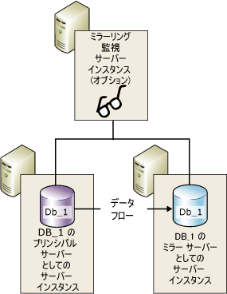
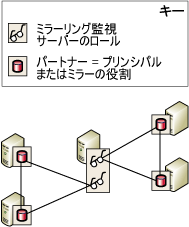

# データベース ミラーリング監視サーバー
[!INCLUDE[appliesto-ss-xxxx-xxxx-xxx-md](../../includes/appliesto-ss-xxxx-xxxx-xxx-md.md)]
  自動フェールオーバーをサポートするには、データベース ミラーリング セッションが高い安全性モードで構成されている必要があります。また、このセッションに *監視サーバー*と呼ばれる 3 番目のサーバー インスタンスを配置する必要もあります。 ミラーリング監視サーバーは、必要に応じて配置できる [!INCLUDE[ssNoVersion](../../includes/ssnoversion-md.md)] のインスタンスです。ミラーリング監視サーバーを使用することにより、高い安全性モードのセッションのミラー サーバーが、自動フェールオーバーを開始するかどうかを決定できるようになります。 2 つのパートナーとは異なり、ミラーリング監視サーバーではデータベースの操作は行いません。 ミラーリング監視サーバーの唯一の役割は、自動フェールオーバーをサポートすることです。  
  
> [!NOTE]  
>  高パフォーマンス モードでは、ミラーリング監視サーバーによって可用性が低下する可能性があります。 データベース ミラーリング セッションでミラーリング監視サーバーを構成すると、プリンシパル サーバーは他のサーバー インスタンスの少なくとも 1 つに接続している必要があります。つまり、ミラー サーバーおよびミラーリング監視サーバーの両方またはいずれか一方と接続している必要があります。 どちらにも接続していないとデータベースが使用できなくなり、サービスの強制はできません (データが失われる損失の可能性あります)。 したがって、高パフォーマンス モードでは、ミラーリング監視サーバーを常に無効に設定しておくことを強くお勧めします。 高パフォーマンス モードに対するミラーリング監視サーバーの影響については、「 [データベース ミラーリングの動作モード](../../database-engine/database-mirroring/database-mirroring-operating-modes.md)」をご覧ください。  
  
 次の図は、ミラーリング監視サーバーを使用した高い安全性モード セッションを示しています。  
  
   
  
 **このトピックの内容**  
  
-   [複数のセッションでのミラーリング監視サーバーの使用](#InMultipleSessions)  
  
-   [ソフトウェアとハードウェアの推奨事項](#SwHwRecommendations)  
  
-   [自動フェールオーバーでのミラーリング監視サーバーの役割](#InAutoFo)  
  
-   [ミラーリング監視サーバーを追加または削除するには](#AddRemoveWitness)  
  
##   複数のセッションでのミラーリング監視サーバーの使用  
 特定のサーバー インスタンスは、それぞれ異なるデータベースに対応している同時実行データベース ミラーリング セッションで、ミラーリング監視サーバーとして機能することができます。 セッションが異なれば、異なるパートナーを含めることができます。 次の図は、ミラーリング監視サーバーが異なるパートナーを含む 2 つのデータベース ミラーリング セッションに参加しているサーバー インスタンスを示しています。  
  
   
  
 同じサーバー インスタンスを一部のセッションではミラーリング監視サーバーとして、他のセッションではパートナーとして、同時に使用することも可能です。 ただし実際には、ミラーリング監視サーバーまたはパートナーのどちらかとしてサーバー インスタンスを使用するのが普通です。 これは、パートナーには実稼働データベースを十分にサポートできるハードウェアを搭載した高度なコンピューターが必要であるのに対し、ミラーリング監視サーバーには [!INCLUDE[ssCurrent](../../includes/sscurrent-md.md)]をサポートするものであればどのような Windows システムでも使用できるためです。  
  
##   ソフトウェアとハードウェアの推奨事項  
 ミラーリング監視サーバーは、パートナーとは別のコンピューターに常駐させることを強くお勧めします。 データベース ミラーリング パートナーは [!INCLUDE[ssNoVersion](../../includes/ssnoversion-md.md)] Standard Edition および [!INCLUDE[ssNoVersion](../../includes/ssnoversion-md.md)] Enterprise Edition でのみサポートされます。 一方、ミラーリング監視サーバーは、 [!INCLUDE[ssNoVersion](../../includes/ssnoversion-md.md)] Workgroup および [!INCLUDE[ssNoVersion](../../includes/ssnoversion-md.md)] Express でもサポートされます。 以前のバージョンの [!INCLUDE[ssNoVersion](../../includes/ssnoversion-md.md)]からアップグレードしている間を除き、ミラーリング セッション内のすべてのサーバー インスタンスでは、同じバージョンの [!INCLUDE[ssNoVersion](../../includes/ssnoversion-md.md)]を実行している必要があります。 たとえば、 [!INCLUDE[ssKatmai](../../includes/sskatmai-md.md)] ミラーリング監視サーバーは、 [!INCLUDE[ssKatmai](../../includes/sskatmai-md.md)] ミラーリング構成からアップグレードする場合にサポートされますが、既存または新規の [!INCLUDE[ssKilimanjaro](../../includes/sskilimanjaro-md.md)] 以降のミラーリング構成には追加できません。  
  
 ミラーリング監視サーバーは、 [!INCLUDE[ssNoVersion](../../includes/ssnoversion-md.md)]のこれらのエディションのいずれかをサポートする任意の信頼性の高いコンピューター システムで実行できます。 ただし、実行中の [!INCLUDE[ssNoVersion](../../includes/ssnoversion-md.md)] の Standard バージョンに必要な最小構成のサーバー インスタンスをミラーリング監視サーバーとして使用することをお勧めします。 ハードウェアとソフトウェアの要件の詳細については、「 [SQL Server 2016 のインストールに必要なハードウェアおよびソフトウェア](../../sql-server/install/hardware-and-software-requirements-for-installing-sql-server.md)」をご覧ください。  
  
##   自動フェールオーバーでのミラーリング監視サーバーの役割  
 データベース ミラーリング セッションの間は、すべてのサーバー インスタンスが接続の状態を監視します。 パートナー間の相互接続が失われると、各パートナーはミラーリング監視サーバーを使用して、少なくとも 1 つのパートナーが現在データベースとして機能していることを確認します。 同期ミラー サーバーからプリンシパル サーバーへの接続が失われても、ミラーリング監視サーバーとの接続が失われていなければ、ミラー サーバーはミラーリング監視サーバーにアクセスして、ミラーリング監視サーバーとプリンシパル サーバーとの接続が失われたかどうかを判断します。  
  
-   プリンシパル サーバーとミラーリング監視サーバーとの接続が失われていなければ、自動フェールオーバーは行われません。 プリンシパル サーバーは引き続きデータベースとして機能し、パートナーから再接続されるときに、その間蓄積したログ レコードをミラー サーバーに送信します。  
  
-   プリンシパル サーバーからミラーリング監視サーバーへの接続も失われている場合、ミラー サーバーはプリンシパル データベースが使用できないことを認識します。 この場合、ミラー サーバーはすぐに自動フェールオーバーを開始します。  
  
-   ミラー サーバーからミラーリング監視サーバーおよびプリンシパル サーバーへの接続がどちらも失われた場合、プリンシパル サーバーがどのような状態であっても、自動フェールオーバーは行えません。  
  
 この少なくとも 2 つのサーバー インスタンスが接続されていなければならない要件を、 *クォーラム*と呼びます。 クォーラムでは、複数のパートナーが同時にデータベースとして機能することはないことが保証されます。 クォーラムのしくみとセッションへの影響については、「[クォーラム: データベースの可用性にミラーリング監視サーバーが与える影響 (データベース ミラーリング)](../../database-engine/database-mirroring/quorum-how-a-witness-affects-database-availability-database-mirroring.md)」を参照してください。  
  
##   ミラーリング監視サーバーを追加または削除するには  
 **ミラーリング監視サーバーを追加するには**  
  
-   [データベース ミラーリング監視サーバーを追加または置き換える方法 &#40;SQL Server Management Studio&#41;](../../database-engine/database-mirroring/add-or-replace-a-database-mirroring-witness-sql-server-management-studio.md)  
  
-   [Windows 認証を使用してデータベースのミラーリング監視を追加する &#40;Transact-SQL&#41;](../../database-engine/database-mirroring/add-a-database-mirroring-witness-using-windows-authentication-transact-sql.md)  
  
 **ミラーリング監視サーバーを削除するには**  
  
-   [データベース ミラーリング セッションからのミラーリング監視サーバーの削除 &#40;SQL Server&#41;](../../database-engine/database-mirroring/remove-the-witness-from-a-database-mirroring-session-sql-server.md)  
  
## 参照  
 [データベース ミラーリング セッション中の役割の交代 &#40;SQL Server&#41;](../../database-engine/database-mirroring/role-switching-during-a-database-mirroring-session-sql-server.md)   
 [データベース ミラーリングの動作モード](../../database-engine/database-mirroring/database-mirroring-operating-modes.md)   
 [クォーラム: データベースの可用性にミラーリング監視サーバーが与える影響 &#40;データベース ミラーリング&#41;](../../database-engine/database-mirroring/quorum-how-a-witness-affects-database-availability-database-mirroring.md)   
 [データベース ミラーリング中に発生する可能性のあるエラー](../../database-engine/database-mirroring/possible-failures-during-database-mirroring.md)   
 [ミラーリング状態 &#40;SQL Server&#41;](../../database-engine/database-mirroring/mirroring-states-sql-server.md)  
  
  
