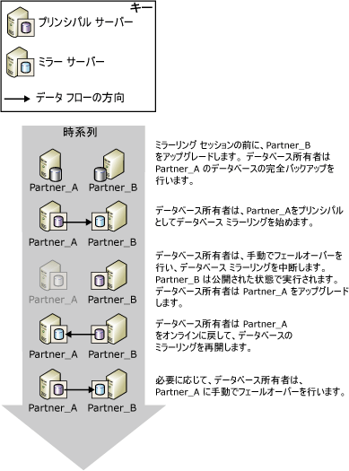
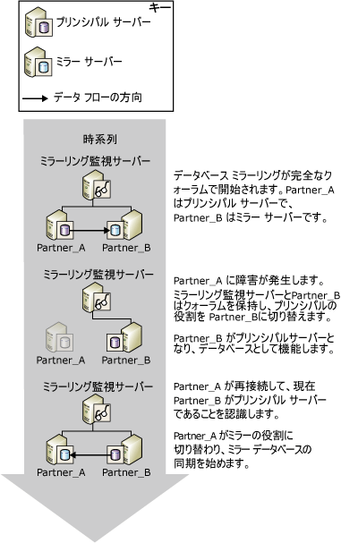
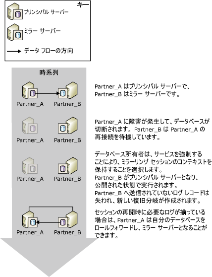

# データベース ミラーリング セッション中の役割の交代 (SQL Server)
[!INCLUDE[appliesto-ss-xxxx-xxxx-xxx-md](../../includes/appliesto-ss-xxxx-xxxx-xxx-md.md)]
  データベース ミラーリング セッションでは、 *役割の交代*という処理により、一般的にプリンシパルとミラーの役割を相互交換できます。 役割の交代では、ミラー サーバーはプリンシパル サーバーに対する *フェールオーバー パートナー* として機能します。プリンシパルの役割を引き継ぎ、サーバー内のデータベースのコピーを復旧し、それを新しいプリンシパル データベースとしてオンラインにします。 以前のプリンシパル サーバーは利用可能であればミラーの役割を担い、サーバー内のデータベースを新しいミラー データベースにします。 場合によっては、複数のエラーに対する対応として、または管理目的のために、役割を何度も交代できます。  
  
> [!NOTE]  
>  このトピックは、データベース ミラーリングの動作モードに詳しいユーザーを対象にしています。 詳しくは、「 [Database Mirroring Operating Modes](../../database-engine/database-mirroring/database-mirroring-operating-modes.md)」をご覧ください。  
  
 次の図は、ミラーリング パートナーである **Partner_A** と **Partner_B**を示しています。一連の自動フェールオーバーまたは手動フェールオーバーで、プリンシパルとミラーの役割を交代しています。  
  
 ")  
  
> [!IMPORTANT]  
>  役割の交代後、以前のプリンシパル データベースで実行されていたジョブを新しいプリンシパル サーバーで実行するには、その新しいプリンシパル サーバーで再作成する必要があります。 詳細については、「[役割の交代後のログインとジョブの管理 &#40;SQL Server&#41;](../../sql-server/failover-clusters/management-of-logins-and-jobs-after-role-switching-sql-server.md)」を参照してください。  
  
 役割の交代には、自動フェールオーバー、手動フェールオーバー、およびサービスの強制 (データ損失の可能性あり) の 3 つの形式があります。 各形式がサポートされるかどうかは、セッションの動作モードによって異なります。  
  
> [!NOTE]  
>  動作モードについて詳しく理解していない場合は、「 [データベース ミラーリングの動作モード](../../database-engine/database-mirroring/database-mirroring-operating-modes.md)」を参照してください。  
  
-   **手動フェールオーバー**  
  
     高い安全性モードでは、手動フェールオーバーがサポートされます。 データベース所有者は、データベースが同期されていれば、いつでも手動フェールオーバーを開始できます。  
  
     手動フェールオーバーは、管理用に用意されています。 詳細については、このトピックの「 [手動フェールオーバー](#ManualFailover)」を参照してください。  
  
-   **Automatic failover**  
  
     ミラーリング監視サーバーを伴う高い安全性モードで、自動フェールオーバーがサポートされます。 ミラーリング監視サーバーとミラー サーバーの相互接続が維持されていて、データベースの同期が完了しているときに、プリンシパル サーバーが使用できなくなった場合のみ、自動フェールオーバーが行われます。 詳細については、このトピックの「 [自動フェールオーバー](#AutomaticFailover)」を参照してください。  
  
-   **サービスの強制 (データ損失の可能性あり)**  
  
     サービスの強制は、ミラーリング監視サーバーを伴わない高い安全性モード、および高パフォーマンス モードでサポートされます。 プリンシパル サーバーが停止した場合、データベース所有者はミラー サーバーにサービスを強制して (データ損失の可能性あり)、データベースを利用できるようにすることができます。  
  
    > [!NOTE]  
    >  高パフォーマンス モードでは、WITNESS プロパティを OFF に設定することをお勧めします。 それ以外の設定では、データベースをオンラインにするためには、ミラー サーバーをミラーリング監視サーバーに接続する必要があります。  
  
     詳細については、このトピックの「 [サービスの強制 (データ損失の可能性あり)](#ForcedService)」を参照してください。  
  
 次の表に、各動作モードでサポートされるフェールオーバーの形式をまとめます。  
  
||高パフォーマンス|ミラーリング監視サーバーを伴わない高い安全性モード|ミラーリング監視サーバーを伴う高い安全性モード|  
|-|----------------------|-----------------------------------------|--------------------------------------|  
|自動フェールオーバー|いいえ|いいえ|はい|  
|手動フェールオーバー|いいえ|はい|はい|  
|サービスの強制|はい|はい|いいえ|  
  
 役割の交代後、すべてのデータベース ユーザーが新しいプリンシパル データベースにアクセスできるようにするには、特定のメタデータが両方のパートナーに存在する必要があります。 また、データベースが定期的にバックアップされ続けるようにするには、新しいプリンシパル サーバーでバックアップ ジョブを作成する必要があります。 詳細については、「[役割の交代後のログインとジョブの管理 &#40;SQL Server&#41;](../../sql-server/failover-clusters/management-of-logins-and-jobs-after-role-switching-sql-server.md)」を参照してください。  
  
 役割の交代中、データベース ミラーリングが使用できなくなる時間の長さは、役割の交代の形式、および原因によって異なります。 詳しくは、「 [役割の交代中に発生するサービスの中断時間の算出 &#40;データベース ミラーリング&#41;](../../database-engine/database-mirroring/estimate-the-interruption-of-service-during-role-switching-database-mirroring.md)という処理により、一般的にプリンシパルとミラーの役割を相互交換できます。  
  
##   Manual Failover  
 手動フェールオーバーによりデータベースからクライアントが切断され、パートナーの役割が元に戻ります。 手動フェールオーバーがサポートされているのは、高い安全性モードのみです。  
  
 **このセクションの内容**  
  
-   [アップグレード中の可用性の維持](#AvailabilityDuringUpgrades)  
  
-   [手動フェールオーバーに必要な条件](#ConditionsForManualFo)  
  
-   [手動フェールオーバーの動作](#HowManualFoWorks)  
  
###   アップグレード中の可用性の維持  
 データベース管理者は、可用性を損なうことなくハードウェアやソフトウェアをアップグレードするために、手動フェールオーバーを行うことができます。 ソフトウェアをアップグレードするためにデータベース ミラーリングを使用する場合、ミラー サーバーのソフトウェア、ハードウェアのアップグレードを先に行う必要があります。  
  
> [!NOTE]  
>  データベース ミラーリングではローリング アップグレードを実行できることになっていますが、将来の変更については不明であるため、この動作は保証されていません。 詳細については、「 [ミラー化されたインスタンスのアップグレード](../../database-engine/database-mirroring/upgrading-mirrored-instances.md)」を参照してください。  
  
 次の図は、データベース サーバー インスタンスをアップグレードするときに、データベースの可用性を保持するために手動フェールオーバーを使用している例を示しています。 アップグレードが完了すると、管理者は必要に応じて元のサーバー インスタンスにフェールオーバーを行うことができます。 これは、管理者がミラーリング セッションを停止し、他の場所にあるミラー サーバーを使用する場合に役に立ちます。 この方法により、一連のデータベース サーバー インスタンスを更新するときに、1 つのサーバー インスタンスを繰り返し使用できます。  
  
   
  
###   手動フェールオーバーに必要な条件  
 手動フェールオーバーでは、トランザクションの安全性が FULL (高い安全性モード) に設定されている必要があります。 パートナーが接続され、データベースが既に同期されている場合、手動フェールオーバーがサポートされます。  
  
###   手動フェールオーバーの動作  
 手動フェールオーバーにより、次の一連の操作が開始されます。  
  
1.  プリンシパル サーバーでは、プリンシパル データベースからクライアントが切断され、ログの末尾がミラー サーバーに送信されます。また、ミラー ロールへの切り替えの準備として、ミラーリングの状態が SYNCHRONIZING に設定されます。  
  
2.  フェールオーバーのログ シーケンス番号 (LSN) としてプリンシパルから受信した、最後のログ レコードの LSN が、ミラー サーバーに記録されます。  
  
    > [!NOTE]  
    >  この LSN を表示するには、[sys.database_mirroring &#40;Transact-SQL&#41;](../../relational-databases/system-catalog-views/sys-database-mirroring-transact-sql.md) から **mirroring_failover_lsn** 列を選択します。  
  
3.  再実行キューで待機しているログがある場合は、ミラー サーバーがミラー データベースのロールフォワードを完了します。 必要な時間は、システムの処理速度、最近の作業負荷、および再実行キューのログの量によって異なります。 同期動作モードの場合、再実行キューのサイズを制限することでフェールオーバーの時間を調節できます。 ただし、同期動作モードでは、ミラー サーバーの遅れを取り戻すためにプリンシパル サーバーの処理速度が低下する場合があります。  
  
    > [!NOTE]  
    >  再実行キューの現在のサイズを調べるには、データベース ミラーリング パフォーマンス オブジェクトの **Redo Queue** パフォーマンス カウンターを使用します (詳細については、「[データベースミラーリングの監視 &#40;SQL Server&#41;](../../database-engine/database-mirroring/monitoring-database-mirroring-sql-server.md)」を参照してください)。  
  
4.  ミラー サーバーが新たにプリンシパル サーバーになり、前のプリンシパル サーバーが新たにミラー サーバーになります。  
  
5.  新しいプリンシパル サーバーでは、コミットされていないトランザクションがロールバックされ、データベースのコピーがプリンシパル データベースとしてオンラインになります。  
  
6.  前のプリンシパルがミラーの役割を引き継ぎ、前のプリンシパル データベースがミラー データベースになります。 新しいミラー サーバーでは、新しいミラー データベースと新しいプリンシパル データベースとの再同期が迅速に実行されます。  
  
    > [!NOTE]  
    >  新しいミラー サーバーによってデータベースの再同期が完了すると、再度フェールオーバーが可能になりますが、今度は反対方向にフェールオーバーされることになります。  
  
 フェールオーバー後は、クライアントから現在のプリンシパル データベースに再接続する必要があります。 詳細については、このトピックの「 [データベース ミラーリング セッションへのクライアントの接続 &#40;SQL Server&#41;](../../database-engine/database-mirroring/connect-clients-to-a-database-mirroring-session-sql-server.md)」を参照してください。  
  
 **手動フェールオーバーを開始するには**  
  
-   [データベース ミラーリング セッションを手動でフェールオーバーする方法 &#40;SQL Server Management Studio&#41;](../../database-engine/database-mirroring/manually-fail-over-a-database-mirroring-session-sql-server-management-studio.md)  
  
-   [データベース ミラーリング セッションを手動でフェールオーバーする方法 &#40;Transact-SQL&#41;](../../database-engine/database-mirroring/manually-fail-over-a-database-mirroring-session-transact-sql.md)。  
  
##   Automatic Failover  
 自動フェールオーバーは、ミラーリング監視サーバーを使用して高い安全性モードで実行されているデータベース ミラーリング セッション (*自動フェールオーバーを伴う高い安全性モード*) でのみサポートされます。 自動フェールオーバーを伴う高い安全性モードでは、一度データベースが同期されると、プリンシパル データベースが使用できなくなった場合に自動フェールオーバーが行われます。 自動フェールオーバーが発生すると、ミラー サーバーがプリンシパル サーバーの役割を引き継ぎ、ミラー サーバーのデータベースのコピーがプリンシパル データベースとしてオンラインになります。 データベースが同期していることを要件とすることで、プリンシパル データベースでコミットされたすべてのトランザクションがミラー データベースでもコミットされるため、フェールオーバーの間のデータの損失を防ぐことができます。  
  
> [!IMPORTANT]  
>  自動フェールオーバーの信頼性を向上させるには、ミラー データベースとプリンシパル データベースを別のコンピューターに配置する必要があります。  
  
 **このセクションの内容**  
  
-   [自動フェールオーバーに必要な条件](#ConditionsForAutoFo)  
  
-   [自動フェールオーバーの動作](#HowAutoFoWorks)  
  
-   [自動フェールオーバーを無効化するには (SQL Server Management Studio)](#DisableAutoSSMS)  
  
-   [自動フェールオーバーを無効化するには (Transact-SQL の使用)](#DisableAutoTsql)  
  
###   自動フェールオーバーに必要な条件  
 自動フェールオーバーを行うには以下の条件を満たしている必要があります。  
  
-   データベース ミラーリング セッションを高い安全性モードで実行し、ミラーリング監視サーバーを配置している。 詳しくは、「 [Database Mirroring Operating Modes](../../database-engine/database-mirroring/database-mirroring-operating-modes.md)」をご覧ください。  
  
-   ミラー データベースが既に同期している。 同期することで、ミラー サーバーに送信されたすべてのログが再実行用としてディスクに書き込まれます。  
  
-   プリンシパル サーバーとその他のデータベース ミラーリング構成との通信が切断され、ミラー サーバーとミラーリング監視サーバーはクォーラムを保持している。 ただし、すべてのサーバー インスタンスで通信が切断された場合、ミラーリング監視サーバーとミラー サーバーの通信が回復しても、自動フェールオーバーは行われません。  
  
    > [!NOTE]  
    >  詳細については、「[クォーラム: データベースの可用性にミラーリング監視サーバーが与える影響 (データベース ミラーリング)](../../database-engine/database-mirroring/quorum-how-a-witness-affects-database-availability-database-mirroring.md)」を参照してください。  
  
-   プリンシパル サーバーの障害がミラー サーバーによって検出される。  
  
     ミラー サーバーによってプリンシパル サーバーの障害がどのように検出されるかは、ハードウェアに関する障害とソフトウェアに関する障害とで異なります。 詳細については、「 [データベース ミラーリング中に発生する可能性のあるエラー](../../database-engine/database-mirroring/possible-failures-during-database-mirroring.md)」を参照してください。  
  
###   自動フェールオーバーの動作  
 上記の条件を満たしている場合、以下の順序で自動フェールオーバーの動作が開始されます。  
  
1.  プリンシパル サーバーがまだ実行中の場合は、プリンシパル データベースの状態が DISCONNECTED に変更され、プリンシパル データベースからすべてのクライアントが切断されます。  
  
2.  プリンシパル サーバーが使用できなくなったことをミラーリング監視サーバーとミラー サーバーが登録します。  
  
3.  再実行キューで待機しているログがある場合は、ミラー サーバーがミラー データベースのロールフォワードを完了します。  
  
    > [!NOTE]  
    >  ログの適用に必要な時間は、システムの処理速度、最近の作業負荷、および再実行キューのログの量によって異なります。  
  
4.  以前のミラー データベースが新しいプリンシパル データベースとしてオンラインになると、復旧によりコミットされていないすべてのトランザクションをできるだけ迅速にロールバックすることでそのようなトランザクションがクリーンアップされます。 これらのトランザクションはロックによって分離されます。  
  
5.  以前のプリンシパル サーバーがセッションに再度参加すると、フェールオーバー パートナーがプリンシパルの役割を所有していることを認識します。 以前のプリンシパル サーバーはミラーの役割を引き継ぎ、サーバー内のデータベースをミラー データベースにします。 この新しいミラー サーバーの新しいミラー データベースは、できるだけ迅速にプリンシパル データベースと同期が取られます。 新しいミラー サーバーによってデータベースの再同期が完了すると、再度フェールオーバーが可能になりますが、今度は反対方向にフェールオーバーされることになります。  
  
 下図に、シングル インスタンスの自動フェールオーバーを示します。  
  
   
  
 最初、3 台のサーバーすべてが接続されています (セッションには完全なクォーラムがあります)。 **Partner_A** がプリンシパル サーバーで、 **Partner_B** がミラー サーバーです。 **Partner_A** ( **Partner_A**のプリンシパル データベース) が使用できなくなります。 ミラーリング監視サーバーと **Partner_B** は、プリンシパルが使用できなくなったことを認識します。セッションのクォーラムは保持されます。 **Partner_B** がプリンシパル サーバーになり、サーバー内のデータベースのコピーを新しいプリンシパル データベースとして使用可能にします。 その後、 **Partner_A** がセッションに再接続すると、 **Partner_B** がプリンシパルの役割を所有していることが検出されます。 そこで**Partner_A** がミラーの役割を引き継ぎます。  
  
 フェールオーバー後は、クライアントから現在のプリンシパル データベースに再接続する必要があります。 詳細については、このトピックの「 [データベース ミラーリング セッションへのクライアントの接続 &#40;SQL Server&#41;](../../database-engine/database-mirroring/connect-clients-to-a-database-mirroring-session-sql-server.md)」を参照してください。  
  
> [!NOTE]  
>  [!INCLUDE[msCoName](../../includes/msconame-md.md)] 分散トランザクション コーディネーターを使用して準備したトランザクションのうち、フェールオーバーの発生時点ではコミットされていなかったトランザクションは、データベースのフェールオーバー後に中断したと見なされます。  
  
###   自動フェールオーバーを無効化するには (SQL Server Management Studio)  
 **[データベースのプロパティ] の [ミラーリング]** ページを開き、次のいずれかのオプションを選択して動作モードを変更します。  
  
-   **[自動フェールオーバーを伴わない高い安全性 (同期)]**  
  
     このモードでは、データベースの同期が継続され、引き続き手動フェールオーバーを実行できます。  
  
-   **[高パフォーマンス (非同期)]**  
  
     このモードでは、ミラー データベースでプリンシパル データベースに対する多少の遅延が発生するため、手動フェールオーバーを実行できません。  
  
###   自動フェールオーバーを無効化するには (Transact-SQL の使用)  
 データベース ミラーリング セッションの任意の時点で、データベース所有者はミラーリング監視サーバーを無効にすることで、自動フェールオーバーを無効にできます。  
  
 **ミラーリング監視サーバーを無効にするには**  
  
-   [データベース ミラーリング セッションからのミラーリング監視サーバーの削除 &#40;SQL Server&#41;](../../database-engine/database-mirroring/remove-the-witness-from-a-database-mirroring-session-sql-server.md)  
  
    > [!NOTE]  
    >  トランザクションの安全性を FULL に保ったままミラーリング監視サーバーを無効にすると、セッションは自動フェールオーバーを伴わない高い安全性モードになります。  
  
##   Forced Service (with Possible Data Loss)  
 データベース ミラーリングには、ディザスター リカバリー方法としてサービスの強制 (データ損失の可能性あり) を利用でき、ミラー サーバーをウォーム スタンバイ サーバーとして使用できます。 サービスを強制できるのは、プリンシパル サーバーが、ミラーリング セッションでミラー サーバーから切断された場合だけです。 サービスを強制するとデータを損失する可能性があるので、サービスの強制は注意深く慎重に使用してください。  
  
 強制的なサービスの起動がサポートされるかどうかは、次に示すように、動作モードとセッションの状態によって異なります。  
  
-   通常、高パフォーマンス モードでは、プリンシパル サーバーが切断されていれば、サービスの強制がサポートされます。 しかし、不要な場合でも、ミラーリング監視サーバーが高パフォーマンス モードのセッション向けに存在する場合があります。 この場合、サービスを強制するには、ミラー サーバーとミラーリング監視サーバーが相互に接続されている必要があります。  
  
-   自動フェールオーバーを伴わない高い安全性モードでは、プリンシパル サーバーが切断されていれば、サービスの強制がサポートされます。  
  
-   自動フェールオーバーを伴う高い安全性モードでは、ミラー サーバーとミラーリング監視サーバーが相互に接続されていて、どちらもプリンシパル サーバーに接続されていなければ、サービスの強制がサポートされます (ただし、ミラー サーバーがプリンシパル サーバーに最後に接続したときに、ミラー サーバーがミラー データベースのロールバック処理中だった場合は除きます)。  
  
 データベースにサービスをすぐに復元する必要があり、データが失われてもかまわない場合に限り、サービスを強制することをお勧めします。 サービスの強制による効果はミラーリングを削除した場合と似ています。異なる点は、サービスの強制では、データ損失の可能性はありますが、ミラーリングの再開時にデータベースを再同期することが容易になることです。 サービスの強制は、ミラー データベースにプリンシパルの役割をスムーズに移行するための機能です。 ミラー サーバーはプリンシパル サーバーの役割を担うと、データベースのコピーをクライアントにすぐに提供します。 新しいプリンシパル データベースはミラーなしで実行されます (つまり、データベースは公開された状態で実行されます)。  
  
> [!IMPORTANT]  
>  プリンシパル サーバーがデータベース ミラーリング セッションから切断されただけで、サーバー自体は実行されている場合、一部のクライアントが元のプリンシパル データベースにアクセスし続けることがあります。 サービスを強制する前に、クライアントが元のプリンシパル サーバーにアクセスできないようにすることが重要です。 そうしないと、サービスが強制された後、元のプリンシパル データベースと現在のプリンシパル データベースがそれぞれ、他方とは無関係に更新されることがあります。  
  
 **このセクションの内容**  
  
-   [強制的なサービスの起動の一般的な事例](#TypicalCaseFS)  
  
-   [サービスの強制のリスク](#FSrisks)  
  
-   [データ損失の可能性への対処](#ManageDataLoss)  
  
-   [強制フェールオーバーを管理するための関連タスク](#RelatedTasksForFS)  
  
###   強制的なサービスの起動の一般的な事例  
 次の図は、強制的なサービスの起動 (データ損失の可能性あり) の一般的な事例を示しています。  
  
   
  
 図では、ミラー サーバー **Partner_B**から元のプリンシパル サーバー **Partner_A**を利用できなくなり、ミラー データベースが切断されます。 クライアントが **Partner_A** を利用できないことを確認した後、データベース管理者は、データを失う可能性がありますが **Partner_B**でサービスを強制します。 **Partner_B** がプリンシパル サーバーになり、データベースが *公開* された状態で (つまり、ミラー化されずに) 実行されます。 この時点で、クライアントは **Partner_B**に再接続できます。  
  
 **Partner_A** は利用可能になると、新しいプリンシパル サーバーに再接続し、セッションにもう一度参加してミラーの役割を担います。 ミラーリング セッションは直ちに中断され、新しいミラー データベースは同期されません。 セッションの中断によって、データベース管理者はセッションを再開するかどうか、極端な場合はミラーリングを削除して以前のプリンシパル データベースからデータ復旧を試行するかどうかを決定できます。 ここでは、データベース管理者はミラーリングを再開することにしました。 その時点で、 **Partner_A** がミラー サーバーの役割を継承し、以前のプリンシパル データベースを、同期トランザクションが最後に正常に完了した時点にロールバックします。コミットされたトランザクションが、サービスが強制される前にミラー サーバー上のディスクに書き込まれていなかった場合、それらのトランザクションは失われます。 その後、**Partner_A** は、以前のミラー サーバーが新しいプリンシパル サーバーになった後で新しいプリンシパル データベースに加えられた変更を適用することによって、新しいミラー データベースをロールフォワードします。  
  
> [!NOTE]  
>  高パフォーマンス モードにはミラーリング監視サーバーは必要ありませんが、構成されている場合は、ミラーリング監視サーバーが現在ミラー サーバーに接続されている場合のみサービスの強制が可能です。  
  
###   サービスの強制のリスク  
 サービスの強制によってデータが失われる可能性があることを理解しておく必要があります。 ミラー サーバーがプリンシパル サーバーと通信できなくなり、そのために 2 つのデータベースが必ずしも同期されなくなることが原因で、データが失われる可能性があります。 サービスを強制すると、新しい復旧分岐が始まります。 元のプリンシパル データベースとミラー データベースは別の復旧分岐に存在するので、それぞれのデータベースにはもう一方のデータベースには含まれていないデータが含まれることになります。つまり元のプリンシパル データベースには、その送信キューから以前のミラー データベースに送信されなかったすべての変更 (未送信ログ) が含まれ、以前のミラー データベースには、サービスの強制後に行われたすべての変更が含まれます。  
  
 プリンシパル サーバーで障害が発生したためにサービスが強制された場合、データが損失するかどうかは、障害発生前にミラー サーバーに送信されなかったトランザクション ログがあるかどうかによって異なります。 高い安全性モードの場合、データが損失するのは、ミラー データベースが同期された状態になるまでの間だけです。 高パフォーマンス モードの場合、蓄積された未送信ログがある場合は常にデータ損失の可能性があります。  
  
 サービスの強制による影響は、セッションにミラーリング監視サーバーが設定されているかどうかによって多少異なります。  
  
-   ミラーリング監視サーバーが存在しない場合、ネットワーク接続が切断されるなどの原因によってパートナーが切断されると、サービスを強制できます。 元のプリンシパル サーバーが実行されている場合、両方のパートナーがプリンシパルの役割を担います。 新しいプリンシパル サーバーに接続しているクライアントは、現在のバージョンのデータベースにアクセスし、元のプリンシパル サーバーに接続しているクライアントは元のプリンシパル データベースにアクセスします。 この状況により、データ損失の可能性が大きくなります。 パートナーが再接続を許可されたら、元のプリンシパル サーバーはミラーの役割を担い、ミラーリングが中断される前にデータベースの状態を "復旧しています" の状態に変更します。 セッションが再開されると、前回切断されたときに送信キューにあったログを所有する元のプリンシパル データベースのトランザクションが失われます。 また、サービスの強制後に発生したトランザクションも失われます。  
  
-   ミラーリング監視サーバーが存在する場合、ミラー サーバーがプリンシパル サーバーとミラーリング監視サーバーの両方から切断されると、プリンシパル サーバーとミラーリング監視サーバーが相互に接続されている限り、プリンシパルが公開された状態で実行されます。 その後、プリンシパル サーバーがミラーリング監視サーバーから切断されると、データベースとして機能しなくなります。 そのため、ミラー サーバーがミラーリング監視サーバーに再接続した後、サービスの強制が可能になります。 サービスが強制されると、元のプリンシパル サーバーが再接続されたときに、元のプリンシパル サーバーが公開された状態で実行されていたときに行われたすべての変更が失われます。  
  
 詳細については、このトピックの「 [データ損失の可能性への対処](#ManageDataLoss)」を参照してください。  
  
###   データ損失の可能性への対処  
 サービスの強制後、以前のプリンシパル サーバーが使用可能になると、そのデータベースは破損していないと想定されるので、データ損失の可能性に対処できます。 データ損失の可能性に対処するために使用できる方法は、元のプリンシパル サーバーがそのパートナーに再接続され、ミラーリング セッションにもう一度参加したかどうかによって異なります。 元のプリンシパル サーバーが新しいプリンシパル インスタンスにアクセスできる場合、自動的に再接続されます。  
  
#### 元のプリンシパル サーバーが再接続された場合  
 通常、障害発生後は、元のプリンシパル サーバーは再起動するとすぐに、パートナーに再接続します。 再接続されると、元のプリンシパル サーバーがミラー サーバーになります。 そのデータベースはミラー データベースになり、セッションが中断されるまで復旧中の状態になります。 ミラー データベースは、ミラーリングを再開しない限り、ロールバックされません。  
  
 ただし、復旧中のデータベースにはアクセスできないので、データベースを調査し、ミラーリングを再開したときにどのデータが失われるのかを評価することができません。 そのため、ミラーリングを再開するか削除するかは、データの損失を許容できるかどうかによって決まります。  
  
-   データの損失を許容できない場合は、ミラーリングを削除して、データを復旧する必要があります。  
  
     ミラーリングを削除すると、データベース管理者は元のプリンシパル データベースを復旧し、失われる可能性のあるデータの復旧を試みることができます。 ただし、以前のミラー データベースがオンラインになると、以前のパートナーは同じ名前の異なるデータベースとして機能するようになります。 データベース管理者はそれらのデータベースのいずれかをクライアントからアクセスできないようにして、さらに別のデータベースが作成されたり、クライアントのフェールオーバー問題が発生することを防ぐ必要があります。  
  
-   データの損失を許容できる場合は、ミラーリングを再開できます。  
  
     ミラーリングを再開すると、新しいミラー データベースがデータベース同期の最初のステップとしてロールバックされます。 障害発生時にログ レコードが送信キューで待機していた場合、対応するトランザクションはコミットされていた場合でも失われます。  
  
#### 元のプリンシパル サーバーが再接続されなかった場合  
 元のプリンシパル サーバーが新しいプリンシパル サーバーにネットワーク経由で再接続するのを一時的に防ぐことができる場合、元のプリンシパル データベースを調査して、ミラーリングが再開されたらどのデータが失われるのかを評価できます。  
  
-   データ損失が許容される場合  
  
     元のプリンシパル サーバーがそのパートナーに再接続できます。 再接続を行うと、ミラーリングが中断されます。 ミラーリングを続行するには、セッションを再開するだけです。 以前のプリンシパル サーバーがミラーの役割を担います。 新しいミラー サーバーが元の復旧分岐を削除し、以前のミラー サーバーに送信されなかったか以前のミラー サーバーによって受信されなかったすべてのトランザクションが失われます。  
  
-   データ損失が許容されない場合  
  
     セッションを再開したら失われる重要なデータが元のプリンシパル サーバーに含まれている場合、ミラーリングを削除することにより元のプリンシパル サーバー上のデータを保持できます。 この時点で、プリンシパルのログの末尾をバックアップしておくことをお勧めします。 その後、復旧したいデータを最初のプリンシパル データベースからエクスポートして、そのデータを現在のプリンシパル データベースにインポートすることにより、現在のプリンシパル (以前のミラー データベース) を更新できます。 更新されたデータベースの完全バックアップを、できるだけ早く実行することをお勧めします。  
  
     更新されたデータベースを最初のプリンシパル データベースとするミラーリングを再確立するには、このバックアップ (およびそれ以降のログ バックアップ 1 つ以上) を使用して、新しいミラー データベースを作成します。 ミラーリングの削除後に実行したログ バックアップをすべて適用する必要があります。 そのため、新しいミラーリング セッションが開始されるまで、プリンシパル データベースで追加のログ バックアップを作成しないことをお勧めします。  
  
###   強制フェールオーバーを管理するための関連タスク  
 **サービスを強制するには**  
  
-   [データベース ミラーリング セッションでのサービスを強制する &#40;Transact-SQL&#41;](../../database-engine/database-mirroring/force-service-in-a-database-mirroring-session-transact-sql.md)。  
  
 **データベース ミラーリングを再開するには**  
  
-   [データベース ミラーリング セッションを一時停止または再開する &#40;Transact-SQL&#41;](../../database-engine/database-mirroring/pause-or-resume-a-database-mirroring-session-sql-server.md)  
  
 **新しいミラー データベースを作成するには**  
  
 [ミラーリングのためのミラー データベースの準備 &#40;SQL Server&#41;](../../database-engine/database-mirroring/prepare-a-mirror-database-for-mirroring-sql-server.md)  
  
 **データベース ミラーリングを開始するには**  
  
-   [データベース ミラーリングの設定 &#40;SQL Server&#41;](../../database-engine/database-mirroring/setting-up-database-mirroring-sql-server.md)  
  
-   [Windows 認証を使用してデータベース ミラーリング セッションを確立する &#40;SQL Server Management Studio&#41;](../../database-engine/database-mirroring/establish-database-mirroring-session-windows-authentication.md)  
  
## 参照  
 [役割の交代中に発生するサービスの中断時間の算出 &#40;データベース ミラーリング&#41;](../../database-engine/database-mirroring/estimate-the-interruption-of-service-during-role-switching-database-mirroring.md)   
 [データベース ミラーリング中に発生する可能性のあるエラー](../../database-engine/database-mirroring/possible-failures-during-database-mirroring.md)   
 [データベース ミラーリング セッションへのクライアントの接続 &#40;SQL Server&#41;](../../database-engine/database-mirroring/connect-clients-to-a-database-mirroring-session-sql-server.md)   
 [データベース ミラーリング監視サーバー](../../database-engine/database-mirroring/database-mirroring-witness.md)   
 [データベースの全体復元 &#40;完全復旧モデル&#41;](../../relational-databases/backup-restore/complete-database-restores-full-recovery-model.md)   
 [データベース ミラーリングの動作モード](../../database-engine/database-mirroring/database-mirroring-operating-modes.md)   
 [ミラーリング状態 &#40;SQL Server&#41;](../../database-engine/database-mirroring/mirroring-states-sql-server.md)  
  
  
