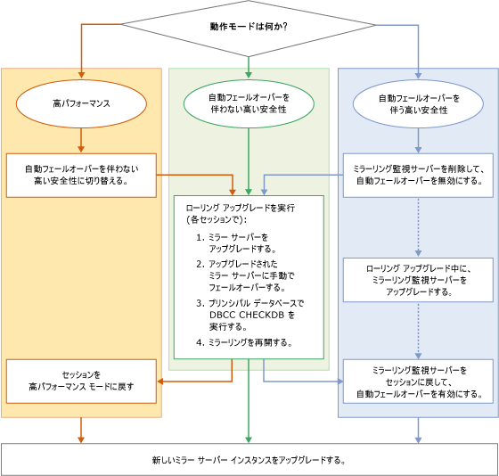

# ミラー化されたインスタンスのアップグレード
[!INCLUDE[appliesto-ss-xxxx-xxxx-xxx-md](../../includes/appliesto-ss-xxxx-xxxx-xxx-md.md)]
  [!INCLUDE[ssNoVersion](../../includes/ssnoversion-md.md)] のミラー化されたインスタンスを新しい [!INCLUDE[ssCurrent](../../includes/sscurrent-md.md)] バージョン、新しい [!INCLUDE[ssNoVersion](../../includes/ssnoversion-md.md)]サービス パックまたは累積的な更新プログラム、あるいは新しい Windows サービス パックまたは累積的な更新プログラムにアップグレードする場合、ローリング アップグレードを実行して、ミラー化された各データベースのダウンタイムを 1 回の手動フェールオーバーのみに減らすことができます (または、元のプライマリにフェールバックする場合は 2 回の手動フェールオーバー)。 ローリング アップグレードは複数の段階から成るプロセスです。最も単純な形式では、ミラーリング セッションで現在ミラー サーバーとして機能している [!INCLUDE[ssCurrent](../../includes/sscurrent-md.md)] インスタンスをアップグレードした後、ミラー化されたデータベースを手動でフェールオーバーし、以前のプリンシパル [!INCLUDE[ssCurrent](../../includes/sscurrent-md.md)] インスタンスをアップグレードして、ミラーリングを再開します。 実際に実行するプロセスは、動作モードと、アップグレードする [!INCLUDE[ssCurrent](../../includes/sscurrent-md.md)] インスタンスで実行しているミラーリング セッションの数やレイアウトによって異なります。  
  
> [!NOTE]  
>  移行中にデータベース ミラーリングとログ配布を併用する方法については、 [データベース ミラーリングとログ配布に関するホワイト ペーパー](https://t.co/RmO6ruCT4J)をダウンロードしてください。  
  
## Prerequisites  
 作業を開始する前に、次の重要な情報を確認してください。  
  
-   [サポートされているバージョンとエディションのアップグレード](../../database-engine/install-windows/supported-version-and-edition-upgrades.md):使用している Windows オペレーティング システムと SQL Server のバージョンから SQL Server 2016 にアップグレードできることを確認します。 たとえば、SQL Server 2005 インスタンスから [!INCLUDE[ssCurrent](../../includes/sscurrent-md.md)]に直接アップグレードすることはできません。  
  
-   [データベース エンジンのアップグレード方法の選択](../../database-engine/install-windows/choose-a-database-engine-upgrade-method.md):サポートされるバージョンとエディションのアップグレードを確認して、適切なアップグレードの方法と手順を選択します。また、環境にインストールされているその他のコンポーネントに基づいて、正しい順序でコンポーネントをアップグレードします。  
  
-   [データベース エンジンのアップグレード計画の策定およびテスト](../../database-engine/install-windows/plan-and-test-the-database-engine-upgrade-plan.md):リリース ノート、アップグレードに関する既知の問題、アップグレード前のチェックリストを確認して、アップグレードの計画を作成およびテストします。  
  
-   [SQL Server 2016 のインストールに必要なハードウェアおよびソフトウェア](../../sql-server/install/hardware-and-software-requirements-for-installing-sql-server.md)[!INCLUDE[ssCurrent](../../includes/sscurrent-md.md)] のインストールにおけるソフトウェア要件を確認します。 その他のソフトウェアが必要な場合は、ダウンタイムを最小限に抑えるために、アップグレード プロセスを開始する前に、各ノードにソフトウェアをインストールします。  
  
## 推奨される準備 (ベスト プラクティス)  
 ローリング アップグレードを開始する前に以下を実行することをお勧めします。  
  
1.  少なくとも 1 つのミラーリング セッションで試験的に手動フェールオーバーを実行します。  
  
    -   [データベース ミラーリング セッションを手動でフェールオーバーする方法 &#40;SQL Server Management Studio&#41;](../../database-engine/database-mirroring/manually-fail-over-a-database-mirroring-session-sql-server-management-studio.md)  
  
    -   [データベース ミラーリング セッションを手動でフェールオーバーする方法 &#40;Transact-SQL&#41;](../../database-engine/database-mirroring/manually-fail-over-a-database-mirroring-session-transact-sql.md)。  
  
    > [!NOTE]  
    >  手動フェールオーバーのしくみについては、「[データベース ミラーリング セッション中の役割の交代 &#40;SQL Server&#41;](../../database-engine/database-mirroring/role-switching-during-a-database-mirroring-session-sql-server.md)」を参照してください。  
  
2.  データを保護します。  
  
    1.  すべてのプリンシパル データベースを対象にデータベースの完全バックアップを実行します。  
  
         [データベースの完全バックアップの作成 &#40;SQL Server&#41;](../../relational-databases/backup-restore/create-a-full-database-backup-sql-server.md)  
  
    2.  すべてのプリンシパル データベースで [DBCC CHECKDB](../../t-sql/database-console-commands/dbcc-checkdb-transact-sql.md) コマンドを実行します。  
  
## ローリング アップグレードの段階  
 ローリング アップグレードの個々の段階は、ミラーリング構成の動作モードによって異なります。 ただし、基本的な段階は同じです。  
  
> [!NOTE]  
>  動作モードの詳細については、「 [データベース ミラーリングの動作モード](../../database-engine/database-mirroring/database-mirroring-operating-modes.md)」を参照してください。  
  
 次の図は、動作モードごとにローリング アップグレードの基本的な段階をフローチャートで示したものです。 図の後で、対応する各手順について説明します。  
  
   
  
> [!IMPORTANT]  
>  同時実行ミラーリング セッションでは、1 つのサーバー インスタンスが複数の異なるミラーリング ロール (プリンシパル サーバー、ミラー サーバー、またはミラーリング監視サーバー) を実行している場合があります。 この場合は、基本的なローリング アップグレード プロセスを適宜調整する必要があります。 詳細については、「 [データベース ミラーリング セッション中の役割の交代 &#40;SQL Server&#41;](../../database-engine/database-mirroring/role-switching-during-a-database-mirroring-session-sql-server.md)をダウンロードしてください。  
  
> [!NOTE]  
>  多くの場合、ローリング アップグレードの完了後は、元のプリンシパル サーバーにフェールバックします。  
  
### セッションを高パフォーマンス モードから高い安全性モードに変更するには  
  
1.  ミラーリング セッションを高パフォーマンス モードで実行している場合は、ローリング アップグレードを実行する前に、動作モードを、自動フェールオーバーを伴わない高い安全性モードに変更します。  
  
    > [!IMPORTANT]  
    >  ミラー サーバーとプリンシパル サーバーが地理的に離れている場合は、ローリング アップグレードは適しません。  
  
    -   [!INCLUDE[ssManStudioFull](../../includes/ssmanstudiofull-md.md)]: **[データベースのプロパティ]** ダイアログ ボックスの [[ミラーリング]](../../relational-databases/databases/database-properties-mirroring-page.md) ページで、 **[動作モード]** オプションを **[自動フェールオーバーを伴わない高い安全性 (同期)]** に変更します。 このページにアクセスする方法については、「[データベース ミラーリング セキュリティ構成ウィザードの起動 &#40;SQL Server Management Studio&#41;](../../database-engine/database-mirroring/start-the-configuring-database-mirroring-security-wizard.md)」を参照してください。  
  
    -   [!INCLUDE[tsql](../../includes/tsql-md.md)]: トランザクションの安全性を FULL に設定します。 詳細については、｢[データベース ミラーリング セッションでのトランザクションの安全性の変更 &#40;Transact-SQL&#41;](../../database-engine/database-mirroring/change-transaction-safety-in-a-database-mirroring-session-transact-sql.md)」を参照してください。  
  
### ミラーリング監視サーバーをセッションから削除するには  
  
1.  ミラーリング セッションにミラーリング監視サーバーが存在する場合は、ローリング アップグレードの実行前にミラーリング監視サーバーを削除しておくことをお勧めします。 そうしないと、ミラー サーバー インスタンスをアップグレードする際のデータベースの可用性が、プリンシパル サーバー インスタンスに接続されたミラーリング監視サーバーに依存することになります。 削除したミラーリング監視サーバーは、ローリング アップグレード プロセス中にいつでもアップグレードでき、また、そうすることでデータベースのダウンタイムを最小限に抑えることができます。  
  
    > [!NOTE]  
    >  詳細については、「[クォーラム: データベースの可用性にミラーリング監視サーバーが与える影響 (データベース ミラーリング)](../../database-engine/database-mirroring/quorum-how-a-witness-affects-database-availability-database-mirroring.md)」を参照してください。  
  
    -   [データベース ミラーリング セッションからのミラーリング監視サーバーの削除 &#40;SQL Server&#41;](../../database-engine/database-mirroring/remove-the-witness-from-a-database-mirroring-session-sql-server.md)  
  
### ローリング アップグレードを実行するには  
  
1.  ダウンタイムを最小限に抑えるため、次をお勧めします: ローリング アップグレードを開始する際は、すべてのミラーリング セッションにおいてミラー サーバーとして機能しているミラーリング パートナーから先に更新します。 場合によっては、この時点で複数のサーバー インスタンスを更新する必要があります。  
  
    > [!NOTE]  
    >  ミラーリング監視サーバーは、ローリング アップグレード プロセス中、いつでもアップグレードできます。 たとえば、セッション 1 ではミラー サーバーとして、セッション 2 ではミラーリング監視サーバーとして機能しているサーバー インスタンスであれば、今すぐにアップグレードすることもできます。  
  
     最初にアップグレードするサーバー インスタンスは、ミラーリング セッションが現在どのように構成されているかによって異なります。その指針を次に示します。  
  
    -   サーバー インスタンスがそのすべてのミラーリング セッションにおいて既にミラー サーバーとして機能している場合、そのサーバー インスタンスを新しいバージョンにアップグレードします。  
  
    -   どのサーバー インスタンスもいずれかのミラーリング セッションのプリンシパル サーバーとして機能している場合は、最初にアップグレードするサーバー インスタンスを 1 つ選択します。 次に、選択したサーバー インスタンスの各プリンシパル データベースを手動でフェールオーバーし、そのサーバー インスタンスをアップグレードします。  
  
     アップグレード後のサーバー インスタンスは、自動的にそれぞれのミラーリング セッションに再度参加します。  
  
2.  前の手順でアップグレードしたミラー サーバー インスタンスのすべてのミラーリング セッションの同期が完了するまで待ちます。 次に、プリンシパル サーバー インスタンスに接続し、セッションを手動でフェールオーバーします。 フェールオーバー時は、アップグレードされたサーバー インスタンスがそのセッションのプリンシパル サーバーになり、以前のプリンシパル サーバーがミラー サーバーになります。  
  
     この手順の目的は、すべてのミラーリング セッションで、パートナー関係にある他方のサーバー インスタンスがミラー サーバーとなるようにすることです。  
  
     **アップグレードしたサーバー インスタンスに対するフェールオーバー後の制限**  
  
     以前のサーバー インスタンスから [!INCLUDE[ssCurrent](../../includes/sscurrent-md.md)] のサーバー インスタンスにフェールオーバーした後は、データベース セッションが中断されます。 もう一方のパートナーがアップグレードされるまで再開できません。 ただし、プリンシパル サーバーは引き続き接続を受け入れ、プリンシパル データベースに対するデータのアクセスや変更は許可されます。  
  
    > [!NOTE]  
    >  新しいミラーリング セッションを確立するには、すべてのサーバー インスタンスが同じバージョンの [!INCLUDE[ssNoVersion](../../includes/ssnoversion-md.md)]を実行している必要があります。  
  
3.  フェールオーバー後は、プリンシパル データベースに対して [DBCC CHECKDB](../../t-sql/database-console-commands/dbcc-checkdb-transact-sql.md) コマンドを実行することをお勧めします。  
  
4.  すべてのミラーリング セッションにおいて、現在ミラー サーバー (パートナー) となっている各サーバー インスタンスをアップグレードします。 場合によっては、この時点で複数のサーバーを更新する必要があります。  
  
    > [!IMPORTANT]  
    >  複雑なミラーリング構成の場合、一部のサーバー インスタンスが、1 つまたは複数のミラーリング セッションで元のプリンシパル サーバーとして機能している場合があります。 これらのサーバー インスタンスについては、関係するすべてのインスタンスがアップグレードされるまで、手順 2 から手順 4 までを繰り返してください。  
  
5.  ミラーリング セッションを再開します。  
  
    > [!NOTE]  
    >  自動フェールオーバーは、ミラーリング監視サーバーがアップグレードされてミラーリング セッションに戻されるまで機能しません。  
  
6.  すべてのミラーリング セッションの残りのサーバー インスタンス (ミラーリング監視サーバー) をアップグレードします。 アップグレードしたミラーリング監視サーバーをミラーリング セッションに再度参加させると、自動フェールオーバーが有効になります。 場合によっては、この時点で複数のサーバーを更新する必要があります。  
  
### セッションを高パフォーマンス モードに戻すには  
  
1.  必要に応じて、高パフォーマンス モードに戻す場合は、次のいずれかの方法を使用します。  
  
    -   [!INCLUDE[ssManStudioFull](../../includes/ssmanstudiofull-md.md)]: **[データベースのプロパティ]** ダイアログ ボックスの **[ミラーリング]** ページで、[[動作モード]](../../relational-databases/databases/database-properties-mirroring-page.md) オプションを **[高パフォーマンス (非同期)]** に変更します。  
  
    -   [!INCLUDE[tsql](../../includes/tsql-md.md)]: [ALTER DATABASE](../../t-sql/statements/alter-database-transact-sql-database-mirroring.md) を使用してトランザクションの安全性を OFF に設定します。  
  
### ミラーリング監視サーバーをミラーリング セッションに戻すには  
  
1.  必要に応じて、高い安全性モードで、各ミラーリング セッションのミラーリング監視サーバーを再度確立します。  
  
     **ミラーリング監視サーバーをセッションに戻すには**  
  
    -   [データベース ミラーリング監視サーバーを追加または置き換える方法 &#40;SQL Server Management Studio&#41;](../../database-engine/database-mirroring/add-or-replace-a-database-mirroring-witness-sql-server-management-studio.md)  
  
    -   [Windows 認証を使用してデータベースのミラーリング監視を追加する &#40;Transact-SQL&#41;](../../database-engine/database-mirroring/add-a-database-mirroring-witness-using-windows-authentication-transact-sql.md)  
  
## 参照  
 [インストール ウィザードを使用した SQL Server 2016 へのアップグレード &#40;セットアップ&#41;](../../database-engine/install-windows/upgrade-sql-server-using-the-installation-wizard-setup.md)   
 [コマンド プロンプトからの SQL Server 2016 のインストール](../../database-engine/install-windows/install-sql-server-2016-from-the-command-prompt.md)   
 [ALTER DATABASE Database Mirroring &#40;Transact-SQL&#41;](../../t-sql/statements/alter-database-transact-sql-database-mirroring.md)   
 [BACKUP &#40;Transact-SQL&#41;](../../t-sql/statements/backup-transact-sql.md)   
 [ミラー化されたデータベースの状態の確認 &#40;SQL Server Management Studio&#41;](../../database-engine/database-mirroring/view-the-state-of-a-mirrored-database-sql-server-management-studio.md)   
 [データベース ミラーリング &#40;SQL Server&#41;](../../database-engine/database-mirroring/database-mirroring-sql-server.md)   
 [データベース ミラーリング セッション中の役割の交代 &#40;SQL Server&#41;](../../database-engine/database-mirroring/role-switching-during-a-database-mirroring-session-sql-server.md)   
 [データベース ミラーリング セッションでのサービスの強制 &#40;Transact-SQL&#41;](../../database-engine/database-mirroring/force-service-in-a-database-mirroring-session-transact-sql.md)   
 [データベース ミラーリング モニターの起動 &#40;SQL Server Management Studio&#41;](../../database-engine/database-mirroring/start-database-mirroring-monitor-sql-server-management-studio.md)   
 [データベース ミラーリングの動作モード](../../database-engine/database-mirroring/database-mirroring-operating-modes.md)  
  
  
