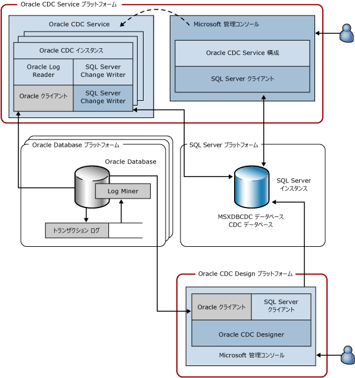

# Change Data Capture Service for Oracle by Attunity のシステム アーキテクチャ

[!INCLUDE[ssis-appliesto](../../includes/ssis-appliesto-ssvrpluslinux-asdb-asdw-xxx.md)]

  CDC Service for Oracle は、1 つ以上のソース Oracle データベースの選択したテーブルに加えられた変更を、 [!INCLUDE[ssNoVersion](../../includes/ssnoversion-md.md)] インスタンスにある [!INCLUDE[ssNoVersion](../../includes/ssnoversion-md.md)] CDC データベースにキャプチャします。 次の図に、CDC Service for Oracle を構成するコンポーネントを示します。  
  
   
  
 この図は、使用される 4 つのプラットフォームを示しています。 多くの場合、これらのプラットフォームは重複させることができますが、この図では標準的なユース ケースを示しています。 たとえば、Oracle データベースと [!INCLUDE[ssNoVersion](../../includes/ssnoversion-md.md)] データベースのそれぞれを独立したコンピューターで実行し、Oracle CDC Service プラットフォームまたは CDC Service の設計元であるプラットフォームと共有しないようにするのが適切です。 この図に示すプラットフォームは次のとおりです。  
  
-   Oracle CDC Service: Oracle CDC Service がインストールされて実行される、任意のサポート対象 Windows コンピューターです。 このプラットフォームは、Microsoft フェールオーバー クラスターのクラスター ノードを表す場合もあります (高可用性構成については、このドキュメントで後ほど説明します)。  
  
-   Oracle データベース: Oracle データベースのサポート対象バージョンが実行される任意のコンピューターです。 これには、Windows、Linux、またはインストールされた Oracle データベースのバージョンがサポートする他の任意のオペレーティング システムを実行するコンピューターが含まれます。 このプラットフォームは図で複数示されています。これは、単一の Oracle CDC Service で複数のソース Oracle データベースの変更をキャプチャできるためです。  
  
-   [!INCLUDE[ssNoVersion](../../includes/ssnoversion-md.md)]: 対象の [!INCLUDE[ssNoVersion](../../includes/ssnoversion-md.md)] データベース ([!INCLUDE[ssCurrent](../../includes/sscurrent-md.md)] のサポート対象の SKU) が実行される任意のコンピューターです。 Oracle CDC Service は、変更テーブルおよびサービス構成を格納する 1 つの [!INCLUDE[ssNoVersion](../../includes/ssnoversion-md.md)] ターゲットをサポートします。 [!INCLUDE[ssNoVersion](../../includes/ssnoversion-md.md)] プラットフォームは、 [!INCLUDE[ssCurrent](../../includes/sscurrent-md.md)] のクラスター化されたインスタンスまたは [!INCLUDE[ssCurrent](../../includes/sscurrent-md.md)] の **Always On** 機能を使用してミラー化されたインスタンスを表す場合もあります。  
  
-   Oracle CDC デザイナー: ソースの Oracle データベースと対象の [!INCLUDE[ssNoVersion](../../includes/ssnoversion-md.md)] データベースにアクセスできる任意のサポート対象 Windows コンピューターです。  
  
 次の表に、上記の 4 つのプラットフォームで実行されるコンポーネントを示します。  
  
|コンポーネント/説明|コンポーネントの構成要素|  
|----------------------------|----------------------------|  
|Oracle CDC Service: 変更データ キャプチャ操作が実行される Windows サービスです。|Oracle CDC インスタンス: 単一のソース Oracle データベースに対する変更データ キャプチャ操作を処理する、Oracle CDC Service のサブプロセスです (ソース Oracle データベースごとに 1 つの Oracle CDC インスタンスが存在します)。|  
||Oracle ログ リーダー: Oracle クライアントを使用して Oracle トランザクション ログを読み取ります。|  
||Oracle クライアント: Oracle との通信に使用される Oracle Instant Client です。 これは、Oracle CDC Service をインストールする前に Oracle から入手してインストールする必要がある必須ソフトウェアです。|  
||[!INCLUDE[ssNoVersion](../../includes/ssnoversion-md.md)] 変更ライター: キャプチャされた Oracle テーブルに加えられたコミット済みの変更を [!INCLUDE[ssNoVersion](../../includes/ssnoversion-md.md)] 変更テーブルに書き込みます。 また、このコンポーネントはキャプチャ状態を対象の [!INCLUDE[ssNoVersion](../../includes/ssnoversion-md.md)] データベース内に維持します。|  
||[!INCLUDE[ssNoVersion](../../includes/ssnoversion-md.md)]ODBC クライアント: [!INCLUDE[ssCurrent](../../includes/sscurrent-md.md)] 用のマイクロソフトのネイティブ クライアントです。 これは、Oracle CDC Service をインストールする前にマイクロソフトから入手してインストールする必要がある必須コンポーネントです。|  
|Oracle CDC Service 構成: Windows サービスを作成してその構成を設定する Microsoft 管理コンソール スナップインです。|[!INCLUDE[ssNoVersion](../../includes/ssnoversion-md.md)] クライアント: .NET Framework Version 4 に付属する SQL ADO.NET クライアントです。|  
|Oracle データベース: 選択したテーブルへの変更をキャプチャするソース Oracle データベースです。|ログ マイナー: Oracle トランザクション ログの読み取りに使用される Oracle コンポーネントです。|  
||トランザクション ログ: データベースでトランザクションをロールバックし、障害から復元できるようにするために (この場合、Oracle データベースをアーカイブログ モードで運用する必要があります)、Oracle によって使用されるオンラインまたはアーカイブされた Oracle 再実行ログです。|  
|[!INCLUDE[ssNoVersion](../../includes/ssnoversion-md.md)] インスタンス: CDC データベースがホストされる [!INCLUDE[ssNoVersion](../../includes/ssnoversion-md.md)] インスタンスです。 これはクラスター化された [!INCLUDE[ssNoVersion](../../includes/ssnoversion-md.md)] インスタンス (フェールオーバー クラスター) またはミラー化されたデータベース (Always On) です。|MSXDBCDC データベース: この [!INCLUDE[ssNoVersion](../../includes/ssnoversion-md.md)] インスタンスと連動する CDC Service に関する情報が保持されるデータベースです。 また、各 CDC Service によって処理される Oracle CDC インスタンスの情報も保持されます。 このデータベースは、CDC Service 作成プロセスの一環として作成されます。|  
||CDC データベース: いずれかのソース Oracle データベースに加えられた変更を格納する [!INCLUDE[ssNoVersion](../../includes/ssnoversion-md.md)] データベースです。 CDC データベースは [!INCLUDE[ssNoVersion](../../includes/ssnoversion-md.md)] CDC に対して有効になります。そのため、 [!INCLUDE[ssNoVersion](../../includes/ssnoversion-md.md)] CDC のテーブルおよび機能を含み、Oracle からの変更を簡単に処理できます。|  
|Oracle CDC デザイナー: Oracle CDC インスタンスの作成を支援する Microsoft 管理コンソール スナップインです。 このスナップインを使用して、キャプチャするテーブルおよび列を選択し、Oracle 接続情報を提供し、CDC インスタンスのライフ サイクルを管理します。|[!INCLUDE[ssNoVersion](../../includes/ssnoversion-md.md)] クライアント: .NET Framework Version 4 に付属する SQL ADO.NET クライアントです。|  
||Oracle クライアント: Oracle との通信に使用される Oracle Instant Client です。 これは、Oracle CDC Service をインストールする前に Oracle から入手してインストールする必要がある必須コンポーネントです。|  
  
 Oracle CDC Service とその子である Oracle CDC インスタンスは、ソース Oracle データベースおよびクライアントである対象の [!INCLUDE[ssNoVersion](../../includes/ssnoversion-md.md)] インスタンスのみと通信できます。 ネットワーク プロトコルやその他のプロトコルの積極的なリッスンは行いません。 Oracle CDC Service は、CDC データベースを監視して構成の変更を検出し、更新された構成に基づいて操作を更新します。  
  
  
