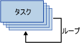

# For ループ コンテナー

[!INCLUDE[ssis-appliesto](../../includes/ssis-appliesto-ssvrpluslinux-asdb-asdw-xxx.md)]

  For ループ コンテナーは、パッケージ内で繰り返す制御フローを定義します。 ループの実装は、プログラミング言語の **For** ループ構造と同じです。 For ループ コンテナーは、ループの各繰り返しで式を評価し、式が **False**に評価されるまでそのワークフローを繰り返します。  
  
 For ループ コンテナーは、次の要素を使用してループを定義します。  
  
-   ループ カウンターに値を割り当てる、省略可能な初期化式。  
  
-   ループの停止または続行のテストに使用する式を含む、評価式。  
  
-   ループ カウンターを増減する、省略可能な初期化式。  
  
 次の図は、メール送信タスクの For ループ コンテナーを示しています。 初期化式が `@Counter = 0`の場合、評価式は `@Counter < 4`になり、初期化式が `@Counter = @Counter + 1`の場合、ループは 4 回繰り返して 4 つの電子メール メッセージを送信します。  
  
   
  
 この式は、有効な [!INCLUDE[ssNoVersion](../../includes/ssnoversion-md.md)] [!INCLUDE[ssISnoversion](../../includes/ssisnoversion-md.md)] の式である必要があります。  
  
 初期化式および代入式を作成するには、代入演算子 (=) を使用します。 この演算子は、Integration Services の式文法以外ではサポートされておらず、For ループ コンテナーの初期化式および代入式の種類によってのみ、使用できます。 代入演算子を使用するあらゆる式には、構文 `@Var = <expression>` が含まれる必要があります。この構文の **Var** は実行時の変数で、\<expression> は [!INCLUDE[ssIS](../../includes/ssis-md.md)] 式の構文の規則に従う式です。 この式には、変数、リテラル、および、SSIS の式文法でサポートされるあらゆる演算子と関数を含めることができます。 この式は、変数のデータ型にキャスト可能なデータ型に評価される必要があります。  
  
 For ループ コンテナーでは、評価式を 1 つだけ含めることができます。 したがって、For ループ コンテナーは、すべての制御フローの要素を同一回数実行します。 For ループ コンテナーには、別の For ループ コンテナーを含めることができるため、パッケージ内で、入れ子になっているループを構築したり複合型のループを実装できます。  
  
 For ループ コンテナー上でトランザクションのプロパティを設定し、パッケージ制御フローのサブセットのトランザクションを定義できます。 この方法により、より細かなレベルでトランザクションを管理できます。 たとえば、For ループ コンテナーが、テーブル内のデータを複数回更新する制御フローを繰り返す場合、For ループおよびその制御フローを構成して、1 つでも正常に更新できないデータがある場合すべてのデータを更新しない、というトランザクションを使用できます。 詳細については、「 [Integration Services のトランザクション](../../integration-services/integration-services-transactions.md)」をご覧ください。  
  
## For ループ コンテナーを含む制御フローに繰り返しを追加する
  [!INCLUDE[ssISnoversion](../../includes/ssisnoversion-md.md)] には For ループ コンテナーが含まれています。For ループ コンテナーとは制御フローの要素で、これを使用すると、条件に応じてパッケージ内の制御フローを繰り返すループを、簡単に含めることができます。 詳細については、「 [For ループ コンテナー](../../integration-services/control-flow/for-loop-container.md)に評価されるまでそのワークフローを繰り返します。  
  
 For ループ コンテナーは、ループの各繰り返しにおいて条件を評価し、条件が FALSE に評価されると停止します。 For ループ コンテナーに含まれる式によって、ループの初期化、繰り返される制御フローの実行を停止する評価条件の指定、評価条件の比較対象となる値を更新する式への値の代入を行います。 評価条件は必ず指定する必要がありますが、初期化式および代入式の指定は任意です。  
  
 For ループ コンテナーに機能は用意されていません。繰り返し可能な制御フローを構築する構造を提供するだけです。 コンテナーに機能を設定するには、For ループ コンテナーに少なくとも 1 つのタスクを含める必要があります。 詳細については、「[Integration Services のタスク](../../integration-services/control-flow/integration-services-tasks.md)」を参照してください。  
  
 For ループ コンテナーには、複数のタスクを持つ制御フローを含めたり、他のコンテナーを含めることができます。 For ループ コンテナーにタスクとコンテナーを追加する手順は、タスクとコンテナーをドラッグする先がパッケージではなく For ループ コンテナーであること以外は、パッケージに追加する手順と同様です。 For ループ コンテナーに複数のタスクまたはコンテナーが含まれる場合、パッケージの場合と同様に、優先順位制約を使用してそれらを連結できます。 詳細については、「 [優先順位制約](../../integration-services/control-flow/precedence-constraints.md)」を参照してください。  
  
## For ループ コンテナーを制御フローに追加する  
  
1.  For ループ コンテナーをパッケージに追加します。 詳細については、「[制御フローのタスクまたはコンテナーを追加または削除する](../../integration-services/control-flow/add-or-delete-a-task-or-a-container-in-a-control-flow.md)」を参照してください。  
  
2.  タスクとコンテナーを For ループ コンテナーに追加します。 詳細については、「 [制御フローのタスクまたはコンテナーを追加または削除する](../../integration-services/control-flow/add-or-delete-a-task-or-a-container-in-a-control-flow.md)」を参照してください。  
  
3.  優先順位制約を使用して、For ループ コンテナー内のタスクとコンテナーを連結します。 詳細については、「[既定の優先順位制約を使用してタスクとコンテナーを連結する](https://msdn.microsoft.com/library/8f31f15f-98ff-4c35-b41f-8b8cfd148d75)」を参照してください。  
  
4.  For ループ コンテナーを構成します。 詳細については、「 [For ループ コンテナーを構成する](https://msdn.microsoft.com/library/b9cd7ea7-b198-4a35-8b16-6acf09611ca5)に評価されるまでそのワークフローを繰り返します。  

##  For ループ コンテナーを構成する
この手順では、 **[For ループ エディター]** ダイアログ ボックスを使用して、For ループ コンテナーを構成する方法について説明します。  
  
 For ループ コンテナーの例については、bimonkey.com の「 [失敗しない SSIS ループ](https://go.microsoft.com/fwlink/?LinkId=240295) 」を参照してください。  
  
1.  [!INCLUDE[ssBIDevStudioFull](../../includes/ssbidevstudiofull-md.md)]で、For ループ コンテナーをダブルクリックして **[For ループ エディター]** を開きます。  
  
2.  必要に応じて、For ループ コンテナーの名前と説明を変更します。  
  
3.  必要に応じて、 **[InitExpression]** テキスト ボックスに初期化式を入力します。  
  
4.  **[EvalExpression]** テキスト ボックスに、評価式を入力します。  
  
    > [!NOTE]  
    >  式はブール値に評価される必要があります。 式が **false**に評価されると、ループは実行を停止します。  
  
5.  必要に応じて、 **[AssignExpression]** テキスト ボックスに代入式を入力します。  
  
6.  必要に応じて、 **[式]** をクリックし、 **[式]** ページで For ループ コンテナーのプロパティ用のプロパティ式を作成します。 詳細については、「 [プロパティ式を追加または変更する](../../integration-services/expressions/add-or-change-a-property-expression.md)」を参照してください。  
  
7.  **[OK]** をクリックし、 **[For ループ エディター]** を閉じます。  

## [For ループ エディター] ダイアログ ボックス
**[For ループ エディター]** ダイアログ ボックスの **[For ループ]** ページを使用すると、指定した条件が false と評価されるまでワークフローを繰り返すループを構成できます。  
  
 For ループ コンテナーの概要とパッケージ内で For ループ コンテナーを使用する方法の詳細については、「 [For Loop Container](../../integration-services/control-flow/for-loop-container.md)」を参照してください。  
  
### オプション  
 **[InitExpression]**  
 必要に応じて、ループが使用する値を初期化する式を指定します。  
  
 **[EvalExpression]**  
 ループが停止するか続行するかを評価する式を指定します。  
  
 **[AssignExpression]**  
 必要に応じて、ループの繰り返しごとに条件を変更する式を指定します。  
  
 **[名前]**  
 For ループ コンテナーに一意な名前を指定します。 この名前は、タスク アイコンのラベルとして使用されます。  
  
> [!NOTE]  
>  オブジェクト名はパッケージ内で一意である必要があります。  
  
 **[説明]**  
 For ループ コンテナーの説明を指定します。  
 
## For ループ コンテナーで式を使用する  
 評価条件、初期化の値、または代入値を指定することによって For ループ コンテナーを構成する場合、リテラルまたは式のどちらかを使用できます。  
  
 式には変数を含めることができます。 変数を使用する利点は実行時に更新できるので、パッケージの管理がより柔軟かつ容易になることです。 式の最大長は 4,000 文字です。  
  
 式の内部で変数を指定する場合、変数名をアット マーク (@) で始める必要があります。 たとえば、**Counter** という名前の変数を指定するには、For ループ コンテナーが使用する式に「@Counter」と入力します。 変数の名前空間のプロパティを含める場合は、変数と名前空間を角かっこで囲む必要があります。 たとえば、**MyNamespace** 名前空間内にある **Counter** 変数については、「@MyNamespace::Counter」と入力します。  
  
 For ループ コンテナーが使用する変数は、For ループ コンテナーのスコープ、またはパッケージ コンテナー階層において上位層にある任意のコンテナーのスコープ内で定義する必要があります。 たとえば、For ループ コンテナーは、それ自体のスコープ内で定義された変数と、パッケージ スコープ内で定義された変数を使用できます。 詳しくは、「[Integration Services &#40;SSIS&#41; の変数](../../integration-services/integration-services-ssis-variables.md)」と「[パッケージで変数を使用する](https://msdn.microsoft.com/library/7742e92d-46c5-4cc4-b9a3-45b688ddb787)」をご覧ください。  
  
 [!INCLUDE[ssIS](../../includes/ssis-md.md)] の式文法には、評価、初期化、または代入に使用する複雑な式を実装するための、演算子と関数の完全なセットが用意されています。 詳細については、「 [Integration Services (SSIS) 式](../../integration-services/expressions/integration-services-ssis-expressions.md)に評価されるまでそのワークフローを繰り返します。  
  
  
## 参照  
 [制御フロー](../../integration-services/control-flow/control-flow.md)   
 [Integration Services (SSIS) 式](../../integration-services/expressions/integration-services-ssis-expressions.md)  
  
  
