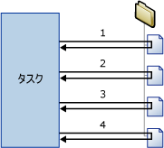

# Foreach ループ コンテナー
  Foreach ループ コンテナーは、パッケージ内で繰り返す制御フローを定義します。 ループの実装は、プログラミング言語の **Foreach** ループ構造と同様です。 パッケージでは、ループは Foreach 列挙子を使用することで有効になります。  Foreach ループ コンテナーは、指定した列挙子のメンバーが処理されるたびに制御フローを繰り返します。  
  
 [!INCLUDE[ssNoVersion](../../includes/ssnoversion-md.md)] [!INCLUDE[ssISnoversion](../../includes/ssisnoversion-md.md)] では、次の種類の列挙子が用意されています。  
  
-   Foreach ADO 列挙子は、テーブル内の行を列挙します。 たとえば、ADO レコードセット内の行を取得できます。  
  
     レコードセット変換先では、 **Object** データ型のパッケージ変数に格納されるレコードセットのメモリにデータが保存されます。 通常は、Foreach ループ コンテナーと Foreach ADO 列挙子を使用して、一度に 1 つのレコードセット行を処理します。 Foreach ADO 列挙子に指定する変数は、Object データ型である必要があります。 レコード セット変換先の詳細については、次を参照してください。 [Use a Recordset Destination](../../integration-services/data-flow/use-a-recordset-destination.md)です。  
  
-   Foreach ADO.NET Schema Rowset 列挙子は、データ ソースに関するスキーマ情報を列挙します。 たとえば、 [!INCLUDE[ssSampleDBnormal](../../includes/sssampledbnormal-md.md)] [!INCLUDE[ssNoVersion](../../includes/ssnoversion-md.md)] データベース内のテーブルを列挙して一覧を取得できます。  
  
-   Foreach File 列挙子は、フォルダー内のファイルを列挙します。 この列挙子は、サブフォルダーをスキャンできます。 たとえば、Windows フォルダーとそのサブフォルダー内から、ファイル名に拡張子 *.log が付いたファイルをすべて読み取ることができます。  
  
-   Foreach From Variable 列挙子は、指定した変数に含まれる列挙可能なオブジェクトを列挙します。 列挙可能なオブジェクトは、配列、ADO.NET **DataTable**、 [!INCLUDE[ssISnoversion](../../includes/ssisnoversion-md.md)] 列挙子などです。 たとえば、サーバーの名前を含む配列の値を列挙できます。  
  
-   Foreach Item 列挙子は、コレクション内のアイテムを列挙します。 たとえば、プロセス実行タスクで使用する実行可能ファイルおよび作業ディレクトリの名前を列挙できます。  
  
-   Foreach Nodelist 列挙子は、XML パス言語 (XPath) 式の結果セットを列挙します。 たとえば、 `/authors/author[@period='classical']`の式は、古典時代のすべての作家を列挙して一覧を取得します。  
  
-   Foreach SMO 列挙子は、 [!INCLUDE[ssNoVersion](../../includes/ssnoversion-md.md)] 管理オブジェクト (SMO) オブジェクトを列挙します。 たとえば、 [!INCLUDE[ssNoVersion](../../includes/ssnoversion-md.md)] データベース内のビューを列挙して一覧を取得できます。  
  
-   Foreach HDFS ファイル列挙子は、指定した HDFS の場所にある HDFS ファイルを列挙します。  
  
-   Foreach Azure BLOB 列挙子は、Azure Storage の BLOB コンテナーで BLOB を列挙します。  

-   Azure Data Lake Store 内のディレクトリにファイルを列挙する Foreach ADLS File 列挙子。
  
 次の図は、ファイル システム タスクを含む Foreach ループ コンテナーを示しています。 Foreach ループは Foreach File 列挙子を使用し、ファイル システム タスクがファイルをコピーするように構成します。 列挙子が指定するフォルダーに 4 つのファイルが含まれる場合、ループが 4 回繰り返されて 4 つのファイルがコピーされます。  
  
   
  
 変数とプロパティ式を組み合わせて使用すると、パッケージ オブジェクトのプロパティを列挙子のコレクションの値で更新できます。 最初にコレクションの値をユーザー定義変数にマップし、次に、変数を使用するプロパティにプロパティ式を実装します。 たとえば、Foreach File 列挙子のコレクションの値を **MyFile** という変数にマップし、次に、この変数をメール送信タスクの Subject プロパティのプロパティ式で使用します。 パッケージを実行すると、Subject プロパティは、ループが繰り返されるたびにファイルの名前で更新されます。 詳細については、「 [パッケージでプロパティ式を使用する](../../integration-services/expressions/use-property-expressions-in-packages.md)」をご覧ください。  
  
 列挙子のコレクションの値にマップされた変数は、式とスクリプトでも使用できます。  
  
 Foreach ループ コンテナーには複数のタスクとコンテナーを含めることができますが、使用できる列挙子は 1 種類のみです。 Foreach ループ コンテナーに複数のタスクが含まれる場合、列挙子のコレクションの値は各タスクの複数のプロパティにマップできます。  
  
 Foreach ループ コンテナー上でトランザクションの属性を設定し、パッケージ制御フローのサブセットのトランザクションを定義できます。 この方法により、トランザクションをパッケージ レベルではなく Foreach ループ レベルで管理できます。 たとえば、Foreach ループ コンテナーが、スター スキーマ内のディメンション テーブルおよびファクト テーブルを更新する制御フローを繰り返す場合、トランザクションを構成して、すべてのファクト テーブルが正しく更新されるようにしたり、ファクト テーブルを更新しないようにすることができます。 詳細については、「 [Integration Services のトランザクション](../../integration-services/integration-services-transactions.md)」をご覧ください。  
  
## 列挙子の種類  
 列挙子は構成可能ですが、列挙子に応じて、それぞれ異なる情報を指定する必要があります。  
  
 次の表に、各種列挙子で必要な情報の概要を示します。  
  
|列挙子|構成要件|  
|----------------|--------------------------------|  
|Foreach ADO|ADO オブジェクトの基になる変数と、列挙子モードを指定します。 変数は、Object データ型である必要があります。|  
|Foreach ADO.NET Schema Rowset|データベースへの接続と、列挙するスキーマを指定します。|  
|Foreach File|フォルダーと、列挙するファイル、取得するファイルのファイル名の形式、およびサブフォルダーをスキャンするかどうかを指定します。|  
|Foreach From Variable|列挙するオブジェクトが含まれる変数を指定します。|  
|Foreach Item|列や列のデータ型など、Foreach Item コレクション内のアイテムを定義します。|  
|Foreach Nodelist|XML ドキュメントの基になる XML ドキュメントを指定し、XPath 操作を構成します。|  
|Foreach SMO|データベースへの接続と、列挙する SMO オブジェクトを指定します。|  
|Foreach HDFS File Enumerator (Foreach HDFS ファイル列挙子)|フォルダーと、列挙するファイル、取得するファイルのファイル名の形式、およびサブフォルダーをスキャンするかどうかを指定します。|  
|Foreach Azure BLOB|列挙する BLOB を含む Azure BLOB コンテナーを指定します。|  
|Foreach ADLS ファイル|列挙するファイルを含む Azure Data Lake Store ディレクトリを指定します。|

## Foreach ループ コンテナーと制御フローに列挙を追加します。
 [!INCLUDE[ssISnoversion](../../includes/ssisnoversion-md.md)]Foreach ループ コンテナー、簡単にファイルとパッケージの制御フロー内のオブジェクトを列挙するループ構造を含めるようにする制御フロー要素が含まれます。 詳細については、「 [Foreach ループ コンテナー](../../integration-services/control-flow/foreach-loop-container.md)」を参照してください。  
  
 Foreach ループ コンテナーに機能は用意されていません。繰り返し可能な制御フローの構築、列挙子の型の指定、および列挙子の構成を行う構造を提供するだけです。 コンテナーに機能を設定するには、Foreach ループ コンテナーに少なくとも 1 つのタスクを含める必要があります。 詳細については、「 [Integration Services のタスク](../../integration-services/control-flow/integration-services-tasks.md)」を参照してください。  
  
 Foreach ループ コンテナーには、複数のタスクを持つ制御フローおよび他のコンテナーを含めることができます。 Foreach ループ コンテナーにタスクとコンテナーを追加する手順は、タスクとコンテナーをドラッグする先がパッケージではなく Foreach ループ コンテナーであること以外は、パッケージに追加する手順と同様です。 Foreach ループ コンテナーに複数のタスクまたはコンテナーが含まれる場合、パッケージで行う場合と同様に、優先順位制約を使用してそれらを連結できます。 優先順位制約の詳細については、「 [優先順位制約](../../integration-services/control-flow/precedence-constraints.md)」を参照してください。  
  
### 追加し、Foreach ループ コンテナーの構成
  
1.  Foreach ループ コンテナーをパッケージに追加します。 詳細については、「 [制御フローのタスクまたはコンテナーを追加または削除する](../../integration-services/control-flow/add-or-delete-a-task-or-a-container-in-a-control-flow.md)」を参照してください。  
  
2.  タスクとコンテナーを Foreach ループ コンテナーに追加します。 詳細については、「 [制御フローのタスクまたはコンテナーを追加または削除する](../../integration-services/control-flow/add-or-delete-a-task-or-a-container-in-a-control-flow.md)」を参照してください。  
  
3.  優先順位制約を使用して、Foreach ループ コンテナー内のタスクとコンテナーを連結します。 詳細については、「 [既定の優先順位制約を使用してタスクとコンテナーを連結する](http://msdn.microsoft.com/library/8f31f15f-98ff-4c35-b41f-8b8cfd148d75)」を参照してください。  
  
4.  Foreach ループ コンテナーを構成します。 詳細については、「 [Foreach ループ コンテナーを構成する](http://msdn.microsoft.com/library/519c6f96-5e1f-47d2-b96a-d49946948c25)」を参照してください。  

## Foreach ループ コンテナーを構成する
この手順では、列挙子レベルおよびコンテナー レベルでのプロパティ式など、Foreach ループ コンテナーを構成する方法について説明します。  
  
1.  [!INCLUDE[ssBIDevStudioFull](../../includes/ssbidevstudiofull-md.md)]で、目的のパッケージが含まれている [!INCLUDE[ssISnoversion](../../includes/ssisnoversion-md.md)] プロジェクトを開きます。  
  
2.  **[制御フロー]** タブをクリックし、Foreach ループをダブルクリックします。  
  
3.  **[Foreach ループ エディター]** ダイアログ ボックスで **[全般]** をクリックし、必要に応じて Foreach ループの名前と説明を変更します。  
  
4.  **[コレクション]** をクリックし、 **[Enumerator]** 一覧から列挙子の型を選択します。  
  
5.  列挙子を指定し、列挙子のオプションを次のように設定します。  
  
    -   Foreach File 列挙子を使用するには、列挙するファイルが含まれるフォルダーを指定し、ファイル名と種類に対するフィルターを指定します。次に、完全修飾ファイル名を返すかどうかを指定します。 また、サブフォルダーを再帰的に使用して、より多くのファイルを列挙するかどうかを指定します。  
  
    -   Foreach Item 列挙子を使用するには、 **[列]**をクリックし、 **[For Each Item 列]** ダイアログ ボックスで **[追加]** をクリックして列を追加します。 **[データ型]** 一覧で各列のデータ型を選択し、 **[OK]**をクリックします。  
  
         列の値を入力するか、一覧から値を選択します。  
  
        > [!NOTE]  
        >  新しい行を追加するには、入力したセルの外側の任意の場所をクリックします。  
  
        > [!NOTE]  
        >  値が列のデータ型と互換性がない場合、テキストが強調表示されます。  
  
    -   Foreach ADO 列挙子を使用するには、 **[ADO オブジェクト ソース変数]** の一覧で既存の変数を選択するか、または **[新しい変数]** をクリックして、列挙する ADO オブジェクトの名前を保持する変数を指定します。次に、列挙モードのオプションを選択します。  
  
         新しい変数を作成する場合、 **[変数の追加]** ダイアログ ボックスで変数のプロパティを設定します。  
  
    -   Foreach ADO.NET Schema Rowset 列挙子を使用するには、 **[接続]** 一覧で既存の ADO.NET 接続を選択するか、または **[新しい接続]** をクリックします。次に、スキーマを選択します。  
  
         必要に応じて、 **[制限の設定]** をクリックしてスキーマの制限を選択するか、制限値が含まれる変数を選択するか、または制限値を入力します。次に、 **[OK]**をクリックします。  
  
    -   Foreach From Variable 列挙子を使用するには、 **[変数]** 一覧で変数を選択します。  
  
    -   Foreach NodeList 列挙子を使用するには、DocumentSourceTypeをクリックし、リストからソースの種類を選択し、DocumentSourceをクリックします。 選択した DocumentSourceType の値に応じて、一覧から変数またはファイル接続を選択するか、新しい変数またはファイル接続を作成するか、 **[ドキュメント ソース エディター]**で XML ソースを入力します。  
  
         次に、[EnumerationType] をクリックし、一覧から列挙型を選択します。 EnumerationType が **Navigator、Node、または NodeText**の場合、OuterXPathStringSourceTypeをクリックし、ソースの種類を選択し、OuterXPathStringをクリックします。 設定した OuterXPathStringSourceType の値に応じて、一覧から変数またはファイル接続を選択するか、新しい変数またはファイル接続を作成するか、外部の XML パス言語 (XPath) 式の文字列を入力します。  
  
         EnumerationType 場合**ElementCollection**、前述のように、OuterXPathStringSourceType と OuterXPathString を設定します。 次に InnerElementTypeをクリックし、内部要素の 列挙型を選択し、InnerXPathStringSourceTypeをクリックします。 設定した InnerXPathStringSourceType の値に応じて、変数またはファイル接続を選択するか、新しい変数またはファイル接続を作成するか、内部の XPath 式の文字列を入力します。  
  
    -   Foreach SMO 列挙子を使用するには、 **[接続]** 一覧で既存の ADO.NET 接続を選択するか、 **[新しい接続]** をクリックします。次に、使用する文字列を入力するか、 **[参照]**をクリックします。 **[参照]**をクリックした場合は、 **[SMO 列挙の選択]** ダイアログ ボックスで、列挙するオブジェクトの種類と列挙型を選択し、 **[OK]**をクリックします。  
  
6.  必要に応じて、 **[コレクション]** ページの **[式]** テキスト ボックスにある参照ボタン ( **[...]** ) をクリックし、プロパティ値を更新する式を作成します。 詳細については、「 [プロパティ式を追加または変更する](../../integration-services/expressions/add-or-change-a-property-expression.md)」を参照してください。  
  
    > [!NOTE]  
    >  プロパティに一覧表示、**プロパティ**リストが列挙子によって異なります。  
  
7.  必要に応じて、をクリックして**変数のマッピング**オブジェクトのプロパティをコレクションの値にマップし、次のオプションを実行します。  
  
    1.  **変数**一覧で変数を選択するかをクリックして**\<新しい変数 >**新しい変数を作成します。  
  
    2.  新しい変数を追加する場合、**[変数の追加]** ダイアログ ボックスで変数のプロパティを設定し、**[OK]** をクリックします。  
  
    3.  Foreach Item 列挙子を使用する場合、 **[インデックス]** の一覧で、インデックス値を更新できます。  
  
        > [!NOTE]  
        >  インデックス値は、アイテム内のどの列が変数にマップされるかを示します。 0 以外のインデックス値を使用できるのは、Foreach Item 列挙子だけです。  
  
8.  必要に応じて **[式]** をクリックし、 **[式]** ページで Foreach ループ コンテナーのプロパティ用のプロパティ式を作成します。 詳細については、「 [Add or Change a Property Expression](../../integration-services/expressions/add-or-change-a-property-expression.md)」(プロパティ式を追加または変更する) を参照してください。  
  
9. **[OK]**をクリックします。  

## 全般 ページで Foreach ループ エディター
**[Foreach ループ エディター]** ダイアログ ボックスの **[全般]** ページを使用すると、Foreach ループ コンテナーの名前と説明を指定できます。これは、指定した列挙子を使用してコレクション内の各メンバーのワークフローを繰り返し処理するコンテナーです。  
  
 Foreach ループ コンテナーとその構成方法については、「 [Foreach ループ コンテナー](../../integration-services/control-flow/foreach-loop-container.md) 」と「 [Foreach ループ コンテナーを構成する](http://msdn.microsoft.com/library/519c6f96-5e1f-47d2-b96a-d49946948c25)」を参照してください。  
  
### オプション  
 **名前**  
 Foreach ループ コンテナーの一意な名前を指定します。 この名前は、タスク アイコンとログでラベルとして使用されます。  
  
> [!NOTE]  
>  オブジェクト名はパッケージ内で一意である必要があります。  
  
 **Description**  
 Foreach ループ コンテナーの説明を入力します。  

## コレクション ページで Foreach ループ エディター
 使用して、**コレクション**のページ、 **Foreach ループ エディター**  ダイアログ ボックスを列挙子の型を指定し、列挙子を構成します。  
  
 Foreach ループ コンテナーとその構成方法については、「 [Foreach ループ コンテナー](../../integration-services/control-flow/foreach-loop-container.md) 」と「 [Foreach ループ コンテナーを構成する](http://msdn.microsoft.com/library/519c6f96-5e1f-47d2-b96a-d49946948c25)」を参照してください。  
  
### 静的オプション  
 **列挙子**  
 列挙子の型を一覧から選択します。 このプロパティには、次の表に示すオプションがあります。  
  
|値|Description|  
|-----------|-----------------|  
|**Foreach File 列挙子**|ファイルを列挙します。 この値を選択すると、セクション **[Foreach File 列挙子]**に動的オプションが表示されます。|  
|**Foreach Item 列挙子**|アイテム内の値を列挙します。 この値を選択すると、セクション **[Foreach Item 列挙子]**に動的オプションが表示されます。|  
|**Foreach ADO 列挙子**|テーブルまたはテーブル内の行を列挙します。 この値を選択すると、セクション **[Foreach ADO 列挙子]**に動的オプションが表示されます。|  
|**Foreach ADO.NET Schema Rowset 列挙子**|スキーマを列挙します。 この値を選択すると、セクション **[Foreach ADO.NET Schema Rowset 列挙子]**に動的オプションが表示されます。|  
|**Foreach From Variable 列挙子**|変数内の値を列挙します。 この値を選択すると、セクション **[Foreach From Variable 列挙子]**に動的オプションが表示されます。|  
|**Foreach Nodelist 列挙子**|XML ドキュメント内のノードを列挙します。 この値を選択すると、セクション **[Foreach NodeList 列挙子]**に動的オプションが表示されます。|  
|**Foreach SMO 列挙子**|SMO オブジェクトを列挙します。 この値を選択すると、セクション **[Foreach SMO 列挙子]**に動的オプションが表示されます。|  
|**Foreach HDFS File Enumerator (Foreach HDFS ファイル列挙子)**|指定された HDFS の場所にある HDFS ファイルを列挙します。 この値を選択すると、セクション **[Foreach HDFS File Enumerator]**(Foreach HDFS ファイル列挙子) に動的オプションが表示されます。|  
|**Foreach Azure Blob 列挙子**|指定された BLOB の場所に BLOB ファイルを列挙します。 この値を選択すると、セクション **[Foreach Azure Blob 列挙子]**に動的オプションが表示されます。|  
|**ADLS の Foreach File 列挙子**|指定された Data Lake Store ディレクトリにファイルを列挙します。 動的オプションが表示されます セクションで、この値を選択する**Foreach ADLS File 列挙子**です。|
  
 **式**  
 **[式]** をクリックして展開すると、既存のプロパティ式のリストが表示されます。 参照ボタン (**[...]**) ボタンをクリックして、列挙子プロパティのプロパティ式を追加するか、既存のプロパティ式を編集して評価します。  
  
 **関連項目:** [Integration Services &#40;SSIS&#41;](../../integration-services/expressions/integration-services-ssis-expressions.md)、[プロパティ式エディター](../../integration-services/expressions/property-expressions-editor.md)、[式ビルダー](../../integration-services/expressions/expression-builder.md)  
  
### 列挙子の動的オプション  
  
#### [Enumerator] = [Foreach File 列挙子]  
 Foreach File 列挙子を使用して、フォルダー内のファイルを列挙します。 たとえば、Foreach ループに SQL 実行タスクが含まれている場合、Foreach File 列挙子を使用して、SQL 実行タスクが実行する SQL ステートメントが含まれているファイルを列挙できます。 この列挙子は、サブフォルダーが含められるように構成することができます。  
  
 Foreach File 列挙子が列挙するフォルダーとサブフォルダーの内容は、ループの実行中に変化する場合があります。これは、外部プロセスまたはループ内のタスクによって、ループの実行時にファイルの追加、名前変更、または削除が発生するためです。 これらの変更は複数の予期しない状況が発生する可能性があります。  
  
-   ファイルが削除されると、Foreach ループで 1 つのタスクの動作が異なる一連の後続のタスクで使用されるファイルよりもファイルにあります。  
  
-   ファイルの名前が変更された外部プロセス、名前が変更されたファイルを置き換えますファイルを自動的に追加する場合は、Foreach ループ内のタスクの動作がありますの同じファイルに 2 回。  
  
-   ファイルを追加する場合は、ファイル、Foreach ループが影響を調べることは難しい場合があります。  
  
 **フォルダー**  
 列挙するルート フォルダーのパスを示します。  
  
 **参照**  
 ルート フォルダーの場所を参照して指定します。  
  
 **[ファイル]**  
 列挙するファイルを指定します。  
  
> [!NOTE]  
>  ワイルドカード文字 (*) を使用して、コレクションに含めるファイルを指定します。 たとえば、名前に "abc" が含まれているファイルを追加するには、 \*abc\*というフィルターを使用します。  
>   
>  ファイル名の拡張子を指定すると、列挙子は、文字が追加された同じ拡張子のファイルも返します (これは、旧バージョンとの互換性のために 8.3 ファイル名も比較する、オペレーティング システムの **dir** コマンドと同じ動作です)。この列挙子の動作は、予期しない結果になる場合があります。 たとえば、Excel 2003 ファイルのみを列挙する場合は「*.xls」と指定しますが、 ただし、列挙子も返しますそれらのファイル、拡張子が付いているために、Excel 2007 がファイル".xlsx"です。  
>   
>  コレクションに追加するファイルを式で指定するには、 **[コレクション]** ページの **[式]** を展開し、 **[FileSpec]** プロパティを選択して参照ボタン ([…]) をクリックし、プロパティ式を追加します。  
  
 **完全修飾**  
 ファイル名の完全修飾パスを取得する場合に選択します。 ファイル オプションにワイルドカード文字を指定する場合、返される完全修飾パスは、フィルターに一致します。  
  
 **名前のみ**  
 ファイル名のみを取得する場合に選択します。 [ファイル] オプションにワイルドカード文字が指定されている場合、返されたファイル名はフィルターに一致します。  
  
 **名前と拡張子**  
 ファイル名とファイル名拡張子を取得する場合に選択します。 [ファイル] オプションにワイルドカード文字が指定されている場合、返されたファイル名および拡張子はフィルターに一致します。  
  
 **サブフォルダーをスキャンします。**  
 列挙にサブフォルダーを含める場合に選択します。  
  
#### [Enumerator] = [Foreach Item 列挙子]  
 Foreach Item 列挙子は、コレクション内のアイテムを列挙するために使用します。 コレクション内のアイテムは、列と列の値を指定して定義します。 行内の各列は個々のアイテムを定義します。 たとえば、プロセス実行タスクで実行される実行可能ファイルとそのタスクで使用される作業ディレクトリを指定するアイテムに 2 つの列を割り当て、1 列は実行可能ファイルの名前、もう 1 列は作業ディレクトリの表示に使用できます。 行数により、ループが繰り返される回数が決まります。 テーブルに 10 行ある場合は、ループが 10 回繰り返されます。  
  
 プロセス実行タスクのプロパティを更新するには、列のインデックスを使用してアイテムの列に変数をマップします。 列挙子のアイテムで定義される最初の列のインデックス値は 0、2 番目の列のインデックス値は 1 になり、それ以降も順番にインデックス値が割り当てられます。 変数の値は、ループが繰り返されるたびに更新されます。 プロセス実行タスクの **Executable** プロパティと **WorkingDirectory** プロパティは、これらの変数を使用するプロパティ式で更新できます。  
  
 **For Each Item コレクションの項目を定義します。**  
 テーブル内の各列に値を提供します。  
  
> [!NOTE]  
>  値を行列に入力した後で、新しい行がテーブルに自動的に追加されます。  
  
> [!NOTE]  
>  提供された値が列データ型と互換性がない場合、テキストは赤になります。  
  
 **列のデータ型**  
 アクティブな列のデータ型を一覧表示します。  
  
 **[削除]**  
 アイテムを一覧から削除するには、そのアイテムを選択してから **[削除]** をクリックします。  
  
 **[列]**  
 アイテム内の列のデータ型を構成する場合にクリックします。  
  
 **関連項目:** [[For Each Item 列] ダイアログ ボックスの UI リファレンス](http://msdn.microsoft.com/library/ea76aae0-8798-4677-8ab8-4a579de4957c)  
  
#### [Enumerator] = [Foreach ADO 列挙子]  
 Foreach ADO 列挙子は、変数に格納されている ADO オブジェクトまたは ADO.NET オブジェクト内の行またはテーブルを列挙するために使用します。 たとえば、変数にデータセットを書き込むスクリプト タスクが Foreach ループに含まれている場合、Foreach ADO 列挙子を使用して、データセット内の行を列挙できます。 変数に ADO.NET データセットが格納されている場合は、複数のテーブル内の行を列挙するか、テーブルを列挙するようにこの列挙子を構成できます。  
  
 **ADO オブジェクト ソース変数**  
 一覧で、ユーザー定義変数を選択するかクリックして\<**新しい変数しています.**> 新しい変数を作成します。  
  
> [!NOTE]  
>  変数は、Object データ型にする必要があります。それ以外の場合はエラーが発生します。  
  
 **関連トピック:** [Integration Services &#40;SSIS&#41; の変数](../../integration-services/integration-services-ssis-variables.md)、[変数の追加](http://msdn.microsoft.com/library/d09b5d31-433f-4f7c-8c68-9df3a97785d5)  
  
 **最初のテーブル内の行**  
 最初のテーブルの行のみを列挙する場合に選択します。  
  
 **すべてのテーブル (ADO.NET のデータセットのみ) 内の行**  
 すべてのテーブルの行を列挙する場合に選択します。 このオプションは、列挙するオブジェクトがすべて同じ ADO.NET データセットのメンバーである場合にのみ使用できます。  
  
 **すべてのテーブル (ADO.NET のデータセットのみ)**  
 テーブルのみを列挙する場合に選択します。  
  
#### [Enumerator] = [Foreach ADO.NET Schema Rowset 列挙子]  
 Foreach ADO.NET Schema Rowset 列挙子は、指定したデータ ソースのスキーマを列挙するために使用します。 たとえば、Foreach ループに SQL 実行タスクが含まれている場合、Foreach ADO.NET Schema Rowset 列挙子を使用して、 **AdventureWorks** データベース内の列や、スキーマ権限を取得するための SQL 実行タスクなど、スキーマを列挙できます。  
  
 **接続**  
 一覧で、ADO.NET 接続マネージャーを選択するかクリックして\<**新しい接続をしています.**> 新しい ADO.NET 接続マネージャーを作成します。  
  
> [!IMPORTANT]  
>  ADO.NET 接続マネージャーでは、OLE DB の .NET プロバイダーを使用する必要があります。 SQL Server に接続する場合は、 [!INCLUDE[ssNoVersion](../../includes/ssnoversion-md.md)] Native Client の使用をお勧めします。このプロバイダーは、 **[接続マネージャー]** ダイアログ ボックスの **[OleDb の .Net プロバイダー]** セクションに一覧表示されます。  
  
 **関連項目:** [ADO 接続マネージャー](../../integration-services/connection-manager/ado-connection-manager.md)、 [ADO.NET の接続マネージャーの構成](../../integration-services/connection-manager/configure-ado-net-connection-manager.md)  
  
 **スキーマ**  
 列挙するスキーマを選択します。  
  
 **制限を設定します。**  
 指定したスキーマに適用する制約を設定します。  
  
 **関連項目:** [[スキーマの制限] ダイアログ ボックス](http://msdn.microsoft.com/library/92e5fd32-4944-4f7c-a448-b458df93d0d5)  
  
#### [Enumerator] = [Foreach From Variable 列挙子]  
 Foreach From Variable 列挙子は、指定した変数に含まれる列挙可能なオブジェクトを列挙するために使用します。 たとえば、クエリを実行し、その結果を変数に格納する SQL 実行タスクが Foreach ループに含まれている場合、Foreach From Variable 列挙子を使用してクエリの結果を列挙できます。  
  
 **変数**  
 一覧で、変数を選択するかクリックして\<**新しい変数しています.**> 新しい変数を作成します。  
  
 **関連トピック:** [Integration Services &#40;SSIS&#41; の変数](../../integration-services/integration-services-ssis-variables.md)、[変数の追加](http://msdn.microsoft.com/library/d09b5d31-433f-4f7c-8c68-9df3a97785d5)  
  
#### [Enumerator] = [Foreach NodeList 列挙子]  
 Foreach Nodelist 列挙子は、XPath 式を XML ファイルに適用した結果として生成された XML ノードのセットを列挙するために使用します。 たとえば、Foreach ループにスクリプト タスクが含まれている場合、Foreach NodeList 列挙子を使用して、XPath 式の条件を満たす値を XML ファイルからスクリプト タスクに渡すことができます。  
  
 XML ファイルに適用される XPath 式は、OuterXPathString プロパティに格納された外部 XPath 操作です。 **ElementCollection**に XPath 列挙型が設定されている場合、ForeachNodeList 列挙子は、InnerXPathString プロパティに格納された内部 XPath 式を、要素のコレクションに適用できます。  
  
 XML ドキュメントとデータの操作の詳細については、MSDN ライブラリの「[.NET Framework における XML の使用](http://go.microsoft.com/fwlink/?LinkId=56214)」を参照してください。  
  
 **DocumentSourceType**  
 XML ドキュメントのソースの種類を選択します。 このプロパティには、次の表に示すオプションがあります。  
  
|値|Description|  
|-----------|-----------------|  
|**[直接入力]**|ソースを XML ドキュメントに設定します。|  
|**[ファイル接続]**|XML ドキュメントが含まれているファイルを選択します。|  
|**変数**|ソースを XML ドキュメントが含まれている変数に設定します。|  
  
 **DocumentSource**  
 **[DocumentSourceType]** が **[直接入力]** に設定されている場合は、XML コードを入力するか、**[ドキュメント ソース エディター]** ダイアログ ボックスで参照ボタン ([...]) をクリックして XML を指定します。  
  
 場合**DocumentSourceType**に設定されている**ファイルの接続**をファイル接続マネージャーを選択するかをクリックして\<**新しい接続をしています.**> 新しい接続マネージャーを作成します。  
  
 **関連トピック:** [ファイル接続マネージャー](../../integration-services/connection-manager/file-connection-manager.md)、 [ファイル接続マネージャー エディター](../../integration-services/connection-manager/file-connection-manager-editor.md)  
  
 場合**DocumentSourceType**に設定されている**変数**を既存の変数を選択するかをクリックして\<**新しい変数しています.**> 新しい変数を作成します。  
  
 **関連項目**: [Integration Services &#40;SSIS&#41; の変数](../../integration-services/integration-services-ssis-variables.md)、[変数の追加](http://msdn.microsoft.com/library/d09b5d31-433f-4f7c-8c68-9df3a97785d5)  
  
 **EnumerationType**  
 一覧から列挙型を選択します。 このプロパティには、次の表に示すオプションがあります。  
  
|値|Description|  
|-----------|-----------------|  
|**ナビゲーター**|XPathNavigator を使用して列挙します。|  
|**ノード**|XPath 操作によって返されたノードを列挙します。|  
|**NodeText**|XPath 操作によって返されたテキスト ノードを列挙します。|  
|**ElementCollection**|XPath 操作によって返された要素ノードを列挙します。|  
  
 **OuterXPathStringSourceType**  
 XPath 文字列のソースの種類を選択します。 このプロパティには、次の表に示すオプションがあります。 
  
|値|Description|  
|-----------|-----------------|  
|**[直接入力]**|ソースを XML ドキュメントに設定します。|  
|**[ファイル接続]**|XML ドキュメントが含まれているファイルを選択します。|  
|**変数**|ソースを XML ドキュメントが含まれている変数に設定します。|  
  
 **OuterXPathString**  
 **[OuterXPathStringSourceType]** が **[直接入力]** に設定されている場合は、XPath 文字列を指定します。  
  
 場合**OuterXPathStringSourceType**に設定されている**ファイルの接続**をファイル接続マネージャーを選択するかをクリックして\<**新しい接続をしています.**> 新しい接続マネージャーを作成します。  
  
 **関連トピック:** [ファイル接続マネージャー](../../integration-services/connection-manager/file-connection-manager.md)、 [ファイル接続マネージャー エディター](../../integration-services/connection-manager/file-connection-manager-editor.md)  
  
 場合**OuterXPathStringSourceType**に設定されている**変数**を既存の変数を選択するかをクリックして\<**新しい変数しています.**> 新しい変数を作成します。  
  
 **関連項目**: [Integration Services &#40;SSIS&#41; の変数](../../integration-services/integration-services-ssis-variables.md)、[変数の追加](http://msdn.microsoft.com/library/d09b5d31-433f-4f7c-8c68-9df3a97785d5)  
  
 **InnerElementType**  
 **[EnumerationType]** が **[ElementCollection]**に設定されている場合は、一覧の内部要素の型を選択します。  
  
 **InnerXPathStringSourceType**  
 内部 XPath 文字列のソースの種類を選択します。 このプロパティには、次の表に示すオプションがあります。  
  
|値|Description|  
|-----------|-----------------|  
|**[直接入力]**|ソースを XML ドキュメントに設定します。|  
|**[ファイル接続]**|XML ドキュメントが含まれているファイルを選択します。|  
|**変数**|ソースを XML ドキュメントが含まれている変数に設定します。|  
  
 **InnerXPathString**  
 **[InnerXPathStringSourceType]** が **[直接入力]** に設定されている場合は、XPath 文字列を指定します。  
  
 場合**InnerXPathStringSourceType**に設定されている**ファイルの接続**をファイル接続マネージャーを選択するかをクリックして\<**新しい接続をしています.**> 新しい接続マネージャーを作成します。  
  
 **関連トピック:** [ファイル接続マネージャー](../../integration-services/connection-manager/file-connection-manager.md)、 [ファイル接続マネージャー エディター](../../integration-services/connection-manager/file-connection-manager-editor.md)  
  
 場合**InnerXPathStringSourceType**に設定されている**変数**を既存の変数を選択するかをクリックして\<**新しい変数しています.**> 新しい変数を作成します。  
  
 **関連項目**: [Integration Services &#40;SSIS&#41; の変数](../../integration-services/integration-services-ssis-variables.md)、[変数の追加](http://msdn.microsoft.com/library/d09b5d31-433f-4f7c-8c68-9df3a97785d5)  
  
#### [Enumerator] = [Foreach SMO 列挙子]  
 Foreach SMO 列挙子は、SQL Server 管理オブジェクト (SMO) のオブジェクトを列挙するために使用します。 たとえば、Foreach ループには、SQL 実行タスクが含まれている場合、Foreach SMO 列挙子を行えます内のテーブルを列挙、 **AdventureWorks**データベースし、各テーブルの行の数をカウントするクエリを実行します。  
  
 **接続**  
 既存の ADO.NET 接続マネージャーを選択するかクリックして\<**新しい接続をしています.**> 新しい接続マネージャーを作成します。  
  
 関連項目 : 「 [ADO.NET Connection Manager](../../integration-services/connection-manager/ado-net-connection-manager.md), [Configure ADO.NET Connection Manager](../../integration-services/connection-manager/configure-ado-net-connection-manager.md)」  
  
 **列挙します。**  
 列挙する SMO オブジェクトを指定します。  
  
 **参照**  
 SMO 列挙を選択します。  
  
 **関連項目:** [[SMO 列挙の選択] ダイアログ ボックス](http://msdn.microsoft.com/library/64ada1fe-21a2-4675-98fc-d5c803aa32f0)  
  
####  列挙子 = Foreach HDFS ファイル列挙子  
 **[Foreach HDFS File Enumerator]** (Foreach HDFS ファイル列挙子) を指定すると、SSIS パッケージは、指定した HDFS の場所にある HDFS ファイルを列挙します。 各 HDFS ファイルの名前を変数に格納し、Foreach ループ コンテナー内のタスクで使用することができます。  
  
 **Hadoop 接続マネージャー**  
 既存の Hadoop 接続マネージャーを指定するか、HDFS ファイルがホストされている場所を指す新しい Hadoop 接続マネージャーを作成します。 詳細については、「 [Hadoop Connection Manager](../../integration-services/connection-manager/hadoop-connection-manager.md)」を参照してください。  
  
 **ディレクトリのパス**  
 列挙する HDFS ファイルが格納されている HDFS ディレクトリの名前を指定します。  
  
 **ファイル名フィルター**  
 特定の名前のパターンを持つファイルを選択する名前フィルターを指定します。 たとえば、MySheet*.xls\* MySheet001.xls や MySheetABC.xlsx などのファイルが含まれています。  
  
 **ファイル名を取得します。**  
 SSIS によって取得されたファイル名の種類を指定します。  
  
-   **完全修飾名**ディレクトリのパスとファイル名を含む完全な名前を意味します。  
  
-   **名前のみ**パスを含まないファイル名が取得されることを意味します。  
  
 **サブフォルダーをスキャンします。**  
 サブフォルダーを再帰的にループ処理するかどうかを指定します。  
  
 エディターの **[変数のマッピング]** ページで、列挙された HDFS ファイルの名前を格納する変数を選択または作成します。  
  
####  列挙子 = Foreach Azure Blob 列挙子  
 **[Azure BLOB 列挙子]** を指定すると、SSIS パッケージは、指定した BLOB の場所にある BLOB ファイルを列挙します。 列挙された blob ファイルの名前を変数に格納し、Foreach ループ コンテナー内のタスクで使用できます。  
  
 **Azure BLOB 列挙子**は、[!INCLUDE[ssSQL15](../../includes/sssql15-md.md)] 用の SQL Server Integration Services (SSIS) Feature Pack for Azure のコンポーネントです。 Feature Pack は [こちら](http://go.microsoft.com/fwlink/?LinkID=626967)からダウンロードしてください。  
  
 **Azure storage 接続マネージャー**  
 既存の Azure ストレージ接続マネージャーを選択するか、Azure ストレージ アカウントを参照する接続マネージャーを新規作成します。  
  
 関連項目: [Azure Storage Connection Manager](../../integration-services/connection-manager/azure-storage-connection-manager.md)です。  
  
 **BLOB コンテナーの名前**  
 列挙する blob ファイルを含む blob コンテナーの名前を指定します。
  
 **Blob ディレクトリ**  
 列挙する blob ファイルを含む blob ディレクトリを指定します。 BLOB ディレクトリは仮想階層構造です。  
  
 **Blob 名のフィルター**  
 特定の名前のパターンを持つファイルを列挙する名前フィルターを指定します。 たとえば、 `MySheet*.xls\*` MySheet001.xls や MySheetABC.xlsx などのファイルが含まれています。  
  
 **Blob 時間範囲からフィルター**  
 時間範囲フィルターを指定します。 変更されたファイル**TimeRangeFrom**前に**TimeRangeTo**が列挙されます。 

####  列挙子 = Foreach ADLS File 列挙子 
**ADLS File 列挙子**SSIS パッケージは、Azure Data Lake Store にファイルを列挙します。 列挙されたファイルの完全なパスを格納することができます (スラッシュの付いた`/`) では、変数を使用して、Foreach ループ コンテナー内のタスクでファイルのパス。
  
**AzureDataLakeConnection**  
Azure Data Lake 接続マネージャーを指定または ADLS アカウントを参照する新しい 1 つを作成します。   
  
**AzureDataLakeDirectory**  
列挙するファイルを含む ADLS ディレクトリを指定します。
  
**FileNamePattern**  
ファイル名のフィルターを指定します。 指定したパターンに一致する名前のファイルのみが列挙されます。 ワイルドカード`*`と`?`はサポートされています。 
  
**SearchRecursively**  
指定したディレクトリ内で再帰的に検索するかどうかを指定します。  

## Foreach ループ エディター-変数のマッピング ページ
 **[Foreach ループ エディター]** ダイアログ ボックスの **[変数のマッピング]** ページを使用すると、コレクションの値に変数をマップできます。 変数の値は、ループの各反復処理でコレクションの値を使用して更新されます。  
  
 Integration Services パッケージで Foreach ループ コンテナーを使用する方法の詳細については、次を参照してください。 [Foreach ループ コンテナー](../../integration-services/control-flow/foreach-loop-container.md)です。 構成方法の詳細については、「 [Foreach ループ コンテナーを構成する](http://msdn.microsoft.com/library/519c6f96-5e1f-47d2-b96a-d49946948c25)」を参照してください。  
  
 [!INCLUDE[msCoName](../../includes/msconame-md.md)] [!INCLUDE[ssNoVersion](../../includes/ssnoversion-md.md)] [!INCLUDE[ssISnoversion](../../includes/ssisnoversion-md.md)] チュートリアルの「簡単な ETL パッケージの作成」には、Foreach ループの追加および構成について説明するレッスンが含まれています。  
  
### オプション  
 **変数**  
 既存の変数を選択するかクリックして**新しい変数しています.**新しい変数を作成します。  
  
> [!NOTE]  
>  変数をマップした後、新しい行が **[変数]** リストに自動的に追加されます。  
  
 **関連トピック**: [Integration Services &#40;SSIS&#41; の変数](../../integration-services/integration-services-ssis-variables.md)、[変数の追加](http://msdn.microsoft.com/library/d09b5d31-433f-4f7c-8c68-9df3a97785d5)  
  
 **Index**  
 Foreach Item 列挙子を使用する場合、変数にマップするコレクションの値に列のインデックスを指定します。 他の列挙子の型では、インデックスは読み取り専用です。  
  
> [!NOTE]  
>  インデックスは 0 から始まります。  
  
**Del**  
 変数を選択し、 **[削除]**をクリックします。  

## スキーマの制限 ダイアログ ボックス (ADO.NET)
**[スキーマの制限]** ダイアログ ボックスを使用すると、Foreach ADO.NET Schema Rowset 列挙子に適用するスキーマの制限を設定できます。  
  
### オプション  
 **制限**  
 スキーマに適用する制約を設定します。  
  
 **変数**  
 制限を定義するために変数を使用します。 変数を一覧から選択するか、**[新しい変数]** をクリックして新しい変数を作成します。  
  
 **関連トピック:** [Integration Services &#40;SSIS&#41; の変数](../../integration-services/integration-services-ssis-variables.md)、[変数の追加](http://msdn.microsoft.com/library/d09b5d31-433f-4f7c-8c68-9df3a97785d5)  
  
 **テキスト**  
 制限を定義するテキストを入力します。  
 
## [For Each Item 列] ダイアログ ボックス
**[For Each Item 列]** ダイアログ ボックスを使用すると、Foreach Item 列挙子が列挙するアイテムの列を定義できます。  
  
### オプション  
 **列**  
 列を一覧表示します。  
  
 **データ型**  
 データ型を選択します。  
  
 **[追加]**  
 新しい列を追加します。  
  
 **[削除]**  
 列を選択してから、 **[削除]**をクリックします。  
 
 ## [SMO 列挙の選択] ダイアログ ボックス
**[SMO 列挙の選択]** ダイアログ ボックスを使用すると、 [!INCLUDE[ssNoVersion](../../includes/ssnoversion-md.md)] の特定のインスタンスの列挙対象となる [!INCLUDE[ssNoVersion](../../includes/ssnoversion-md.md)] 管理オブジェクト (SMO) オブジェクトを指定し、列挙型を選択できます。  
  
### オプション  
 **列挙します。**  
 サーバーを展開して SMO オブジェクトを選択します。  
  
 **オブジェクト**  
 Objects 列挙型を使用します。  
  
 **事前設定します。**  
 Objects 列挙型を指定して **[事前作成]** オプションを使用します。  
  
 **名**  
 Names 列挙型を使用します。  
  
 **Urn**  
 URN 列挙型を使用します。  
  
 **場所**  
 Locations 列挙型を使用します。 このオプションは、ファイルに対してのみ使用できます。  

## Foreach ループ コンテナーでプロパティ式を使用します。  
 パッケージは、複数の実行可能ファイルが同時に実行されるように構成できます。 プロパティ式を実装した Foreach ループ コンテナーがパッケージに含まれるときは、この構成を注意して使用する必要があります。  
  
 多くの場合、Foreach ループ列挙子が使用する接続マネージャーの ConnectionString プロパティの値を設定するには、プロパティ式を実装すると便利です。 ConnectionString のプロパティ式は、列挙子のコレクションの値にマップした変数によって設定され、ループの反復ごとに更新されます。  
  
 ループ内のタスクの並列実行が非決定的なタイミングで行われるという不適切な結果を回避するには、一度に 1 つしか実行可能ファイルが実行されないようにパッケージを構成する必要があります。 たとえば、パッケージが同時に複数のタスクを実行できる場合、フォルダー内のファイルを列挙する Foreach ループ コンテナーでファイル名を取得してから SQL 実行タスクを使用してテーブルにファイル名を挿入すると、SQL 実行タスクの 2 つのインスタンスが同時に書き込もうとして、書き込みの競合が発生する可能性があります。 詳細については、「 [パッケージでプロパティ式を使用する](../../integration-services/expressions/use-property-expressions-in-packages.md)」をご覧ください。  

## 参照  
 [制御フロー](../../integration-services/control-flow/control-flow.md)   
 [Integration Services コンテナー](../../integration-services/control-flow/integration-services-containers.md)  
  
  

