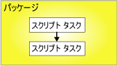
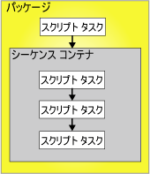

# 優先順位制約

[!INCLUDE[ssis-appliesto](../../includes/ssis-appliesto-ssvrpluslinux-asdb-asdw-xxx.md)]

  優先順位制約は、パッケージ内の実行可能ファイル、コンテナー、およびタスクをリンクして制御フローを作成し、実行可能ファイルを実行するかどうかを決定する条件を指定します。 実行可能ファイルには、For ループ コンテナー、Foreach ループ コンテナー、シーケンス コンテナー、タスク、またはイベント ハンドラーを設定できます。 また、イベント ハンドラーは優先順位制約を使用して実行可能ファイルをリンクし、制御フローを作成します。  
  
 優先順位制約は、優先実行可能オブジェクトと制約付きの実行可能オブジェクトを連結します。 優先実行可能オブジェクトは制約付きの実行可能オブジェクトの前に実行され、優先実行可能オブジェクトの実行結果により、制約付きの実行可能オブジェクトを実行するかどうかが決まる場合があります。 次の図は、優先順位制約によってリンクされた 2 つの実行可能ファイルを示しています。  
  
   
  
 直線的な制御フロー、つまり分岐のない制御フローでは、優先順位制約のみがタスクの実行順序を制御します。 制御フローに分岐がある場合には、 [!INCLUDE[ssISnoversion](../../includes/ssisnoversion-md.md)] ランタイム エンジンが、分岐の直後に続くタスクとコンテナーの実行順序を決定します。 ランタイム エンジンは、制御フロー内で連結されていないワークフローの実行順序も決定します。  
  
 [!INCLUDE[ssISnoversion](../../includes/ssisnoversion-md.md)] のアーキテクチャではコンテナーを入れ子にできるので、1 つのタスクのみをカプセル化するタスク ホスト コンテナーを除き、すべてのコンテナーに他のコンテナーと独自の制御フローを含めることができます。 For ループ コンテナー、Foreach ループ コンテナー、およびシーケンス コンテナーには、タスクとその他のコンテナーを複数含めることができます。さらに、そのコンテナーにも複数のタスクとコンテナーを含めることができます。 たとえば、スクリプト タスクとシーケンス コンテナーを持つパッケージに、そのスクリプト タスクとシーケンス コンテナーをリンクする優先順位制約を含めます。 シーケンス コンテナーには 3 つのスクリプト タスクが含まれ、その優先順位制約は 3 つのスクリプト タスクをリンクして制御フローを作成します。 次の図は、2 レベルの入れ子構造のパッケージの優先順位制約を示しています。  
  
   
  
 パッケージは、 [!INCLUDE[ssIS](../../includes/ssis-md.md)] コンテナー階層の最上層にあるため、複数のパッケージを優先順位制約によってリンクすることはできません。ただし、パッケージ実行タスクをパッケージに追加して、別のパッケージを間接的に制御フローにリンクできます。  
  
 優先順位制約は、次の方法で構成できます。  
  
-   評価操作を指定します。 優先順位制約は、制約値および式の両方、またはいずれか 1 つを使用して、制約付き実行可能ファイルを実行するかどうかを決定します。  
  
-   優先順位制約で実行結果を使用する場合、成功、失敗、完了のいずれかの実行結果を指定できます。  
  
-   優先順位制約で実行結果を使用する場合、ブール型に評価される式を指定できます。  
  
-   優先順位制約を単独で評価するか、制約付き実行可能ファイルに適用する別の制約と共に評価するかを指定します。  
  
## 評価操作  
 [!INCLUDE[ssISnoversion](../../includes/ssisnoversion-md.md)] には、次の評価操作が用意されています。  
  
-   優先順位付き実行可能ファイルの実行結果のみを使用して、制約付き実行可能ファイルを実行するかどうかを決定する制約。 優先順位付き実行可能ファイルの実行結果には、完了、成功、または失敗を設定できます。 これは既定の操作です。  
  
-   評価する式。これを使用して制約付き実行可能ファイルを実行するかどうかを決定します。 式が TRUE に評価された場合、制限付き実行可能ファイルは実行されます。  
  
-   優先順位付き実行可能ファイルの実行結果と、式を評価した戻り結果の両方を必須とする、式および制約。  
  
-   優先順位付き実行可能ファイルの実行結果か、式を評価した戻り結果を使用する、式または制約。  
  
 [!INCLUDE[ssIS](../../includes/ssis-md.md)] デザイナーでは、優先順位制約の種類を色で識別します。 成功制約は緑、失敗制約は赤、完了制約は青で表示されます。 [!INCLUDE[ssIS](../../includes/ssis-md.md)] デザイナーで制約の種類を示すテキスト ラベルを表示するには、 [!INCLUDE[ssIS](../../includes/ssis-md.md)] デザイナーのユーザー補助機能を構成する必要があります。  
  
 式は、有効な [!INCLUDE[ssIS](../../includes/ssis-md.md)] の式である必要があります。この式には、関数、演算子、システム関数およびカスタム関数を含めることができます。 詳細については、「[Integration Services &#40;SSIS&#41; の式](../../integration-services/expressions/integration-services-ssis-expressions.md)」および「[Integration Services &#40;SSIS&#41; の変数](../../integration-services/integration-services-ssis-variables.md)」を参照してください。  
  
## 実行結果  
 優先順位制約は、次の実行結果を単独で、または式との組み合わせで使用できます。  
  
-   完了。制約付き実行可能ファイルを実行するには、結果にかかわらず優先順位付き実行可能ファイルが完了することだけが必要です。  
  
-   成功。制約付き実行可能ファイルを実行するには、優先順位付き実行可能ファイルが正常に完了する必要があります。  
  
-   失敗。制約付き実行可能ファイルを実行するには、優先順位付き実行可能ファイルが失敗する必要があります。  
  
> [!NOTE]  
>  同じ **優先順位制約** コレクションのメンバーである優先順位制約のみを、論理 AND 条件でグループ化できます。 たとえば、2 つの Foreach ループ コンテナーの優先順位制約を組み合わせることはできません。  
  
## [優先順位制約エディター] を使用して優先順位制約のプロパティを設定する  
  
1.  [!INCLUDE[ssBIDevStudioFull](../../includes/ssbidevstudiofull-md.md)]で、目的のパッケージが含まれている [!INCLUDE[ssISnoversion](../../includes/ssisnoversion-md.md)] プロジェクトを開きます。  
  
2.  ソリューション エクスプローラーで、パッケージをダブルクリックして開きます。  
  
3.  **[制御フロー]** タブをクリックします。  
  
4.  優先順位制約をダブルクリックします。  
  
     **[優先順位制約エディター]** が開きます。  
  
5.  **[評価操作]** ドロップダウン リストで、評価操作を選択します。  
  
6.  **[値]** ドロップダウン リストで、優先順位付き実行可能ファイルの実行結果を選択します。  
  
7.  評価操作で式を使用する場合は、 **[式]** ボックスに式を入力して **[テスト]** をクリックし、式を評価します。  
  
    > [!NOTE]  
    >  変数名の大文字と小文字は区別されます。  
  
8.  複数のタスクまたは複数のコンテナーが制約付き実行可能ファイルに連結されている場合、前のすべての実行可能ファイルの実行結果が必ず **true** に評価されることを条件とするには、 **[論理 AND]** を選択します。 1 つの実行結果のみが必ず **true** に評価されることを条件とするには、 **[論理 OR]** を選択します。  
  
9. **[OK]** をクリックし、 **[優先順位制約エディター]** を閉じます。  
  
10. 更新したパッケージを保存するには、 **[ファイル]** メニューの **[選択されたファイルを上書き保存]** をクリックします。  

## 優先順位制約エディター
**[優先順位制約エディター]** ダイアログ ボックスを使用すると、優先順位制約を構成できます。  
  
### オプション  
 **[評価操作]**  
 優先順位制約で使用する評価操作を指定します。 操作は次のとおりです: **[制約]** 、 **[式]** 、 **[式と制約]** 、 **[式または制約]** 。  
  
 **Value**  
 制約値として次の値を指定します: **[成功]** 、 **[失敗]** 、 **[完了]** 。  
  
> [!NOTE]  
>  優先順位制約を表す線は、 **[成功]** の場合は緑色、 **[失敗]** の場合は強調表示、 **[完了]** の場合は青色です。  
  
 **[式]**  
 操作として **[式]** 、 **[式と制約]** 、または **[式または制約]** を使用する場合は、式を入力するか、式ビルダーを起動して式を作成します。 式はブール値に評価される必要があります。  
  
 **テスト**  
 式を検証します。  
  
 **論理積**  
 同一の実行可能ファイルに対して、複数の優先順位制約を同時に評価することを指定する場合に選択します。 すべての制約が **True**に評価される必要があります。  
  
> [!NOTE]  
>  この種類の優先順位制約は、緑色、強調表示、または青色の実線で示されます。  
  
 **論理和**  
 同一の実行可能ファイルに対して、複数の優先順位制約を同時に評価することを指定する場合に選択します。 少なくとも 1 つの制約が **True**に評価される必要があります。  
  
> [!NOTE]  
>  この種類の優先順位制約は、緑色、強調表示、または青色の点線で示されます。  
  
## [プロパティ] ウィンドウを使用して優先順位制約のプロパティを設定する  
  
1.  [!INCLUDE[ssBIDevStudioFull](../../includes/ssbidevstudiofull-md.md)]で、変更するパッケージが含まれている [!INCLUDE[ssISnoversion](../../includes/ssisnoversion-md.md)] プロジェクトを開きます。  
  
2.  ソリューション エクスプローラーで、パッケージをダブルクリックして開きます。  
  
3.  **[制御フロー]** タブをクリックします。 **[制御フロー]** タブのデザイン画面で優先順位制約を右クリックし、 **[プロパティ]** をクリックします。 [プロパティ] ウィンドウで、プロパティの値を変更します。  
  
4.  **[プロパティ]** ウィンドウで、優先順位制約の次の読み取り/書き込みプロパティを設定します。  
  
    |読み取り/書き込みプロパティ|構成アクション|  
    |--------------------------|--------------------------|  
    |[説明]|説明を指定します。|  
    |EvalOp|評価操作を選択します。 **Expression**、 **ExpressionAndConstant**、 **ExpressionOrConstant** のいずれかの操作を選択した場合は、式を指定することができます。|  
    |[式]|評価操作に and 式が含まれる場合は、式を指定します。 式はブール値に評価される必要があります。 式言語の詳細については、「[Integration Services &#40;SSIS&#41; 式](../../integration-services/expressions/integration-services-ssis-expressions.md)」をご覧ください。|  
    |LogicalAnd|**[論理 AND]** を設定し、複数の実行可能ファイルを先に実行して制約付き実行可能ファイルにリンクする場合、優先順位制約を他の優先順位制約と組み合わせて評価するかどうかを指定します。|  
    |[オブジェクト名]|優先順位制約の名前を更新します。|  
    |ShowAnnotation|使用する注釈の種類を指定します。 注釈を無効にするには **[Never]** 、要求時に注釈を有効にするには **[AsNeeded]** 、Name プロパティの値を使用して注釈を自動的に設定するには **[ConstraintName]** 、Description プロパティの値を使用して注釈を自動的に設定するには **[ConstraintDescription]** 、Value プロパティと Expression プロパティの値を使用して注釈を自動的に設定するには **[ConstraintOptions]** をそれぞれ選択します。|  
    |[値]|EvalOP プロパティで指定された評価操作に制約が含まれる場合は、制約付き実行可能ファイルの実行結果を選択します。|  
  
5.  [プロパティ] ウィンドウを閉じます。  
  
6.  更新したパッケージを保存するには、 **[ファイル]** メニューの **[選択されたファイルを上書き保存]** をクリックします。  

## ショートカット メニューを使用して優先順位制約の値を設定する  
  
1.  [!INCLUDE[ssBIDevStudioFull](../../includes/ssbidevstudiofull-md.md)]で、目的のパッケージが含まれている [!INCLUDE[ssISnoversion](../../includes/ssisnoversion-md.md)] プロジェクトを開きます。  
  
2.  ソリューション エクスプローラーで、パッケージをダブルクリックして開きます。  
  
3.  **[制御フロー]** タブをクリックします。  
  
4.  **[制御フロー]** タブのデザイン画面で優先順位制約を右クリックし、次に、 **[成功]** 、 **[失敗]** 、または **[完了]** をクリックします。  
  
5.  更新したパッケージを保存するには、 **[ファイル]** メニューの **[選択されたファイルを上書き保存]** をクリックします。  

## 優先順位制約に式を追加する
 優先順位制約では、優先順位付き実行可能ファイルと、制約付き実行可能ファイルの 2 つの実行可能ファイル間の制約を定義するために、式を使用できます。 これらの実行可能ファイルには、タスクまたはコンテナーを設定できます。 式は単独で使用することも、優先順位付き実行可能ファイルの実行結果と組み合わせて使用することもできます。 実行可能ファイルの実行結果は、成功または失敗のどちらかです。 優先順位制約の実行結果を構成する場合、実行結果を **Success**、 **Failure**、または **Completion**に設定できます。 **Success** に設定した場合、優先順位付き実行可能ファイルは成功する必要があります。 **Failure** に設定した場合、優先順位付き実行可能ファイルは失敗する必要があります。 **Completion** は、優先順位付きタスクの成功または失敗にかかわらず、制約つき実行可能ファイルが実行されることを示します。 詳細については、「 [優先順位制約](../../integration-services/control-flow/precedence-constraints.md)」を参照してください。  
  
 式は **True** または **False** に評価される、有効な [!INCLUDE[ssISnoversion](../../includes/ssisnoversion-md.md)] 式である必要があります。 式では、リテラル、システム変数とカスタム変数、および [!INCLUDE[ssIS](../../includes/ssis-md.md)] の式文法で用意されている関数と演算子を使用できます。 たとえば、式 `@Count == SQRT(144) + 10` では、変数 **Count**、SQRT 関数、等号 (==) 演算子、および加算 (+) 演算子が使用されています。 詳細については、「[Integration Services (SSIS) の式](../../integration-services/expressions/integration-services-ssis-expressions.md)」を参照してください。  
  
 次の図では、実行結果と式を使用する優先順位制約によって、タスク A とタスク B がリンクされています。 制約値は **Success** に設定され、式は  `@X >== @Z`です。 タスク B は制約付きタスクで、タスク A が正常に完了し、変数 **X** の値が変数 **Z**の値以上の場合にのみ実行されます。  
  
   
  
 異なる式が含まれる複数の優先順位制約を使用して、実行ファイルをリンクすることもできます。 たとえば、次の図では、実行結果と式を使用する優先順位制約によって、タスク B およびタスク C がタスク A にリンクされています。 制約値は両方とも **Success**に設定されています。 1 つの優先順位制約には式 `@X >== @Z`が含まれ、もう 1 つの優先順位制約には式 `@X < @Z`が含まれています。 変数 **X** と変数 **Z**の値に応じて、タスク C とタスク B のどちらかが実行されます。  
  
   
  
 式を追加または変更するには、 **デザイナーの** [優先順位制約エディター] [!INCLUDE[ssIS](../../includes/ssis-md.md)] と [!INCLUDE[ssBIDevStudioFull](../../includes/ssbidevstudiofull-md.md)] で用意されている [プロパティ] ウィンドウを使用します。 ただし、[プロパティ] ウィンドウには、式の構文を検証する機能は用意されていません。  
  
 優先順位制約に式が含まれる場合、 **[制御フロー]** タブのデザイン画面で、優先順位制約の隣にアイコンが表示され、アイコン上のツールヒントには式が表示されます。  

### 優先順位制約に式を追加する  
  
1.  [!INCLUDE[ssBIDevStudioFull](../../includes/ssbidevstudiofull-md.md)]で、目的のパッケージが含まれている [!INCLUDE[ssISnoversion](../../includes/ssisnoversion-md.md)] プロジェクトを開きます。  
  
2.  ソリューション エクスプローラーで、パッケージをダブルクリックして開きます。  
  
3.  **[制御フロー]** タブをクリックします。  
  
4.  **[制御フロー]** タブのデザイン画面で、優先順位制約をダブルクリックします。 **[優先順位制約エディター]** が開きます。  
  
5.  **[評価操作]** の一覧で、 **[式]** 、 **[式と制約]** 、または **[式または制約]** を選択します。  
  
6.  **[式]** ボックスに式を入力するか、式ビルダーを起動して式を作成します。  
  
7.  式の構文を検証するには、 **[テスト]** をクリックします。  
  
8.  更新したパッケージを保存するには、 **[ファイル]** メニューの **[選択されたファイルを上書き保存]** をクリックします。  
 
### 実行値と式の結合  
 次の表では、実行値制約と優先順位制約の式を結合した場合の結果について説明します。  
  
|[評価操作]|制約の評価|式の評価|制約付き実行可能ファイルの実行|  
|--------------------------|-----------------------------|-----------------------------|---------------------------------|  
|制約|True|なし|True|  
|制約|False|なし|False|  
|式|なし|True|True|  
|式|なし|False|False|  
|制約と式の両方|True|True|True|  
|制約と式の両方|True|False|False|  
|制約と式の両方|False|True|False|  
|制約と式の両方|False|False|False|  
|制約または式のいずれか|True|True|True|  
|制約または式のいずれか|True|False|True|  
|制約または式のいずれか|False|True|True|  
|制約または式のいずれか|False|False|False|  

## 複数の優先順位制約を含む複雑な制約シナリオ 
優先順位制約は、2 つのタスク、2 つのコンテナー、1 つのタスクと 1 つのコンテナーなど、2 つの実行可能ファイルを連結します。 これらは優先順位付き実行可能ファイル、および制約付き実行可能ファイルと呼ばれています。 制約付き実行可能ファイルには、複数の優先順位制約を含めることができます。 優先順位制約の詳細については、「[優先順位制約](../../integration-services/control-flow/precedence-constraints.md)」を参照してください。  
  
 制約をグループ化して複雑な制約シナリオを組み立てると、複雑な制御フローをパッケージに実装できます。 たとえば、次の図で、タスク D は、 **成功** 制約によってタスク A にリンクされ、 **失敗** 制約によってタスク B にリンクされ、さらに **成功** 制約によってタスク C にリンクされています。 タスク D とタスク A の間、タスク D とタスク B の間、およびタスク D とタスク C の間の優先順位制約は、論理 *AND* リレーションシップになります。 したがって、タスク D を実行するには、タスク A の実行が成功し、タスク B が失敗し、タスク C の実行が成功する必要があります。  
  
   
  
### LogicalAnd プロパティ  
 タスクまたはコンテナーに複数の制約がある場合、 **LogicalAnd** プロパティにより、優先順位制約を単独で評価するか、別の制約と組み合わせて評価するかを指定します。  
  
 **LogicalAnd** プロパティを設定するには、 **デザイナーで用意されている** [優先順位制約エディター] [!INCLUDE[ssIS](../../includes/ssis-md.md)] 、または [!INCLUDE[ssBIDevStudioFull](../../includes/ssbidevstudiofull-md.md)] の [プロパティ] ウィンドウを使用します。  

## 優先順位制約の既定値を設定する  
[!INCLUDE[ssIS](../../includes/ssis-md.md)] デザイナーを初めて使用する場合、優先順位制約の既定値は **[成功]** です。 別の既定値を使用するように [!INCLUDE[ssIS](../../includes/ssis-md.md)] デザイナーを構成するには、次の手順に従います。
  
1.  [!INCLUDE[ssBIDevStudioFull](../../includes/ssbidevstudiofull-md.md)]を開きます。  
  
2.  **[ツール]** メニューの **[オプション]** をクリックします。  
  
3.  **[オプション]** ダイアログ ボックスで **[ビジネス インテリジェンス デザイナー]** を展開し、次に **[Integration Services デザイナー]** を展開します。  
  
4.  **[制御フローの自動接続]** をクリックし、 **[選択した図形に新しい図形を既定で接続する]** をオンにします。  
  
5.  ドロップダウン リストで、 **[新しい図形に失敗制約を使用]** または **[新しい図形に完了制約を使用]** を選択します。  
  
6.  **[OK]** をクリックします。  
  
## 既定の優先順位制約を作成する  
  
1.  [!INCLUDE[ssBIDevStudioFull](../../includes/ssbidevstudiofull-md.md)]で、目的のパッケージが含まれている [!INCLUDE[ssISnoversion](../../includes/ssisnoversion-md.md)] プロジェクトを開きます。  
  
2.  ソリューション エクスプローラーで、パッケージをダブルクリックして開きます。  
  
3.  **[制御フロー]** タブをクリックします。  
  
4.  **[制御フロー]** タブのデザイン画面で、タスクまたはコンテナーをクリックし、そのコネクタを、優先順位制約を適用する実行可能ファイルにドラッグします。  
  
5.  更新したパッケージを保存するには、 **[ファイル]** メニューの **[選択されたファイルを上書き保存]** をクリックします。  
