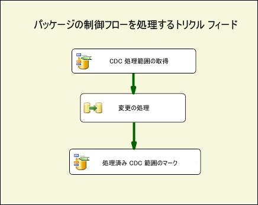
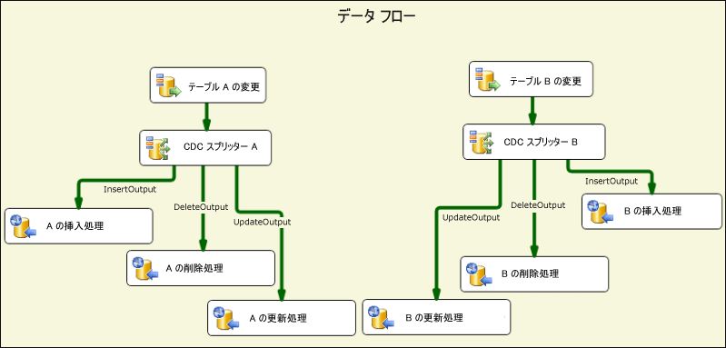
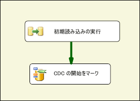
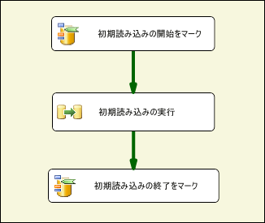
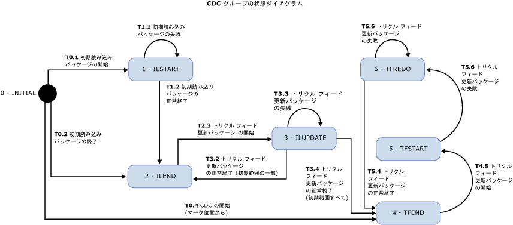

# CDC フロー コンポーネント

[!INCLUDE[ssis-appliesto](../../includes/ssis-appliesto-ssvrpluslinux-asdb-asdw-xxx.md)]

  SSIS 開発者は、Microsoft [!INCLUDE[ssISCurrent](../../includes/ssiscurrent-md.md)] 用 Attunity 変更データ キャプチャ (CDC) コンポーネントを使用すると、CDC を操作し、CDC パッケージの複雑さを軽減できます。  
  
 SSIS CDC コンポーネントは、ソース テーブルが同じ [!INCLUDE[ssCurrent](../../includes/sscurrent-md.md)] データベースか Oracle データベース (Oracle CDC Service for [!INCLUDE[ssCurrent](../../includes/sscurrent-md.md)] の使用時) である場合に、 [!INCLUDE[ssCurrent](../../includes/sscurrent-md.md)]CDC 機能を使用できるようにデザインされています。 パーティション テーブルがサポートされます。  
  
 このコンポーネントには、SSIS パッケージの変更データの読み取りと処理を効率化する、制御フロー コンポーネントとデータ フロー コンポーネントがあります。 これらのコンポーネントは Microsoft [!INCLUDE[ssCurrent](../../includes/sscurrent-md.md)]のコンポーネント ライブラリに追加できますが、個別にインストールする必要があります。  
  
 次のコンポーネントが Attunity 変更データ キャプチャ (CDC) コンポーネントです。  
  
 **CDC 制御フロー コンポーネント**:  
  
 [CDC 制御タスク](../../integration-services/control-flow/cdc-control-task.md)  
  
 **CDC データ フロー コンポーネント**:  
  
 [CDC ソース](../../integration-services/data-flow/cdc-source.md)  
  
 [CDC スプリッター](../../integration-services/data-flow/cdc-splitter.md)  
  
## インストール  
 このセクションでは、CDC Components for Microsoft [!INCLUDE[ssISCurrent](../../includes/ssiscurrent-md.md)]のインストール手順について説明します。  
  
 SSIS 用の CDC コンポーネントは、Microsoft® Change Data Capture Designer and Service for Oracle by Attunity for Microsoft SQL Server® に同梱されています。 このダウンロードは、SQL Server の Feature Pack の一部です。 [SQL Server 2016 Feature Pack の Web ページ](https://go.microsoft.com/fwlink/?LinkId=746297)から、Feature Pack のコンポーネントをダウンロードします。  
  
### バージョンのサポート

#### SQL Server のバージョン サポート

SSIS の CDC コンポーネントは、サポートされているすべての Microsoft SQL Server バージョンでサポートされています。 現在のところ、サポートされている SQL Server バージョンには、SQL Server 2012 から SQL Server 2017 までが含まれています。

#### オペレーティング システムのバージョン サポート
  
SSIS の CDC コンポーネントは、次のオペレーティング システムとプラットフォームでサポートされています。  
  
-   Windows 8 および 8.1
-   Windows 10  
-   Windows Server 2012 および 2012 R2
-   Windows Server 2016
  
### インストール プログラムの実行  
 インストール ウィザードを実行する前に、必ず [!INCLUDE[ssCurrent](../../includes/sscurrent-md.md)][!INCLUDE[ssBIDevStudio](../../includes/ssbidevstudio-md.md)] を閉じてください。 そのうえでインストール ウィザードの指示に従います。  
  
### SSIS サービスの再起動 
CDC コンポーネントをインストールしたら、SQL [!INCLUDE[ssBIDevStudio](../../includes/ssbidevstudio-md.md)]でのパッケージの開発時にコンポーネントが正常に機能するように、SSIS サービスを再起動する必要があります。  
  
コンポーネントをインストールすると、メッセージが表示されます。 メッセージが表示されたら **[はい]** をクリックします。  
  
### Microsoft CDC コンポーネントのアンインストール  
 CDC ソース、CDC スプリッター、または CDC 制御タスクをアンインストールするには、アンインストール ウィザードを使用します。 パッケージの開発に [!INCLUDE[ssCurrent](../../includes/sscurrent-md.md)][!INCLUDE[ssBIDevStudio](../../includes/ssbidevstudio-md.md)] を使用している場合は、アンインストール ウィザードの実行前に [!INCLUDE[ssBIDevStudio](../../includes/ssbidevstudio-md.md)] を閉じる必要があります。  
  
## 利点  
 SSIS 開発者は、 [!INCLUDE[ssCurrent](../../includes/sscurrent-md.md)][!INCLUDE[ssISnoversion](../../includes/ssisnoversion-md.md)] コンポーネント用の CDC コンポーネントを使用して、変更データを処理する SSIS パッケージを簡単に構築できます。 これらのコンポーネントは、CDC に対処し、CDC パッケージの複雑さを軽減する SSIS 開発者の能力を高めます。  
  
 SSIS CDC コンポーネントを使用すると、レプリケーション、データ ウェアハウスの読み込み、OLAP の緩やかに変化するディメンションの更新、変更の監査などの目的で処理しやすい形で変更データを提供できます。 後で行う処理の種類は、SSIS 開発者が決定します。  
  
 SSIS CDC コンポーネントは、同じ [!INCLUDE[ssCurrent](../../includes/sscurrent-md.md)] データベース内の変更テーブルで [!INCLUDE[ssCurrent](../../includes/sscurrent-md.md)] CDC 機能を使用できるようにデザインされています。  
  
## Change Data Capture コンポーネントの概要  
 一般的な CDC パッケージでは、テーブルのグループに対する変更を処理します。 この種類の CDC パッケージの基本的な制御フローを以下の図に示します。 このパッケージは、トリクル フィード処理パッケージと呼ばれます。  
  
   
  
 この [!INCLUDE[ssCurrent](../../includes/sscurrent-md.md)][!INCLUDE[ssISnoversion](../../includes/ssisnoversion-md.md)] 制御フローには、2 つの CDC 制御タスクとデータ フロー タスクが含まれています。 **Get CDC Processing Range** (CDC 処理範囲の取得) という最初のタスクでは、 **Process Changes**(変更の処理) というデータ フロー タスクで処理される変更の LSN 範囲を設定します。 この範囲は、前回のパッケージ実行時に処理されて永続的なストアに保存された内容に基づいて設定されます。  
  
 CDC 制御タスクの使用の詳細については、「 [CDC Control Task](../../integration-services/control-flow/cdc-control-task.md) 」と「 [CDC Control Task Editor](../../integration-services/control-flow/cdc-control-task-editor.md)」を参照してください。  
  
 次の図に、変更の処理方法を概念的に表した、 **Process Changes (変更の処理)** データ フローを示します。  
  
   
  
 この図の手順は次のとおりです。  
  
-   **Changes for Table X (テーブル X の変更)** は、テーブル X に対する変更 (親コントロール フローで決定された CDC 処理範囲内での変更) を読み取る CDC ソースです。  
  
-   **CDC Splitter X (CDC スプリッター X)** は、変更を、挿入、削除、および更新に分割するために使用されます。 このシナリオでは、異なる種類の変更を並列処理できるように、差分変更を生成するように CDC ソースが構成されているものとします。  
  
-   特定の変更は、下流でさらに処理されます。 この図では、変更は複数の ODBC 入力先を使用してテーブルに挿入されていますが、実際の処理方法は異なる可能性があります。  
  
 CDC ソースの詳細については、以下のトピックを参照してください。  
  
 [CDC ソース](../../integration-services/data-flow/cdc-source.md)  
  
 [[CDC ソース エディター] ([接続マネージャー] ページ)](../../integration-services/data-flow/cdc-source-editor-connection-manager-page.md)  
  
 [[CDC ソース エディター] &#40;[列] ページ&#41;](../../integration-services/data-flow/cdc-source-editor-columns-page.md)  
  
 [[CDC ソース エディター] ([エラー出力] ページ)](../../integration-services/data-flow/cdc-source-editor-error-output-page.md)  
  
 CDC スプリッターの詳細については、以下のトピックを参照してください。  
  
 [CDC スプリッター](../../integration-services/data-flow/cdc-splitter.md)  
  
 CDC パッケージの構築時に注意が必要な基本的な問題の 1 つに、変更の処理とデータの初期読み込み (または初期処理) の関係があります。  
  
 CDC コンポーネントは、3 種類の初期読み込みと変更処理のシナリオをサポートしています。  
  
-   データベース スナップショットでの初期読み込み。 このケースでは、変更の処理はスナップショット イベントの LSN で開始されます。  
  
-   休止データベースからの初期読み込み。 このケースでは、初期読み込み中に変更は行われないため、初期読み込み中のある時点で現在の LSN がサンプリングされ、変更の処理はその LSN から開始されます。  
  
-   アクティブ データベースからの初期読み込み。 このケースでは、初期読み込みが実行中であるため、データベースに変更が加えられ、変更の処理の正確な開始点となる単一の LSN は存在しません。 このケースでは、初期読み込みパッケージの開発者は、初期読み込みの前後にソース データベースの現在の LSN をサンプリングできます。 その後、初期読み込みに対して並列に行われた変更を処理する際には注意が必要です。処理対象の変更の一部が既に初期読み込みに含まれるためです (たとえば、重複キーのエラーにより挿入変更に失敗することがありますが、その原因は、挿入される行が初期読み込みプロセスで既に読み取られているためです)。  
  
 次の図に、最初の 2 つのシナリオが関係する SSIS パッケージを示します。  
  
   
  
 次の図に、3 番目のシナリオが関係する SSIS パッケージを示します。  
  
   
  
 初期読み込みパッケージに続き、トリクル フィード更新パッケージがスケジュールに従って繰り返し実行され、処理できるようになった変更を処理します。  
  
 初期読み込みパッケージからトリクル フィード パッケージ、および各パッケージ内の異なるタスク間での CDC 処理の状態の受け渡しは、特別な SSIS パッケージ文字列変数を使用して行われます。 この変数の値は CDC 状態と呼ばれ、初期読み込みとトリクル フィード パッケージによって処理されるテーブル グループの CDC 処理の現在の状態が反映されます。  
  
 CDC 状態変数の値は、永続的なストレージで保守管理する必要があります。 CDC 処理の開始前に読み込む必要があり、処理の完了後は、現在の状態で保存する必要があります。 SSIS 開発者は CDC 状態の読み込みと保存のタスクを処理できますが、CDC 制御コンポーネントでこのタスクを自動化することもできます。それには、CDC 状態の値をデータベース テーブルで保持する必要があります。  
  
## セキュリティに関する考慮事項  
 このセクションでは、SSIS での CDC コンポーネントの使用に関連するセキュリティ上の注意点について説明します。  
  
### 変更データへのアクセスの承認  
 トリクル フィード更新パッケージには、 [!INCLUDE[ssCurrent](../../includes/sscurrent-md.md)] CDC 関数へのアクセスが必要です。 既定では、このアクセスは、 **db_owner** 固定データベース ロールのメンバーに許可されます。 **db_owner** は強力なロールなので、 [!INCLUDE[ssCurrent](../../includes/sscurrent-md.md)] でキャプチャ インスタンスを定義する際には、各キャプチャ インスタンスにゲーティング セキュリティ ロールを関連付け、SSIS CDC パッケージがはるかに制限の厳しいユーザーを変更の処理に使用できるようにすることをお勧めします。  
  
### CDC データベースの現在の LSN へのアクセス  
 変更の処理用に開始 LSN にマーキングするための CDC 制御タスク操作では、CDC データベースの現在の LSN を検出できる必要があります。 コンポーネントでは、マスター データベースのプロシージャ **sp_replincrementlsn** を利用することで LSN が検出されます。 このプロシージャの実行権限を、 [!INCLUDE[ssCurrent](../../includes/sscurrent-md.md)] CDC データベースに接続するために使用されるログインに付与する必要があります。  
  
### CDC 状態テーブルへのアクセス  
 CDC 状態テーブルは、 [!INCLUDE[ssCurrent](../../includes/sscurrent-md.md)] CDC データベースへの接続に使用されるログインで更新できる必要のある CDC 状態を自動的に保持するために使用されます。 このテーブルを作成するのは SSIS 開発者なので、 [!INCLUDE[ssCurrent](../../includes/sscurrent-md.md)] データベースの作成と管理タスクの実行を許可するユーザーとして、 [!INCLUDE[ssCurrent](../../includes/sscurrent-md.md)] システム管理者を設定してください。 また、CDC 対応データベースを扱う [!INCLUDE[ssCurrent](../../includes/sscurrent-md.md)] システム管理者には、 [!INCLUDE[ssCurrent](../../includes/sscurrent-md.md)] CDC のテクノロジと実装に関する知識が必要です。  
  
## CDC 処理用のテーブルのグループ化  
 データベース プロジェクトの規模は、テーブルが数個のものから数千個のものまで、さまざまです。 初期読み込みパッケージと CDC パッケージをデザインする際には、効率を高め、管理しやすくするために、テーブルをより小さなグループに分けることをお勧めします。 このセクションでは、小さいグループ (各グループ内のテーブルは、初期読み込みの後、グループとして更新される) へのテーブルの並べ替えに関係する各種考慮事項を示します。  
  
 CDC コンポーネントでサポートされる CDC パターンは、このグループ化が既に決定されていることを前提としています。 各グループでは、他のグループとは別に保持される CDC コンテキストが定義されます。 グループごとに、初期読み込みパッケージとトリクル フィード更新パッケージが作成されます。 トリクル フィード更新については、変更処理の制約のレート (たとえば、他のシステムに影響する CPU および IO 使用量) と適切な待機時間に基づいて、定期的な実行がスケジュールされます。  
  
 テーブルは、次の考慮事項に基づいてグループ化されます。  
  
1.  ターゲット データベース。 別のターゲット データベースに書き込まれるテーブルと別の処理が適用されるテーブルは、すべて異なる CDC グループに割り当てる必要があります。  
  
2.  参照整合性制約に関係するテーブルは、ターゲットでの参照整合性の問題を避けるために、同じグループに割り当てる必要があります。  
  
3.  比較的長い待機時間が許容されるテーブルは、処理頻度を抑え、システム全体の負荷を小さくするために、グループ化できます。  
  
4.  変更頻度の高いテーブルはより小さなグループに入れる必要がありますが、変更頻度の低いテーブルはより大きなグループに入れることができます。  
  
 CDC グループごとに次の 2 つのパッケージが作成されます。  
  
-   ソース テーブルからデータの範囲全体を読み取り、それをターゲット テーブルに適用する初期読み込みパッケージ。  
  
-   ソース テーブルに対する変更を読み取り、その変更をターゲット テーブルに適用するトリクル フィード更新パッケージ。 このパッケージは、定期的に実行する必要があります。  
  
## CDC 状態  
 各 CDC グループには、特定の形式の文字列で表される状態が関連付けられています。 詳細については、「 [CDC Control Task](../../integration-services/control-flow/cdc-control-task.md)」を参照してください。 CDC 状態の値は、次のいずれかです。  
  
|状態|[説明]|  
|-----------|-----------------|  
|0-(INITIAL)|現在の CDC グループでパッケージが実行される前の状態です。 CDC 状態が空のときの状態でもあります。   CDC 制御タスクの操作の詳細については、「 [CDC Control Task](../../integration-services/control-flow/cdc-control-task.md)」を参照してください。|  
|1-ILSTART (Initial-Load-Started)|初期読み込みパッケージが開始されたときの状態です。 CDC 制御タスクに対する **MarkInitialLoadStart** 操作の呼び出し後に、この状態になります。   CDC 制御タスクの操作の詳細については、「 [CDC Control Task](../../integration-services/control-flow/cdc-control-task.md)」を参照してください。|  
|2- ILEND (Initial-Load-Ended)|初期読み込みパッケージが正常に終了したときの状態です。 CDC 制御タスクに対する MarkInitialLoadEnd 操作の呼び出し後に、この状態になります。   CDC 制御タスクの操作の詳細については、「 [CDC Control Task](../../integration-services/control-flow/cdc-control-task.md)」を参照してください。|  
|3-ILUPDATE (Initial Load Update)|初期読み込みの後に更新パッケージを初めて実行した後、まだ初期処理範囲を処理しているときの状態です。 CDC 制御タスクに対する **GetProcessingRange** 操作の呼び出し後に、この状態になります。   **_$reprocessing** 列を使用している場合は、既にターゲットに存在する行をパッケージが再処理している可能性があることを示す 1 に設定されます。   CDC 制御タスクの操作の詳細については、「 [CDC Control Task](../../integration-services/control-flow/cdc-control-task.md)」を参照してください。|  
|4-TFEND (Trickle-Feed-Update-Ended)|定期的な CDC の実行で期待される状態です。 前の実行が正常に完了していることと、新しい実行を新しい処理範囲で開始できることを表します。|  
|5-TFSTART (Trickle-Feed-Update-Started)|CDC 制御タスクに対して **GetProcessingRange** 操作を呼び出した後で、更新パッケージの後続実行を行ったときの状態です。   定期的な CDC の実行を開始したものの、まだ完了していないことを表します (**MarkProcessedRange**)。   CDC 制御タスクの操作の詳細については、「 [CDC Control Task](../../integration-services/control-flow/cdc-control-task.md)」を参照してください。|  
|6-TFREDO (Reprocessing-Trickle-Feed-Updates)|TFSTART の後に **GetProcessingRange** が行われたときの状態です。 前の実行が正常に完了しなかったことを表します。   __$reprocessing 列を使用している場合は、既にターゲットに存在する行をパッケージが再処理している可能性があることを示す 1 に設定されます。|  
|7-ERROR|CDC グループはエラー状態です。|  
  
 ここに CDC コンポーネントの状態図があります。 予期しない状態に達したときに、エラー状態になっています。 予期される状態は次の図のようになります。 しかしながら、この図にはエラー状態がありません。  
  
 たとえば、初期読み込みパッケージの終了時に状態を ILEND に設定しようとした時点で、状態が TFSTART の場合は CDC グループはエラー状態になり、トリクル フィード更新パッケージは実行されません (初期読み込みパッケージは実行されます)。  
  
   
  
 初期読み込みパッケージが正常に実行されると、定義済みのスケジュールに従ってトリクル フィード更新パッケージが繰り返し実行され、ソース テーブルに対する変更を処理します。 トリクル フィード更新パッケージの各実行は、CDC 実行です。  
  
## このセクションの内容  
  
-   [CDC ソース](../../integration-services/data-flow/cdc-source.md)  
  
-   [CDC スプリッター](../../integration-services/data-flow/cdc-splitter.md)  
  
## Related Tasks  
  
-   [変更の種類に応じた CDC ストリームのダイレクト](../../integration-services/data-flow/direct-the-cdc-stream-according-to-the-type-of-change.md)  
  
-   [状態変数の定義](../../integration-services/data-flow/define-a-state-variable.md)  
  
## 関連コンテンツ  
  
-   mattmasson.com のブログ「 [SQL Server 2012 用の SSIS の CDC](https://www.mattmasson.com/2011/12/cdc-in-ssis-for-sql-server-2012-2/)」  
  
-   blogs.msdn.com の CDC Service の設定に関するブログ エントリ「 [SQL Server 2012 の Oracle 用 CDC](https://go.microsoft.com/fwlink/?LinkId=247827)」  
  
-   social.technet.microsoft.com の技術記事「 [Microsoft SQL Server 2012 Change Data Capture for Oracle by Attunity のインストール](https://go.microsoft.com/fwlink/?LinkId=252958)」  
  
-   social.technet.microsoft.com の技術記事「 [Microsoft Change Data Capture for Oracle by Attunity の構成の問題のトラブルシューティング](https://go.microsoft.com/fwlink/?LinkId=252960)」  
  
-   social.technet.microsoft.com の技術記事「 [Microsoft Change Data Capture for Oracle by Attunity の CDC インスタンス エラーのトラブルシューティング](https://go.microsoft.com/fwlink/?LinkId=252961)」  
  
-   technet.microsoft.com のビデオ「 [SQL Server Integration Services 2012 を使用した Oracle データベースの CDC (SQL Server ビデオ)](https://technet.microsoft.com/sqlserver/jj218898)」  
  
## 参照  
 [CDC 制御タスク](../../integration-services/control-flow/cdc-control-task.md)  
  
  
