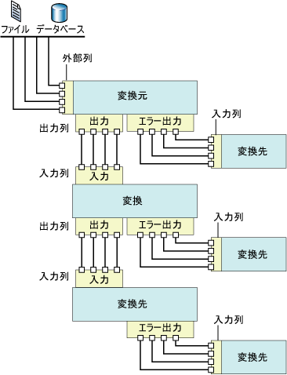

# データ フロー

[!INCLUDE[ssis-appliesto](../../includes/ssis-appliesto-ssvrpluslinux-asdb-asdw-xxx.md)]

  [!INCLUDE[ssNoVersion](../../includes/ssnoversion-md.md)] [!INCLUDE[ssISnoversion](../../includes/ssisnoversion-md.md)] には、変換元、変換、および変換先という 3 種類のデータ フロー コンポーネントが用意されています。 変換元は、リレーショナル データベース、ファイル、および [!INCLUDE[ssASnoversion](../../includes/ssasnoversion-md.md)] データベースのテーブルやビューなどのデータ ストアからデータを抽出します。 変換は、データを変更、集約、およびクリーンアップします。 変換先は、データをデータ ストアに読み込んだり、メモリ内のデータセットを作成します。  
  
> [!NOTE]  
>  カスタム プロバイダーを使用するときに、ProviderDescriptors.xml ファイルをメタデータ列の値で更新する必要があります。  
  
 また、 [!INCLUDE[ssISnoversion](../../includes/ssisnoversion-md.md)] では、コンポーネントの出力を別のコンポーネントの入力に連結するパスが用意されています。 パスは、コンポーネントの順序を定義します。また、パスを使用して注釈をデータ フローに追加したり、列の変換元を表示したりすることもできます。  
  
 データ フロー コンポーネントを連結するには、変換元と変換の出力を、変換と変換先の入力に連結します。 データ フローを構築する場合、通常は 2 番目以降のコンポーネントを追加するときに、データ フローに連結します。 コンポーネントを連結すると、コンポーネントを構成するための入力列が使用できるようになります。 使用できる入力列がない場合、コンポーネントをデータ フローに連結した後に、そのコンポーネントの構成を完了する必要があります。 詳細については、「 [Integration Services のパス](../../integration-services/data-flow/integration-services-paths.md) 」と「 [パスを使用してコンポーネントを連結する](https://msdn.microsoft.com/library/05633e4c-1370-4b05-802b-f36b07dd71c8)」を参照してください。  
  
 次の図は、1 つの変換元、入力と出力を 1 つずつとる 1 つの変換、および 1 つの変換先を持つデータ フローを示しています。 この図には、入力列、出力列、および外部列に加え、入力、出力、およびエラー出力が含まれています。  
  
   
  
## データ フローの実装  
 パッケージにデータ フローを実装するには、最初にデータ フロー タスクをパッケージの制御フローに追加します。 パッケージには、それぞれ独自のデータ フローを持つ複数のデータ フロー タスクを含めることができます。 たとえば、パッケージで、特定の順序でデータ フローを実行する必要がある場合、またはデータ フロー間で別のタスクを実行する必要がある場合は、データ フローごとに異なるデータ フロー タスクを使用する必要があります。  
  
 制御フローにデータ フロー タスクを含めた後で、パッケージで使用するデータ フローの作成を開始できます。 詳細については、「 [データ フロー タスク](../../integration-services/control-flow/data-flow-task.md)」を参照してください。  
  
 データ フローを作成するには、次の手順を実行します。  
  
-   1 つ以上の変換元を追加してファイルおよびデータベースからデータを抽出し、接続マネージャーを追加して変換元に接続します。  
  
-   パッケージのビジネス要件を満たす変換を追加します。 ただし、データ フローには変換を含めなくてもかまいません。  
  
     一部の変換では、接続マネージャーが必要です。 たとえば、参照変換では、接続マネージャーを使用して参照データを含むデータベースに接続します。  
  
-   変換元と変換の出力を、変換と変換先の入力に連結することにより、データ フロー コンポーネントを連結します。  
  
-   1 つ以上の変換先を追加してファイルやデータベースなどのデータ ストアにデータを読み込み、接続マネージャーを追加してデータ ソースに接続します。  
  
-   コンポーネント上で、問題を扱うエラー出力を構成します。  
  
     データ フロー コンポーネントがデータを変換したり、参照を実行したり、または式を評価する際に、実行時に行レベルのエラーが発生する場合があります。 たとえば、文字列値のデータ列が整数に変換できない場合、または式が 0 での除算を試行している場合などがあります。 これらの操作の結果はいずれもエラーになり、エラーが含まれる行は、エラー フローを使用して別個に処理されます。 パッケージのデータ フローでエラー フローを使用する方法については、「 [データのエラー処理](../../integration-services/data-flow/error-handling-in-data.md)」を参照してください。  
  
-   データ フローを自己文書化する注釈を追加します。 詳細については、「 [パッケージで注釈を使用する](../../integration-services/use-annotations-in-packages.md)」を参照してください。  
  
> [!NOTE]  
>  新しいパッケージを作成する場合、ウィザードを使用して、接続マネージャー、変換元、および変換先を正しく構成することもできます。 詳細については、「 [SQL Server データ ツールでのパッケージの作成](../../integration-services/create-packages-in-sql-server-data-tools.md)」を参照してください。  
  
 **[データ フロー]** タブがアクティブになっている場合、ツールボックスには、データ フローに追加できる変換元、変換、および変換先が表示されます。  
  
## 式  
 多くのデータ フロー コンポーネント (変換元、変換、および変換先) では、一部のプロパティでプロパティ式を使用できます。 プロパティ式は、パッケージの読み込み時にプロパティの値を置き換える式です。 実行時に、パッケージは更新されたプロパティ値を使用します。 [!INCLUDE[ssISnoversion](../../includes/ssisnoversion-md.md)] 式の構文を使用して式を作成し、その式に [!INCLUDE[ssISnoversion](../../includes/ssisnoversion-md.md)] の関数、演算子、識別子、および変数を含めることができます。 詳細については、「[Integration Services &#40;SSIS&#41; の式](../../integration-services/expressions/integration-services-ssis-expressions.md)」、「[Integration Services &#40;SSIS&#41; の式](../../integration-services/expressions/integration-services-ssis-expressions.md)」および「[パッケージでプロパティ式を使用する](../../integration-services/expressions/use-property-expressions-in-packages.md)」を参照してください。  
  
 [!INCLUDE[ssBIDevStudioFull](../../includes/ssbidevstudiofull-md.md)] でパッケージを構築すると、プロパティ式をサポートするすべてのデータ フロー コンポーネントのプロパティが、そのデータ フロー コンポーネントが属するデータ フロー タスクに表示されます。 データ フロー コンポーネントのプロパティ式を追加、変更、および削除するには、データ フロー タスクをクリックし、[プロパティ] ウィンドウまたはタスク用のエディターを使用してプロパティ式を追加、変更、または削除します。 データ フロー タスク自体のプロパティ式は、[プロパティ] ウィンドウで管理します。  
  
 データ フローに式を使用するコンポーネントが含まれている場合は、該当する式も [プロパティ] ウィンドウに表示されます。 式を表示するには、コンポーネントが属するデータ フロー タスクを選択します。 プロパティは項目別またはアルファベット順に表示できます。 [プロパティ] ウィンドウで項目別のビューを使用すると、特定のプロパティで使用されていないすべての式は **[その他]** カテゴリに一覧表示されます。 アルファベット順のビューを使用すると、データ フロー コンポーネントの名前順に式が一覧表示されます。  
  
## 変換元  
 [!INCLUDE[ssISnoversion](../../includes/ssisnoversion-md.md)]での変換元とは、さまざまな外部データ ソースのデータを、データ フロー内の別のコンポーネントで使用できるようにするデータ フロー コンポーネントのことです。 フラット ファイル、XML ファイル、Microsoft Excel ブック、および生データが含まれるファイルからデータを抽出できます。 また、データベースのテーブルやビューにアクセスしたり、クエリを実行したりすることによっても、データを抽出できます。  
  
 1 つのデータ フローには、1 つまたは複数の変換元を含めることができます。  
  
 データ フローの変換元は、通常、1 つの標準出力をとります。 標準出力には、変換元がデータ フローに追加する列である出力列が含まれます。  
  
 標準出力は、外部列を参照します。 外部列とは、変換元に含まれる列のことです。 たとえば、 **AdventureWorks** データベースの **Product** テーブル内にある **MadeFlag** 列は、標準出力に追加できる外部列です。 外部列のメタデータには、変換元の列の名前、データ型、および長さなどの情報が含まれます。  
  
 変換元のエラー出力には、標準出力と同じ列に加え、エラーに関する情報を提供する 2 つの列も含まれます。 [!INCLUDE[ssISnoversion](../../includes/ssisnoversion-md.md)] オブジェクト モデルでは、変換元に含めることができる標準出力とエラー出力の数に制限はありません。 [!INCLUDE[ssISnoversion](../../includes/ssisnoversion-md.md)] に含まれる、スクリプト コンポーネント以外のほとんどの変換元の標準出力は 1 つです。また、ほとんどの変換元のエラー出力は 1 つです。 カスタム ソースをコード化して、複数の標準出力と複数のエラー出力を実装できます。  
  
 すべての出力列は、データ フロー内の次のデータ フロー コンポーネントで、入力列として使用できます。  
  
 カスタムの変換元を記述することもできます。 詳しくは、「 [カスタム データ フロー コンポーネントの開発](../../integration-services/extending-packages-custom-objects/data-flow/developing-a-custom-data-flow-component.md) 」と「 [特定の種類のデータ フロー コンポーネントの開発](../../integration-services/extending-packages-custom-objects-data-flow-types/developing-specific-types-of-data-flow-components.md)」をご覧ください。  
  
 次の変換元には、プロパティ式で更新できるプロパティがあります。  
  
-   [ADO NET ソース](../../integration-services/data-flow/ado-net-source.md)  
  
-   [XML ソース](../../integration-services/data-flow/xml-source.md)  
  
### ダウンロード可能な変換元  
 次の表に、 [!INCLUDE[msCoName](../../includes/msconame-md.md)] の Web サイトから別途ダウンロード可能な変換元を示します。  
  
|Source|Description|  
|------------|-----------------|  
|Oracle 変換元|Oracle 変換元は、 [!INCLUDE[msCoName](../../includes/msconame-md.md)] Connector for Oracle by Attunity の変換元コンポーネントです。 [!INCLUDE[msCoName](../../includes/msconame-md.md)] Connector for Oracle by Attunity には、接続マネージャーおよび変換先も含まれます。 詳細については、 [Microsoft Connectors for Oracle and Teradata by Attunity](https://go.microsoft.com/fwlink/?LinkId=789384)のダウンロード ページを参照してください。|  
|SAP BI 変換元|SAP BI 変換元は、 [!INCLUDE[msCoName](../../includes/msconame-md.md)] Connector for SAP BI の変換元コンポーネントです。 [!INCLUDE[msCoName](../../includes/msconame-md.md)] Connector for SAP BI には、接続マネージャーおよび変換先も含まれます。 詳細については、 [Microsoft SQL Server 用 Feature Pack](https://go.microsoft.com/fwlink/?LinkID=746297)のダウンロード ページを参照してください。|  
|Teradata 変換元|Teradata 変換元は、 [!INCLUDE[msCoName](../../includes/msconame-md.md)] Connector for Teradata by Attunity の変換元コンポーネントです。 [!INCLUDE[msCoName](../../includes/msconame-md.md)] Connector for Teradata by Attunity には、接続マネージャーおよび変換先も含まれます。 詳細については、[Microsoft Connectors for Oracle and Teradata by Attunity](https://go.microsoft.com/fwlink/?LinkId=789384) のダウンロード ページを参照してください。|  
  
 [!INCLUDE[msCoName](../../includes/msconame-md.md)] Connector for Oracle by Attunity のパフォーマンス強化を活用する方法の例については、「 [Microsoft Connector for Oracle by Attunity のパフォーマンス (SQL Server ビデオ)](https://go.microsoft.com/fwlink/?LinkID=210369)」を参照してください。  
  
## 変換  
 変換の機能は多岐にわたります。 変換では、データを更新、集約、クリーンアップ、マージ、および分散するタスクを実行できます。 列の値の変更、テーブルの値の参照、データのクリーンアップ、および列の値の集計ができます。  
  
 変換の入力と出力では、入力されるデータと出力されるデータの列を定義します。 データに対して実行される操作に応じて、変換に 1 つの入力と複数の出力が含まれる場合や、複数の入力と 1 つの出力が含まれる場合があります。 変換にはエラー出力を含めることもできます。エラー出力では、発生したエラーに関する情報と、たとえば整数データ型に変換できなかった文字列データなど、失敗したデータが提供されます。 [!INCLUDE[ssISnoversion](../../includes/ssisnoversion-md.md)] オブジェクト モデルでは、変換に含めることができる入力、標準出力、およびエラー出力の数に制限はありません。 カスタム変換を作成して、複数の入力、標準出力、およびエラー出力をさまざまな組み合わせで実装できます。  
  
 変換の入力は、1 つ以上の入力列として定義されます。 一部の [!INCLUDE[ssISnoversion](../../includes/ssisnoversion-md.md)] 変換では、外部列を入力として参照することもできます。 たとえば、OLE DB コマンド変換への入力には、外部列が含まれます。 出力列とは、変換がデータ フローに追加する列のことです。 標準出力とエラー出力の両方に出力列が含まれます。 これらの出力列は、データ フロー内で次に位置する、別の変換または変換先のどちらかのコンポーネントへの入力列として機能します。  
  
 次の変換には、プロパティ式で更新できるプロパティがあります。  
  
-   [条件分割変換](../../integration-services/data-flow/transformations/conditional-split-transformation.md)  
  
-   [派生列変換](../../integration-services/data-flow/transformations/derived-column-transformation.md)  
  
-   [あいまいグループ化変換](../../integration-services/data-flow/transformations/fuzzy-grouping-transformation.md)  
  
-   [あいまい参照変換](../../integration-services/data-flow/transformations/fuzzy-lookup-transformation.md)  
  
-   [OLE DB コマンド変換](../../integration-services/data-flow/transformations/ole-db-command-transformation.md)  
  
-   [比率サンプリング変換](../../integration-services/data-flow/transformations/percentage-sampling-transformation.md)  
  
-   [ピボット変換](../../integration-services/data-flow/transformations/pivot-transformation.md)  
  
-   [行サンプリング変換](../../integration-services/data-flow/transformations/row-sampling-transformation.md)  
  
-   [並べ替え変換](../../integration-services/data-flow/transformations/sort-transformation.md)  
  
-   [ピボット解除変換](../../integration-services/data-flow/transformations/unpivot-transformation.md)  
  
 詳しくは、「 [Integration Services の変換](../../integration-services/data-flow/transformations/integration-services-transformations.md)」をご覧ください。  
  
## 変換先  
 変換先とは、データ フローのデータを特定のデータ ストアに書き込んだり、メモリ内のデータセットを作成したりする、データ フロー コンポーネントのことです。 フラット ファイルへのデータの読み込み、分析オブジェクトの処理、および他の処理へのデータの提供を行うことができます。 また、データベースのテーブルやビューにアクセスしたり、クエリを実行したりすることによっても、データを読み込むことができます。  
  
 1 つのデータ フローには、さまざまなデータ ストアにデータを読み込む複数の変換先を含めることができます。  
  
 [!INCLUDE[ssISnoversion](../../includes/ssisnoversion-md.md)] 変換先には、少なくとも 1 つの入力が必要です。 入力には、別のデータ フロー コンポーネントからの入力列が含まれます。 入力列は、変換先の列にマップされます。  
  
 多くの変換先は、さらに 1 つのエラー出力をとります。 変換先のエラー出力に含まれる出力列には、通常、データを変換先のデータ ストアに書き込むときに発生するエラーに関する情報が含まれます。 エラーの発生原因はさまざまです。 たとえば、列に NULL 値が含まれているのに対し、変換先の列には NULL 値を設定できない場合があります。  
  
 [!INCLUDE[ssISnoversion](../../includes/ssisnoversion-md.md)] オブジェクト モデルでは、変換先に含めることができる標準入力とエラー出力の数に制限はありません。また、カスタム変換先を作成すると、複数の入力とエラー出力を実装できます。  
  
 カスタムの変換先を記述することもできます。 詳細については、「 [カスタム データ フロー コンポーネントの開発](../../integration-services/extending-packages-custom-objects/data-flow/developing-a-custom-data-flow-component.md) 」と「 [特定の種類のデータ フロー コンポーネントの開発](../../integration-services/extending-packages-custom-objects-data-flow-types/developing-specific-types-of-data-flow-components.md)」を参照してください。  
  
 次の変換先には、プロパティ式で更新できるプロパティがあります。  
  
-   [フラット ファイル変換先](../../integration-services/data-flow/flat-file-destination.md)  
  
-   [SQL Server Compact Edition 変換先](../../integration-services/data-flow/sql-server-compact-edition-destination.md)  
  
### ダウンロード可能な変換先  
 次の表に、 [!INCLUDE[msCoName](../../includes/msconame-md.md)] の Web サイトから別途ダウンロード可能な変換先を示します。  
  
|Source|Description|  
|------------|-----------------|  
|Oracle 変換先|Oracle 変換先は、 [!INCLUDE[msCoName](../../includes/msconame-md.md)] Connector for Oracle by Attunity の変換先コンポーネントです。 [!INCLUDE[msCoName](../../includes/msconame-md.md)] Connector for Oracle by Attunity には、接続マネージャーおよび変換元も含まれます。 詳細については、[Microsoft Connectors for Oracle and Teradata by Attunity](https://go.microsoft.com/fwlink/?LinkId=789384) のダウンロード ページを参照してください。|  
|SAP BI 変換先|SAP BI 変換先は、 [!INCLUDE[msCoName](../../includes/msconame-md.md)] Connector for SAP BI の変換先コンポーネントです。 [!INCLUDE[msCoName](../../includes/msconame-md.md)] Connector for SAP BI には、接続マネージャーおよび変換元も含まれます。 詳細については、 [Microsoft SQL Server 用 Feature Pack](https://go.microsoft.com/fwlink/?LinkID=746297)のダウンロード ページを参照してください。|  
|Teradata 変換先|Teradata 変換先は、 [!INCLUDE[msCoName](../../includes/msconame-md.md)] Connector for Teradata by Attunity の変換先コンポーネントです。 [!INCLUDE[msCoName](../../includes/msconame-md.md)] Connector for Teradata by Attunity には、接続マネージャーおよび変換元も含まれます。 詳細については、[Microsoft Connectors for Oracle and Teradata by Attunity](https://go.microsoft.com/fwlink/?LinkId=789384) のダウンロード ページを参照してください。|  
  
 [!INCLUDE[msCoName](../../includes/msconame-md.md)] Connector for Oracle by Attunity のパフォーマンス強化を活用する方法の例については、「 [Microsoft Connector for Oracle by Attunity のパフォーマンス (SQL Server ビデオ)](https://go.microsoft.com/fwlink/?LinkID=210369)」を参照してください。  
  
## 接続マネージャー  
 多くのデータ フロー コンポーネントはデータ ソースに接続します。そのため、コンポーネントを正しく構成するには、コンポーネントに必要な接続マネージャーをパッケージに追加する必要があります。 接続マネージャーは、データ フローを構築するときと、データ フローの構築を開始する前に追加できます。 詳細については、「[Integration Services (SSIS) の接続](../../integration-services/connection-manager/integration-services-ssis-connections.md)」および「[接続マネージャーを作成する](https://msdn.microsoft.com/library/6ca317b8-0061-4d9d-b830-ee8c21268345)」を参照してください。  
  
## 外部メタデータ  
 [!INCLUDE[ssIS](../../includes/ssis-md.md)] デザイナーを使用してパッケージ内にデータ フローを作成する場合、変換元と変換先のメタデータは、変換元と変換先の外部列にコピーされ、スキーマのスナップショットとして機能します。 [!INCLUDE[ssISnoversion](../../includes/ssisnoversion-md.md)] がパッケージを検証する際に、 [!INCLUDE[ssIS](../../includes/ssis-md.md)] デザイナーはこのスナップショットを変換元または変換先のスキーマと比較し、変更内容に応じてエラーと警告を通知します。  
  
 [!INCLUDE[ssISnoversion](../../includes/ssisnoversion-md.md)] プロジェクトには、オフライン モードが用意されています。 オフラインで作業すると、パッケージが使用する変換元または変換先には連結されません。また、外部列のメタデータも更新されません。  
  
## 入力および出力  
 変換元は出力をとり、変換先は入力をとります。また、変換は入力と出力の両方をとります。 さらに、多くのデータ フロー コンポーネントで、エラー出力を使用するように構成できます。  
  
### 入力  
 変換先と変換は入力をとります。 入力には 1 つ以上の入力列が含まれており、データ フロー コンポーネントで外部列を使用するように構成されている場合、入力列は外部列を参照できます。 入力を構成して、データ フローを監視および制御できます。たとえば、コンポーネントがエラーに応じて失敗する場合に、エラーを無視するか、またはエラー行をエラー出力にリダイレクトするように指定できます。 また、入力に説明を割り当てたり、入力名を更新することもできます。 [!INCLUDE[ssIS](../../includes/ssis-md.md)] デザイナーで入力を構成するには、 **[詳細エディター]** ダイアログ ボックスを使用します。 **詳細エディター** について詳しくは、「 [Integration Services のユーザー インターフェイス](../../integration-services/integration-services-user-interface.md)」を参照してください。  
  
### 出力  
 変換元と変換は、常に出力をとります。 出力には 1 つ以上の出力列が含まれており、データ フロー コンポーネントが外部列を使用するように構成されている場合、出力列は外部列を参照できます。 出力は、下流でのデータ処理に有用な情報を提供するように構成できます。 たとえば、出力を並べ替えるかどうかを指定できます。 また、出力に説明を割り当てたり、出力名を更新することもできます。 [!INCLUDE[ssIS](../../includes/ssis-md.md)] デザイナーで出力を構成するには、 **[詳細エディター]** ダイアログ ボックスを使用します。  
  
### エラー出力  
 変換元、変換先、および変換には、エラー出力を含めることができます。 それぞれの入力または列で、エラーに対するデータ フロー コンポーネントの応答方法を指定するには、 **[エラー出力の構成]** ダイアログ ボックスを使用します。 実行時にエラーまたはデータの切り捨てが発生したとき、データ フロー コンポーネントが行をリダイレクトするように構成されている場合、エラーが発生したデータ行はエラー出力に送信されます。 エラー出力は、追加の変換を適用する変換、または別の変換先にデータを出力する変換に連結できます。 既定では、エラー出力には出力列と、**ErrorCode** および **ErrorColumn** の 2 つのエラー列が含まれます。 出力列には、失敗した行のデータが含まれます。また、 **ErrorCode** はエラー コードを提供し、 **ErrorColumn** は失敗した列を識別します。  
  
 詳細については、「 [データのエラー処理](../../integration-services/data-flow/error-handling-in-data.md)」を参照してください。  
  
### [列]  
 入力、出力、およびエラー出力は、列の集合です。 各列は構成可能であり、入力、出力、または外部といった列の種類に応じて、列のさまざまなプロパティが [!INCLUDE[ssISnoversion](../../includes/ssisnoversion-md.md)] で用意されています。 [!INCLUDE[ssISnoversion](../../includes/ssisnoversion-md.md)] では、列のプロパティの設定方法として、プログラムによって設定する方法、コンポーネント固有のダイアログ ボックスを使用する方法、および **[詳細エディター]** ダイアログ ボックスを使用する方法の 3 種類が用意されています。  
  
## パス  
 パスは、データ フロー コンポーネントを連結します。 [!INCLUDE[ssIS](../../includes/ssis-md.md)] デザイナーでは、パスのプロパティの表示と変更、パスの開始点についての出力メタデータの表示、およびデータ ビューアーのパスへのアタッチを行うことができます。  
  
 詳細については、「 [Integration Services のパス](../../integration-services/data-flow/integration-services-paths.md) 」と「 [データ フローのデバッグ](../../integration-services/troubleshooting/debugging-data-flow.md)」を参照してください。  
  
## データ フロー コンポーネントの構成  
 データ フロー コンポーネントは、コンポーネント レベル、入力、出力、エラー出力レベル、および列レベルで構成できます。  
  
-   コンポーネント レベルでは、すべてのコンポーネントに共通のプロパティと、そのコンポーネントのカスタム プロパティを設定します。  
  
-   入力、出力、およびエラー出力レベルでは、入力、出力、およびエラー出力での共通プロパティを設定します。 コンポーネントが複数の出力をサポートしている場合は、出力を追加できます。  
  
-   列レベルでは、コンポーネントが列に提供しているカスタム プロパティに加え、すべての列との共通プロパティを設定します。 コンポーネントで出力列の追加をサポートしている場合は、列を出力に追加できます。  
  
 プロパティを設定するには [!INCLUDE[ssIS](../../includes/ssis-md.md)] デザイナーから行うか、またはプログラムによって設定します。 [!INCLUDE[ssIS](../../includes/ssis-md.md)] デザイナーでは、要素のプロパティを設定できます。設定するには、各要素のタイプで用意されているカスタム ダイアログ ボックスを使用するか、[プロパティ] ウィンドウまたは **[詳細エディター]** ダイアログ ボックスを使用します。  
  
 [!INCLUDE[ssIS](../../includes/ssis-md.md)] デザイナーを使用してプロパティを設定する方法の詳細については、「 [データ フロー コンポーネントのプロパティを設定する](../../integration-services/data-flow/set-the-properties-of-a-data-flow-component.md)」を参照してください。  
  
## Related Tasks  
 [データ フローでコンポーネントを追加または削除する](../../integration-services/data-flow/add-or-delete-a-component-in-a-data-flow.md)  
  
 [データ フロー内でコンポーネントを連結する](../../integration-services/data-flow/connect-components-in-a-data-flow.md)  
  
## 関連コンテンツ  
 technet.microsoft.com のビデオ「 [Microsoft Connector for Oracle by Attunity のパフォーマンス (SQL Server ビデオ)](https://go.microsoft.com/fwlink/?LinkID=210369)」  
