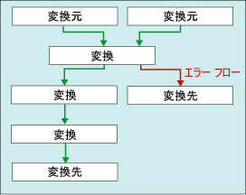

# <a name="error-handling-in-data"></a>データのエラー処理

[!INCLUDE[ssis-appliesto](../../includes/ssis-appliesto-ssvrpluslinux-asdb-asdw-xxx.md)]


  データ フロー コンポーネントが変換を列データに適用したり、変換元のデータを抽出したり、変換先にデータを読み込んだりするときに、エラーが発生する場合があります。 エラーが発生する原因の主なものは、予期しないデータ値です。 たとえば、数字ではなく文字列が列に含まれる場合、データ変換は失敗します。また、データは日付データであるが列のデータ型は数値の場合、データベース列への挿入は失敗します。あるいは、列の値が 0 の場合に数学的演算の結果が無効となり、それが原因で式の評価が失敗します。  
  
 エラーは一般的に、次のカテゴリのいずれかに分類されます。  
  
-   データ変換エラー。変換により、有効桁の損失、有効桁以外の桁の損失、および文字列の切り捨てなどの結果が返された場合に発生します。 要求された変換がサポートされていない場合にも、データ変換エラーは発生します。  
  
-   式の評価エラー。実行時に評価される式が無効な演算を実行したり、データ値の不足または無効のため構文的に間違った状態になる場合に発生します。  
  
-   参照エラー。参照操作が、参照テーブル内で一致を見つけられなかった場合に発生します。  
  
 Integration Services のエラー、警告、および他のメッセージの一覧については、「 [Integration Services Error and Message Reference](../../integration-services/integration-services-error-and-message-reference.md)」を参照してください。  
  
## <a name="use-error-outputs-to-capture-row-level-errors"></a>エラー出力での行レベル エラーのキャプチャ  
 多くのデータ フロー コンポーネントではエラー出力がサポートされています。これを利用すると、コンポーネントが行う、入力データと出力データの両方での行レベルのエラー処理の方法を制御できます。 入力または出力の個々の列にオプションを設定することにより、切り捨てまたはエラーが発生したときのコンポーネントの動作方法を指定します。 たとえば、顧客名のデータが切り捨てられたときは失敗するが、それよりも重要でないデータが含まれる別の列で切り捨てが発生した場合はエラーを無視するように、コンポーネントを指定できます。  
  
 エラー出力は、別の変換の入力に連結したり、エラー出力以外の別の変換先に読み込むことができます。 たとえば、エラー出力は、空白列に文字列を提供する派生列変換に連結できます。  
  
 次の図は、エラー出力が含まれる簡単なデータ フローを示しています。  
  
   
  
 詳細については、「 [データ フロー](../../integration-services/data-flow/data-flow.md) 」と「 [Integration Services のパス](../../integration-services/data-flow/integration-services-paths.md)」を参照してください。  

## <a name="configure-error-output-dialog-box"></a>[エラー出力の構成] ダイアログ ボックス
**[エラー出力の構成]** ダイアログ ボックスを使用すると、エラー出力をサポートするデータ フロー変換のエラー処理オプションを構成できます。  
  
 エラー出力の操作の詳細については、「 [データのエラー処理](../../integration-services/data-flow/error-handling-in-data.md)」を参照してください。  
  
### <a name="options"></a>オプション  
 **入力または出力**  
 出力の名前を表示します。  
  
 **列**  
 変換エディターのダイアログ ボックスで選択した出力列が表示されます。  
  
 **Error**  
 必要に応じて、エラーが発生した場合に障害を無視するか、行をリダイレクトするか、コンポーネントを失敗させるかを指定します。  
  
 **関連トピック:** [データのエラー処理](../../integration-services/data-flow/error-handling-in-data.md)  
  
 **切り捨て**  
 必要に応じて、切り捨てが発生した場合に障害を無視するか、行をリダイレクトするか、コンポーネントを失敗させるかを指定します。  
  
 **関連トピック:** [データのエラー処理](../../integration-services/data-flow/error-handling-in-data.md)  
  
 **[説明]**  
 操作の説明を表示します。  
  
 **[選択したセルに設定する値]**  
 エラーまたは切り捨てが発生した場合に、選択したすべてのセルに対して障害を無視するか、行をリダイレクトするか、コンポーネントを失敗させるかを指定します。  
  
 **[適用]**  
 選択したセルにエラー処理オプションを適用します。  
  
## <a name="errors-are-either-failures-or-truncations"></a>エラーと切り捨て  
 エラーは、エラーまたは切り捨ての、2 つのカテゴリのいずれかに分類されます。  
  
 **エラー**。 エラーは決定的な失敗を示し、NULL 値の結果を生成します。 このようなエラーには、データ変換エラーまたは式の評価エラーが含まれます。 たとえば、英文字が含まれる文字列を数字に変換しようとすると、エラーが発生します。 データ変換、式の評価、および変数、プロパティ、データ列への式の結果の割り当ては、無効なキャストおよび互換性のないデータ型のために失敗する場合があります。 詳細については、「[Cast &#40;SSIS 式&#41;](../../integration-services/expressions/cast-ssis-expression.md)[式における Integration Services データ型](../../integration-services/expressions/integration-services-data-types-in-expressions.md), 」、および「[Integration Services のデータ型](../../integration-services/data-flow/integration-services-data-types.md)」を参照してください。  
  
 **切り捨て**。 切り捨ては、エラーほど重大ではありません。 切り捨てによって生成される結果は、使用できる場合も、むしろ望ましい場合もあります。 切り捨てをエラーとして扱うか、または許容できる条件として扱うかを選択できます。 たとえば、15 文字の文字列を、文字幅が 1 文字のみの列に挿入する場合、文字列の切り捨てを選択できます。  
  
## <a name="select-an-error-handling-option"></a>エラー処理オプションの選択  
 変換元、変換、および変換先によるエラーと切り捨ての処理方法を構成できます。 次の表では、このオプションについて説明します。  
  
|オプション|[説明]|  
|------------|-----------------|  
|エラー コンポーネント|エラーまたは切り捨てが発生すると、データ フロー タスクは失敗します。 [失敗] は、エラーおよび切り捨ての既定のオプションです。|  
|エラーを無視する|エラーまたは切り捨ては無視され、データ行は変換または変換元の出力に送られます。|  
|行のリダイレクト|エラーまたは切り捨てのデータ行は、変換元、変換、または変換先のエラー出力に送られます。|  
  
## <a name="get-more-info-about-the-error"></a>エラーに関する詳細の取得  
 データ列の他に、エラー出力には **ErrorCode** 列と **ErrorColumn** 列が含まれています。 **ErrorCode** 列はエラーを識別し、 **ErrorColumn** 列にはエラー列の系列 ID が含まれます。  
  
 状況によっては、 **ErrorColumn** 列の値が 0 に設定されていることがあります。 これは、エラー状態が 1 列ではなく行全体に影響していることを示します。 たとえば、参照変換で参照に失敗した場合などです。  
  
 この 2 つの数値は、対応するエラーの説明と列の名前がないとあまり役に立ちません。 エラーの説明と列の名前を取得する方法をいくつか次に示します。  
  
-   エラーの説明と列の名前の両方を確認するには、データ ビューアーをエラー出力にアタッチします。 SSIS デザイナーで、エラー出力を指す赤の矢印を右クリックし、 **[データ ビューアーを有効にする]** を選択します。  
  
-   列の名前を確認するには、ログ記録を有効にして、 **DiagnosticEx** イベントを選択します。 このイベントは、データ フロー列マップをログに書き込みます。 その後、この列マップの識別子から列名を参照できます。 **DiagnosticEx** イベントでは XML 出力に含まれる空白が維持されないので、ログのサイズを軽減できます。 読みやすくするために、XML 書式と構文の強調表示をサポートする XML エディター (たとえば Visual Studio) にログをコピーします。 ログ記録の詳細については、「[Integration Services &#40;SSIS&#41; のログ記録](../../integration-services/performance/integration-services-ssis-logging.md)」を参照してください。  
  
     データ フロー列マップの例を次に示します。  
  
    ```xml  
  
    \<DTS:PipelineColumnMap xmlns:DTS="www.microsoft.com/SqlServer/Dts">  
        \<DTS:Pipeline DTS:Path="\Package\Data Flow Task">  
            \<DTS:Column DTS:ID="11" DTS:IdentificationString="ADO NET Source.Outputs[ADO NET Source Output].Columns[Customer]"/>  
            \<DTS:Column DTS:ID="12" DTS:IdentificationString="ADO NET Source.Outputs[ADO NET Source Output].Columns[Product]"/>  
            \<DTS:Column DTS:ID="13" DTS:IdentificationString="ADO NET Source.Outputs[ADO NET Source Output].Columns[Price]"/>  
            \<DTS:Column DTS:ID="14" DTS:IdentificationString="ADO NET Source.Outputs[ADO NET Source Output].Columns[Timestamp]"/>  
            \<DTS:Column DTS:ID="20" DTS:IdentificationString="ADO NET Source.Outputs[ADO NET Source Error Output].Columns[Customer]"/>  
            \<DTS:Column DTS:ID="21" DTS:IdentificationString="ADO NET Source.Outputs[ADO NET Source Error Output].Columns[Product]"/>  
            \<DTS:Column DTS:ID="22" DTS:IdentificationString="ADO NET Source.Outputs[ADO NET Source Error Output].Columns[Price]"/>  
            \<DTS:Column DTS:ID="23" DTS:IdentificationString="ADO NET Source.Outputs[ADO NET Source Error Output].Columns[Timestamp]"/>  
            \<DTS:Column DTS:ID="24" DTS:IdentificationString="ADO NET Source.Outputs[ADO NET Source Error Output].Columns[ErrorCode]"/>  
            \<DTS:Column DTS:ID="25" DTS:IdentificationString="ADO NET Source.Outputs[ADO NET Source Error Output].Columns[ErrorColumn]"/>  
            \<DTS:Column DTS:ID="31" DTS:IdentificationString="Flat File Destination.Inputs[Flat File Destination Input].Columns[Customer]"/>  
            \<DTS:Column DTS:ID="32" DTS:IdentificationString="Flat File Destination.Inputs[Flat File Destination Input].Columns[Product]"/>  
            \<DTS:Column DTS:ID="33" DTS:IdentificationString="Flat File Destination.Inputs[Flat File Destination Input].Columns[Price]"/>  
            \<DTS:Column DTS:ID="34" DTS:IdentificationString="Flat File Destination.Inputs[Flat File Destination Input].Columns[Timestamp]"/>  
        \</DTS:Pipeline>  
    \</DTS:PipelineColumnMap>  
  
    ```  
  
-   スクリプト コンポーネントを使用して、エラーの説明と列の名前を、エラー出力の追加の列に挿入することもできます。 例については、「 [スクリプト コンポーネントによるエラー出力の強化](../../integration-services/extending-packages-scripting-data-flow-script-component-examples/enhancing-an-error-output-with-the-script-component.md)」を参照してください。  
  
    -   追加列にエラーの説明を含めるには、 <xref:Microsoft.SqlServer.Dts.Pipeline.Wrapper.IDTSComponentMetaData100.GetErrorDescription%2A> インターフェイスの <xref:Microsoft.SqlServer.Dts.Pipeline.Wrapper.IDTSComponentMetaData100> メソッドを呼び出す 1 行のスクリプトを使用します。  
  
    -   追加列に列名を含めるには、 <xref:Microsoft.SqlServer.Dts.Pipeline.Wrapper.IDTSComponentMetaData100.GetIdentificationStringByID%2A> インターフェイスの <xref:Microsoft.SqlServer.Dts.Pipeline.Wrapper.IDTSComponentMetaData100> メソッドを呼び出す 1 行のスクリプトを使用します。  
  
     スクリプト コンポーネントは、エラーをキャプチャするデータ フロー コンポーネントよりデータ フローの下流にある任意のエラー セグメントに追加できます。 通常、このスクリプト コンポーネントは、エラー行が出力先に書き込まれる直前に配置します。 これにより、スクリプトは、書き込まれたエラー行についてのみ説明を参照します。 データ フロー内のエラー セグメントによってエラーの一部が修正されることがあり、こうした行は、エラーの出力先には書き込まれません。  

## <a name="see-also"></a>参照  
 [データ フロー](../../integration-services/data-flow/data-flow.md)   
 [変換を使用してデータを変換する](../../integration-services/data-flow/transformations/transform-data-with-transformations.md)   
 [パスを使用してコンポーネントを連結する](https://msdn.microsoft.com/library/05633e4c-1370-4b05-802b-f36b07dd71c8)   
 [[データ フロー タスク]](../../integration-services/control-flow/data-flow-task.md)   
 [データ フロー](../../integration-services/data-flow/data-flow.md)  
  
  
