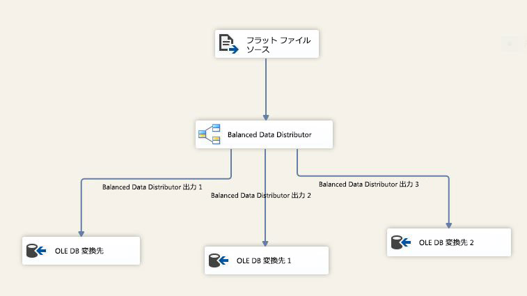

# Balanced Data Distributor (BDD) 変換

[!INCLUDE[ssis-appliesto](../../../includes/ssis-appliesto-ssvrpluslinux-asdb-asdw-xxx.md)]

  Balanced Data Distributor (BDD) 変換では最新 CPU の同時処理機能を利用します。 この手法では、複数の着信バッファーを、個別のスレッド上に存在する出力に対して一様に分配します。 BDD コンポーネントは各出力パスに対応する個別のスレッドを使用することで、マルチコアまたはマルチプロセッサのコンピューターで SSIS パッケージのパフォーマンスを向上させます。  
  
 次の図に、BDD 変換を使用する簡単な例を示します。 この例では、BDD 変換はフラット ファイル変換元から得られる入力データから、一度に 1 つのパイプライン バッファーを選択し、3 つの出力パスのいずれかに対してラウンド ロビン形式で送信します。 SQL Server データ ツールで、データ フロー タスクのプロパティを表示する <xref:Microsoft.SqlServer.Dts.Pipeline.Wrapper.MainPipeClass.DefaultBufferSize%2A>ペインを使用して、 <xref:Microsoft.SqlServer.Dts.Pipeline.Wrapper.MainPipeClass.DefaultBufferMaxRows%2A>(パイプラインのバッファーの既定のサイズ) と **DefaultBufferMaxRows** (パイプライン バッファー内にある最大行数の既定値) の値を確認することができます。  
  
   
  
 次の条件を満たすシナリオで、Balanced Data Distributor (BDD) 変換を使用して、パッケージのパフォーマンスを向上させることができます。  
  
1.  BDD 変換に対して到着する大量のデータがあります。 データ サイズが小さく、わずか 1 個のバッファーでデータを保持できる場合は、BDD 変換を使用する利点はありません。 データ サイズが大きく、データを保持するために複数のバッファーが必要な場合は、BDD は個別のスレッドを使用してデータ バッファーを効率的に並行処理することができます。  
  
2.  データ フローの残りの部分による処理速度より高速に、データを読み取ることができます。 このシナリオでは、データの到着速度に比べると、データに対して実行される変換の方が遅くなっています。 ボトルネックが転送先に存在する場合は、変換先を並列化する必要があります。  
  
3.  データを並べ替える必要がありません。 たとえば、データを並べ替えた状態で維持する必要がある場合は、BDD 変換を使用してデータを分割することを避けてください。  
  
 変換元からデータを読み取るレートが原因で、ボトルネックが SSIS パッケージ内に存在する場合は、BDD コンポーネントはパフォーマンス向上に役立たないことに注意してください。 変換先が並列処理をサポートしていないことが原因でボトルネックが SSIS パッケージ内に存在する場合も、BDD は役に立ちません。ただし、すべての変換を並列実行し、データを変換先に送信する前に、全体結合という変換を使用して、BDD 変換の複数の出力パスから到着した出力データを組み合わせることができます。  
  
> [!IMPORTANT]  
>  変換の使用方法を示すプレゼンテーションとして、TechNet ライブラリの [Balanced Data Distributor ビデオに関するページ](https://go.microsoft.com/fwlink/?LinkID=226278) を参照してください。  
  
  
