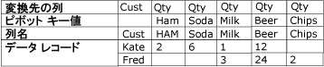
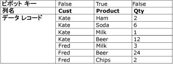

# ピボット解除変換

[!INCLUDE[ssis-appliesto](../../../includes/ssis-appliesto-ssvrpluslinux-asdb-asdw-xxx.md)]

  ピボット解除変換は、単一のレコード内にある複数の列の値を、単一の列内で同じ値を持つ複数のレコードに展開することにより、正規化されていないデータセットを正規化されたバージョンに変換します。 たとえば、顧客名を一覧表示するデータセットに、顧客ごとに 1 つの行があり、製品と購入した数量がその行の列に表示されているとします。 ピボット解除変換がこのデータセットを正規化すると、データセットには、顧客が購入した各製品に対して異なる行が含まれるようになります。  
  
 次の図は、データが Product 列でピボット解除される前のデータセットを示しています。  
  
   
  
 次の図は、データが Product 列でピボット解除された後のデータセットを示しています。  
  
   
  
 状況によっては、ピボット解除された結果には予期しない値を持つ行が含まれる場合があります。 たとえば、図に示したサンプル データのピボット解除では、Fred のすべての Qty 列が NULL 値である場合、出力に含まれる Fred の行は 5 つではなく 1 つだけです。 Qty 列には、列データ型に応じて、NULL または 0 のいずれかが含まれます。  
  
## ピボット解除変換の構成  
 ピボット解除変換には、 **PivotKeyValue** カスタム プロパティがあります。 このプロパティは、パッケージの読み込み時にプロパティ式で更新できます。 詳細については、「[Integration Services &#40;SSIS&#41; の式](../../../integration-services/expressions/integration-services-ssis-expressions.md)」、「[パッケージでプロパティ式を使用する](../../../integration-services/expressions/use-property-expressions-in-packages.md)」、および「[変換のカスタム プロパティ](../../../integration-services/data-flow/transformations/transformation-custom-properties.md)」を参照してください。  
  
 この変換は 1 つの入力と 1 つの出力をとります。 エラー出力はありません。  
  
 プロパティを設定するには [!INCLUDE[ssIS](../../../includes/ssis-md.md)] デザイナーから行うか、またはプログラムによって設定します。  
  
 **[詳細エディター]** ダイアログ ボックスまたはプログラムで設定できるプロパティの詳細については、次のトピックのいずれかを参照してください。  
  
-   [共通プロパティ](https://msdn.microsoft.com/library/51973502-5cc6-4125-9fce-e60fa1b7b796)  
  
-   [変換のカスタム プロパティ](../../../integration-services/data-flow/transformations/transformation-custom-properties.md)  
  
 データ フロー コンポーネントのプロパティの設定方法については、「 [データ フロー コンポーネントのプロパティを設定する](../../../integration-services/data-flow/set-the-properties-of-a-data-flow-component.md)」を参照してください。  
  
## [ピボット解除変換エディター]
  **[ピボット解除変換エディター]** ダイアログ ボックスを使用すると、行でピボットする列を選択したり、データ列および新しいピボット値出力列を指定したりできます。  
  
> [!NOTE]  
>  このトピックでは、「 [ピボット解除変換](../../../integration-services/data-flow/transformations/unpivot-transformation.md) 」に示されているピボット解除の例に基づいて、オプションの使用方法を説明します。  
  
### オプション  
 **使用できる入力列**  
 チェック ボックスを使用して、行でピボットする列を指定します。  
  
 **[名前]**  
 使用できる入力列の名前を表示します。  
  
 **[パススルー]**  
 ピボット解除された出力に列を含めるかどうかを示します。  
  
 **入力列**  
 各行に対して使用できる入力列の一覧から選択します。 選択内容が **[使用できる入力列]** テーブルのチェック ボックスに反映されます。  
  
 「 [Unpivot Transformation](../../../integration-services/data-flow/transformations/unpivot-transformation.md)」のピボット解除の例では、入力列として、 **Ham**, **Soda**, **Milk**, **Beer**、および **Chips** の各列があります。  
  
 **変換先列**  
 データ列の名前を指定します。  
  
 「 [ピボット解除変換](../../../integration-services/data-flow/transformations/unpivot-transformation.md)」のピボット解除の例では、変換先列は数量 (**Qty**) 列です。  
  
 **[ピボット キー値]**  
 ピボット値の名前を指定します。 既定は入力列の名前です。一意のわかりやすい名前を付けることもできます。  
  
 このプロパティの値は、プロパティ式を使用して指定することができます。  
  
 「 [Unpivot Transformation](../../../integration-services/data-flow/transformations/unpivot-transformation.md)」のピボット解除の例では、ピボット値は、 **[ピボット キー値の列名]** オプションで指定された新しい Product 列のテキスト値 **Ham**, **Soda**, **Milk**, **Beer**、および **Chips**として表示されます。  
  
 **[ピボット キー値の列名]**  
 ピボット値列の名前を指定します。 既定では [ピボット キー値] になりますが、わかりやすい一意な名前を選択することもできます。  
  
 「 [Unpivot Transformation](../../../integration-services/data-flow/transformations/unpivot-transformation.md)」のピボット解除の例では、ピボット キー値列の名前は **Product** です。これは、 **Product** 、 **Product**, **Product**, **Product**, **Product**の列のピボット解除が行われる新しい **Product** 列を示しています。  
  
## 参照  
 [Integration Services のエラーおよびメッセージのリファレンス](../../../integration-services/integration-services-error-and-message-reference.md)   
 [ピボット変換](../../../integration-services/data-flow/transformations/pivot-transformation.md)  
  
  
