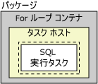
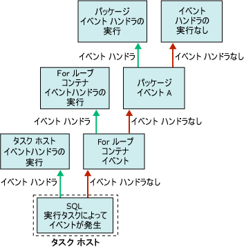

# Integration Services (SSIS) のイベント ハンドラー

[!INCLUDE[ssis-appliesto](../includes/ssis-appliesto-ssvrpluslinux-asdb-asdw-xxx.md)]

  実行可能ファイル (パッケージ、Foreach ループ コンテナー、For ループ コンテナー、シーケンス コンテナー、およびタスク ホスト コンテナー) は実行時にイベントを発生させます。 たとえば、エラーが発生すると、OnError イベントが発生します。 これらのイベントに対してカスタム イベント ハンドラーを作成し、パッケージ機能を拡張すると、実行時のパッケージを容易に管理できます。 イベント ハンドラーは、次のタスクを実行できます。  
  
-   パッケージまたはタスクの実行が完了したとき、一時データ ストレージをクリーンアップします。  
  
-   システム情報を取得して、パッケージを実行する前にリソースの可用性を評価します。  
  
-   参照テーブル内の参照が失敗したとき、テーブル内のデータを更新します。  
  
-   エラーまたは警告が発生したとき、またはタスクが失敗したときに、電子メール メッセージを送信します。  
  
 イベントにイベント ハンドラーがない場合、パッケージのコンテナー階層で上位にあたる次のコンテナーでイベントが発生します。 このコンテナーにイベント ハンドラーがある場合、イベントに応答してイベント ハンドラーが実行されます。 イベント ハンドラーがない場合、コンテナー階層で上位にあたる次のコンテナーでイベントが発生します。  
  
 次の図は、1 つの SQL 実行タスクを含む For ループ コンテナーを持つ、簡単なパッケージを示しています。  
  
   
  
 **OnError** イベントに対するイベント ハンドラーを持つのは、パッケージのみです。 SQL 実行タスクの実行時にエラーが発生した場合、パッケージの **OnError** イベント ハンドラーが実行されます。 次の図は、パッケージの **OnError** イベント ハンドラーにより実行される呼び出しの順序を示しています。  
  
   
  
 イベント ハンドラーは、イベント ハンドラー コレクションのメンバーであり、このコレクションはすべてのコンテナーに含まれています。 [!INCLUDE[ssIS](../includes/ssis-md.md)] デザイナーを使用してパッケージを作成すると、イベント ハンドラー コレクションのメンバーは、 **デザイナーの** [パッケージ エクスプローラー] **タブ上の** [イベント ハンドラー] [!INCLUDE[ssIS](../includes/ssis-md.md)] フォルダー内に表示されます。  
  
 イベント ハンドラーのコンテナーは、次の方法で構成できます。  
  
-   イベント ハンドラーの名前と説明を指定します。  
  
-   イベント ハンドラーを実行するかどうか、イベント ハンドラーが失敗した場合にパッケージが失敗するかどうか、イベント ハンドラーが失敗するまでに発生するエラーの最大数を示します。  
  
-   実行時にイベント ハンドラーが返す実際の実行結果の代わりに、返される実行結果を指定します。  
  
-   イベント ハンドラーのトランザクション オプションを指定します。  
  
-   イベント ハンドラーが使用するログ モードを指定します。  
  
## イベント ハンドラーの内容  
 イベント ハンドラーの作成方法は、パッケージの構築方法と同様です。つまり、イベント ハンドラーには、制御フロー内で順序付けられたタスクとコンテナーがあります。また、イベント ハンドラーにデータ フローを含めることもできます。 [!INCLUDE[ssIS](../includes/ssis-md.md)] デザイナーには **[イベント ハンドラー]** タブが含まれており、これを使用してカスタム イベント ハンドラーを作成します。  
  
 イベント ハンドラーは、プログラムによって作成することもできます。 詳細については、「 [プログラムによるイベントの処理](../integration-services/building-packages-programmatically/handling-events-programmatically.md)」を参照してください。  
  
## 実行時イベント  
 次の表に、 [!INCLUDE[ssISnoversion](../includes/ssisnoversion-md.md)] で用意されているイベント ハンドラーの一覧を示します。また、イベント ハンドラーによって実行される実行時イベントについて説明します。  
  
|イベント ハンドラー|イベント|  
|-------------------|-----------|  
|**OnError**|**OnError** イベントのイベント ハンドラーです。 このイベントは、エラー発生時に実行可能ファイルから発生します。|  
|**OnExecStatusChanged**|**OnExecStatusChanged** イベントのイベント ハンドラーです。 このイベントは、実行状態が変化したときに実行可能ファイルから発生します。|  
|**OnInformation**|**OnInformation** イベントのイベント ハンドラーです。 このイベントは、実行可能ファイルの検証時および実行時に、情報をレポートするために発生します。 このイベントは情報を伝達するだけのもので、エラーや警告は発生しません。|  
|**OnPostExecute**|**OnPostExecute** イベントのイベント ハンドラーです。 このイベントは、実行可能ファイルの実行完了直後に、実行可能ファイルから発生します。|  
|**OnPostValidate**|**OnPostValidate** イベントのイベント ハンドラーです。 このイベントは、実行可能ファイルの検証が完了したときに、実行可能ファイルから発生します。|  
|**OnPreExecute**|**OnPreExecute** イベントのイベント ハンドラーです。 このイベントは、実行可能ファイルが実行される直前に、実行可能ファイルから発生します。|  
|**OnPreValidate**|**OnPreValidate** イベントのイベント ハンドラーです。 このイベントは、実行可能ファイルの検証を開始するときに、実行可能ファイルから発生します。|  
|**OnProgress**|**OnProgress** イベントのイベント ハンドラーです。 このイベントは、実行可能ファイルで重要な進行があったときに、実行可能ファイルから発生します。|  
|**OnQueryCancel**|**OnQueryCancel** イベントのイベント ハンドラーです。 このイベントは、実行可能ファイルの実行を停止するかどうかを決定するために、実行可能ファイルから発生します。|  
|**OnTaskFailed**|**OnTaskFailed** イベントのイベント ハンドラーです。 このイベントは、タスクが失敗したときにタスクから発生します。|  
|**OnVariableValueChanged**|**OnVariableValueChanged** イベントのイベント ハンドラーです。 このイベントは、変数の値が変化したときに実行可能ファイルから発生します。 イベントは、変数が定義されている実行可能ファイルで発生します。 変数の **RaiseChangeEvent** プロパティが **False** に設定されている場合、このイベントは発生しません。 詳細については、「 [Integration Services &#40;SSIS&#41; の変数](../integration-services/integration-services-ssis-variables.md)」を参照してください。|  
|**OnWarning**|**OnWarning** イベントのイベント ハンドラーです。 このイベントは、警告の発生時に実行可能ファイルから発生します。|  

## パッケージにイベント ハンドラーを追加する
コンテナーとタスクは実行時にイベントを発生させます。 こうしたイベントが発生したときにワークフローを実行して、イベントに応答するカスタム イベント ハンドラーを作成できます。 たとえば、タスクが失敗したときに電子メール メッセージを送信するイベント ハンドラーを作成できます。  
  
 イベント ハンドラーは、パッケージと同様です。 イベント ハンドラーでは、パッケージと同様に変数のスコープが用意され、制御フローとオプションのデータ フローが含まれています。 パッケージ、Foreach ループ コンテナー、For ループ コンテナー、シーケンス コンテナー、およびすべてのタスクに対してイベント ハンドラーを作成できます。  
  
 イベント ハンドラーを作成するには、 **デザイナーにある** [イベント ハンドラー] [!INCLUDE[ssIS](../includes/ssis-md.md)] タブのデザイン画面を使用します。  
  
 **[イベント ハンドラー]** タブがアクティブな場合、 **デザイナーにあるツールボックスの** [制御フロー項目] **および** [メンテナンス プランのタスク] [!INCLUDE[ssIS](../includes/ssis-md.md)] ノードには、イベント ハンドラーで制御フローを作成するためのタスクとコンテナーが含まれます。 **[データ フローの変換元]** 、 **[変換]** 、および **[データ フローの変換先]** ノードには、イベント ハンドラーでデータ フローを作成するためのデータ ソース、変換、および変換先が含まれます。 詳細については、「 [制御フロー](../integration-services/control-flow/control-flow.md) 」と「 [データ フロー](../integration-services/data-flow/data-flow.md)」を参照してください。  
  
 **[イベント ハンドラー]** タブには、 **[接続マネージャー]** 領域も含まれ、イベント ハンドラーがサーバーおよびデータ ソースに接続するために使用する、接続マネージャーの作成および変更を行うことができます。 詳細については、「 [接続マネージャーを作成する](https://msdn.microsoft.com/library/6ca317b8-0061-4d9d-b830-ee8c21268345)」を参照してください。  
  
### [イベント ハンドラー] タブでイベント ハンドラーを追加する  
  
1.  [!INCLUDE[ssBIDevStudioFull](../includes/ssbidevstudiofull-md.md)]で、目的のパッケージが含まれている [!INCLUDE[ssISnoversion](../includes/ssisnoversion-md.md)] プロジェクトを開きます。  
  
2.  ソリューション エクスプローラーで、パッケージをダブルクリックして開きます。  
  
3.  **[イベント ハンドラー]** タブをクリックします。  
  
       
  
     イベント ハンドラー内で制御フローとデータ フローを作成する手順は、パッケージ内で制御フローとデータ フローを作成する手順と同様です。 詳細については、「 [制御フロー](../integration-services/control-flow/control-flow.md) 」と「 [データ フロー](../integration-services/data-flow/data-flow.md)」を参照してください。  
  
4.  **[実行可能ファイル]** の一覧から、イベント ハンドラーを作成する実行可能ファイルを選択します。  
  
5.  **[イベント ハンドラー]** の一覧から、作成するイベント ハンドラーを選択します。  
  
6.  **[イベント ハンドラー]** タブのデザイン画面のリンクをクリックします。  
  
7.  制御フロー アイテムをイベント ハンドラーに追加し、優先順位制約を使用してアイテムを接続します。これは、制御フロー アイテムから別の制御フロー アイテムに制約をドラッグして行います。 詳細については、「 [Control Flow](../integration-services/control-flow/control-flow.md)」を参照してください。  
  
8.  必要に応じてデータ フロー タスクを追加し、 **[データ フロー]** タブのデザイン画面で、イベント ハンドラーのデータ フローを作成します。 詳細については、「 [Data Flow](../integration-services/data-flow/data-flow.md)」を参照してください。  
  
9. **[ファイル]** メニューの **[選択されたファイルを上書き保存]** をクリックし、新しいパッケージを保存します。  

## イベント ハンドラーのプロパティを設定する  
 プロパティを設定するには、 **の** [プロパティ] [!INCLUDE[ssBIDevStudioFull](../includes/ssbidevstudiofull-md.md)] ウィンドウで行うか、またはプログラムによって設定します。  
  
 これらのプロパティを [!INCLUDE[ssBIDevStudioFull](../includes/ssbidevstudiofull-md.md)]で設定する方法については、「 [タスクまたはコンテナーのプロパティを設定する](https://msdn.microsoft.com/library/52d47ca4-fb8c-493d-8b2b-48bb269f859b)」を参照してください。  
  
 これらのプロパティのプログラムでの設定については、「 <xref:Microsoft.SqlServer.Dts.Runtime.DtsEventHandler>」を参照してください。  
  
## Related Tasks  
 パッケージにイベント ハンドラーを追加する方法については、「[パッケージにイベント ハンドラーを追加する](https://msdn.microsoft.com/library/5e56885d-8658-480a-bed9-3f2f8003fd78)」を参照してください。  
  
  
