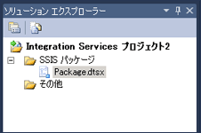

# Integration Services (SSIS) プロジェクトとソリューション
  [!INCLUDE[ssNoVersion](../includes/ssnoversion-md.md)] には [!INCLUDE[ssBIDevStudioFull](../includes/ssbidevstudiofull-md.md)] パッケージを開発するための [!INCLUDE[ssISnoversion](../includes/ssisnoversion-md.md)] が用意されています。  
  
  [!INCLUDE[msCoName](../includes/msconame-md.md)] [!INCLUDE[ssNoVersion](../includes/ssnoversion-md.md)] データベースまたは [!INCLUDE[ssIS](../includes/ssis-md.md)] パッケージ ストアにパッケージを配置する場合は、パッケージの管理に [!INCLUDE[ssISnoversion](../includes/ssisnoversion-md.md)] サービスを使用します。 [!INCLUDE[ssISnoversion](../includes/ssisnoversion-md.md)] サービスは [!INCLUDE[ssManStudioFull](../includes/ssmanstudiofull-md.md)]でのみ使用できます。 サービスの詳細については、「[Integration Services サービス (SSIS サービス)](../integration-services/service/integration-services-service-ssis-service.md)」を参照してください。 パッケージ配置の詳細については、「[レガシー パッケージの配置 (SSIS)](../integration-services/packages/legacy-package-deployment-ssis.md)」を参照してください。  
  
 [!INCLUDE[ssISnoversion](../includes/ssisnoversion-md.md)] サーバーに [!INCLUDE[ssISnoversion](../includes/ssisnoversion-md.md)] プロジェクトを配置する場合は、[!INCLUDE[ssManStudioFull](../includes/ssmanstudiofull-md.md)] で Transact-SQL のビューおよびストアド プロシージャを使用してプロジェクトを管理します。 プロジェクト配置の詳細については、「 [Deployment of Projects and Packages](https://msdn.microsoft.com/library/hh213290.aspx)」を参照してください。 [!INCLUDE[ssISnoversion](../includes/ssisnoversion-md.md)] サーバーの詳細については、「[Integration Services (SSIS) Server](https://msdn.microsoft.com/library/ms137731.aspx)」を参照してください。  
  
 [!INCLUDE[ssBIDevStudioFull](../includes/ssbidevstudiofull-md.md)] と [!INCLUDE[ssManStudioFull](../includes/ssmanstudiofull-md.md)] の概要については、「[Integration Services &#40;SSIS&#41; の開発および管理ツール](https://msdn.microsoft.com/library/ms140028.aspx)」をご覧ください。  
  
## パッケージを格納する Integration Services プロジェクト  
 プロジェクトとは [!INCLUDE[ssISnoversion](../includes/ssisnoversion-md.md)] パッケージを開発するコンテナーのことです。  
  
 [!INCLUDE[ssBIDevStudioFull](../includes/ssbidevstudiofull-md.md)]では、 [!INCLUDE[ssISnoversion](../includes/ssisnoversion-md.md)] プロジェクトにはパッケージに関連するファイルが格納され、グループ化されます。 たとえば、プロジェクトには、特定の抽出、変換、および読み込み (ETL) ソリューションの作成に必要なファイルが含まれます。  
  
 [!INCLUDE[ssISnoversion](../includes/ssisnoversion-md.md)] プロジェクトを作成する前に、この種のプロジェクトの基本的な内容を理解しておく必要があります。 プロジェクトの内容を理解すれば、 [!INCLUDE[ssISnoversion](../includes/ssisnoversion-md.md)] プロジェクトの作成および作業を開始することができます。  
  
## Integration Services プロジェクトのフォルダー  
 次の図は、 [!INCLUDE[ssISnoversion](../includes/ssisnoversion-md.md)] での [!INCLUDE[ssBIDevStudioFull](../includes/ssbidevstudiofull-md.md)]プロジェクト内のフォルダーを示しています。  
  
   
  
 次の表では、 [!INCLUDE[ssISnoversion](../includes/ssisnoversion-md.md)] プロジェクトに表示されるフォルダーについて説明します。  
  
|フォルダー|Description|  
|------------|-----------------|  
|[!INCLUDE[ssIS](../includes/ssis-md.md)] パッケージ|パッケージが含まれます。 詳細については、「[Integration Services &#40;SSIS&#41; Packages](../integration-services/integration-services-ssis-packages.md)」を参照してください。|  
|その他|パッケージ ファイル以外のファイルが含まれます。|  
  
## Integration Services プロジェクトのファイル  
 新しい [!INCLUDE[ssISnoversion](../includes/ssisnoversion-md.md)] プロジェクトまたは既存のプロジェクトをソリューションに追加すると、 [!INCLUDE[ssBIDevStudioFull](../includes/ssbidevstudiofull-md.md)] により、.dtproj、.dtproj.user、および .database 拡張子を持つプロジェクト ファイルが作成されます。  
  
-   *.dtproj ファイルには、プロジェクトの構成と、パッケージなどのアイテムに関する情報が含まれます。  
  
-   *.dtproj.user ファイルには、プロジェクト処理の設定に関する情報が含まれます。  
  
-   *.database ファイルには、[!INCLUDE[ssBIDevStudioFull](../includes/ssbidevstudiofull-md.md)] で [!INCLUDE[ssISnoversion](../includes/ssisnoversion-md.md)] プロジェクトを開くために必要な情報が含まれます。  
  
## Integration Services プロジェクトの対象バージョン  
 [!INCLUDE[ssBIDevStudioFull](../includes/ssbidevstudiofull-md.md)]では、SQL Server 2016、SQL Server 2014 または SQL Server 2012 を対象とするパッケージを実行、作成、および管理できます。  
  
 ソリューション エクスプローラーで Integration Services プロジェクトを右クリックし、**[プロパティ]** を選択すると、そのプロジェクトのプロパティ ページが開きます。 **[構成プロパティ]** の **[全般]**タブで、 **[TargetServerVersion]** プロパティを選択した後、[SQL Server 2016]、[SQL Server 2014]、または [SQL Server 2012] を選択します。  
  
   
  
## プロジェクトを格納するソリューション  
 ソリューションとは、エンド ツー エンドのビジネス ソリューションを開発するときに使用するプロジェクトを、グループ化して管理するコンテナーのことです。 ソリューションを使用すると、複数のプロジェクトを 1 単位として処理し、ビジネス ソリューションに役立つ 1 つ以上の関連プロジェクトをまとめることができます。  
  
 ソリューションには、さまざまな種類のプロジェクトを含めることができます。 [!INCLUDE[ssIS](../includes/ssis-md.md)] デザイナーを使用して [!INCLUDE[ssISnoversion](../includes/ssisnoversion-md.md)] パッケージを作成する場合は、 [!INCLUDE[ssISnoversion](../includes/ssisnoversion-md.md)] で用意されているソリューション内の [!INCLUDE[ssBIDevStudioFull](../includes/ssbidevstudiofull-md.md)]プロジェクトで作業します。  
  
 新しいソリューションを作成すると、 [!INCLUDE[ssBIDevStudioFull](../includes/ssbidevstudiofull-md.md)] のソリューション エクスプローラーにソリューション フォルダーが自動的に追加され、拡張子 .sln および .suo のファイルが作成されます。  
  
-   *.sln ファイルには、ソリューションの構成情報、およびソリューション内のプロジェクトの一覧が格納されます。  
  
-   *.suo ファイルには、ソリューションを操作するうえでのユーザー設定情報が格納されます。  
  
 新しいプロジェクトを作成すると [!INCLUDE[ssBIDevStudioFull](../includes/ssbidevstudiofull-md.md)] でソリューションが自動的に作成されますが、空白のソリューションを作成して、プロジェクトを後で追加することもできます。  
  
> **注:** 既定では、[!INCLUDE[ssBIDevStudioFull](../includes/ssbidevstudiofull-md.md)] で新しい [!INCLUDE[ssISnoversion](../includes/ssisnoversion-md.md)]プロジェクトを作成すると、そのソリューションは**プロジェクト エクスプローラー** ペインに表示されません。 既定の動作を変更するには、 **[ツール]** メニューの **[オプション]**をクリックします。 **[オプション]** ダイアログ ボックスで、 **[プロジェクトおよびソリューション]**を展開し、 **[全般]**をクリックします。 **[全般]** ページで、 **[常にソリューションを表示]**を選択します。  
  
## 関連タスク  
 [ソリューション内の Integration Services プロジェクトを追加または削除する](../Topic/Add%20or%20Remove%20an%20Integration%20Services%20Project%20in%20a%20Solution.md)  
  
 [新しい Integration Services プロジェクトを作成する](../Topic/Create%20a%20New%20Integration%20Services%20Project.md)  
  
 [Integration Services プロジェクトにアイテムを追加する](../Topic/Add%20an%20Item%20to%20an%20Integration%20Services%20Project.md)  
  
 [プロジェクト アイテムをコピーする](../Topic/Copy%20Project%20Items.md)  
  
## 関連コンテンツ  
 [Integration Services プロジェクトの開発](../Topic/Development%20of%20an%20Integration%20Services%20Project.md)  
  
  