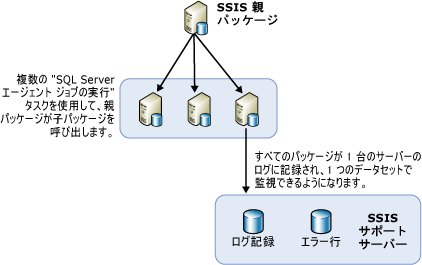

# リモート サーバー上での SQL Server エージェントを使用したパッケージの負荷分散

[!INCLUDE[ssis-appliesto](../../includes/ssis-appliesto-ssvrpluslinux-asdb-asdw-xxx.md)]

  実行する必要のあるパッケージが数多くある場合、使用可能な他のサーバーでパッケージを実行すると便利です。 すべてのパッケージを 1 つの親パッケージで管理している場合に、他のサーバーを使用してパッケージを実行するこの方法を、負荷分散といいます。 [!INCLUDE[ssNoVersion](../../includes/ssnoversion-md.md)] [!INCLUDE[ssISnoversion](../../includes/ssisnoversion-md.md)]の負荷分散は、手動による方法であり、パッケージの所有者が構築する必要があります。 負荷分散は、サーバーで自動的には実行されません。 また、リモート サーバーで実行するパッケージは、他のパッケージ内の個別のタスクではなく、完全なパッケージである必要があります。  
  
 負荷分散は、次のようなシナリオで役に立ちます。  
  
-   複数のパッケージを同時実行できる。  
  
-   個々のパッケージが大きく、順番に実行すると、処理許容時間を超えて実行される可能性がある。  
  
 管理者や設計者は、処理に他のサーバーを使用することに利点があるかどうかを判断できます。  
  
## 負荷分散の図  
 次の図は、サーバー上の親パッケージを示します。 親パッケージには、SQL Server エージェント ジョブの実行タスクが複数含まれています。 親パッケージ内の各タスクは、リモート サーバー上の SQL Server エージェントを呼び出します。 これらのリモート サーバーには、そのサーバー上のパッケージを呼び出すステップを含む SQL Server エージェント ジョブがあります。  
  
   
  
 このアーキテクチャで負荷分散に必要な手順は、新しい概念ではありません。 負荷分散は、既存の概念と一般的な SSIS オブジェクトを新しい方法で使用して実現されています。  
  
## リモート インスタンスで SQL Server エージェントを使用したパッケージの実行  
 リモート パッケージの実行の基本的なアーキテクチャでは、中心となるパッケージは、他のリモート パッケージを制御する SQL Server のインスタンスに常駐します。 図では、SSIS Parent という名前の中心となるパッケージを示しています。 この親パッケージが常駐するインスタンスによって、子パッケージを実行する SQL Server エージェント ジョブの実行が制御されます。 子パッケージの実行は、リモート サーバーの SQL Server エージェントで制御される固定的なスケジュールに基づくわけではありません。 子パッケージは、親パッケージから呼び出されたときに SQL Server エージェントによって開始され、SQL Server エージェントが常駐している同じ SQL Server のインスタンスで実行されます。  
  
 SQL Server エージェントを使用してリモート パッケージを実行するには、あらかじめ親パッケージと子パッケージを構成し、子パッケージを制御する SQL Server エージェント ジョブをセットアップしておく必要があります。 次のセクションでは、リモート サーバーで実行するパッケージの作成、構成、実行、および管理方法について説明します。 このプロセスには、いくつかの手順があります。  
  
-   子パッケージを作成してリモート サーバーにインストールします。  
  
-   パッケージを実行するリモート インスタンスで SQL Server エージェント ジョブを作成します。  
  
-   親パッケージを作成します。  
  
-   子パッケージ用のログ記録シナリオを決定します。  
  
## 子パッケージの実装
  [!INCLUDE[ssISnoversion](../../includes/ssisnoversion-md.md)]を使用して負荷分散を実装すると、子パッケージが他のサーバーにインストールされ、利用可能な CPU 時間またはサーバー時間を活用することができます。 子パッケージを作成および実行するには、次の手順を実行します。  
  
-   子パッケージをデザインします。  
  
-   パッケージをリモート サーバーに移動します。  
  
-   子パッケージを実行するステップを含む SQL Server エージェント ジョブをリモート サーバー上に作成します。  
  
-   SQL Server エージェント ジョブと子パッケージをテストおよびデバッグします。  
  
 子パッケージをデザインする際、子パッケージにはデザイン上の制限がないため、目的の機能をすべて追加できます。 ただし、パッケージからデータにアクセスする場合は、パッケージを実行するサーバーからそのデータにアクセスできなければなりません。  
  
 子パッケージを実行する親パッケージを識別するには、[!INCLUDE[ssBIDevStudioFull](../../includes/ssbidevstudiofull-md.md)] のソリューション エクスプローラーでパッケージを右クリックし、 **[エントリ ポイント パッケージ]** をクリックします。  
  
 子パッケージをデザインしたら、次に、そのパッケージをリモート サーバーに配置します。  
  
### リモート インスタンスへの子パッケージの移動  
 パッケージを他のサーバーに移動する方法は何種類かあります。 次の 2 つの方法をお勧めします。  
  
-   [!INCLUDE[ssManStudioFull](../../includes/ssmanstudiofull-md.md)]を使用してパッケージをエクスポートします。  
  
-   パッケージを配置します。パッケージを配置するには、配置するパッケージを含むプロジェクトの配置ユーティリティをビルドした後、パッケージ インストール ウィザードを実行し、パッケージをファイル システムまたは [!INCLUDE[ssNoVersion](../../includes/ssnoversion-md.md)] のインスタンスにインストールします。 詳細については、「[レガシー パッケージの配置 &#40;SSIS&#41;](../../integration-services/packages/legacy-package-deployment-ssis.md)」を参照してください。  
  
 この配置は、使用する各リモート サーバーに対してそれぞれ行う必要があります。  
  
### SQL Server エージェント ジョブの作成  
 子パッケージをさまざまなサーバーに配置した後、子パッケージを格納した各サーバー上に SQL Server エージェント ジョブを作成します。 SQL Server エージェント ジョブには、ジョブ エージェントの呼び出し時に子パッケージを実行するステップが含まれています。 SQL Server エージェント ジョブは定期ジョブではありません。つまり、子パッケージは、親パッケージによって呼び出されたときだけ実行されます。 ジョブの成功や失敗に関する親パッケージへの通知は、SQL Server エージェント ジョブの成功や失敗、およびそのジョブが正常に呼び出されたかどうかを表すものであり、子パッケージが実行されたかどうかや、その成功や失敗については反映されません。  
  
### SQL Server エージェント ジョブと子パッケージのデバッグ  
 次のいずれかの方法を使用して、SQL Server エージェント ジョブとその子パッケージをテストできます。  
  
-   **[デバッグ]** メニューの  /  **[デバッグなしで開始]** をクリックして、SSIS デザイナーで各子パッケージを実行します。  
  
-   [!INCLUDE[ssManStudioFull](../../includes/ssmanstudiofull-md.md)] を使用してリモート コンピューター上の個別の SQL Server エージェント ジョブを実行し、パッケージが実行されていることを確認します。  
  
 [!INCLUDE[ssNoVersion](../../includes/ssnoversion-md.md)] エージェントのジョブから実行するパッケージのトラブルシューティング方法については、[!INCLUDE[msCoName](../../includes/msconame-md.md)] サポート技術情報の「[SQL Server エージェントのジョブ ステップから SSIS パッケージを呼び出したときに SSIS パッケージが実行されない](https://support.microsoft.com/kb/918760)」を参照してください。  
  
 SQL Server エージェントは、ジョブ ステップを実行するたびに、プロキシに対してサブシステムのアクセス許可を確認し、プロキシへのアクセスを確立します。  
  
 プロキシは、 [!INCLUDE[ssManStudioFull](../../includes/ssmanstudiofull-md.md)]で作成できます。  

## 親パッケージの実装
  さまざまなサーバー間で SSIS パッケージの負荷を分散する場合、子パッケージの作成と配置を行い、その子パッケージを実行するためのリモート SQL Server エージェント ジョブを作成したら、次のステップは親パッケージを作成することです。 親パッケージには、SQL Server エージェント ジョブの実行タスクが多数含まれます。各タスクは、子パッケージの 1 つを実行する個別の SQL Server エージェント ジョブを呼び出します。 親パッケージ内にある SQL Server エージェント ジョブの実行タスクは、各種の SQL Server エージェント ジョブを次々に実行します。 親パッケージ内の各タスクには、リモート サーバーへの接続方法やそのサーバーで実行するジョブなどの情報が含まれています。 詳しくは、「 [Execute SQL Server Agent Job Task](../../integration-services/control-flow/execute-sql-server-agent-job-task.md)」をご覧ください。  
  
 子パッケージを実行する親パッケージを識別するには、 [!INCLUDE[ssBIDevStudioFull](../../includes/ssbidevstudiofull-md.md)] のソリューション エクスプローラーでパッケージを右クリックし、 **[エントリ ポイント パッケージ]** をクリックします。  
  
### 子パッケージの一覧表示  
 親パッケージと子パッケージを含むプロジェクトを [!INCLUDE[ssISnoversion](../../includes/ssisnoversion-md.md)] サーバーに配置した場合、親パッケージにより実行される子パッケージの一覧を表示することができます。 親パッケージを実行すると、 **に親パッケージの** [概要] [!INCLUDE[ssManStudioFull](../../includes/ssmanstudiofull-md.md)]レポートが自動的に生成されます。 次の図のように、レポートには、親パッケージに含まれるパッケージ実行タスクによって実行された子パッケージが一覧表示されます。  
  
   
  
 **[概要]** レポートのアクセスについては、「 [Reports for the Integration Services Server](../../integration-services/performance/monitor-running-packages-and-other-operations.md#reports)」を参照してください。  
  
### 親パッケージの優先順位制約  
 親パッケージ内の複数の SQL Server エージェント ジョブの実行タスク間で優先順位制約を作成する場合、これらの優先順位制約で制御されるのは、リモート サーバー上の SQL Server エージェント ジョブの開始時刻のみです。 優先順位制約では、SQL Server エージェント ジョブのステップで実行される子パッケージが、成功したか失敗したかに関する情報を受け取ることができません。  
  
 つまり、子パッケージの成功または失敗は親に伝達されません。これは、親パッケージ内の SQL Server エージェント ジョブの実行タスクには、SQL Server エージェント ジョブに子パッケージを実行することを要求する機能しかないためです。 SQL Server エージェント ジョブが正しく呼び出されると、親パッケージは、<xref:Microsoft.SqlServer.Dts.Runtime.DTSExecResult.Success> という結果を受け取ります。  
  
 このシナリオでの失敗とは、リモート SQL Server エージェント ジョブ タスクの呼び出しに失敗した場合しかありません。 このような失敗は、リモート サーバーが停止している場合、およびエージェントが応答しない場合に発生することがあります。 ただし、エージェントが起動している限り、親パッケージはそのタスクを正常に完了したことになります。  
  
> [!NOTE]  
>  **sp_start_job N'package_name'** の Transact-SQL ステートメントを含む SQL 実行タスクを使用できます。 詳細については、「[sp_start_job &#40;Transact-SQL&#41;](../../relational-databases/system-stored-procedures/sp-start-job-transact-sql.md)」をご覧ください。  
  
### デバッグ環境  
 親パッケージをテストする場合は、[デバッグ] メニューの [デバッグの開始] をクリックして (または F5 キーを押して) そのパッケージを実行し、デザイナーのデバッグ環境を使用します。 または、コマンド プロンプト ユーティリティ **dtexec**を使用できます。 詳細については、「 [dtexec Utility](../../integration-services/packages/dtexec-utility.md)」を参照してください。  

## リモート サーバー上の負荷分散パッケージのログ記録
  すべての子パッケージで同じログ プロバイダーを使用し、これらの出力先を同じにすれば、さまざまなサーバーで実行されているすべての子パッケージに関するログの管理が容易になります。 すべての子パッケージに共通するログ ファイルを作成する方法の 1 つとして、イベントのログが SQL Server ログ プロバイダーに記録されるように子パッケージを構成することができます。 すべてのパッケージが、同じデータベース、同じサーバー、同じサーバー インスタンスを使用するように構成できます。  
  
 管理者は、1 台のサーバーにログオンするだけで、すべての子パッケージに関するログ ファイルを確認できます。  
  
 パッケージでログ記録を有効にする方法については、「[Integration Services (SSIS) のログ記録](../../integration-services/performance/integration-services-ssis-logging.md)」を参照してください。  

## Related Tasks  
 [パッケージに対する SQL Server エージェント ジョブ](../../integration-services/packages/sql-server-agent-jobs-for-packages.md)  
  
  
