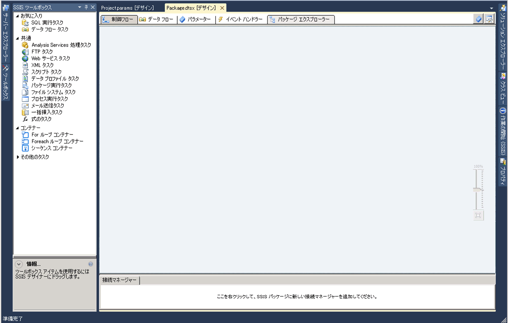

# SSIS デザイナー

[!INCLUDE[ssis-appliesto](../includes/ssis-appliesto-ssvrpluslinux-asdb-asdw-xxx.md)]

  [!INCLUDE[ssIS](../includes/ssis-md.md)] デザイナーは、 [!INCLUDE[ssISnoversion](../includes/ssisnoversion-md.md)] パッケージの作成および管理に使用できるグラフィカル ツールです。 [!INCLUDE[ssIS](../includes/ssis-md.md)] デザイナーは、 [!INCLUDE[ssBIDevStudioFull](../includes/ssbidevstudiofull-md.md)] で [!INCLUDE[ssISnoversion](../includes/ssisnoversion-md.md)] プロジェクトの一部として使用できます。  
  
 [!INCLUDE[ssIS](../includes/ssis-md.md)] デザイナーを使用すると、次のタスクを実行できます。  
  
-   パッケージ内に制御フローを構築します。  
  
-   パッケージ内にデータ フローを構築します。  
  
-   パッケージおよびパッケージ オブジェクトにイベント ハンドラーを追加します。  
  
-   パッケージの内容を表示します。  
  
-   実行時に、パッケージの実行の進行状況を表示します。  
  
 次の図は、 [!INCLUDE[ssIS](../includes/ssis-md.md)] デザイナーと **[ツールボックス]** ウィンドウを示しています。  
  
   
  
 [!INCLUDE[ssISnoversion](../includes/ssisnoversion-md.md)] には、さらに、パッケージに機能を追加するダイアログ ボックスとウィンドウが含まれており、 [!INCLUDE[ssBIDevStudioFull](../includes/ssbidevstudiofull-md.md)] では、開発環境を構成しパッケージを使用するためのウィンドウとダイアログ ボックスが用意されています。 詳細については、「 [Integration Services のユーザー インターフェイス](../integration-services/integration-services-user-interface.md)」を参照してください。  
  
 [!INCLUDE[ssIS](../includes/ssis-md.md)] デザイナーは、パッケージを管理および監視する [!INCLUDE[ssISnoversion](../includes/ssisnoversion-md.md)] サービスに対して依存関係はなく、 [!INCLUDE[ssIS](../includes/ssis-md.md)] デザイナーでパッケージを作成または変更するために、このサービスを実行する必要はありません。 ただし、 [!INCLUDE[ssIS](../includes/ssis-md.md)] デザイナーが開いている間にサービスを停止すると、 [!INCLUDE[ssIS](../includes/ssis-md.md)] デザイナーで提供されるダイアログ ボックスを開くことができなくなり、"RPC サーバーを利用できません。" というエラー メッセージが返されます。 [!INCLUDE[ssIS](../includes/ssis-md.md)] デザイナーをリセットして引き続きパッケージを処理するには、デザイナーを閉じて [!INCLUDE[ssBIDevStudioFull](../includes/ssbidevstudiofull-md.md)]を終了し、次に [!INCLUDE[ssBIDevStudioFull](../includes/ssbidevstudiofull-md.md)]、 [!INCLUDE[ssISnoversion](../includes/ssisnoversion-md.md)] プロジェクト、およびパッケージを再度開く必要があります。  
  
## 元に戻す、やり直す  
 [!INCLUDE[ssIS](../includes/ssis-md.md)] デザイナーでの操作は、最大 20 件まで元に戻したり、やり直したりすることができます。 パッケージの場合、元に戻す/やり直すを使用できるのは、 **[制御フロー]** タブ、 **[データ フロー]** タブ、 **[イベント ハンドラー]** タブ、 **[パラメーター]** タブと、 **[変数]** ウィンドウです。 プロジェクトの場合、元に戻す/やり直すは **[プロジェクト パラメーター]** ウィンドウで使用できます。  
  
 **新しい SSIS ツールボックス**に対する変更を元に戻す/やり直すことはできません。  
  
 コンポーネント エディターを使用してコンポーネントを変更した場合、元に戻す/やり直す操作は個別の変更ではなく一連の変更に対して適用されます。 元に戻す/やり直す操作のドロップダウン リストでは、一連の変更が単一の操作として表示されます。  
  
 操作を元に戻すには、元に戻すツール バー ボタンまたは **[編集]/[元に戻す]** メニュー項目をクリックするか、または Ctrl キーを押しながら Z キーを押します。 操作をやり直すには、やり直しツール バー ボタンまたは **[編集]/[やり直し]** メニュー項目をクリックするか、または Ctrl キーを押しながら Y キーを押します。複数の操作を元に戻したり、やり直したりするには、ツール バー ボタンの横にある矢印をクリックし、ドロップダウン リストで複数の操作を強調表示にして、リストをクリックします。  
  
## SSIS デザイナーの構成要素  
 [!INCLUDE[ssIS](../includes/ssis-md.md)] デザイナーには、パッケージ制御フロー、データ フロー、パラメーター、およびイベント ハンドラーを構築するタブが 1 つずつ、パッケージの内容を表示するタブが 1 つ、計 5 つのタブが常に表示されています。 実行時には、6 番目のタブが表示され、実行中のパッケージの進行状況と実行完了後の実行結果を表示します。  
  
 また、 [!INCLUDE[ssIS](../includes/ssis-md.md)] デザイナーには、パッケージがデータに接続するために使用する接続マネージャーを追加および構成する、[接続マネージャー] 領域が含まれています。  
  
### [制御フロー] タブ  
 パッケージ内に制御フローを構築するには、 **[制御フロー]** タブのデザイン画面を使用します。アイテムを **[ツールボックス]** からデザイン画面にドラッグし、アイテムのアイコンをクリックして、矢印を別のアイテムにドラッグすると、アイテムが制御フローに連結されます。  
  
 詳細については、「 [Control Flow](../integration-services/control-flow/control-flow.md)」を参照してください。  
  
### [データ フロー] タブ  
 パッケージ内にデータ フロー タスクが含まれている場合、データ フローをパッケージに追加できます。 パッケージ内にデータ フローを構築するには、 **[データ フロー]** タブのデザイン画面を使用します。アイテムを **[ツールボックス]** からデザイン画面にドラッグし、アイテムのアイコンをクリックして、矢印を別のアイテムにドラッグすると、アイテムがデータ フローに連結されます。  
  
 詳細については、「 [Data Flow](../integration-services/data-flow/data-flow.md)」を参照してください。  
  
### [パラメーター] タブ  
 Integration Services (SSIS) パラメーターを使用すると、パッケージの実行時にパッケージ内のプロパティに値を割り当てることができます。 プロジェクト パラメーターはプロジェクト レベル、パッケージ パラメーターはパッケージ レベルで作成できます。 プロジェクト パラメーターは、プロジェクトが受け取る外部入力をプロジェクト内の 1 つまたは複数のパッケージに指定するために使用します。 パッケージ パラメーターを使用すると、パッケージを編集したり再配置したりせずにパッケージ実行を変更できます。 このタブでは、パッケージ パラメーターを管理できます。  
  
 パラメーターの詳細については、「 [Integration Services (SSIS) パラメーター](integration-services-ssis-package-and-project-parameters.md)」を参照してください。  
  
> **重要!!**  パラメーターを使用できるのは、プロジェクトの配置モデル用に開発したプロジェクトに対してのみです。 したがって、プロジェクト配置モデルを使用するように構成されているプロジェクトの一部であるパッケージに対してのみ、[パラメーター] タブが表示されます。  
  
### [イベント ハンドラー] タブ  
 パッケージ内にイベントを構築するには、 **[イベント ハンドラー]** タブのデザイン画面を使用します。 **[イベント ハンドラー]** タブで、イベント ハンドラーを作成するパッケージまたはパッケージ オブジェクトを選択し、次にイベント ハンドラーに関連付けるイベントを選択します。 イベント ハンドラーには制御フローと、オプションでデータ フローが含まれます。  
  
 詳細については、「 [Add an Event Handler to a Package](https://msdn.microsoft.com/library/5e56885d-8658-480a-bed9-3f2f8003fd78)」を参照してください。  
  
### [パッケージ エクスプローラー] タブ  
 パッケージは、タスク、接続マネージャー、変数、その他の要素が多数含まれていて複雑な場合があります。 パッケージをエクスプローラー ビューで表示すると、パッケージ要素の全一覧を確認できます。  
  
 詳細については、「 [パッケージ オブジェクトを表示する](../integration-services/view-package-objects.md)」を参照してください。  
  
### [進行状況] タブと [実行結果] タブ  
 パッケージの実行中は、 **[進行状況]** タブにパッケージの実行の進行状況が表示されます。 パッケージの実行が完了すると、 **[実行結果]** タブに実行結果が表示され、そのまま使用できます。  
  
> **注:** **[進行状況]** タブでのメッセージの表示を有効または無効にするには、 **[SSIS]** メニューの **[進行状況レポートのデバッグ]** オプションを切り替えます。  
  
#### [接続マネージャー] 領域  
 パッケージで使用する接続マネージャーを追加および変更するには、 **[接続マネージャー]** 領域を使用します。 [!INCLUDE[ssISnoversion](../includes/ssisnoversion-md.md)] には、テキスト ファイル、OLE DB データベース、.NET プロバイダーなど、さまざまなデータ ソースに接続するための接続マネージャーがあります。  
  
 詳細については、「[Integration Services (SSIS) の接続](../integration-services/connection-manager/integration-services-ssis-connections.md)」および「[接続マネージャーを作成する](https://msdn.microsoft.com/library/6ca317b8-0061-4d9d-b830-ee8c21268345)」を参照してください。  
 
## [制御フロー] タブ
**デザイナーの** [制御フロー] [!INCLUDE[ssIS](../includes/ssis-md.md)] タブを使用すると、 [!INCLUDE[ssISnoversion](../includes/ssisnoversion-md.md)] パッケージの制御フローを構築できます。  
  
 制御フローを作成するには、 [!INCLUDE[ssIS](../includes/ssis-md.md)] タスクおよびコンテナーを表すグラフィカル オブジェクトを、 **ツールボックス** から **[制御フロー]** タブのデザイン画面にドラッグします。次に、オブジェクトのコネクタを別のオブジェクトにドラッグしてオブジェクトどうしを接続します。 オブジェクトを接続しているそれぞれの線は、タスクおよびコンテナーの実行順序を指定する優先順位制約を表します。  
  
 さらに、 [!INCLUDE[ssIS](../includes/ssis-md.md)] デザイナーを使用して、 **[制御フロー]** タブから次の機能を追加できます。  
  
-   ログ記録を実装する。  
  
-   パッケージ構成を作成する。  
  
-   パッケージに証明書を使用して署名する。  
  
-   変数の管理  
  
-   注釈の追加  
  
-   ブレークポイントを構成する。  
  
 [!INCLUDE[ssIS](../includes/ssis-md.md)] デザイナーを使用してこれらの機能をそれぞれのタスクまたはコンテナーに追加するには、デザイン画面上でオブジェクトを右クリックし、目的のオプションを選択します。  
 
## [データ フロー] タブ
**デザイナーの** [データ フロー] [!INCLUDE[ssIS](../includes/ssis-md.md)] タブを使用すると、 [!INCLUDE[ssISnoversion](../includes/ssisnoversion-md.md)] パッケージのデータ フローを作成できます。  
  
 データ フローを作成するには、変換元、変換、および変換先を表すグラフィカル オブジェクトを **[ツールボックス]** から **[データ フロー]** タブのデザイン画面にドラッグしてから、オブジェクトに接続して変換を実行するシーケンスを決定するパスを作成します。  
  
 パスを右クリックして **[データ ビューアー]** をクリックし、各データ フロー オブジェクトの前後にデータを表示するデータ ビューアーを追加します。  
  
 [!INCLUDE[ssIS](../includes/ssis-md.md)] デザイナーの **[データ フロー]** タブでは、次の機能を追加することもできます。  
  
-   変数の管理  
  
-   注釈の追加  
  
 [!INCLUDE[ssIS](../includes/ssis-md.md)] デザイナーでこれらの機能を追加するには、デザイン画面を右クリックして、必要なオプションを選択します。  
 
## [イベント ハンドラー] タブ
  **デザイナーの** [イベント ハンドラー] [!INCLUDE[ssIS](../includes/ssis-md.md)] タブを使用すると、 [!INCLUDE[ssISnoversion](../includes/ssisnoversion-md.md)] パッケージの制御フローを構築できます。 イベント ハンドラーは、パッケージによって生成されたイベントまたはパッケージ内のタスクまたはコンテナーによって生成されたイベントに応答して実行されます。  
  
## オプション  
 **[実行可能ファイル]**  
 イベント ハンドラーを作成する実行可能ファイルを選択します。 実行可能ファイルとは、パッケージか、パッケージ内のタスクまたはコンテナーです。  
  
 **イベント ハンドラー**  
 イベント ハンドラーの種類を選択します。 **ツールボックス**からアイテムをドラッグしてイベント ハンドラーを作成します。  
  
 **削除**  
 イベント ハンドラーを選択し、 **[削除]** をクリックすると、パッケージからイベント ハンドラーを削除できます。  
  
 **実行可能ファイル \<executable name\> の \<event handler name\> を作成するには、ここをクリックします**  
 イベント ハンドラーを作成する場合にクリックします。  
  
 制御フローを作成するには、 [!INCLUDE[ssIS](../includes/ssis-md.md)] タスクおよびコンテナーを表すグラフィカル オブジェクトを、 **ツールボックス** から **[イベント ハンドラー]** タブのデザイン画面にドラッグします。次に、優先順位制約を使用してオブジェクトどうしを接続して、その実行の順序を定義します。  
  
 また、注釈を追加するには、デザイン画面を右クリックし、メニューの **[注釈の追加]** をクリックします。  
 
## [パッケージ エクスプローラー] タブ
**デザイナーの** [パッケージ エクスプローラー] [!INCLUDE[ssIS](../includes/ssis-md.md)] タブを使用すると、パッケージのすべての要素 (構成、接続、イベント ハンドラー、タスクやコンテナーなどの実行可能オブジェクト、ログ プロバイダー、優先順位制約、変数) の階層ビューを参照できます。 パッケージにデータ フロー タスクが含まれている場合、 **[パッケージ エクスプローラー]** タブにはデータ フロー コンポーネントの階層ビューを格納するノードが含まれます。  
  
 パッケージ要素を右クリックして、 **[プロパティ]** をクリックすると **[プロパティ]** ウィンドウに要素のプロパティが表示され、 **[削除]** をクリックすると要素が削除されます。 
 
## [進行状況] タブ
**デザイナーの** [進行状況] [!INCLUDE[ssIS](../includes/ssis-md.md)] タブを使用すると、 [!INCLUDE[ssISnoversion](../includes/ssisnoversion-md.md)] で [!INCLUDE[ssBIDevStudioFull](../includes/ssbidevstudiofull-md.md)]パッケージを実行するときに、その進行状況を表示できます。 **[進行状況]** タブには、1) パッケージおよび実行可能ファイルの検証と実行の開始時刻、終了時刻、および経過時間、2) パッケージの情報または警告、3) 進行状況通知、4) パッケージの成功または失敗、5) パッケージの実行中に生成されたエラー メッセージなどが表示されます。  
  
 **[進行状況]** タブでのメッセージの表示を有効または無効にするには、 **[SSIS]** メニューの **[進行状況レポートのデバッグ]** オプションを切り替えます。 進行状況レポートを無効にすると、 [!INCLUDE[ssBIDevStudio](../includes/ssbidevstudio-md.md)]で複雑なパッケージを実行する際のパフォーマンスを向上させることができます。  
  
 パッケージの実行が停止した後は、 **[進行状況]** タブは **[実行結果]** タブになります。  
 
## [接続マネージャー] 領域
パッケージでは、接続マネージャーを使用してファイル、リレーショナル データベース、サーバーなどのデータ ソースに接続します。  
  
 **デザイナーの** [接続マネージャー] [!INCLUDE[ssIS](../includes/ssis-md.md)] 領域を使用すると、接続マネージャーの追加、削除、変更、名前の変更、コピー、貼り付けを実行できます。  
  
 この領域を右クリックし、メニューから実行する作業のオプションをクリックします。
 
## Related Tasks  
  
-   [SQL Server データ ツールでのパッケージの作成](../integration-services/create-packages-in-sql-server-data-tools.md)  
  
## 参照  
 [Integration Services のユーザー インターフェイス](../integration-services/integration-services-user-interface.md)  
  
  
