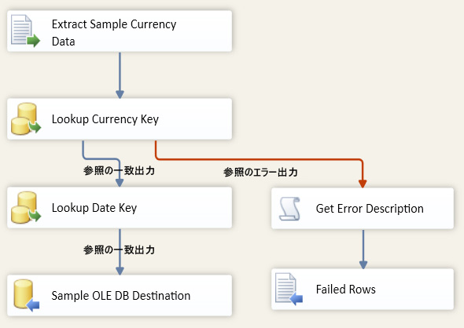

# 手順 3: レッスン 6 のパッケージのテスト
パッケージを実行すると、VarFolderName パラメーターから Directory プロパティの値が取得されます。  
  
パッケージの実行時に、Directory プロパティが新しい値に更新されているかどうかを確認するには、パッケージを実行してみます。 3 つのサンプル データ ファイルのみが新しいディレクトリにコピーされるため、データ フローは 3 回だけ実行されます。元のフォルダーの 14 ファイルには反復処理は実行されません。  
  
## パッケージ レイアウトの確認  
パッケージをテストする前に、次の図に示すオブジェクトがレッスン 6 のパッケージの制御フローとデータ フローに含まれていることを確認します。 制御フローはレッスン 5 の制御フローと同じである必要があります。 データ フローはレッスン 5 のデータ フローと同じである必要があります。  
  
**制御フロー**  
  
  
  
**データ フロー**  
  
  
  
### レッスン 6 のチュートリアル パッケージをテストするには  
  
1.  [デバッグ] メニューの [デバッグの開始] をクリックします。  
  
2.  パッケージの実行が完了したら、[デバッグ] メニューの [デバッグの停止] をクリックします。  
  
## このレッスンの次の作業  
[手順 4: レッスン 6 のパッケージの展開](../integration-services/step-4-deploying-the-lesson-6-package.md)  
  
  
  
