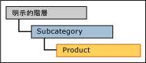
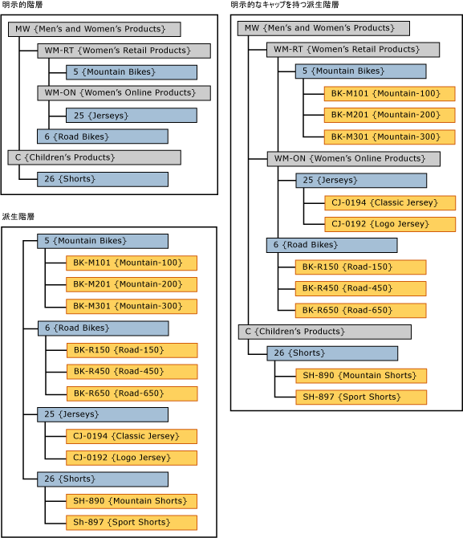

# 明示的なキャップを持つ派生階層 (Master Data Services)

[!INCLUDE [SQL Server - Windows only ASDBMI  ](../includes/applies-to-version/sql-windows-only-asdbmi.md)]

  [!INCLUDE[ssMDSshort](../includes/ssmdsshort-md.md)]の、派生階層の最上位レベルとして使用される明示的階層のレベルは、明示的なキャップを持つ派生階層と呼ばれます。  
  
 明示的階層は、派生階層の最上位のエンティティと同じエンティティに基づく必要があります。  
  
 [!INCLUDE[ssMDSmdm](../includes/ssmdsmdm-md.md)] のユーザー インターフェイス (UI) で明示的階層を派生階層の最上位にドラッグして、この種類の階層を作成します。  
  
   
  
## 明示的なキャップを持つ派生階層の例  
 この例では、明示的階層のメンバーは Subcategory エンティティのメンバーです。 派生階層の最上位レベルのメンバーも Subcategory エンティティのメンバーです。  
  
   
  
 明示的階層を派生階層の最上位で使用することにより、派生階層は不規則になります。  
  
## ルール  
  
-   明示的キャップを持つ 1 つの派生階層に設定できる明示的階層は 1 つだけです。  
  
-   同じ明示的階層を複数の派生階層のキャップとして使用できます。  
  
-   明示的なキャップを持つ派生階層に階層メンバーの権限を割り当てることはできません。 権限を明示的階層または派生階層に個々に割り当てた場合、権限は両方の階層に影響します。  
  
## Related Tasks  
  
|タスクの説明|トピック|  
|----------------------|-----------|  
|派生階層を作成する。|[派生階層を作成する (マスター データ サービス)](../master-data-services/create-a-derived-hierarchy-master-data-services.md)|  
|明示的階層を作成する。|[明示的階層を作成する (マスター データ サービス)](../master-data-services/create-an-explicit-hierarchy-master-data-services.md)|  
|既存の派生階層を削除する。|[派生階層を削除する (マスター データ サービス)](../master-data-services/delete-a-derived-hierarchy-master-data-services.md)|  
|||  
  
## 関連コンテンツ  
  
-   [派生階層 (マスター データ サービス)](../master-data-services/derived-hierarchies-master-data-services.md)  
  
-   [明示的階層 (マスター データ サービス)](../master-data-services/explicit-hierarchies-master-data-services.md)  
  
  
