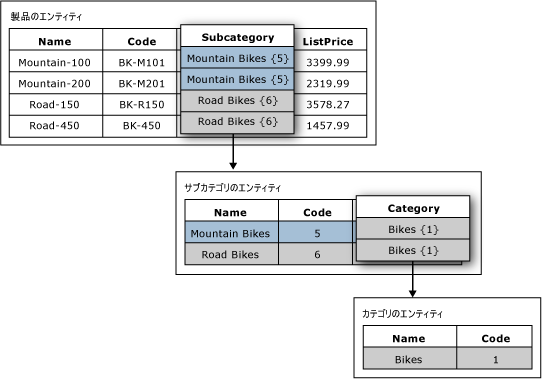

# ドメインベースの属性 (マスター データ サービス)

[!INCLUDE[appliesto-ss-xxxx-xxxx-xxx-md-winonly](../includes/appliesto-ss-xxxx-xxxx-xxx-md-winonly.md)]

  [!INCLUDE[ssMDSshort](../includes/ssmdsshort-md.md)]でのドメイン ベースの属性とは、別のエンティティからのメンバーによって値が設定される属性です。 ドメイン ベースの属性によって、ユーザーが無効な属性値を入力することを防止できることから、ドメイン ベースの属性は制約リストと考えることもできます。 属性値を選択するには、ユーザーは一覧から選択する必要があります。  
  
## ドメイン ベースの属性の例  
 次の図では、Product エンティティに Subcategory というドメイン ベースの属性があります。 Subcategory 属性は Subcategory エンティティの値によって設定されます。  
  
 Subcategory エンティティには Category というドメイン ベースの属性があります。 Category 属性は Category エンティティの値によって設定されます。  
  
   
  
## 複数のドメイン ベースの属性に同じエンティティを使用する  
 複数のエンティティのドメイン ベースの属性として同じエンティティを使用できます。 たとえば、Yes、No、および Maybe というメンバーを持つ YesNoIndicator という名前のエンティティを作成できます。 InStock というドメイン ベースの属性を作成して、YesNoIndicator エンティティをソースとして使用できます。 また、Approved という別のドメイン ベースの属性を作成し、YesNoIndicator エンティティをソースとして使用することもできます。 YesNoIndicator エンティティのメンバーのリストからユーザーによる選択を行う場合は、エンティティをドメイン ベースの属性として使用できます。  
  
## ドメイン ベースの属性による派生階層の形成  
 ドメイン ベースの属性のリレーションシップは、派生階層の基盤となります。 詳細については、「[派生階層 (マスター データ サービス)](../master-data-services/derived-hierarchies-master-data-services.md)」を参照してください。  
  
## 関連タスク  
  
|タスクの説明|トピック|  
|----------------------|-----------|  
|既存のエンティティを元にして新しいドメインベースの属性を作成する。|[ドメイン ベースの属性を作成する (マスター データ サービス)](../master-data-services/create-a-domain-based-attribute-master-data-services.md)|  
|新規エンティティを作成する。|[エンティティを作成する (マスター データ サービス)](../master-data-services/create-an-entity-master-data-services.md)|  
  
## 関連コンテンツ  
  
-   [派生階層 (マスター データ サービス)](../master-data-services/derived-hierarchies-master-data-services.md)  
  
-   [属性 (マスター データ サービス)](../master-data-services/attributes-master-data-services.md)  
  
-   [エンティティ (マスター データ サービス)](../master-data-services/entities-master-data-services.md)  
  
  
