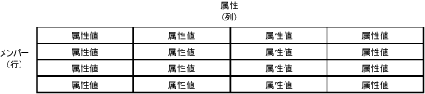

# エンティティ (Master Data Services)

[!INCLUDE[appliesto-ss-xxxx-xxxx-xxx-md-winonly](../includes/appliesto-ss-xxxx-xxxx-xxx-md-winonly.md)]

  エンティティは、 [!INCLUDE[ssMDSshort](../includes/ssmdsshort-md.md)] モデルに含まれるオブジェクトです。 各エンティティには、管理対象のマスター データの行であるメンバーが含まれています。  
  
## 適切なエンティティ数  
 モデルには、管理を希望する数だけエンティティを含めることができます。 各エンティティでは、類似するデータをグループ化する必要があります。 たとえば、組織のすべてのアカウントのエンティティや従業員のマスター リストのエンティティなどが考えられます。  
  
 一般に、ビジネスにとって重要な 1 つ以上の中心となるエンティティが存在し、そのエンティティにモデル内の他のオブジェクトを関連付けます。 たとえば、Product モデルであれば、Product という中心となるエンティティを作成し、その Product エンティティに Subcategory や Category というエンティティを関連付けます。 ただし、中心となるエンティティの作成は必須ではありません。 要件に応じて、重要性が同等と見なせる複数のエンティティを作成することもできます。  
  
## エンティティと他のモデル オブジェクトの関連付け  
 エンティティはマスター データを含むテーブルと考えることができます。行がメンバーを表し、列が属性を表します。  
  
   
  
 管理対象のマスター データのリストをエンティティに設定します。  
  
 複数のエンティティを使用して派生階層を構築できます。派生階層とは、複数のエンティティに基づくレベルベースの階層です。 詳細については、「[派生階層 (マスター データ サービス)](../master-data-services/derived-hierarchies-master-data-services.md)」を参照してください。  
  
 また、場合によっては、エンティティに明示的階層 (単一のエンティティに基づく不規則な構造) とコレクション (メンバーのサブセットの 1 回限りの組み合わせ) を含めることも可能です。 詳細については、「[明示的階層 (マスター データ サービス)](../master-data-services/explicit-hierarchies-master-data-services.md)」および「[コレクション (マスター データ サービス)](../master-data-services/collections-master-data-services.md)」を参照してください。  
  
## 制約リストとしてのエンティティの使用  
 ユーザーはエンティティ内のメンバーに属性を割り当てるときに、値の制約リストから属性を選択することができます。 これを行うには、エンティティを使用して属性用に値のリストを設定します。 これを、ドメイン ベースの属性といいます。 詳細については、「[ドメインベースの属性 (マスター データ サービス)](../master-data-services/domain-based-attributes-master-data-services.md)」を参照してください。  
  
## ベース エンティティ  
 ベース エンティティは、モデル内でオブジェクト間を移動するときのユーザーの開始点です。 ユーザーが **[エクスプローラー]** 機能領域を開いてメニュー バーの **[エクスプローラー]** をクリックすると、ベース エンティティによって画面のレイアウトが決定されます。 エンティティをベース エンティティに指定するには、 **[システム管理]** 機能領域に移動します。 **[モデル ビュー]** ページで、右側のツリー コントロールのエンティティを左側のツリー コントロールのモデルの名前にドラッグします。  
  
## エンティティのセキュリティ  
 関連するモデル オブジェクトを含む、エンティティに対する権限をユーザーに付与できます。 詳細については、「[エンティティ権限 (マスター データ サービス)](../master-data-services/entity-permissions-master-data-services.md)」を参照してください。  
  
## エンティティの例  
 次の例では、エンティティに Name、Code、Subcategory、StandardCost、ListPrice、および FilePhoto という属性があることを示しています。 これらの属性はメンバーを表します。 各メンバーは、属性値の 1 行で表されます。  
  
   
  
 次の例では、Product エンティティが中心となるエンティティです。 Subcategory エンティティは、Product エンティティのドメイン ベースの属性です。 Category エンティティは、Subcategory エンティティのドメイン ベースの属性です。 StandardCost および ListPrice は、Product エンティティの自由形式属性で、FilePhoto は Product エンティティのファイル属性です。  
  
   
  
> [!NOTE]  
>  これは、 [!INCLUDE[ssMDSmdm](../includes/ssmdsmdm-md.md)] ユーザー インターフェイスに基づく例です。 階層ツリー構造は、エンティティとドメイン ベースの属性間のリレーションシップを示します。 これは、リレーションシップを示すもので、重要度を表すものではありません。  
  
## 関連タスク  
  
|タスクの説明|トピック|  
|----------------------|-----------|  
|新規エンティティを作成する。|[エンティティを作成する (マスター データ サービス)](../master-data-services/create-an-entity-master-data-services.md)|  
|既存のエンティティの名前を変更する。|[エンティティを編集する (マスター データ サービス)](../master-data-services/edit-an-entity-master-data-services.md)|  
|既存のエンティティを削除する。|[エンティティを削除する (マスター データ サービス)](../master-data-services/delete-an-entity-master-data-services.md)|  
|エンティティに権限を割り当てる。|[モデル オブジェクト権限を割り当てる (マスター データ サービス)](../master-data-services/assign-model-object-permissions-master-data-services.md)|  
  
## 関連コンテンツ  
  
-   [モデル (マスター データ サービス)](../master-data-services/models-master-data-services.md)  
  
-   [メンバー (マスター データ サービス)](../master-data-services/members-master-data-services.md)  
  
-   [属性 (マスター データ サービス)](../master-data-services/attributes-master-data-services.md)  
  
  
